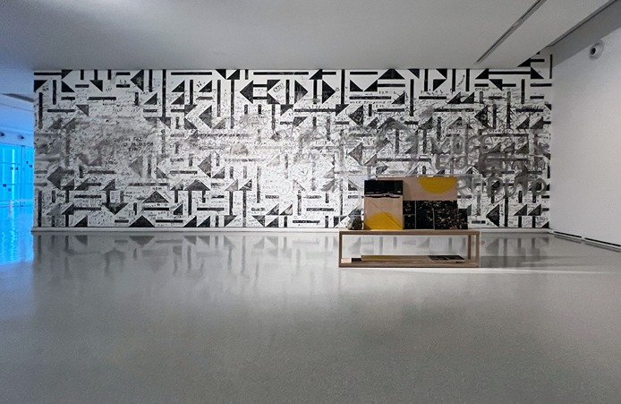

---
Pr-id: MoneyLab
P-id: INC Reader
A-id: 10
Type: article
Book-type: anthology
Anthology item: article
Item-id: unique no.
Article-title: title of the article
Article-status: accepted
Author: name(s) of author(s)
Author-email:   corresponding address
Author-bio:  about the author
Abstract:   short description of the article (100 words)
Keywords:   50 keywords for search and indexing
Rights: CC BY-NC 4.0
...

# Memory from Brasilia / Memória de Brasília

### Laercio Redondo

The union of art, life and architecture is analyzed within the process
of creating panels and tiles by Brazilian artist Athos Bulcão
(1918-2008). Bulcão's work is distinguished by a method whereby
construction workers actively participated in the process of aesthetic
and technical assembly of the murals. This is the starting point for the
project that examines aspects of modernism in the construction of
Brasilia in the late 1950s. Bulcão's works are poetic insertions in the
construction of Brasilia. It is this relationship between artist and
worker, city and landscape that builds the common thread linking all the
research that resulted in a series of silkscreens on plywood, two videos
and a wall painting.

 
Next page:

Memory from Brasilia, 2012/2022

Installation view with works on plywood and mural painting featuring visitor's interferences, part of the exhibition *Lugar-comum*, Museum of Contemporary of Art of the University of São Paulo (MAC–USP), March–December, 2022.

 
***
 

A conjunção entre arte, vida e arquitetura é analisada a partir do
processo de criação dos painéis e azulejos do artista Athos Bulcão
(1918-2008). A obra de Bulcão é marcada por um processo no qual, por
vezes, incluía a participação ativa dos operários na montagem dos
murais. Este singular é, enquanto relevo do aspecto social e da inclusão
poética dos trabalhadores no resultado dos grandes painéis de azulejos
presentes na arquitetura e na paisagem de Brasília, o fio condutor de
toda a pesquisa.

*Lembrança de Brasília* contextualiza esse processo, reencena e
resignifica o ofício do azulejador, que no Brasil tem início nos tempos
coloniais. O conjunto de obras é assim uma reflexão sobre um artista
essencial na discussão da aproximação entre arte, vida e arquitetura na
historia recente do Brasil.

 
"Próxima página: 

Lembrança de Brasília, 2012/2022

Vista da instalação com obras em madeira e mural com interferências de visitantes, parte da exposição *Lugar-comum*, Museu de Arte Contemporânea da Universidade de São Paulo (MAC–USP), março-dezembro de 2022."

Detalhe do trabalho durante a exposição *Lugar Comum*

Museu de Arte Contemporânea da Universidade de São Paulo. 
São Paulo, Brasil, 2022, Photo: Laercio Redondo

 

