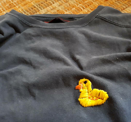
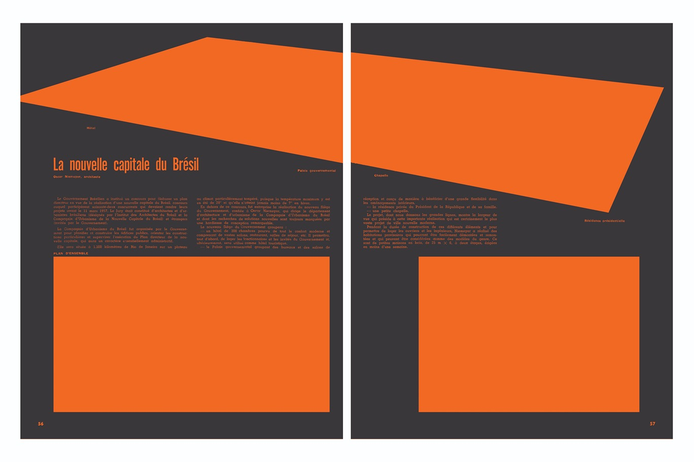
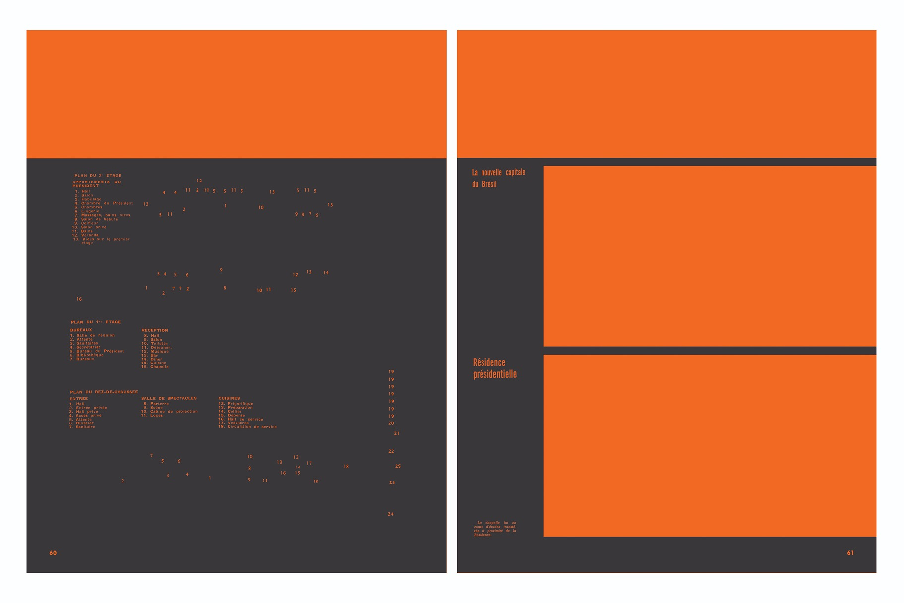

#The Planalto Riots
## Making and Unmaking: A Failed Coup in Brazil

# Colophon 

**INC Theory on Demand #51**  
The Planalto Riots Making and Unmaking of A Failed Coup in Brazil

**Edited by:** Lou Caffagni, Isabel Löfgren,
Gizele Martins and Paola Sartoretto

**Contributors:** Viviane Borelli, Lou Caffagni, Apoena Canuto Cosenza,
Bartira S. Fortes, Camila Hartmann, Clementino Junior, Tatiana Letier
Pinto, Isabel Löfgren, Ada C. Machado Silveira, Alecsandra Matias de
Oliveira, Maria Eduarda Mathias, Gizele Martins, Ana Paula da Rosa,
Aline Roes Dalmolin, Eduardo Ruedell, Gabriela Schneider, and Oscar
Svanelid

**Artistic contributions by:** Tatiana Letier Pinto, Isabel Löfgren,
Laercio Redondo, and Gustavo Speridião & Leandro Barboza/Faixa Protesta

**Cover design:** Katja van Stiphout  

**Design and EPUB development:** Tommaso Campagna, Erica Gargaglione, Carolina Valente Pinto and Giulia Timis 

 
Published by the Institute of Network Cultures, Amsterdam 2024.

ISBN: 9789083328270

**Contact:** Institute of Network Cultures  
Amsterdam University of Applied Sciences (HvA)

**Email:** info@networkcultures.org  
**Web:** [www.networkcultures.org](www.networkcultures.org)

Order a copy or download this publication for free at: 
 
www.networkcultures.org/publications

Subscribe to the INC newsletters:  
[www.networkcultures.org/newsletter](www.networkcultures.org/newsletter)  
[www.networkcultures.org/viralimageculture](www.networkcultures.org/viralimageculture)

This publication is licensed under the Creative Commons Attribution
NonCommercial ShareAlike 4.0 Unported (CC BY-NC-SA 4.0). To view a copy of this license, visit
[www.creativecommons.org/licences/by-nc-sa/4.0./](www.creativecommons.org/licences/by-nc-sa/4.0./).

# TABLE OF CONTENTS

<a href='ch004.xhtml'>Acknowledgements</a>

<a href='ch004.xhtml'> Introduction, *Lou Caffagni, Isabel Löfgren, Paola Sartoretto, Gizele Martins*</a>

<a href='ch006.xhtml'>Introdução, *Lou Caffagni, Isabel Löfgren, Paola Sartoretto, Gizele Martins*</a>

## Media Practices Before the Storm / Práticas midiáticas antes da tempestade

<a href='ch008.xhtml'>Fake News, Memes, and the Unconscious Production of Paranoid
     Utterances, Lou Caffagni</a>

<a href='ch009.xhtml'>Around the World with the Truck Patriot: Memetization and the
     Circulation of Laughter in the 2022 Post-Election Period in
     Brazil, Viviane Borelli and Isabel Löfgren, and visual essay by Isabel
     Löfgren</a>

<a href='ch010.xhtml'>The March on Brasilia: An Interpretation of Bolsonarist Actions in
     Preparation for the January 8, 2023 Insurrection,
     Apoena Cosenza</a>

<a href='ch011.xhtml'>The Green-and-Yellow Black Box: Mobilization on Platforms Toward the Attempted Coup on January 8, 2023,
     Aline Roes Dalmolin e Maria Eduarda Mathias</a>

## The Attempted Coup/A tentativa de golpe

<a href='ch013.xhtml'>Experience and Barbarism in Brasilia: a Savage Journey to
     Understand the Heart of Brazilian Conservative Rioters,
     Eduardo Ruedell</a>

<a href='ch014.xhtml'>Brasília, 8 de janeiro de 2023: a festa acabou! A guerra (ainda)
     não,
     Camila Hartmann, Ada C. Machado Silveira e Gabriela Schneider</a>

<a href='ch015.xhtml'>Governos autoritários na democracia brasileira: A Origem Política do 8 de Janeiro,
     Gizele Martins</a>

<a href='ch016.xhtml'>Against the Ultra-Right Coup-Mongers, Organize Self-Defense/Contra
     a direita golpista, organizar a auto-defesa,
    Gustavo Speridião & Leandro Barboza/Faixa Protesta</a>

## Art and architecture: Brasília / Arte e arquitetura: Brasília

<a href='ch018.xhtml'>A arte e o Instante Político,
     Alecsandra Matias de Oliveira</a>

<a href='ch019.xhtml'>Memory from Brasilia / Lembrança de Brasília, Laercio Redondo</a>

<a href='ch020.xhtml'>The Stories of the Victims: The Planalto Riots from the
     Perspective of Terrorized Art,
     Oscar Svanelid</a>

<a href='ch021.xhtml'>Death of the Author / Morte do Autor, Laercio Redondo</a>

<a href='ch022.xhtml'>Carta ao Arquiteto,
     Tatiana Letier Pinto</a>

## The Image and the Other/A imagem e o outro

<a href='ch024.xhtml'>8J, Clementino Jesus Junior</a>

<a href='ch025.xhtml'>Indigenizing Democracy: Never Again a Brazil Without Us, Bartira Fortes</a>

<a href='ch026.xhtml'>Enquanto Narciso Invade o Congresso brasileiro, Yanomamis desaparecem nas águas, Ana Paula da Rosa</a>

## Appendix

<a href='ch027.xhtml'>Abstracts / Resumos</a>

<a href='ch029.xhtml'>Biographies / Biografias</a>

#Acknowledgments

We created this book out of a need to create a historical document about what we consider to be one of the ‘darkest episodes of an already dark period’ in Brazilian history, as Clementino Jesus Junior writes in his chapter in this collection. Given the urgency of this book, this book is the collective of the editors and contributors who we would like to thank for their time and dedication in writing their texts and for their belief in our proposal. We would also like to thank Geert Lovink and the INC team for receiving our idea enthusiastically and waiting patiently for the manuscript to materialize. A special thanks to the entire team at INC who keeps the Theory on Demand series going, especially Tommaso Campagna, Erica Gargaglione, Carolina Valente Pinto and Giulia Timis. We are proud to be part of this collection. 

# Introduction

### Lou Caffagni, Isabel Löfgren, Paola Sartoretto, Gizele Martins 

Unlike many books written about historical events, the idea for this
book arose in June 2022, months before the event we discuss in this
collection actually materialized. At that moment, the violent and
nefarious attack on the United States Capitol in January 2021 was still
unsettled. Also, the similarities and connections between the extreme
right's coordinated efforts in the United States and Brazil led us to
believe that if Jair Bolsonaro lost the 2022 presidential elections, the
transition of power would not be peaceful.

What eventually culminated in a coup attempt by *Bolsonaristas* (as
Bolsonaro's supporters are called) on January 8, 2023, in the Planalto
Esplanade in Brasilia, Brazil's capital city, had in fact been brewing
for nearly a decade. In the years following the so-called 'Journeys of
June' 2013 student protests against an increase in public transportation
fares, public demonstrations regarding political dissatisfaction were
gradually taken over by extreme right-wing groups and their agendas.
Since then, several figures from the extreme right's political
underground have been elevated to the status of political celebrities,
supported by a well-coordinated digital communication structure.[^introEng_1] One
of these figures was Jair Messias Bolsonaro, a rather obscure federal
deputy from the state of Rio de Janeiro and a former military
officer,[^introEng_2] known for his controversial views on human rights,
democracy, and gender and race equality, to name only a few. Bolsonaro
went from being a caricatural political figure who was a frequent guest
on comedy and talk shows on television to becoming a presidential
candidate in 2018.

In the years leading up to the 2018 presidential election, Brazil went
through what is now commonly referred to as a parliamentary coup
orchestrated by the Federal Congress with the collaboration of then-Vice
President Michel Temer, who impeached leftist President Dilma Rousseff
(2012-2016) on fiscal administrative misconduct charges. In parallel
with the investigation into irregularities in Dilma Rousseff's
government finances ('CPI das Pedaladas Fiscais'), the Federal Police
conducted 'Operation Carwash'' ('Operação Lava Jato'), whose
proceedings uncovered a massive corruption scheme in the Brazilian
federal government, particularly in state-owned companies. As a result
of 'Lava Jato', former President Luiz Inácio Lula da Silva[^introEng_3] was
sentenced to prison in 2018. Coincidentally, when Lula da Silva was
imprisoned, he was leading the opinion polls for the upcoming
presidential election. After Lula's imprisonment, the Worker's Party
(PT) failed to promote Fernando Haddad (a former mayor of São Paulo,
Brazil's largest city, and former Minister of Education under Lula da
Silva's previous governments) as an alternative to Jair Bolsonaro, who
by then had the support of a powerful segment of the Brazilian business
community, evangelical church leaders, and a well-oiled social media
mobilization apparatus.

After his election in 2018, Jair Bolsonaro, supported by a
conservative-majority congress, was responsible for setbacks in various
political fields, including environmental and human rights. Political
commentators have argued that Bolsonaro governed for four years
(2018-2022) as if he were still campaigning, always aiming to reach a
small but significant group of staunch supporters who would be able to
expand support during election periods. However, the Bolsonaro
administration's irresponsible handling of the COVID-19 pandemic between
2020 and 2022 had a negative impact on Bolsonaro's approval ratings.
Even with a decline in approval during the pandemic and many other
questionable actions by the then-president and his associates (including
his four sons, three of which are elected officials), Lula da Silva's
victory in the 2022 general election was not easy. He won in the second
round with just over 51 percent of all valid votes.

In a political landscape of crisis and inequality where a few private
media conglomerates concentrate all media power in the country and where
legislation does not keep pace with the rapid development of digital
media,[^introEng_4] the direct and simple communication style of the extreme
right in Brazil (and around the world) gained enormous strength. In
contrast, social movements in Brazil have a long tradition of grassroots
popular mobilization, also in forming political parties during and after
the re-democratization process in the late 1980s. It has been argued
that in the 2022 general elections, this mobilization capacity was able
to reestablish the weakened connection of the Workers' Party with its
popular base. In addition, an alignment of the leftists with some
democratic elements of the center and center-right is believed to have
ensured Lula da Silva's narrow victory.

However, in an era of post-truth, disinformation, and fake news, it
cannot be expected that the results of such turbulent elections would be
accepted without friction. The fragility of the victory and the threats
to Lula da Silva's new government was evident in the coup attempt on
January 8, 2023, which brought the political imagination, narratives,
and characters of the extreme right to the forefront of the Brazilian
and international public spheres.

\*\*\*

Given this political context, we, Lou Caffagni, Isabel Löfgren, Paola
Madrid Sartoretto, and Gizele Martins gathered for an international
conference on media and governance in Latin America during a hot Swedish
summer in 2022 as the COVID-19 pandemic was subsiding. In conversations
about future collaborations and concerned about the upcoming general
elections in Brazil, one of us mentioned the book *The Capitol Riots:
Digital Media, Disinformation, and Democracy Under Attack* (2022)[^introEng_5]
which discusses the 2021 attack on the US Congress. We decided, with
equal parts seriousness and sarcasm, to start a similar book as quickly
as possible, so that it would be ready if and when similar events
occurred in Brazil.

Brazil's insertion into the global wave of threats to the
civilizational pact of democracy that culminated in the attack on a
peaceful transition of power that respects the results of democratic
elections deserves a sober discussion of this troubled period. The book
does not aim to be a journalistic document but rather an analysis of the
attack from its communicative and symbolic aspects. More importantly, we
do this from a decolonial perspective that carefully avoids interpreting
the attempted coup in Brazil as a reflection of events in the United
States.

On 30 October 2022, former President Luiz Inácio Lula da Silva was
elected for a third term, defeating the incumbent President Jair
Bolsonaro, who was running for re-election. In the week following the
second round of the election, protests rejecting the election results
took place on various roads across Brazil. Demonstrators demanded, among
other things, a military intervention to restore power to Bolsonaro, who
they believed was defeated due to election fraud. As such, one of the
main arguments of the extreme right was contesting the use of electronic
voting machines, which have been used in Brazil since 1996. After a few
days of road blockades and intense protests that nearly stopped the
country, several militant Bolsonarist groups continued to mobilize,
arranging protests and camping in front of military barracks for the
following two months.

Surprisingly, the presidential inauguration on 1 January 2023, took
place without major incidents. Like in the United States in 2021, it did
not have the presence of the then-president in the symbolic ritual of
handing over the presidential sash and the presidency to their
successor. However, one week later, on Sunday 8 January 2023, around
4000 people marched in the streets of Brasilia to reach the Three Powers
Square ('Praça dos Três Poderes') and invade the Planalto Palace, the
seat of the Brazilian government, the Supreme Federal Court, and the
National Congress buildings. During the coup attempt, participants
vandalized the buildings and damaged significant artworks, documents,
and furniture posting the events continuously on social media. When
compared to the June 2013 protests mentioned earlier, more than twice as
many protesters occupied Brasilia. In addition, they were not prevented
by police from entering public buildings. At the time, several
commentators and the press considered the possibility of complicity by
city authorities opposed to the new government.[^introEng_7] Nonetheless, Lula da
Silva, who was not in Brasilia during the riots, acted quickly and a
government intervention detained many participants in the act.

As we finish this book at the end of 2023, several participants in the 8
January events are being investigated and prosecuted. In September, the
first three individuals investigated were sentenced to prison terms
ranging from 14 to 17 years. Investigations to identify the financiers
and organizers of the events continue. Former President Jair Bolsonaro
is the target of seven charges referred to the Federal Court, including
incitement to a coup d´état, still under investigation. He has already
been convicted for electoral crimes which have make him ineligible in
the next presidential race of 2026.

\*\*\*

We live in a time when digital communication is characterized by its
connectivity, speed, and often extremism that brings with it a certain
detachment from material reality. The dynamics of digital communication
platforms in late capitalism contribute to the aggregation of extremism
while actors with significant economic power support and facilitate
mobilizations like those in Washington in 2021 and Brasilia in 2023.[^introEng_8]
Communication as a form of social interaction and construction of
meaning can be understood as a fundamental aspect of extremists' agency
that aim to contradict and threaten important civilizational milestones
such as respect for the results of democratic elections.

Using media and communication as a guiding thread, we can follow two
lines of interpretation of the coup attempt in Brasilia on 8 January
2023. The first is to analyze the communicative processes that enable
the organization, coordination, and mobilization around an extreme
right-wing ideology that excludes and dehumanizes others. Following this
line, we can understand the events of 8 January as the culmination of
processes of meaning production and circulation. The second line is to
analyze images and meanints that circulate, aggregate, and mobilize a
significant number of people to commit criminal acts around
anti-democratic ideas. Here, it is not a matter of separating the
message from its context but analytically separating otherwise
empirically inseparable aspects to understand how the political,
economic, historical, communicational, and aesthetic contexts relate to
the phenomenon we are experiencing.

Our goal in *The Planalto Riots: The Making and Unmaking of a Failed
Coup in Brazil* is not journalistic - there are better sources for this
type of approach. Also, the guiding thread of this book is not to report
what happened before, during, and after 8 January 2023, but to cast a
critical eye on symbolic and communicational practices surrounding the
event in a broader sense. Moreover, the fact that all contributions are
about the same event gives the reader the impression of looking at a
cubist painting, in which the same element is seen from different angles
and perspectives. Some information may be repeated between articles,
however, each approach is unique. Lastly, some articles in the book are
written in Portuguese and others in English. In this way, the reader of
texts in Portuguese will read a different book than the reader of texts
in English and vice-versa. We have included summaries of all articles in
both languages ​​at the end of the book to satisfy readers' curiosity
about its contents.

We begin by discussing the mobilization and circulation of meanings in
the period leading up to the coup attempt. In the first part, *Media
Practices Before the Storm,* Lou Caffagni identifies and discusses the
traces of paranoia in the production and circulation of memes and fake
news using philosophical concepts of rhetorics and simulacra. Viviane
Borelli and Isabel Löfgren discuss the intersection of humor and
politics using the emblematic case of the 'Truck Patriot' meme, an
anti-Bolsonaro internet phenomenon that challenged the extreme right
dominance on social media on one hand but fueled more hatred from
*Bolsonarists* on the other. Isabel Löfgren created a visual essay based
on the meme. Apoena Canuto Cosenza identifies narrative and political
continuities between fascism and Bolsonarism, comparing the 8 January
2023 insurrection to Mussolini's *March on Rome* in 1922. Closing the
first part, Aline Roes Dalmolin and Maria Eduarda Mathias discuss
Bolsonarist mobilizations on social media platforms that led to the
events of 8 January.

In the second part, *The Attempted Coup*, we move on to discussions of
various experiences of the 8 January events intersected by media
communication. Eduardo Ruedell resorts to Walter Benjamin in an
auto-ethnographic account of his experience as a television spectator of
a coup attempt that had barbaric and bizarre elements. Camila Hartmann,
Ada C. Machado Silveira, and Gabriela Schneider identify and discuss the
contradictions between the festive and optimistic sentiment that
dominated Lula da Silva's inauguration on January 1 and the threat to
the democratic pact that was loud and clear a week later through the
lens of mediatized warfare. Gizele Martins reminds us that the extreme
right's coup plot that came to the fore in 2023 had been present and
active in Brazil for at least ten years when seen from the perspective
of popular struggles and the militarization of conflicts in Rio de
Janeiro's *favelas* that could serve as a blueprint for potential
military interventions, such as the one desired by 8 January protesters.
An artistic contribution by Gustavo Speridião and Leandro Barboza's
collective *Faixa Protesta* shows how their 'painting-manifesto' voiced
out people's demands for justice for the anti-democratic acts the day
after the coup.

The chapters in the third part *Art and Architecture: Brasilia* explore
art, design, and architecture as cultural expressions with political
relevance connected to the architecture and experience of the modernist
city. Alecsandra Matias de Oliveira draws a parallel in the history of
Brazilian art between the repression and censorship of artistic
expressions during the dictatorship of the 1960s and 70s, up to the
attacks on the artworks inside the government buildings during the
attempted coup. Next, Oscar Svanelid gives voice to vandalized objects
and artworks during the Planalto riots to discuss the relationship
between art, design, history, and politics in Brazil. Laercio Redondo's
artistic contributions raises questions about the impact and
consequences of utopian ideologies related to the construction of
Brasilia in the late 1950s. In a letter to Oscar Niemeyer, the architect
who designed Brasilia, Tatiana Letier Pinto locates the city's
architecture in Brazil's political history.

In the fourth and final part *The Image and the Other*, the texts
address a traumatic aspect of Brazilian identity concerning our
(self-)image, our complicated and problematic relationship with
Indigenous peoples, and how this relationship came to the forefront
during and after the attempted coup. Clementino Jesus Junior analyzes
the polarization of narratives about the events of January 8th in an
analogy with the game of chess and how front page images in newspapers
frame different narratives connected to the failed coup. Bartira S.
Fortes highlights the paradox between Indigenous visibility at Lula da
Silva's inauguration on 1 January and the negation and silencing of
diversity in the events of 8 January. In a similar vein, Ana Paula da
Rosa discusses another contemporary paradox: the narcissistic
omnipresence of images of the coup participants on social media during
the event in contrast to the invisibility of the humanitarian tragedy
concerning the lives and existence of the Yanomami people in Brazil, who
only a few days after the 8 January failed coup attempt garnered
national and international media attention.

## Bibliography

Canavarro Martins, Marcela. *Political Mobilization in Brazil from 2013
to 2017: A Technopolitical Analysis Using Surveys and Social Network
Data Mining*, PhD diss., Faculty of Engineering, University of Porto,
Porto/Portugal, 2019,
<https://repositorio-aberto.up.pt/handle/10216/122246>.

da Empoli, Giuliano. *Os Engenheiros Do Caos*, Vestígio Editora, 2019.

Jeppesen, Sandra, Hoechsmann, Michael, Hezel Ulthiin, Iowyth, Vandyke,
David, and McKee, Miranda. *The Capitol Riots: Digital Media,
Disinformation, and Democracy Under Attack*, Routledge, 2022.

Peruzzo, Cecilia M. Krohling. 'Comunicação Comunitária E Educação Para
a Cidadania', *Comunicação e Sociedade* 2 (August 29, 2000): 651-68,
<https://doi.org/10.17231/comsoc.2(2000).1427>.

Ricardo, Carolina. 'A Democracia Não Pode Ser Considerada Garantida No
Brasil.' *openDemocracy*, 10 October 2023,
<https://www.opendemocracy.net/pt/democracia-nao-pode-ser-considerada-garantida-brasil-policialismo/>.

Wylie, Christopher. *Mindf\*ck : Cambridge Analytica and the Plot to
Break America*, New York: Random House, 2019.

[^introEng_1]: Marcela Canavarro Martins, *Political Mobilization in Brazil from
    2013 to 2017: A Technopolitical Analysis Using Surveys and Social
    Network Data Mining*, PhD diss., Faculty of Engineering, University
    of Porto, Porto/Portugal, 2019,
    <https://repositorio-aberto.up.pt/handle/10216/122246>.

[^introEng_2]: Bolsonaro was ousted from the military in the early 1980s after
    attempting to stage an internal coup against the military command,
    in a failed plan involving bomb attacks on army barracks, as part of
    a faction in the military that was dissatisfied with the process of
    re-democratization of the country at the end of a 21-year military
    dictatorship (1964-1985) and the ensuing loss of privileges for the
    military. He then started a political career as a local politician,
    in collusion with former members of Rio de Janeiro's military police
    force that through the years formed a parallel political power
    called the 'milícias'.

[^introEng_3]: Lula da Silva has previously served two presidential mandates from 2003 to 2011.

[^introEng_4]: Cecilia M. Krohling Peruzzo, 'Comunicação Comunitária E Educação
    Para a Cidadania,' *Comunicação e Sociedade* 2 (August 29, 2000):
    651-68.

[^introEng_5]: Sandra Jeppesen Michael Hoechsmann, Miranda McKee, iowyth hezel
    ulthiin and David Van Dyke, *The Capitol Riots: Digital Media,
    Disinformation, and Democracy Under Attack*, New York: Routledge,
    2022.

[^introEng_6]:

[^introEng_7]: Carolina Ricardo, 'A Democracia Não Pode Ser Considerada
    Garantida No Brasil,' *openDemocracy*, 10 October 2023,
    <https://www.opendemocracy.net/pt/democracia-nao-pode-ser-considerada-garantida-brasil-policialismo/>.

[^introEng_8]: See Giuliano da Empoli, *Os Engenheiros Do Caos*, Vestígio
    Editora, 2019, and Christopher Wylie, *Mindf\*ck: Cambridge
    Analytica and the Plot to Break America*, New York: Random House,
    2019.

# Introdução

### Lou Caffagni, Isabel Löfgren, Paola Sartoretto, Gizele Martins 

Diferente de muitos livros escritos sobre eventos históricos, a ideia
geradora deste livro surgiu em junho de 2022, meses antes de o evento de
que tratamos aqui se materializasse. O violento e nefasto ataque ao
Capitólio nos Estados Unidos em Janeiro de 2021 e as semelhanças e
relações entre a articulação da extrema direita nos Estados Unidos e no
Brasil, além das constantes ameaças à democracia proferidas por Jair
Bolsonaro durante seu governo, nos levavam a crer que caso Bolsonaro
perdesse as eleições presidenciais de 2022, a transição de poder não
seria pacífica.

Nos anos que sucederam as chamadas Jornadas de Junho de 2013, protestos
inicialmente contra o aumento das tarifas de transporte público que
foram tomados por grupos e agendas de extrema direita,[^introPor_1] vários
personagens do submundo ultra-conservador foram alçados à categoria de
celebridade política apoiados numa afinada estrutura de comunicação
digital. Uma dessas personagens era o ex-militar e deputado federal,
eleito pelo estado do Rio de Janeiro, Jair Messias Bolsonaro, conhecido
por suas opiniões controversas sobre direitos humanos, democracia,
igualdade de gêneros, etc. Bolsonaro passou de figura caricata,
frequente personagem de programas de humor, a candidato à presidência em
2018.

Nos anos que antecederam a eleição presidencial de 2018, o Brasil passou
pelo que hoje se convencionou chamar de golpe parlamentar orquestrado
pelo Congresso Federal com a colaboração do então vice-presidente Michel
Temer e de parcela significativa do judiciário , que removeu a
Presidenta Dilma Roussef de seu cargo. Em paralelo à CPI das pedaladas
fiscais, que investigou irregularidades nas finanças do governo petista,
a Polícia Federal, o ministério público e o juizado federal do Paraná, a
Operação Lava Jato investigou um esquema de corrupção em diversos
contratos de empresas públicas e privadas no Brasil. Como resultado da
Lava Jato, o ex-presidente Luis Inácio Lula da Silva foi condenado à
prisão em 2018. Coincidentemente, ao ser preso, Lula da Silva liderava
as pesquisas de opinião para eleição à presidência. Após sua prisão, a
esquerda não conseguiu emplacar Fernando Haddad, ex-prefeito de São
Paulo e ex-Ministro da Educação, como alternativa a Jair Bolsonaro que
contava com o apoio de uma parte poderosa do empresariado brasileiro,
líderes de igrejas evangélicas, parte da mídia comercial, além de uma
bem lubrificada máquina de mobilização digital.

A partir de sua eleição em 2018, Jair Bolsonaro, apoiado por um
congresso de maioria conservadora, foi responsável por retrocessos em
vários campos políticos, incluindo o meio-ambiente e os direitos
humanos. Comentaristas políticos argumentam que Bolsonaro governou
quatro anos como se ainda estivesse em campanha, sempre com o objetivo
de atingir um pequeno, mas significante, grupo de apoiadores ferrenhos
que teriam a capacidade de expandir o apoio em momentos de eleição.
Entretanto, a atuação irresponsável do governo durante a pandemia de
Covid-19 entre 2020 e 2022 teve um impacto negativo na popularidade de
Bolsonaro. Mesmo com a queda na aprovação durante a pandemia (além de
muitos outros atos questionáveis do presidente e de pessoas em seu
círculo próximo, incluindo seus quatro filhos), a vitória de Lula nas
eleições de 2022 não foi fácil, ele venceu no segundo turno com pouco
mais de 51 por cento dos votos válidos.

Em um cenário político de crise e desigualdade somado à problemática
estrutura midiática do Brasil, na qual poucas empresas concentram o
poder de comunicar,[^introPor_2] à desregulamentação da legislação, que não
acompanha a velocidade do desenvolvimento das mídias digitais, o estilo
de comunicação direto e simples da extrema-direita no Brasil e no mundo
ganha força. Em contrapartida, os movimentos sociais no Brasil têm uma
longa história de mobilização popular capilarizada que inclui os
partidos políticos formados durante e depois da redemocratização, a
partir da segunda metade da década de 1980. Foi justamente a partir
dessa capacidade de mobilização social 'rizomática' que os movimentos
populares puderam retomar o contato enfraquecido com o Partido dos
Trabalhadores, que também estabeleceu alianças estratégicas com os
setores democráticos da direita, garantindo assim a apertada vitória de
Lula da Silva em 2022. Em tempos de pós-verdade, desinformação e
notícias falsas não se pode esperar que o resultado de eleições tão
conturbadas seja aceito sem atritos. A estreita margem da vitória
eleitoral e as ameaças ao novo governo se fizeram presentes e visíveis
nos atos golpistas de 8 de janeiro de 2023 que trouxeram o imaginário
político, as narrativas, e as personagens da extrema direita à tona da
esfera pública nacional e internacional.

\*\*\*

Nesse contexto político, num quente verão sueco em 2022 quando a
pandemia do COVID-19 arrefecia, nos encontramos, Gizele Martins, Paola
Sartoretto, Isabel Löfgren e Lou Caffagni, para um seminário de
cooperação internacional. Em uma das reuniões, discutindo sobre
colaboração para futuras pesquisas e já preocupados com as eleições
presidenciais, falamos sobre o livro *The Capitol Riots: Digital Media,
Disinformation, and Democracy Under Attack,* (2022)[^introPor_3] que discute exatamente
o ataque ao congresso estadunidense. A nossa decisão naquele dia, com
doses iguais de seriedade e sarcasmo, foi começar a fazer um livro, no
mesmo modelo, o mais rápido possível para que estivesse pronto quando
eventos semelhantes acontecessem no Brasil. Não obstante, as
peculiaridades dos acontecimentos em nossas terras exigiram um olhar
mais demorado do que o previsto.

A inserção do Brasil na onda global de ameaças ao pacto civilizatório da
democracia, que culminou no ataque à transição de poder pacífica
respeitando o resultado de eleições democráticas, merece uma discussão
sóbria que sirva como documento histórico desse período conturbado. O
livro não pretende ser um documento jornalístico, mas uma análise do
ataque ao Palácio do Planalto a partir de diversas perspectivas e
diferentes formas de saber, voltadas à compreensão de seus aspectos
comunicativos e simbólicos, sob uma ótica decolonial que evita entender
a tentativa de golpe no Brasil como um reflexo dos eventos nos Estados
Unidos.

Em outubro de 2022, o ex-presidente Luiz Inácio Lula da Silva foi eleito
para um terceiro mandato, derrotando o então presidente Jair Bolsonaro,
candidato à reeleição. Na semana seguinte ao segundo turno da eleição,
manifestações populares que contestavam os resultados das eleições
tomaram várias estradas em diversos pontos do Brasil. Manifestantes
pediam, entre outras demandas, uma intervenção militar e acusavam
interferências nas urnas eletrônicas, utilizadas no Brasil desde as
eleições municipais de 1996. Após alguns dias de manifestações intensas,
vários grupos seguiram mobilizados, concentrando-se em frente aos
quartéis. A posse presidencial no dia 1º de janeiro de 2023 aconteceu
sem maiores percalços, mas também, assim como aconteceu nos Estados
Unidos em 2021, sem a presença do então presidente no ritual simbólico
de passagem da faixa presidencial. Uma semana depois, no domingo 8 de
janeiro de 2023, cerca de quatro mil pessoas percorreram as ruas de
Brasília para chegar à Praça dos Três Poderes e invadir o Palácio do
Planalto e o Supremo Tribunal Federal, respectivas sedes do executivo e
do judiciário. Durante os atos golpistas, participantes depredaram os
prédios, danificaram obras de arte e peças de mobiliário histórica e
esteticamente significativas. Comparando com as jornadas de junho de
2013, quando mais do que o dobro de manifestantes ocuparam Brasília e
foram impedidos pela polícia de entrar nos prédios públicos, a hipótese
de omissão da polícia do Distrito Federal foi considerada por
comentaristas e imprensa.[^introPor_4]

\*\*\*

No momento em que finalizamos este livro, nos últimos meses de 2023,
vários participantes dos atos de 8 de janeiro estão sendo investigados e
processados. Em setembro os primeiros investigados foram condenados a
penas que variam de 14 a 17 anos de prisão. As investigações para chegar
aos financiadores e organizadores dos atos continuam. O ex-presidente
Jair Bolsonaro é alvo de sete investigações encaminhadas à Justiça
Federal, incluindo incitação a golpe de estado. Uma das acusações por
crime eleitoral já tornou o ex-presidente inelegível nas próximas
eleições presidenciais de 2026.

Vivemos num tempo em que a comunicação digital se caracteriza por sua
conectividade, rapidez, e, muitas vezes, pela polarização exacerbada e
um certo descolamento da realidade material. A dinâmica das plataformas
digitais de comunicação no capitalismo tardio contribui para que
extremismos se aglutinem ao mesmo tempo que atores com grande poder
econômico apoiam e facilitam mobilizações como as que aconteceram em
Washington em 2021 e em Brasília em 2023.[^introPor_5] A comunicação como forma
de interação social e construção de sentido pode ser entendida como
condição de possibilidade dos extremismos que vêm à superfície como
performances que contrariam e ameaçam marcos civilizatórios importantes
como o respeito ao resultado de eleições democráticas.

Utilizando a comunicação como fio condutor, podemos seguir duas linhas
de interpretação da tentativa de golpe de estado em Brasília em janeiro
de 2023. A primeira delas é analisar os processos comunicativos que
possibilitam a organização, articulação e mobilização em torno de um
ideário de extrema direita que exclui e desumaniza o outro. Seguindo
essa linha, podemos entender os atos do dia 8 de janeiro como o ápice de
processos de produção e circulação de sentidos. A segunda linha é
analisar os sentidos e significados que circulam, aglutinam e mobilizam
um número significativo de pessoas a cometer atos criminosos em torno de
ideias antidemocráticas e, muitas vezes, fantasiosas. Aqui não se trata
de separar a mensagem do contexto, mas de distinguir analiticamente
aspectos inseparáveis empiricamente para que possamos entender como os
contextos político, econômico, histórico, comunicacional e estético se
relacionam com o fenômeno que vivenciamos.

Nosso objetivo em Planalto Riots não é jornalístico, nesse sentido há e
com certeza surgirão fontes melhores. O fio condutor deste livro não é
relatar o que aconteceu antes, depois e durante 8 de janeiro de 2023,
mas lançar o olhar para práticas simbólicas e comunicacionais em um
sentido amplo, elaborando reflexões teóricas aprofundadas sobre este
peculiar acontecimento. O fato de todas as contribuições terem em comum
o mesmo evento dá a impressão ao leitor de uma pintura cubista, em que o
mesmo elemento é visto por diferentes ângulos e perspectivas. Alguns
artigos no livro são em português e outros em inglês. Desta forma o
leitor dos textos em português lerá um livro diferente do que o leitor
dos textos em inglês, e vice-versa. Para satisfazer a curiosidade dos
leitores sobre o conteúdo do livro como um todo, incluimos os resumos de
todos os artigos em ambos idiomas no final do livro.

Começamos discutindo a mobilização e circulação de sentidos no período
que antecedeu a tentativa de golpe. Na primeira parte, *Práticas
midiáticas antes da tempestade*, Lou Caffagni identifica e discute a
dimensão paranóica e inconsciente na produção e circulação de memes e
notícias falsas. Viviane Borelli e Isabel Löfgren analisam a interseção
entre humor e política a partir de um levantamento do emblemático meme
do 'patriota do caminhão', seguido de um ensaio visual com o meme de
Isabel Löfgren. Apoena Cosenza identifica continuidades narrativas e
políticas entre a Marcha sobre Roma, evento seminal na emergência do
fascismo italiano na década de 20, e a tentativa frustrada de golpe do
bolsonarismo. Fechando a primeira parte, Aline Roes Dalmolin e Maria
Eduarda Mathias discutem a mobilização digital que levou aos atos de 8
de janeiro.

Na segunda parte, *A tentativa de golpe*, passamos para discussões sobre
diversas experiências dos atos de 8 de janeiro atravessadas pela
comunicação midiática. Eduardo Ruedell faz uma auto-etnografia da sua
experiência como espectador televisivo de uma tentativa de golpe que
teve elementos barbáricos e bizarros. Camila Hartmann, Ada Cristina
Machado Silveira e Gabriela Schneider identificam e discutem as
contradições entre o sentimento festivo e otimista que dominou a posse
de Lula da Silva no dia 1° de Janeiro e ameaça ao pacto democrático que
se fez presente em alto e bom som uma semana depois. Gizele Martins nos
lembra que a articulação golpista da extrema direita que veio à tona em
2013 esteve presente e ativa no Brasil há pelo menos dez anos, visto da
perspectiva das lutas populares e a militarização de conflitos
principalmente nas favelas cariocas. A contribuição artística de Gustavo
Speridião e Leandro Barboza do coletivo carioca Faixa Protesta mostra,
através de sua pintura-manifesto, como a população foi às ruas no dia
seguinte à tentativa de golpe pedindo justiça pelos atos
antidemocráticos .

Os capítulos da terceira parte, *Arte e arquitetura - Brasília*,
exploram a dimensão estética e cultural deste evento político.
Alecsandra Matias de Oliveira faz um paralelo na história da arte
brasileira entre a repressão e censura às expressões artísticas durante
a ditadura dos anos 1960 e 70 até os ataques às obras de arte do
Planalto durante a tentativa de golpe. Por sua vez, Oscar Svanelid dá
voz aos objetos e obras de arte do Palácio do Planalto para discutir as
relações entre arte, design, história e política no Brasil. As
contribuições artísticas de Laercio Redondo põem em questão o impacto e
as consequências das ideologias utópicas relacionadas à construção da
nova capital no final dos anos 1950. Na sequência, em uma carta para
Oscar Niemeyer, arquiteto que concebeu o projeto de Brasília, Tatiana
Letier Pinto localiza a arquitetura de Brasília na história política do
Brasil.

Na quarta e última parte, *A imagem e o outro*, os textos abordam um
aspecto traumático da identidade Brasileira a partir da imagem, e a
nossa relação complicada e problemática com os povos Indígenas,
discutindo como essa relação veio à tona durante os atos golpistas.
Clementino Jesus Junior analisa a polarização das narrativas sobre os
eventos de 8 de janeiro a partir de uma analogia com o jogo de xadrez.
Bartira Fortes traz à tona o paradoxo entre a visibilidade Indígena na
posse do presidente Lula da Silva e a negação da diversidade nos atos de
8 de janeiro. Na mesma linha, Ana Paula da Rosa fala de outro paradoxo
contemporâneo: a onipresença narcisista das imagens dos golpistas de 8
de janeiro em paralelo à invisibilidade da tragédia que ameaça a vida e
existência do povo Yanomami no Brasil, no contexto da crise humanitária
deflagrada contra esse povo originário após a tentativa de golpe no dia 8 de
janeiro, causando uma comoção nacional e internacional.

## Bibliografia

Canavarro Martins, Marcela. *Political Mobilization in Brazil from 2013
to 2017: A Technopolitical Analysis Using Surveys and Social Network
Data Mining*, PhD diss., Faculty of Engineering, University of Porto,
Porto/Portugal, 2019,
<https://repositorio-aberto.up.pt/handle/10216/122246>.

da Empoli, Giuliano. *Os Engenheiros Do Caos*, Vestígio Editora, 2019.

Jeppesen, Sandra, Hoechsmann, Michael, Hezel Ulthiin, Iowyth, Vandyke,
David, and McKee, Miranda. *The Capitol Riots: Digital Media,
Disinformation, and Democracy Under Attack*, Routledge, 2022.

Peruzzo, Cecilia M. Krohling. 'Comunicação Comunitária E Educação Para
a Cidadania', *Comunicação e Sociedade* 2 (August 29, 2000): 651--68,
<https://doi.org/10.17231/comsoc.2(2000).1427>.

Ricardo, Carolina. 'A Democracia Não Pode Ser Considerada Garantida No
Brasil.' *openDemocracy*, 10 October 2023,
<https://www.opendemocracy.net/pt/democracia-nao-pode-ser-considerada-garantida-brasil-policialismo/>.

Wylie, Christopher. *Mindf\*ck : Cambridge Analytica and the Plot to
Break America*, New York: Random House, 2019.

[^introPor_1]: Marcela Canavarro Martins, *Political Mobilization in Brazil from
    2013 to 2017: A Technopolitical Analysis Using Surveys and Social
    Network Data Mining*, PhD diss., Faculty of Engineering, University
    of Porto, Porto/Portugal, 2019,
    <https://repositorio-aberto.up.pt/handle/10216/122246>.

[^introPor_2]: Cecilia M. Krohling Peruzzo, 'Comunicação Comunitária E Educação
    Para a Cidadania,' *Comunicação e Sociedade* 2 (August 29, 2000):
    651--68.

[^introPor_3]: Sandra Jeppesen Michael Hoechsmann, Miranda McKee, iowyth hezel
    ulthiin and David Van Dyke, *The Capitol Riots: Digital Media,
    Disinformation, and Democracy Under Attack*, New York: Routledge,
    2022.

[^introPor_4]: Carolina Ricardo, 'A Democracia Não Pode Ser Considerada
    Garantida No Brasil,' *openDemocracy*, 10 October 2023,
    <https://www.opendemocracy.net/pt/democracia-nao-pode-ser-considerada-garantida-brasil-policialismo/>.

[^introPor_5]: Ver Giuliano da Empoli, *Os Engenheiros Do Caos*, Vestígio
    Editora, 2019, e Christopher Wylie, *Mindf\*ck: Cambridge Analytica
    and the Plot to Break America*, New York: Random House, 2019.

# Media Practices Before the Storm / Práticas midiáticas antes da tempestade

# Fake News, Memes, and the Unconscious Production of Paranoid Utterances

### Lou Caffagni

> *'The \'collective imbecile\' is not, indeed, the mere sum of a certain
> number of individual imbeciles. It is, on the contrary, a collectivity
> of people of normal or even superior intelligence that come together,
> driven by a common desire to stupefy themselves and each other. Whether
> the desire is conscious, or unconscious is not important.'*  
> 
> — Olavo de Carvalho[^f05_2]
> 
> *'Olavo is right'*  
> 
> — Bolsonarist catchphrase

Jair Bolsonaro was elected in 2018 and since then, he has been spreading
conspiracy theories against the electoral system in Brazil thus
discrediting the very process that brought him to the presidency. He has
claimed on numerous occasions that 'only God could remove him from the
presidential chair'. Michele Prado[^f05_3] has described the messianic
imaginary that surrounded Bolsonaro\'s government, where some circles
considered him as a leader 'chosen by God to win an electoral war'[^f05_4].
Thus, when Lula da Silva\'s victory was announced on October 30, 2022,
Bolsonaro\'s followers quickly blocked highways and put into practice
the coup d\'état that they had already been planning for four years
since Bolsonaro took power. With the support of the Federal Highway
Police and Military Police, truck drivers occupied roads and highways,
halting the circulation of people and goods and choking the main cities
of the country. The blockades were only lifted weeks later thanks to the
action of football supporters who, when the Brazilian national football
championship resumed, were eager to attend the matches and support their
teams. To access the stadiums, they had to clear the way from the
Bolsonarist barricades. Even the most fanatical supporters of Bolsonaro
could not stand in the way of the Gaviões da Fiel, or, the Faithful
Hawks, the organized fan union of Corinthians.[^f05_5] Someone could say,
perhaps, that God sent the 'faithful Corinthians' to spread His wisdom
and will: 'Love does not delight in evil but rejoices with the truth. It
always protects, always trusts, always hopes, always perseveres.'[^f05_6]

However, hatred also persists, and the insurrectionists, having been
pushed off the road blockades, then moved to the entrances of military
headquarters in nearly every Brazilian city, setting up camps and
protests calling for military intervention. For two months, they held
their ground, many of them losing their jobs and families to be able to
live in the camps permanently, while others came back and forth from the
camps every day, often bringing their children. Their participation was
fueled by social media messages with photomontages about military
operations, movements of tanks, soldiers, and equipment that supposedly
had never been seen in Brazil\'s history. In the meantime, Bolsonaro hid
in the Presidential Palace, refusing to acknowledge his defeat. A few
days before the end of his term, he flew to Florida with his family.

On January 8, 2023, one week after Lula da Silva\'s inauguration,
Brasilia was taken over by barbarian invaders wearing yellow and green
shirts, calling for a military coup to reinstate Bolsonaro as the
'rightful' and 'God-sent' president. In this essay, I will try to
understand how so many seemingly reasonable people joined this radical
pro-Bolsonaro social movement influenced by grotesque memes, fake news,
and conspiracy theories.

The kernel of alt-right conspiracy theories became known in alt-right
circles as 'cultural Marxism'. But what the hell is that? Conservative
scholars like Paul Gottfried (founder of paleoconservatism), Michael
Minnicino (infamous creator of the term cultural Marxism), and James Davison
Hunter (who theorizes the cultural war),[^f05_7] alt-right influencers like
Bolsonaro's political advisor Olavo de Carvalho[^f05_8], and specialists in
international relations, such as Brazilian diplomat and former Foreign
Minister Ernesto Araujo[^f05_9], all believe that communism conquered the
Western world after the Berlin Wall fell. They argue that the fall of
the Berlin Wall gave communism the edge in the cultural battlefield of
the Cold War, allowing communist agents to perpetrate their secret
purposes in an open field. However, they remain convinced that
communism\'s true aim was not the proletarian revolution. Instead, the
aim is to attack traditional Western values, break down families, and
increase government control over the economy and personal freedoms.
According to them, today, communists are CEOs of multinational
companies, such as Bill Gates and George Soros, media corporations such
as *NBC*, *CBS* (USA), *Globo* (Brazil), and *BBC* (UK), as well as most
journalists, popular artists, judges, and politicians. As in the
'Purloined letter' in Poe's famous short story, 'they hide in plain
sight'.[^f05_10] Inspired by this type of far-right propaganda, in 2018,
Brazilian conservative groups spread false rumors on social media about
a so-called gay kit being distributed in schools to promote
homosexuality. This gay kit was a fake news piece accusing left-wing
politicians of distributing insidious educational material to promote a
gay lifestyle as part of what the alt-right called 'gender ideology'.
What was the star attraction of this fictional pedagogical kit'? A
phallic-shaped baby bottle they named the 'cock bottle'.

 

These groups claimed, without any evidence, that communist agents had
infiltrated the media, the courts, and the elite in Brazil, who in turn
manipulated the election to ensure Lula da Silva\'s victory. They
claimed that communist agents had secret rooms inside the Brazilian
Superior Electoral Court (TSE), contaminated electronic voting machines
with malware, and also helped to spread disinformation against Bolsonaro
and his supporters to justify their actions. They argue, based on an
obscure interpretation of Article 142 of the Brazilian constitution,
that the army\'s true mission was to moderate between the legislative,
executive, and judicial powers.[^f05_11] However, their true plan was to
instigate social chaos by paralyzing roads, attacking the seat of
government power, stopping public services, and through enough pressure,
forcing Lula da Silva to call the army so they could overthrow its
commander-in-chief and president and thus declare military rule.

In this turmoil, fake news played a decisive role in the failed coup
attempt, just as it did in the events of the Capitol Riot two years
earlier in the USA. The universe of fake news is driven by a delusionary
discourse that has a significant presence in the academy, politics, and
other institutions.

## Rhetorics, Philosophy, and Memetization

The relationship between image, mimesis, and political discourse are as
old as philosophy itself. Even though memes and fake news are considered
contemporary media and political phenomena bolstered by the rise of
algorithmically driven social media platforms, the reflection on the
political dimension of images in ancient Greece remains relevant. In
Gorgias, Plato[^f05_12] recounts a dialogue between Socrates and Callicles
about rhetoric. Calicles, a sophist, argues that rhetoric is a
specialized art that aims to convince and persuade the audience to
achieve political goals. He believes that rhetoric is essential for
educating political leaders to govern the polis and exert power over
fellow citizens. A good rhetorician, as Calicles argues, must have a
deep understanding of the nature of passions and use them wisely.
Socrates, on the other hand, considers rhetoric to be an inferior art
because, while it can persuade, it is incapable of revealing the true
essence of things. Aristotle[^f05_13] had a slightly higher opinion of
rhetoric. For him, rhetoric was not just an art form but also a
necessary tool in political decision-making, and legal processes, even
though rhetorical syllogism is inferior to scientific syllogism.
Cicero[^f05_14] takes it a step further and emphasizes that rhetoric plays a
fundamental role in the political education of citizens. My thesis is
that memetic rhetoric is not like traditional rhetoric, but rather a
simulacrum of rhetoric, or, to put it in another way, rhetoric is to
memetic discourse as journalism is to fake news; it is a void and
seemingly mimesis, a meta-mimetic genre.[^f05_15]

According to Cicero,[^f05_16] true rhetoric does not ignore reality, but
rather integrates the discourse (*verba*), knowledge about its subject,
things (*res*), and the context or the audience of the discourse.
Rhetoric is not merely a manipulation of emotions but a discourse that
connects knowledge and communication techniques. Pericles\' speeches are
a perfect example of this conception of rhetoric. Although he seeks to
convince the audience, his discourse mobilizes a series of knowledge.
Pericles was efficient only insofar as he concatenated a set of
knowledge and facts to communicate the truthfulness of the events.[^f05_17]
Classical rhetoric aims to persuade the crowd's infatuations by
referring to certain facts and through a set of knowledge and
techniques. Its uses and strategies depend on a certain knowledge of the
subject, political action, and human emotions, even if it is merely
instrumental.

In *Logic of Sense*, Gilles Deleuze argues that the true opposition in
Platonism is not between immutable ideas and their mundane copies, but
between these copies and simulacra.[^f05_18] Simulacra are copies of copies,
representations of sensible things that are themselves imperfect copies
of immutable ideas. There is a hierarchy of mimetic devices that starts
in the transition between ideas and sensible beings and ends in the
transition between these beings and their copies. Simulacra are like
paintings of nature that resort to technical gimmicks to produce effects
of resemblance. They generate resemblances through optical illusions. If
philosophy seeks to recognize the immutable essence of being by looking
up to the perfect realm of ideas, by contrast, rhetoric is more
concerned with humans, as faulty copies of the ethereal ideal of
Humanity. Philosophy and rhetoric thus represent two opposing forms of
discourse and communication in the political realm. On the one hand, the
search for truth, on the other, the realm of appearances. However, the
true division is not between populist rhetoric and technicism, but
between these two types of communication and the trend of memetizing
political discourse.[^f05_19] Memes are cultural forms that emerged with the
Internet and include imitations of arguments, news, or opinions mainly
in visual form but sometimes incorporating texts. Their true essence
lies in their ability to spread and replicate like a virus. The
mainstream media journalistic form is hijacked by alt-right groups to
subvert the truth in the form of memes and fake news.[^f05_20]

In a different methodological approach, but one equally rooted in the
concept of cultural or semiotic contagion between the two realms,
Richard Dawkins, a North American scholar, introduced the term meme
(derived from the supposed theory of memetics), or 'mind virus'.
According to this theory, the meme is the 'basic unit of imitation',
capable of reproducing a cultural repertoire, much like a gene
reproduces a biological structure. However, the virus operates in both
directions, contributing to the saturation of culture through media
images.[^f05_21]

Like classical rhetoric, memes aim to affect the audience\'s emotions,
but they do so on a different level. Memes do not depend on a rational
construction of arguments whereas rhetoric acts on the emotions of
self-interested individuals, which can be understood rationally.
Rhetoric mimics the philosophical syllogism,[^f05_22] memetic discourse is a
vulgarization of classical rhetoric, it is a simulacra of truth
discourse. Classical rhetoric and memetic discourse are based on
resemblance, the difference between them is that while rhetoric seeks to
convince and manipulate, memetic discourse and fake news seek to deceive
and falsify. As such, rhetoric plays with rational fears and hopes. How
then do memes such as the cock-pacifier or the fake news that announce,
for instance, Michel Foucault as an advisor to the Brazilian Minister of
Justice mobilize the passion of the Bolsonarist audience? How can these
meme-driven discourses drive thousands of people to an uprising,
jeopardizing their freedom, jobs, savings, and even their lives?

An analysis of Bolsonarist symbolism can shed light on the nature of
their memetic discourse. For instance, we could consider two strategic
symbols: the large yellow and green phallus balloon displayed at several
protests on Avenida Paulista, one of São Paulo's main avenues, and the
epithet *imbrochável* — a neologism in Portuguese meaning unbreakable
but which in this context designates someone who never loses an erection
and is always ready to perform sexual acts — assigned by Bolsonaro
himself and his supporters on an Independence Day celebration rally
while the presidential campaign was in full swing in late 2022. The
fixation on the phallus and on the virility of the leader and the meme
with phallus-shaped feeding bottles being introduced into toddlers'
mouths by nursery teachers, is an almost cheap and vulgar literary
expression of the Freudian unconscious. In this way, the memetic
communication of the alt-right mobilizes the collective unconscious of
the crowd. According to Freud, drives and impulses are the substrates in
which the identification process structures itself. These drives are
emotions but do not respond to a reasonable imperative. The unconscious
does not follow a sequential and rational concatenation, nor does it
seek to arrange an argumentation as a successive chaining of thoughts.
Rather, it concatenates signs following a mysterious and dreamlike order
that is not readily assimilated into a logical sequence.

 

It is for this reason that Freud chooses dreams as the main
manifestation of the unconscious,[^f05_23] while Deleuze and Guattari chose
delusion as its perfect expression.[^f05_24] Far-right memes in
communication thus aim to reach unconscious structures and
identification processes. As such, Bolsonarism mobilizes signifiers that
either threaten or reinforce dominant identities (male, white,
cisgender, middle/upper class, conservative) . Therefore, reality,
rationality, or even argumentation are systematically denied by
alt-right communities.

## The Production and Maintenance of Alt-right Paranoid Utterances

There is a set of conditions that orient the production of this kind of
collective unconscious. Such communities operate within a framework of
specific functional rules, akin to an autopoietic system that reproduces
its essential internal elements and protects its borders from external
intrusion.[^f05_25] The communication process in these communities follows
certain norms that enable their continuity, such as excluding or
rejecting any communication that does not fit their core beliefs or
diverges from them. Rational dialogue or doubt that threatens the
integrity of the discourse is *excommunicated*, while communication is
required to be intensive, continuous, and repetitive. The moderation
device of alt-right digital communities does exactly the opposite of
Socratic discourse. While the latter excommunicates or expels irrational
and untruthful utterances, the former is not capable of dealing with
utterances that contradict its own illusions and misleading arguments,
thereby excluding all reasonable and critical discourse.[^f05_26]

The main operative of these communities relies on information disorders
performed through the usage of fake news, memes, and conspiracy
theories, among others, that reinforce each other and occupy a large
portion of its members\' worldview. They create a totalizing worldview
that both replaces and excludes previous assumptions that are not
connected to, or that go against the group\'s discourse. The members of
these communities often share racial, gender, and class prejudices,
which serve as criteria for selecting new members. In addition, these
communities tend to attack and exclude any member who diverges from
their mental dispositions. If someone posts divergent opinions or tries
to reason with the group, that is, uses critical thinking, they face
public defamation, thereby reinforcing the group\'s beliefs and
preventing dissent within the group.

In *Anti-Oedipus*, Deleuze and Guattari argue that each society produces
and manages its own image of the unconscious through certain social
practices.[^f05_27] In alt-right communities, these practices are primarily
digital. Scholars have argued that social media operates like an echo
chamber that amplifies, in this case, extreme political positions. The
closed structure and algorithmic logic of social media platforms create
an ideal environment for this kind of herd mentality. However, this
structure is maintained through a set of unspoken rules. Michele Prado
describes how these rules operate in WhatsApp communities and how they
help in constructing echo chambers.[^f05_28] According to Prado's study,
these groups exclude any communication that deviates from their beliefs
and are known for organizing political persecutions against opponents or
ex-members. They also refuse to engage in any dialogue that challenges
their dogmatic positions. Moreover, they react aggressively to anyone
who questions fake news or criticizes Bolsonaro\'s government. This
ostracism can quickly escalate and spill over into the real world.[^f05_29]
Michele Prado, who was an active participant in these groups, was
expelled, persecuted online, and received numerous death threats when
she began to question Bolsonaro\'s measures on the COVID-19 pandemic.

When the traditional media presents information that threatens the
integrity of a group's discourse or identity, members of that group
often respond by denying this information. They may disqualify
journalists by conjuring up conspiratorial theories or labeling them as
\'cultural Marxists\'. For instance, when Bolsonaro supporters were
confronted with scenes of violence during the failed coup in Brasilia on
January 8th, 2023, they sought to repair the group\'s integrity by
spreading fake news. They accused one of their own leaders of being an
infiltrator for left-wing parties and shared a meme with alleged proof
of infiltrated members in the riots. A meme circulated on social media
during the riots, showing two pictures side by side. One picture was of
a man in a yellow shirt, the color of the Brazilian football team, who
appeared wounded and bleeding. The other picture was of a man hugging
Lula. Some conservative social media communities claimed that it was the
same man in both images, even though a quick look at the pictures would
contradict this claim.

As Freud noted on many occasions, the unconscious often operates by
denying unacceptable realities and projecting internal features onto
external events. The construction of Bolsonarist discourse follows the
same logic.[^f05_30] They deny any reality that threatens their identity and
discourse, projecting their own actions onto others, while accusing them
of perpetuating the same acts for which they are to blame. In addition,
they disseminate fake news and new waves of various conspiracy theories.
To protect their beliefs, they accuse others of doing the same. As such,
these communities operate as an autopoietic hermetic system. They are
fed by memes and fake news produced by their members or by specialized
communication professionals, and these communications shape and generate
collective processes of identification. The system excludes any external
element that represents a threat to it and could break the articulation
of the continuum of communication.

Cognitive saturation is a crucial aspect of the Bolsonarist
communication strategy, which involves circulating memes and other
communications with a high degree of frequency, intensity, correlation,
and repetition. To maintain this saturation, groups need to constantly
feed the system with fresh content. Memes are crafted to elicit strong
emotional responses that excite the fears, passions, and anxieties of
the members, overloading their senses and producing acute agony as an
effect. Fake news and memes usually revolve around specific subjects,
such as the perceived threats to the traditional family, traditional
values, and very often, the fear of a communist revolution, which
resurfaces every week in new guises.

As Deleuze noted, repetition appears disguised through different
manifestations of an event. In this way, memes and fake news make up a
relational network of communication that support and confirm each
other.[^f05_31] Fake news relates to other fake news to compose a
generalizable and totalitarian worldview, always referring to a
mysterious and exotic causality to explain the multitude of effects and
occurrences. João Cézar de Casto Rocha, states that opinions and motifs
are repeated tautologically in the rhetoric of Olavo de Carvalho and his
followers[^f05_32]. Memes must be shared, forwarded, and spread through
social networks, and the threats to conservative values need to be
constantly reaffirmed and reiterated.

In science, an *enunciate* is considered successful if it meets truth
conditions, such as internal consistency and the principle of
noncontradiction. However, conservative social media measures the
success of a statement by how widely it circulates in a virtual space -
the degree of engagement - as well as how strongly it elicits emotional
responses from users. Therefore, the power of circulation lies in its
capacity to emotionally impact the largest number of people. In this
system, each individual functions as a node in a network, consuming,
creating, and forwarding communication according to community
parameters. A successful meme is not determined by how well it adheres
to the parameters of a true utterance, but rather by its ability to
mobilize the unconscious and anxieties of the crowd. Bolsonaro\'s
supporters thus pervert the principle of noncontradiction in their
discourse. While this principle traditionally refers to internal
coherence, Brazilian conservatives use it to exclude any disturbances
that could potentially threaten the identity and integrity of their
communities.

Instead of evaluating the truthfulness of a statement based on its
correlation with the internal structure of an observed phenomenon, in
this case, it is based on the quality and reliability of the enunciator.
Even if the utterance is absurd, it must be considered true if it is
attributed to an authority or a familiar figure, typically a family man
who is considered trustworthy. However, being trustworthy or having
authority does not necessarily require having any kind of expertise,
having social status, or avoiding self-contradiction. Rather, it is
about being part of the same circle, sharing the same positions, and
despising the same enemies. A reliable person in those circles is
someone who never contradicts the discourse of the community. For
instance, Abraham Weintraub, Bolsonaro\'s former minister of education,
had his speeches and posts widespread and repeated in the extremist
communities and was therefore considered a reliable and trustworthy
authority figure in the first years of Bolsonaro's term. When he broke
apart with the movement his opinion became suddenly discredited and he
became an enemy of the community. Rocha named this technique of
dehumanization and discrediting of a political adversary a 'nullifier
disqualification'. The technique aims to deny the subjectivity of
enemies and put them in a position of maximum alterity: 'The effect is
terrifying, as it authorizes the complete dehumanization of those who do
not share one\'s own convictions. And since this is a technique - never
forget it - the nullifying disqualification, as perfected by Olavo de
Carvalho, was taught and multiplied by the myriad of right-wing
YouTubers\'.[^f05_33]

João C. Rocha[^f05_34] and Patrícia de Mello[^f05_35] argue that Bolsonarism has
a rhetoric based on hate. It is true that there is a discursive
technique founded on hate, but it is less certain that this technique is
purely rhetorical. Olavo de Carvalho developed his rhetorical-discursive
techniques on his YouTube channel in the form of pseudo-philosophy
lessons for his followers. However, there is no systematic development
of his thinking. If we analyze Olavo de Carvalho\'s commentaries about
his own style, it becomes clear that he never fully comprehends the
nature or reach of his own techniques. His discursive technique is not a
product of an explicitly elaborated art, as rhetoric is, but rather an
organic and empirical development of certain traces of his personality
in conjunction with YouTube media logic. It is true that this technique
can be taught and indeed was taught. Olavo was a master of authoritarian
discourse and could perfect the features of his dogmatic personality in
a style of linguistic expression, but there is no explicit or systematic
elaboration of this technique. His discourse is the perfect expression
of a form shared by conservative, reactionary white men. The same
strategies are used in chans, social media, online games, or any other
digital spaces where these types of men find the occasion and a forum to
express themselves.

Nonetheless, alt-right communication is not merely an accident of the
unconscious. In addition to what became known as digital militias made
up of anonymous supporters, communication under Bolsonaro's government
involved a coordinated political agency that resembled a military
propaganda strategy. The coordination of digital Brazilian alt-right
communication surpasses in many ways the strategies of left-wing
parties. Although, the delusions are not an effect of these techniques,
but inform them. Olavo de Carvalho, Bolsonaro, his sons, Ernesto Araújo
(Chancellor of the government), Ricardo Salles (Environment Minister),
and General Heleno (Defense Minister) really believed in the conspiracy
theories they promoted, and they acted accordingly on many occasions.
For instance, they purposely abandoned the Yanomami Indigenous people,
letting them die of hunger because they actually believed that
international organizations invented or manipulated the Yanomami ethnic
group, localized on the frontier between Brazil and Venezuela, to take
over control of the Amazon Forest. The armed forces even published a
book called *The Yanomami Farce*[^f05_36] that supports that thesis.
Furthermore, Bolsonaro and Araújo jeopardized their own careers to
support that COVID-19 was a conspiracy to attack individual liberties.
Since the main goal of Bolsonaro's term was reelection, his government
was a series of motorcycle rallies, campaign speeches, and populist
measures, but he bet all his chips on the thesis of the COVID-19
conspiracy. If he had adopted a reasonable policy during the pandemic,
if he had not scorned dead and sick people publicly as he did, if he had
not let seven hundred thousand people die, he would probably have been
reelected. But why did he pose for pictures chasing the Esplanada's emus
with a box of chloroquine in his hands? Why would a well-established
economist, such as Finance Minister Guedes, or a career diplomat, such
as Araújo, jeopardize their reputation and liberty to support the
bullshit of \'cultural Marxism\'? Why would thousands of reasonable,
ordinary people invade, occupy, and plunder public buildings to defend a
coup? Because they really believe in these conspiracies, and because
this discourse has been constructed since the end of the military
dictatorship. Documents like the *Orvil Project,*[^f05_37] a classified file
that recounts a delusional version of Brazil's history through a war
between communists and patriots, and whose last chapter focuses on cultural
war, were written in the 1970s and have been unearthed by the far-right.

Unconscious beliefs do not act alone in this war. Today, there is a
pragmatic, systematic, and international organization of alt-right
forces. Neoconservatives have emerged in many countries in the second
half of the 20th century. Initially, they were fragmented and
disconnected. In the US, they included the anti-communism of McCarthy in
the 1950s, including the *John Birch Society* (founded in 1958), white
supremacists, and later, Incels, Tea Party Organization,
anti-immigration militias, and others. In France, they included the
Front National (1972), the *Nouvelle Droite*, and the *Groupement de
Recherche et d\'Études Pour la Civilisation Européenne*, created in
1968. In Germany, there is the *Aktion Neue Rechte* (1972).[^f05_38] In
Brazil, leaders of the military dictatorship such as General Garrastazu
Médici (president of Brazil between 1969 and 1974), General Ernesto
Geisel (who followed Médici), as well as the infamous torturer Carlos
Brilhante Ustra (to whom Bolsonaro dedicated his vote on Dilma
Rousseff\'s impeachment),[^f05_39] and more recently the ideologist Olavo de
Carvalho and his disciples, and Jair Bolsonaro. Slowly and patiently,
they have been infiltrating many social spaces in traditional parties,
universities, armies, religious congregations, and schools.

While the internet is instrumental in the rise of conservative
communities, many far-right scholars and ideologists have also published
their worldviews in books and essays, often through respected academic
publishers. For instance, Paul Gottfried, the founder of the
paleoconservative[^f05_40] movement, and James Division Hunter, the creator
of the concept of \'cultural Marxism\', are professors at US
universities who have published works with some of the most important
academic publishers in the US. A simulacrum device thus drives the
discourse and communication of the alt-right. Conservative scholars
often take scientific, sociological, and philosophical concepts and
twist them into conspiratorial and delusional theories. They
misinterpret the Gramscian concept of hegemony and the sociological
concept of globalization as cultural Marxism and globalism,
respectively, changing the moral signal value of original theories.[^f05_41]
Ideologists like Olavo de Carvalho then take these academic ideas and
turn them into more accessible forms of communication.[^f05_42] In their
turn, social media influencers take these ideas and turn them into memes
and fake news. This process is not straightforward and is not just
one-way. While sometimes internet communicators can influence academics,
in general, the communication process flows from scholars, politicians,
and ideologues to internet communicators and lastly, the crowds. While
the academic production of the alt-right constitutes a theoretical
corpus, there is an unconscious guideline that runs through these
theories that connects them to internet communities. Between the top and
the bottom of this network, a series of translations and vulgarizations
of conspiracy theories can be observed. This process is what I call a
simulacrum process, driven by unconscious imperatives. Like Plato's
*simulacrum*, the process is driven by mimesis, as argued by Horbyk,
Löfgren, Soriano, and Prymachenko, and where 'imitation and mimicry are
at the heart of 'fake news' just as Aristotelian mimesis is at the heart
of fiction; but while a fictional text seeks to imitate life, 'fake
news' texts imitate other texts, those of actual news. It is a
meta-mimesis'.[^f05_43]

The process can be described in four steps. First, conservative
academics or organizations appropriate scientific and sociological
concepts. For example, Gottfried and Hunter interpret Gramsci\'s concept
of hegemony to create the idea of \'cultural Marxism\', understood as a
social and discursive battle of left-wing academics and politicians to
gain dominance over the cultural and political realm. The second step
involves alt-right politicians and ideologues translating this discourse
into a more popular form of communication. In Brazil, the Bolsonaro
family and Olavo de Carvalho are responsible for this transition. They
simplify and amplify the conspiracy theories created in academia,
foundations, and government agencies, and shape the discourse into a
more populist style. The third step involves ideologues and politicians
forming a sect of followers that will disseminate and broadcast their
theories to a large audience through social media and other types of
digital communication. The three first steps are financed directly by
the organizations and parties involved in the two first steps. In the
third step, there is an additional source of incoming links to
monetization of social media channels. The fourth step refers to the
action of the crowd of extremist sympathizers sharing and forwarding
memes and fake news among their communities. The use of WhatsApp in
Brazil is idiosyncratic, for it is a family tool for everyday
communication. Thus, fake news and memes are forwarded in family groups
aggregating a surplus of authority and reliability to the content
shared.[^f05_44] Several organizations, parties, and foundations finance
these actions.

At this stage, memes and fake news are created collectively, and they
come from various sources. Some memes are derived from conservative
discourses in academia, while others emerge from common users at the
bottom of the network. A significant number of them are created by
disciples of ideologues or professionals of digital communication, who
aim to manipulate the crowd. Nevertheless, this group creates pieces of
communication as a strategy to support the \'cultural war\' they believe
they are fighting. The strategy of memes informed by conspiracy
theories, oriented by collective paranoid delusions, is just one example
of how it can be deployed.

## Final Remarks

The inner nature of memes involves their replicability, fluidity, and
flexibility. A single conspiracy theory can take many forms through
variations in memes and fake news. Elements related to sexuality and
identity that strengthen collective identity and values are present at
all levels. Conspiracy theories, as content, reiterate themselves
through various communication formats, including fake news and memes.
For example, the cock-pacifier meme is not a joke or an individual
delusion. It is a materialization of the conspiracy theory of \'cultural
Marxism\' and globalism packaged as gender ideology, another term
invented by far-right and other conservative forces. According to this
delusional approach, international agents of socialism invest against
family values to attack traditional institutions and destroy Western
civilization. They manipulate the entire world to indulge their perverse
desires. In some radical and extremist circles, these desires are
portrayed as satanic and pedophilic, as is the case of the conspiracy of
QAnon, also present in Brazilian communities. For less extreme groups,
the aim of this left-wing elite is simply to control the world and
inculcate an atheist, socialist, and unnatural morality in the
population. In summary, this delusional conspiracy theory repeats itself
across various levels of communication, starting as an announced tragedy
and then evolving into farce or comedy, paraphrasing Marx[^f05_45] and
Deleuze.[^f05_46]

If you were to meet one of the rioters of the January 8 Planalto Riots
in a professional or social setting, you probably would not be able to
tell that they would have the capacity to participate in a terrorist act
such as the invasion of Brasilia. Bolsonaro\'s supporters are mostly
middle-class and college graduates who have access to knowledge and
specialized journalistic publications. The issue is not access to
quality information, but rather an underlying rational issue. It is also
not about brainwashing conspiracies, or propaganda as they are neither
fooled nor alienated by a specialized master of communication. They act
in their own interest, they are active in digital networks, and they
consciously promote hate speech. They are as responsible for their
decisions as anyone could be. Nonetheless, the unconscious is a
fundamental dimension of politics. As Lacan says, desire is the essence
of reality, and each person reaches the truth that they are capable of
bearing.[^f05_47] They integrate a closed belief system, an unconscious
collective dispositif. When moved by this system/dispositif, they truly
believe in the fake news and memes that they create.

By following military-specialized channels on YouTube during the first
week of 2023, one could see a trove of seemingly journalistic pieces
about army movements preparing for a coup. Even the Bolsonaro family\'s
social media channels were filled with a multitude of hidden signals
tailored to their audience, pointing to a big event, a great disruption.
This means that the invasion was prepared and fed through social media
to reach the masses to perpetrate a coup. Digital discourse,
misinformation, memes, social media, and fake news are the substrate of
the riots. They produce an unconscious mass reaction that leads to a
violent uprising. Speeches enact concrete events, and they can express
themselves in acts because the unconscious is made of discursive acts,
and politics are always filled with desires.

## References

Araújo, Ernesto. 'Trump e o ocidente', *Cadernos de Política Exterior*
III.6 (Winter 2017): 323-358.

Aristotele. *Retórica e Poética*, Torino: Unione Tipografico-Editrice
Torinese, 2004.

Barreto, Carlos Alberto L. M. *A farsa Ianomâmi*, Rio de Janeiro:
Biblioteca do Exército Editora, 1995.

Bible Gateway. \'1 Corinthians 13:4-7 (NIV),\' n.d.,
https://www.biblegateway.com/passage/?search=1%20Corinthians%2013%3A4-7&version=NIV.

Carvalho, Olavo de. *O imbecil coletivo: Atualidades inculturais
brasileiras,* São Paulo: Faculdade da Cidade Editora, 1997.

Cicerón. *De l\'oratoire*, Livre III, 5.19, Paris: Les Belles Lettres,
1971.

Deleuze, Gilles. *Logique du sens*, Paris: Les Éditions du Minuit, 1982.

\_\_\_\_\_. *Difference and Repetition*, New York: University of
Columbia Press, 1995.

\_\_\_\_\_ and Guattari, Félix. *The Anti-Oedipus: Capitalism and
Schizophrenia,* Minneapolis: University of Minnesota Press, 1983.

Freud, Sigmund. *Negation*, *International Journal of Psycho-Analysis*
6.4(1925):367-371.

\_\_\_\_\_. *Totem and Taboo*, London: Rutledge, 2001.

\_\_\_\_\_. *The interpretations of Dreams*, New York: BasicBooks, 2010.

\_\_\_\_\_. *Psycho-Analytic Notes upon an Autobiographical Account of a
Case of Paranoia (Dementia paranoides)*, London: White Press, 2014.

Galloway, Alexander R., Wark, McKenzie, and Thacker, Eugene.
*Excommunication: Three Inquiries in Media and Mediation*, Chicago:
University of Chicago Press, 2014.

Gottfried, Paul Edward. *Multiculturalism and the Politics of Guilt,
Toward a Secular Theocracy*, Columbia: University of Missouri Press,
2002.

Gramsci, Antonio. *Selection from Political Writings 1921-1926*,
Minneapolis: University of Minnesota Press, 1990.

Horbyk, Roman, Löfgren, Isabel, Soriano, Cheryll and Prymachenko, Yana.
'Fake News as Meta-Mimesis: Imitative Genres and Storytelling in the
Philippines, Brazil, Russia and Ukraine', *Popular Inquiry: The Journal
of Kitsch, Camp and Mass Culture* 8.1 (2021): 30-54.

Hunter, James D. *Cultural Wars: The struggle to define America - Making
Sense of the Battle over Family, Art, Education, Law, and Politics*. New
York: Basic Books, 1992.

Lacan, Jacques, *The Seminar of Jacques Lacan: The Other Side of
Psychoanalysis. Book XVII*, New York/London: W. W. Norton & Company,
2007.

\_\_\_\_\_. Écrits: a selection. London/New York: Routledge, 2001

Luhmann, Niklas, The Theory of Society. Vo. 1. Stanford: University of
California Press, 2012.

Marx, Karl. 'The Eighteenth Brumaire of Louis Bonaparte', in Robert
Tucker (ed.), T*he Marx-Engels Reader*, London/New York: W.W. Norton &
Company, 1978.

Mello, Patrícia C. *A máquina do ódio: Notas de uma repórter sobre Fake
news e violência digital*, São Paulo: Companhia das Letras, 2020.

Minnicino, Michael J. 'The Frankfurt School and 'political correctness'.
*Fidelio*, 1 (Winter 1992): 4-27.

Plato. *Gorgias*. Oxford: Clarendon Press, 1979.

Poe, Edgar A. 'The Purloined Letter', In: Edgar A. Poe, *The Murder in
the Rue Morgue and The Purloined Letter*. Genoa: Black Cat Publishing,
1999.

Prado, Michele. *Tempestade Ideológica: Bolsonarismo, a Alt-right e o
Populismo Liberal no Brasil*, São Paulo: Lux Editora, 2021.

*'Projeto Orvil',* (n.d.),
https://www.averdadesufocada.com/images/orvil/orvil_completo.pdf.

Rocha, João C. C. *Guerra Cultural e retórica do Ódio: Crônicas de um
Brasil pós-político,* Goiânia: Caminhos, 2021.

Sodré, Muniz. *Antropológica do espelho : uma teoria da comunicação
linear e em rede,* Petrópolis: Vozes, 2002.

Thucydides. *The Peloponnesian War.* New York: Oxford University Press,
2009.

[^f05_2]: Olavo de Carvalho, *O imbecil coletivo: Atualidades inculturais
    brasileiras,* São Paulo: Faculdade da Cidade Editora, 1997.

[^f05_3]: Michele Prado, *Tempestade Ideológica: Bolsonarismo, a Alt-right e
    o Populismo Liberal no Brasil*, São Paulo: Lux Editora, 2021.

[^f05_4]: Michele Prado is a social scientist, former supporter of
    Bolsonaro, she participated in some Bolsonarist groups until the
    Covid Pandemics. When she began to question the government policies,
    she was persecuted by her fellow companions. In 2021, she wrote a
    book about her experience in Bolsonaro's trenches.

[^f05_5]: A union isn't a common term to translate the organizations of fans
    of a club, but I believe is justified because of the social and
    political nature of this specific organization that has played a
    significant role in other recent historical events.

[^f05_6]: Bible Gateway, \'1 Corinthians 13:4-7 (NIV),\' n.d.
    https://www.biblegateway.com/passage/?search=1%20Corinthians%2013%3A4-7&version=NIV.

[^f05_7]: See Paul Edward Gottfried, *Multiculturalism and the Politics of
    Guilt, Toward a Secular theocracy.* Columbia: University of Missouri
    Press, 2002.; Michael J. Minnicino, *The Frankfurt School and
    'political correctness'*. *Fidelio* 1 (Winter 1992): 4-27; and
    James D. Hunter, *Cultural Wars: The struggle to define America -
    Making sense of the battle over family, art, education, law, and
    politics.* New York: BasicBooks, 1992.

[^f05_8]: Olavo de Carvalho was an astrologer and ideologue of the alt-right
    in Brazil. He has written numerous books criticizing the left-wing
    views, political correctness and supporting many alt-right leaders
    such as Trump and Putin. He influenced the emergence of Bolsonarism.

[^f05_9]: Ernesto H. F. Araújo, 'Trump e o ocidente*'*, *Cadernos de
    Política Exterior* III.6 (Winter2017): 323-358.

[^f05_10]: Edgar A. Poe, 'The Purloined Letter', In Edgar A. Poe, *The
    Murder in the Rue Morgue and The Purloined Letter*. Genoa: Black cat
    Publishing, 1999.

[^f05_11]: Brasil, *Constituição Federal*, 1988. The article defines the
    constitutional role of the Army.

[^f05_12]: Plato, *Gorgias*. Oxford: Clarendon Press, 1979.

[^f05_13]: Aristotle, *Retorica e Poetica*. Torino: Unione
    Tipografico-Editrice Torinese, 2004.

[^f05_14]: Cicerón, *De l\'oratoire: Livre III, 5, 19*. Paris: Les Belles
    Lettres, 1971.

[^f05_15]: Roman Horbyk, Isabel Löfgren, Yana Prymachenko, Cheryll Soriano.
    'Fake News as Meta-Mimesis: Imitative Genres and Storytelling in the
    Philippines, Brazil, Russia and Ukraine'. *Popular Inquiry: The
    Journal of Kitsch, Camp and Mass Culture* 8.1 (Autumn 2021).

[^f05_16]: Cicerón, *De l\'oratoire. Livre III, 5, 19*. Paris: Les Belles
    Lettres, 1971.

[^f05_17]: Thucydides, *The Peloponnesian War*. New York: Oxford University
    Press, 2009.

[^f05_18]: Gilles Deleuze, *Logique du sens.* Paris: Les Éditions du Minuit,
    1982.

[^f05_19]: My thesis contradicts Plato\'s position on rhetoric. Plato
    asserts that rhetoric is a kind of simulacrum of episteme. However,
    in his theory of truth, he insists that opinion is distinct from an
    image and holds a superior position in the hierarchy of knowledge.
    Opinions are situated between images and rational argumentation. I
    argue that rhetoric is associated with opinion and the realm of
    politics, while memes are connected to artificial images; they serve
    as copies of opinionated arguments.

[^f05_20]: Horbyk, Löfgren, Soriano and Prymachenko. 'Fake News as
    Meta-Mimesis'.

[^f05_21]: Muniz Sodré, *Antropológica do espelho: uma teoria da comunicação
    linear e em rede.* Petrópolis: Vozes, 2002, p. 56. (Translated from
    the original)

[^f05_22]: Aristotele, *Retorica e Poetica,* Torino: Unione
    Tipografico-Editrice Torinese. 2004

[^f05_23]: Sigmund Freud, *The interpretations of Dreams*, New York:
    BasicBooks, 2010.

[^f05_24]: Gilles Deleuze and Félix Guattari, *The Anti-Oedipus: Capitalism
    and Schizophrenia*. Minneapolis: University of Minnesota Press, 1983

[^f05_25]: Niklas Luhmann, *The Theory of Society*. Vo. 1. Stanford:
    University of California Press, 2012.

[^f05_26]: Alexander R. Galloway, McKenzie Wark, and Eugene Thacker,
    *Excommunication: Three inquiries in Media and Mediation*, Chicago:
    University of Chicago Press, 2014.

[^f05_27]: Deleuze and Guattari, *The Anti-Oedipus: Capitalism and
    Schizophrenia*.

[^f05_28]: Prado, *Tempestade Ideológica*.

[^f05_29]: Patrícia C. Mello, *A máquina do ódio: Notas de uma repórter
    sobre Fake news e violência digital*. São Paulo: Companhia das
    Letras. 2020.

[^f05_30]: For example: Sigmund Freud, *Psycho-Analytic Notes upon an
    Autobiographical Account of a Case of Paranoia (Dementia
    paranoides)*. London: White Press, 2014; Sigmund Freud, *Totem and
    Taboo.* London: Rutledge, 2001; Sigmund Freud, 'Negation',
    *International Journal of Psycho-Analysis* 6.4, (July, 1925):
    367-371.

[^f05_31]: Gilles Deleuze, *Difference and Repetition.* New York: University
    of Columbia press, 1995.

[^f05_32]: João C. de C. Rocha, *Guerra Cultural e retórica do Ódio:
    Crônicas de um Brasil pós-político*, Goiânia: Caminhos, 2021.

[^f05_33]: Rocha, *Guerra Cultural e retórica do Ódio,* p. 160 (translated
    from original).

[^f05_34]: Rocha, *Guerra Cultural e retórica do Ódio.*

[^f05_35]: Patrícia C. Mello, *A máquina do ódio.*

[^f05_36]: Carlos Alberto L. M. Barreto, *A farsa Ianomâmi,* Rio de Janeiro:
    Biblioteca do Exército Editora, 1995.

[^f05_37]: *Orvil* is a classified document produced by the Intelligence
    Service of the Brazilian Army in the 80's. There is no date or
    author. The document has been circulating in many extremist
    communities since the 2000's. The word *Orvil* is an inversion of
    *Livro*, which means 'book' in Portuguese. 'Projeto Orvil',
    https://www.averdadesufocada.com/images/orvil/orvil_completo.pdf.

[^f05_38]: Michele Prado, *Tempestade Ideológica*.

[^f05_39]: In 2016, the first woman president in Brazil, Dilma Rousseff,
    underwent an impeachment, accused of fiscal misconduct. Many
    scholars, jurists and activists pointed out irregularities in this
    process. Despite the process having followed the legal procedure
    outlined in the constitution, the analysis of the merits of the
    process was biased. In her place, Michel Temer assumed office,
    implementing a series of highly unpopular neoliberal measures.

[^f05_40]: Paleoconservatism is a academic stream of far-right movement,
    characterised by its opposition against immigration, globalisation,
    feminism and gay marriage. It opposes neoconservatives insofar as it
    rejects liberal policies and the globalization of economics.

[^f05_41]: Antonio Gramsci, *Selection from Political Writings 1921-1926*.
    Minneapolis: University of Minnesota Press, 1990.

[^f05_42]: Olavo de Carvalho, *O imbecvil coletivo: Atualidades inculturais
    brasileiras.*

[^f05_43]: Horbyk, Löfgren, Soriano and Prymachenko. 'Fake News as
    Meta-Mimesis'.

[^f05_44]: Horbyk, Löfgren, Soriano and Prymachenko. 'Fake News as
    Meta-Mimesis'.

[^f05_45]: Karl Marx, 'The Eighteenth Brumaire of Louis Bonaparte'. In
    Robert Tucker (Ed.)*The Marx-Engels Readers*. London/New York: W.W.
    Norton & Company, 1978: 594-495.

[^f05_46]: Gilles Deleuze, *Difference and repetition*. New York: University
    of Columbia press. 1994: 15

[^f05_47]: Jacques Lacan, *Écrits: a selection*. London/New York: Routledge,
    2001

— -
Pr-id: MoneyLab
P-id: INC Reader
A-id: 10
Type: article
Book-type: anthology
Anthology item: article
Item-id: unique no.
Article-title: title of the article
Article-status: accepted
Author: name(s) of author(s)
Author-email:   corresponding address
Author-bio:  about the author
Abstract:   short description of the article (100 words)
Keywords:   50 keywords for search and indexing
Rights: CC BY-NC 4.0
...

# Around the World with the 'Truck Patriot': Memetization and the Circulation of Laughter in the 2022 Post-Election Period in Brazil

### Viviane Borelli and Isabel Löfgren

> ​​*Laughter is a philosophy. Often, laughter is salvation. And in constitutional politics, at least, laughter is an opinion.* 
> 
> — Eça de Queiroz, As Farpas[^f06_3]

## Prelude to a meme

Brazil experienced a historic moment on October 30, 2022, when Luiz
Inácio Lula da Silva (Lula) was elected President of Brazil. For the
first time in recent Brazilian history, a sitting president was not
re-elected for a second term. Refusing to recognize defeat, Jair
Bolsonaro hid in the presidential official residence, retreated into
silence, and left the public scene for two days. In the meantime,
moments after the election results were announced, Bolsonaro's
disgruntled supporters mobilized for anti-democratic and coup-related
actions across the country resulting in the almost immediate blockage of
highways by truck drivers, and occupations in front of army barracks by
fanatic militants. In addition, rumors that a military intervention would occur within 72 hours to keep Bolsonaro in power and annul election
results spread very quickly.[^f06_4] This type of networked social and
political mobilization aided by a symbolic apparatus financed by
businessmen, politicians, and other social groups,[^f06_5] would culminate
months later in the attempted coup of January 8, 2023, in Brasilia.

Two days after the election, on November 1, Bolsonaro finally broke his
silence. In a much-awaited press conference, he assuaged his supporters'
dissatisfaction with his defeat by alluding to electoral misconduct by
authorities, vaguely encouraging peaceful demonstrations, and deflecting
any potential accusations of violence incitement by attacking the left.
In a speech, he declared that:

> (\...) The current popular \[Bolsonarist\] movements are the result of
> indignation and a sense of injustice regarding how the electoral process
> unfolded. Peaceful demonstrations will always be welcome, but our
> methods cannot be those of the left, which has consistently harmed the
> population, such as property invasions, destruction of heritage, and
> restrictions on the right to come and go.[^f06_6]

Despite the gravity of the protests, it was during this interim period
between Lula\'s victory and Bolsonaro\'s return to the public scene that
an opportunity for a critical and humorous resistance arose among
Lula\'s supporters in the festive spirit of the victory. However, before
we delve into what became the most acclaimed meme of 2022, it is
necessary to understand the media context of that moment to grasp the
pivotal role of memes in this turbulent period.

One of the most striking features of Jair Bolsonaro\'s government
(2019-2022) was the construction of a sophisticated social media and
media apparatus for organizing and mobilizing supporters. This, in turn,
was supported by an institutional apparatus known as 'digital militias'
that fostered an industry of fake news and disinformation as a
government strategy that helped consolidate the far-right social
movement in Brazil.[^f06_7] As a result, anti-Bolsonaro movements were
forced into a defensive position until the late 2022 general
elections.[^f06_8]

During the presidential campaign, some high-profile Lula supporters such
as Congressman André Janones and digital influencer Felipe Neto used
their Twitter profiles to take down Bolsonaro's fake news machinery with
memes, short videos, sensationalist news reports, live sendings, and
more, to reverse the political situation.[^f06_9] In addition, Lula's
leftist Workers\' Party (PT) established an innovative media strategy by
creating a legal apparatus against electoral crimes committed by
Bolsonaro, whose campaign was largely based on fake news designed to
delegitimize election results and defame his political opponents. Some
of these legal actions resulted in media restrictions and other legal
measures by the Superior Electoral Court (TSE) to thwart Bolsonaro's
strategies to attack the electoral system's legitimacy.[^f06_10] The leftist
campaign strategy was successful insofar as it instilled a sense of
confidence and unity among Lula's supporters, as well as turning the
legal apparatus in Lula's favor eventually leading to his victory.
However, even with significant efforts by authorities and civil society
to combat the Bolsonarist fake news machinery during the campaign, it
was not possible to control the proliferation of messages among radical
Bolsonarist groups in the aftermath of the election.[^f06_11]

## The Road Blockades and the Emergence of the \'Truck Patriot\' meme

 

 

Soon after Bolsonaro's defeat was announced in the late evening of
October 30, 2022, Bolsonaro supporters took to the streets claiming that
the elections were rigged. They demanded the investigation of electronic
polling stations and a 'military intervention' to delegitimize the
election.[^f06_12] Bolsonarist truck drivers blocked traffic on highways
while others camped in front of army barracks all over the country
(Figure 1).[^f06_13] It is now known that the truckers were supported by
some members of the Federal Highway Police (PRF),[^f06_14] but at the time,
it did not prevent demonstrators from unlawfully blocking the roads or
removing them from specific locations.[^f06_15] As a result of this
coordinated action by protesters financed in part by businessmen from
the agribusiness and cargo transport sectors, and with the veiled
consent of authorities like the PRF, the transportation system fell into
chaos, and deliveries of goods nearly halted in Brazil.[^f06_16]

The incitement for mobilization for the protests occurred largely
through the widespread false information in messages on Twitter,
Facebook, Instagram, and TikTok, but especially in radical Bolsonarist
groups on WhatsApp and Telegram. These platforms, previously used by
Bolsonaro supporters for various national-scale mobilizations during his
government, featured images, videos, and memes supporting truckers, as
well as calls for various protest actions accompanying the
blockades.[^f06_17]

In these gatherings, a distinctive visuality emerged: people wearing
yellow football jerseys and waving flags, and all sorts of nationalistic
paraphernalia in yellow and green, the colors of the Brazilian national
flag (Figure 1) —  a visual identity that had already been
institutionalized within Bolsonarism since the 2018 presidential
elections. Also known as 'Patriots', these green-and-yellow-clad
protesters became the symbols of devotion and sacrifice to Bolsonaro and
his government, who often referred to the then-president as *The Myth*.

On the internet, a curious memetic phenomenon involving a Bolsonarist
'Patriot' marked the history of the Brazilian internet: the 'Truck
Patriot' meme (in Portuguese, 'O Patriota do Caminhão'). We refer to
this event as a *memetivistic turn* —  or activism through memes —  in
Brazilian internet culture and in the Brazilian political landscape.
This phenomenon helped wrest media dominance from the Bolsonarists in
the unstable period that followed but also widened the abyss between
Lula's and Bolsonaro's supporters in the coming months.

## A Readymade Meme

The story of how the meme started is as one-of-a-kind as the buzz it
created, making it one of the top and most widely discussed memes in the
media in 2022, that 'made Brazil smile'.[^f06_18] On November 2, 2022, the
third day of trucker protests and roadblocks, 41-year-old businessman
Júnior César Peixoto from Caruaru, in northeastern Brazil, went to a
blockage point on a federal highway to deliver food to protesters. At
one point, he noticed that a dissenting truck driver had broken through
the blockade and then attempted to stop the truck while in motion. This
is when the unusual scene unfolded: the man, dressed in a yellow shirt
and Brazil cap, climbed onto the front part of the truck's cabin,
cruised at high speed, and clung to the windshield without letting go
for 10 kilometers. This unusual ride allowed many passers-by and the
truck driver himself to capture the scene on video.

![Figure 2: News report showing the Bolsonaro supporter from inside the
truck, filmed by the driver. Source: *UOL*, Youtube.[^f06_19]](imgs/06_2.png)

 

![Figure 3: 'Bolsonarist stuck to the windshield of a truck that broke
through coup-related road blockade'. Video still. Source: *DCM TV*,
Youtube, 3 November 2022.[^f06_20]](imgs/06_3.png)

 

This is a unique case where the meme is born ready in the face of the
unexpected and unexplainable because the 'Patriot' from Caruaru achieved
the improbable: he clung to the front of the truck for almost 10 minutes
in dangerous conditions against any traffic rules and was captured by
dozens of mobile cameras in photos and videos on its path. The images,
which initially went viral in a video from November 2, 2022, were
captured from two angles: from inside the cabin by the truck\'s driver
that shows the protester's face (Figure 2), and by passers-by and parked
trucks on the highway with a view of the moving truck and the 'Patriot'
hanging in front of the vehicle (Figure 3). The figure came to be known
as the 'Truck Patriot'.

As soon as the first videos of the 'Truck Patriot' were released to the
public, the original videos (Figure 2) quickly became newsworthy in
mainstream media outlets and on messaging apps and social media
platforms. Since WhatsApp is used by 54% of Brazilians, a significant
portion of the population very likely became aware of the videos through
the messaging app.[^f06_21]

After the initial circulation of this material reporting the incident,
anti-Bolsonaro audiences immediately repurposed these scenes into
images, memes, collages, mashups, montages, parodies, and other viral
digital formats. Online news outlets first reported the incident as the
\'man hanging onto a truck\', and later as 'the Bolsonaro supporter on
the truck'. However, after going viral the memes soon came to be known
as 'the Truck Patriot,\' and in international meme repositories as
simply \'Truck Patriot'.[^f06_22]

A search for the hashtag *#truckpatriot* yielded more than 1,000 results
of memes and videos on Instagram, and approximately 3,000 results
including text posts, images, and videos on Twitter, mostly between
November 2 and 10, 2022, followed by numerous iterations in the months
that followed. On YouTube, the 'Truck Patriot' appears in video formats
such as video clips, montages, reportage, comedy sketches, and more. The
memes circulated both among the general public and in the profiles of
politicians and digital influencers associated with Lula, such as Felipe
Neto. Neto created sophisticated productions in the form of comedy
sketches using the 'Truck Patriot' to debunk Bolsonarist
worldviews.[^f06_23] On the most popular social media profiles on several
platforms, posting the meme became an action of what we call *memetic
cultural resistance* to openly express anti-Bolsonaro sentiments that
had largely consisted of reactive responses to his institutionalized
fake news machinery in previous years. Due to the immense popularity of
the meme, it was voted one of the best memes of 2022 both in Brazil and
internationally,[^f06_24] and the meme also has its own Wikipedia
entry.[^f06_25]

However, the circulation of hundreds of memes in various genres was most
intense on November 3 and 4, 2022. At this point, the country was
experiencing widely different emotions. While Lula's supporters were
still celebrating their victory at the polls, pro-Bolsonaro protesters
were staging massive street protests in front of military barracks and
in major cities all over the country, in anticipation of an imagined
military intervention that never happened. Lula\'s supporters were
adamant in showing that Bolsonarists' anti-democratic actions and calls
for a coup bordered on the improbable and the absurd through symbols,
humor, satire, and parodies of the original 'TruckPatriot' video in
various communication channels, on- and offline. We see the
proliferation of this type of content anchored in interdiscursivity, a
type of social communication where discourses relate to one other in an
infinite chain of symbolic production.[^f06_26]

In the hands of Lula\'s supporters, the memes created from this action
became a critical device of both satire and derisive humor that
stimulated a peal of mocking laughter, which according to Vladimir Propp
is a reaction to a ridiculous object or situation.[^f06_27] The
effectiveness and speed of this humoristic device created a sense of
collective catharsis through the circulation of networked laughter and
*schadenfreude*. Turning the 'Patriot\'s' truck-blocking attempt into
comedy and satire expressed a collective joy and relief in Bolsonaro\'s
defeat that served to demoralize the sitting president and his
supporters, and also far-right movements as a whole.[^f06_28] Moreover, it
meant that Bolsonarists were dethroned from their previously dominant
position on social media, at least temporarily.

## Expanding meme genres

The moral, political, and aesthetic dimensions of laughter, ridicule,
irony, mockery, and clever humor were deployed in various mediums,
sometimes using established meme genres or creating new ones. According
to Limor Shifman's early meme theory, internet memes use cultural
elements through an imitative gesture in which a central content is
used, appropriated, interpreted, and recontextualized in modular formats
of established meme genres, or else in new formats that emerge from
continuous iterations of the same content that become highly
recognizable to audiences.[^f06_29] The 'Truck Patriot' meme evolved from
mashups and remixes (sampling and re-editing techniques using found
materials) that became highly exploitable through continuous emulations,
ultimately becoming a *catchphrase*, a popularly recognized expression
through repeated iterations of its original enunciation. As such, the
'Truck Patriot' entered the everyday life of Brazilians and injected a new
dimension of laughter, ridicule, irony, and mockery that became deeply
embedded in the Brazilian post-election media frenzy. Moreover, the
speed and scale at which 'Truck Patriot' memes were produced and
circulated in various channels by individuals of diverse social
backgrounds, and in both urban and rural areas, turned the various
manifestations of the meme into a democratic expression with a variety
of regional expressions.

![Figure 4: Example of pastiche using cinematic tropes with the 'Truck
Patriot' or UFO clinging onto E.T.'s bicycle. Source: \@SeJustica,
Twitter post, 7 November 2022.[^f06_30]](imgs/06_4.png)

 

 

In the field of audiovisual production, *Netflix Brasil* posted a video
collage that combined the Truck Patriot\'s video footage with iconic
scenes in famous Hollywood productions.[^f06_31] The figure of the Patriot
is inserted into action scenes from movies such as *Spider-Man*, E.T.,
(Figure 4) *Harry Potter (Figure 5)*, *Nightmare on Elm Street,
Priscilla, Queen of the Desert, Mad Max,* and *others*, or he appears in
cartoon vignettes like *The Road Runner*. There are also iterations that
reference classic moments in film history, such as a scene in which the
Truck Patriot is seen clinging to a train in one of the earliest films
by the Lumière Brothers, *Arrival of a Train at La Ciotat* (1895)
playfully renamed by commenters as *Arrival of a Train 'with a Patriot'
at La Ciotat*.[^f06_32]

 

Regarding music and popular culture, at times the meme is reconfigured
in visual and auditory mashups with soundtracks added to the original
video clip (Figure 2) with songs such as Miley Cyrus\' \'Fly on the
Wall\' or Gloria Gaynor\'s \'I Will Survive'.[^f06_33] There are also
iterations using iconic images like The Beatles' iconic *Abbey Road*
album cover (Figure 10). The 'Truck Patriot' meme also merged with an
array of imagery of national and international celebrities, as in the
image where the 'Patriot' can be sighted outside climate activist Greta
Thunberg's train window (Figure 6), where she seems to be blissfully
ignoring what is happening outside. Her character serves as a symbol for
all progressive-minded people whose causes and beliefs had been
systematically denied by Bolsonarist ideology, such as climate change.

![Figure 7: The Truck Patriot is seen in front of the Tower of Pisa.
Source: \@folha.[^f06_34]](imgs/06_7.png)

 

In another series, we observe multiple mashups in an extensive series of
over 200 memes depicting the 'Truck Patriot' traveling by truck around
the world, spotted in cities across Brazil and in iconic landscapes and
global monuments in the whole world, such as the pyramids of Egypt, the
Taj Mahal, the Eiffel Tower and the Tower of Pisa (Figure 7). The 'Truck
Patriot' can also be seen in outer space, either plummeting off the edge
of the Flat Earth —  a denialist theory defended by Bolsonarism (Figure
8) —  or floating in outer space, on the Moon, or clinging to a rocket
on the way to Planet Mars.

![Figure 8: The Truck Patriot falling off the edge of the Flat Earth.
Source: \@Drifez_original, 'E vamos de patriota do caminhão chegando a
borda da terra plana', Twitter post.[^f06_35]](imgs/06_8.jpg)

 

The meme also surfaced on more commercially oriented images, products,
and ads. Within the realm of play, the iconic figure of the 'Truck
Patriot' was incorporated into video game interfaces like *Adventure
Quest 3*,[^f06_36] or became toys as in the 'Patriot Lego' set. Other sets
of toys and thematic paraphernalia like pens, mugs, and T-shirts
appeared either as spoof ads or as items for sale on several e-commerce
websites. Another unusual appropriation is the insertion of the Truck
Patriot\'s image in advertisements and promotions on small business
profiles on Instagram. Here, the Truck Patriot served as a promotional
figure to sell a product or service, and the meme functions as a form of
co-branding where the image\'s virality is used to draw attention both
to the business and the political humor. Another genre of meme involves
social media users sharing their reactions while scrolling through their
social media feeds and looking at the memes, thereby reinforcing the
viral effect of networked laughter circulating among various audiences
beyond the original visual artifact.

 

The meme also traveled beyond the internet. In the visual arts, the use
of the 'Truck Patriot' image as a cultural icon in public art like
graffiti and mural paintings spread across the streets of Brazil. One of
the most spectacular uses of Truck Patriot videos was as projections in
musical performances just three days after the meme first emerged.[^f06_37]
The meme saw a peak in postings immediately after the election but
remained active in various communication streams in the following
months,[^f06_38] spanning the government transition on January 1, 2023, the
Planalto Riots on January 8, and into the carnival season in March
2023 - a time when Brazilian carnival goers typically express a wide
range of political opinions through music, dance, and costumes. Thus, it
was not surprising that the figure of the Truck Patriot was appropriated
as a central theme in various carnival costumes (Figure 9). The carnival
catharsis was particularly significant because the country\'s largest
popular festival had faced rampant criticism from the Bolsonaro
government in previous years for being hedonist and sinful, and it was
also the first carnival after the COVID-19 pandemic, during which street
parties had been suspended due to lockdowns and social distancing
measures.

As we have seen, memes are produced through the creative and
performative activity of various social actors who apprehend specific
discursive units by editing, reconfiguring, reframing, reassembling, and
then putting them into circulation.

## Memetization as a Form of Political Participation

The concept of *interdiscursivity* is central to a communicational
approach to the phenomenon of memetization both in how memes are
constituted and how they become part of communication processes in this
period of political transformation.[^f06_39] Memetization is a symbolic
praxis of memes embedded in social networks that materializes as a
visual-discursive phenomenon, whose multiple manifestations may become a
form of popular culture, media activism, or political propaganda. Memes
are understood through a sense-making activity grounded in
interdiscursive operations, in such a way that 'the structure of
discourses is always an interdiscursive phenomenon'.[^f06_40] According to
the Argentine semiotician Eliseo Verón, *interdiscursivity* is one of
the constituent conditions of the functioning of social discourses. In
this context, we understand that memes generate humor that serves to
generate laughter as an effect of meaning because, as Verón reminds us,
a discourse always generates a field of effects and never a single
effect due to its non-linearity and the constitutive dissonances between
production and recognition.[^f06_41]

According to Shifman, when internet users create or consume political
memes, they engage in a 'normative debate about how the world should (or
should not) be and the best way to achieve that vision'. The circulation
of memes and their various discursive constructs also express struggle
and resistance as poetic and humorous devices used in political contexts
where the meme activates 'public discourses \[that\] are socially
constructed, and memetic variations represent different voices and
perspectives'.[^f06_42] Therefore, memes expand the range of political
participation modalities by offering new, playful, and accessible modes
of participation for expressing political opinions and engaging in
debates on current issues. Therefore, we focus on this interdiscursive
dynamic to show how social actors, mostly anonymous, appropriate
discursive fragments from the social fabric, construct different ways of
expressing - through humor - that it is necessary to resist and fight
against Bolsonarism. In this case, the \'Truck Patriot\' meme phenomenon
is unique because it is efficient as a political tool for critique and
ridicule of Bolsonarist fanaticism, and as a way of mobilization against
extremist tendencies towards a more plural internet.

The 'Truck Patriot' meme can be also considered as a cultural phenomenon
that creates new genres within meme typologies. It becomes a kind of
memetic activism, or activism through memes, where memes travel from
screens to the streets and highways and back again (Figure 9). In Gisele
Beiguelman's view, in this process, the interdiscursive phenomenon that
crosses over between digital screen-based mediums and analog
street-based mediums opens up to multiple derivations that break with
systems of representation and their mechanisms of symbolic organization
in both content and form.[^f06_43] Lastly, some \'Truck Patriot\' memes also
incorporate other discourses, information, and political events as
elements of commentary and critique, such as the pandemic and fake news
occurring during the election period or in politics in general. We
notice, for instance, a process of meta-mimesis when it appropriates
other internet genres such as parodies of fake news.[^f06_44]

In these interdiscursive contexts, the \'Truck Patriot\' figure takes on
multiple roles, first as the protagonist, but also as an interdiscursive
device through its role as a double symbol for both democracy and
Bolsonarism, as a supporting character in other memes, as an agent of
political transformation, and as a strategy for resistance.

#### The 'Truck Patriot' meme as a Symbol of Democracy 

 

![Figure 11: A collage with the Lula's and Bolsonaro's cut-out photographs
on the original video footage. Source: \#*MUSEUdeMEMES*.[^f06_45]](imgs/06_11.png)

 

When memes cross over to the language of political cartoons, they become
part of the political commentary and *memetize* political discourse.
Here, the meme's main visual elements of the truck, on one hand, and the
Patriot figure, on the other, each acquire opposite meanings. In Figure
7, in a political cartoon the truck becomes a symbol of a strong
democracy on the way to 'crush' the fragile symbol of Bolsonarism
clinging to whatever is left of its anti-democratic values. In Figure 8,
the scene is personified by a cut-out of Lula's campaign photo as a
smiling truck driver, while a desperate Jair Bolsonaro trying to hold on
to the power he just lost. Both images embody the 'aesthetic of a failed
coup'[^f06_46] and the need to get rid of Bolsonaro from the political
scene. This becomes especially funny when we know that Bolsonaro refuses
to acknowledge Lula's victory and 'clings' to power through his most
committed followers.

#### The 'Truck Patriot' Meme as a Supporting Character

![Figure 12: Zambelli's *Abbey Road* meme with the Truck Patriot in the
background. The caption reads, 'Bro!!! This meme only gets
better!!!'.Source: \@annaguirro, Twitter post 5 November 2022.[^f06_47]](imgs/06_12.png)

 

While the 'Truck Patriot' meme circulated mostly as a standalone meme,
in some instances, it was combined with memes with absurd scenes from
the last days of the presidential campaign. In Figure 8, the Truck
Patriot becomes a supporting character in a scene that symbolizes
Bolsonarist anti-democratic, violent, and criminal behaviors. The woman
in the foreground is Congresswoman Carla Zambelli,[^f06_48] one of
Bolsonaro\'s main political allies, caught on video pointing a gun to a
Black journalist and Lula campaigner on the eve of election day, October
29, 2022, in a busy street in São Paulo.[^f06_49] Besides political and
racially motivated violence, the incident gained significant media
attention because Brazilian law forbids the use of firearms by civilians
24 hours before and after election day. Several witnesses captured
images of the Congresswoman and her armed assistants publicly committing
a serious electoral offense. Videos show Zambelli\'s confrontation with
the black journalist, then chasing him, and finally pointing her gun
inside a bar.[^f06_50] A flurry of memes took over social media platforms
during the entire election weekend, and, when the \'Truck Patriot\' meme
appeared a few days later, it was immediately added on to Zambelli's
memes. In Figure 9, Zambelli's green-clad figure holding a gun is pasted
onto The Beatles' iconic album cover *Abbey Road*, pointing her gun at
John Lennon, a well-known pacifist killed by gunshot in 1980, protecting
his bandmates on the crosswalk. The 'Truck Patriot's frontal shot is
pasted in the back coming at full speed in Zambelli's direction.

Zambelli\'s figure represents the symbolic and real violence associated
with the militaristic and nationalist ideals of Bolsonarism, while the
frightened 'Truck Patriot' figure in yellow, carried by the \'democracy
truck\', symbolizes Bolsonaro\'s defeat. Furthermore, we understand that
although the Truck Patriot is a minor character in pictorial terms as it
is seen in the background, it will soon crush Zambelli in the
foreground. When combined, these two absurd scenes represent how the
Bolsonarist movement tends to turn against itself without the need for
the opposition to take on the task. Moreover, the meme expresses a type
of humor that not only serves as an easy laugh but also reflects deeper
sentiments, perhaps a kind of \'democratic revenge\' and the desire of
many Brazilians to expel Bolsonarism and \'run over\' its leadership and
allies.

#### The Truck Patriot as an Agent of Political Transformation

![Figure 13: Photo collage of the National Congress in Brasília, where the
\'Truck Patriot\' is depicted on a collision course with Jair Bolsonaro
and Carla Zambelli. The caption reads 'Brazil, 2022. Rioters on panel.',
in the style of image captions given to artworks. Credit:
\@deyvidbacelar.[^f06_51]](imgs/06_13.png)

 

Another meme shows Carla Zambelli running with a gun, followed by Jair
Bolsonaro and the 'Truck Patriot' frozen in motion in what looks like a
still shot of an action scene. They seem to be running off in
desperation out of the frame as if being chased away from power for
their political misconduct. The scene is set against the background of
the Brazilian Congress in Brasilia, the same site of the insurrection
that would take place two months later, on January 8, 2023. Using the
typical meme 'deep-fried' aesthetic of quick, low-quality collage style,
the fragments gathered from different sources are cut out from their
original contexts and pasted together to generate new
interdiscursivities and resignifications. In Figure 10, the caption
describes the image as a work of art, 'Brazil, 2022. Rioters on panel'
as a kind of 'ironic sublime' that underscores the picturesque quality
of the scene. Moreover, the caricatural quality of all three figures
enhances the scene's comic effect, aiming to demoralize Bolsonaro and
oust Bolsonarist politicians in general. In addition, the scene gives a
sense of collective catharsis and the pursuit of justice against
political figures considered to be criminals by their opponents. The
'Truck Patriot' here represents how Bolsonarist's tactics have turned
against themselves. The dissident truck represents force making the
politicians run away, and help transform the political situation. The
meme also expresses a desire for Brasilia to become inhabited by a new
president and a government that respects the rights of Brazilians and
their democratic institutions.

#### The 'Truck Patriot' meme as Meme-activist Resistance

Following Lula\'s democratic victory, producing and circulating the
'Truck Patriot' meme became an act of resistance strategy to attempt to
reverse the \'culture war\' that Bolsonarists had declared against all
their opponents in previous years. Since the left had been on the
defensive for four years, it now could regain an upper hand by exposing
the ridiculousness of Bolsonarists while reinforcing bonds of
solidarity. This practice had earlier been observed during the COVID-19
pandemic when Brazilians mobilized different discursive materials in the
form of critical memes and laughter as a form of resistance against
Bolsonaro\'s negationist stance towards the pandemic and his ineffective
government.[^f06_52]

 

Besides a need to celebrate Lula's victory in the elections, the 'Truck
Patriot' meme was important to communicate the need to stay together to
confront the ongoing acts threatening democracy. The reconfiguration of
an iconic meme of resistance against Bolsonaro's victory in 2018 (Figure
11, left) was updated to reflect the 'Truck Patriot' meme phenomenon
that characterized Bolsonaro's defeat in 2022 (Figure 11, right). In
both images, the image of joined hands remains, yet the pictorial
element and the words are changed to signify the success of the critical
voice of the resistance against Bolsonarism. Using self-parody, the rose
is replaced with a drawing of the truck with the Patriot, and the word
'hand' is replaced by the word for 'truck'. But in the second image, the
hands and the words are doing different things. If in the first image, '
no one lets go of anyone's hand' means 'we stick together, no matter
what', in the second there is an ironic reversal where the words say 'no
one lets go of the truck' where 'no one' means that the Bolsonaristas
clinging to their illusions. A new discursive unity is thus created
through the replication of some verbal elements and the substitution of
iconography as a one-liner joke that proposes a reversal of meanings.

This self-appropriative gesture suggests the continuity of memetic
activism that reinforces bonds of unity and solidarity, needed to
demarcate a discursive territory of humor as a form of ideological and
media superiority over the opposing side. If, during Bolsonaro's
extreme-right government memes were used by right-wingers for political
propaganda, the left reacted by using memes to express resistance. The
'Truck Patriot' meme became an essential discursive device for the left
to express itself not only against the anti-democratic acts in front of
the barracks but especially to articulate strategies to combat ongoing
threats of coup attempts and military interventions.

## Conclusion

The memetization of the man clinging to the truck indicates two
codependent movements. While the left\'s humor and meme creativity
promoted a sense of relief and emancipation from Bolsonarism\'s
dominance on social media and in the cultural imaginary, it also fueled
a growing resentment and anger among Bolsonarists, as their protests
escalated into various anti-democratic actions in the post-election
period. Nonetheless, from the left\'s perspective, the strengthening of
its oppositional voice immediately after the election was empowered by a
'memetic turn' with the help of the 'Truck Patriot' memes. It gave the
winning majority a possibility to take back media space and discourses
that had been suppressed during the Bolsonaro government and its fake
news machinery. The Truck Patriot meme also became a cathartic
collective online celebration of Lula\'s victory over Bolsonaro and
empowered the new majority, making Brazilians able to laugh openly and
collectively again, following cultural tropes and the central role of
humor in the Brazilian psyche.

Despite the broad popular struggle of the left and the imaginative
expressions of the 'Truck Patriot' meme, it did not deter the
continuation of Bolsonarist anti-democratic tactics. In fact, the 'Truck
Patriot' meme was co-opted by Bolsonarists to exalt the symbolic figure
of the 'Patriot', as seen in new profiles or renaming old accounts on
Twitter with variations of \'@patriotadocaminhao\' which elevated the
yellow-clad patriot figure as a heroic symbol of far-right
mobilizations. Indeed, in the following months, Bolsonarists continued
their practices of disseminating false messages on social media and
messaging apps demanding a military intervention. By targeting specific
groups on WhatsApp and Telegram specifically in strategic sectors such
as agribusiness and the cargo transportation sector, which includes
thousands of truck drivers and powerful financiers, they were able to
mobilize protesters toward what eventually resulted in the Planalto
Riots on January 8, 2023. Nonetheless, the 'Truck Patriot' remains a
symbol of the inventiveness of the Brazilian internet and the new social
imaginary created during a turbulent period in Brazilian political
history signifying the power shift from an anti-democratic to a
democratic government with Lula's victory.

## Bibliography

\@AndreJanonesAdv, Twitter profile.

\@annaguirro, 'Mano!!! Esse meme só melhora!!! #ZambelliNaCadeia
\#PatriotaDoCaminhao', Twitter post, 5 November 2022, 3:11 AM,
<https://twitter.com/annaguirro/status/1588715480969535489>.

'Bolsonaristas se reuniram em atos antidemocráticos em 24 estados e no
DF', G1, 3 November 2022,
<https://g1.globo.com/politica/eleicoes/2022/noticia/2022/11/02/atos-bolsonaristas-quarteis-brasil.ghtml>.

Beiguelman, Giselle. Políticas da Imagem: Vigilância e Resistência na
Dadosfera. São Paulo: Ubu Editora, 2021.

Borelli, Viviane, and Regiani, Herivelto. 'Memetizing and Mediatizing:
Memes as an Evangelical Discursive Strategy'. ESSACHESS - Journal for
Communication Studies, 10.2 (2017): 9— 31.

\_\_\_\_\_\_, Dalmolin, Aline, Feliciano, M.Z., and Regiani, Herivelto.
'O Riso como Resistência: Memes contra Bolsonaro no Contexto da
Pandemia', in *Anais do 44º Congresso brasileiro de ciências da
comunicação* *INTERCOM*, Recife, Brasil, 2021: 1-15,
https://www.portalintercom.org.br/anais/nacional2021/resumos/dt8-ci/herivelton-regiani.pdf.

Bolada, Dandara. 'O Patriota do Caminhão',#*MUSEUdeMEMES*, 2022,
https://museudememes.com.br/collection/patriota-do-caminhao.

'Bora Bill, Scooby travando, patriota do caminhão: relembre memes de
2022 que fizeram o Brasil sorrir', G1, 15 December 2022,
https://gshow.globo.com/tudo-mais/viralizou/noticia/relembre-os-memes-que-movimentaram-as-redes-sociais-em-2022.ghtml.

Brito, Fernando. 'Desova de Bolsonaro começa e já vai ao ridículo',
*Tijolaço*, 5 November 2022,
https://tijolaco.net/desova-de-bolsonaro-comeca-e-ja-vai-ao-ridiculo/.

Braga, José Luiz. 'Dispositivos interacionais; Circuitos de
Comunicação', in José Luiz Braga e R. Calazans (eds.), *Matrizes
Interacionais: A Comunicação Constrói a Sociedade*, Campina Grande:
EDUEPB, Vol. 2, 2017, pp. 15— 64.

Calgaro, Fernando. 'Bloqueios bolsonaristas: quais são as penas
previstas para interdição de rodovias', *G1*, 1 November 2022,
https://g1.globo.com/politica/eleicoes/noticia/2022/11/01/bloqueios-bolsonaristas-quais-sao-as-penas-previstas-para-interdicao-de-rodovias.ghtml.

'Cena de 'patriota em caminhão' em memes', \@folha Twitter post, 4
November 2022, 11:20PM,
https://twitter.com/folha/status/1588657529210507265.

\@deyvidbacelar., 'Brasil, 2022. Golpistas sobre tela', Twitter post, 5
November 2022, 1:21 AM,
https://twitter.com/deyvidbacelar/status/1588687985758781440.

DCM TV, 'Bolsonarista fica pendurado em para-brisa de caminhão que furou
bloqueio golpista', *DCM TV*, YouTube video, 1:33, 3 November 2022,

https://www.youtube.com/watch?v=qmIGA9r455w.

'Do patriota do caminhão à tapioca homofóbica: relembre os memes de
2022', Folha de S. Paulo, 15 December 2022,
https://www1.folha.uol.com.br/blogs/hashtag/2022/12/do-patriota-do-caminhao-a-tapioca-homofobica-relembre-os-memes-de-2022.shtml.

Domingos, Roney. 'É fake que 51 milhões de votos foram roubados de
Bolsonaro', *G1*, 1 November 2022.

https://g1.globo.com/fato-ou-fake/eleicoes/noticia/2022/11/07/e-fake-que-51-mihoes-de-votos-foram-roubados-de-bolsonaro.ghtml.

\@Drifez_original, 'E vamos de patriota do caminhão chegando a borda da
terra plana', Twitter post, 6 November 2022, 11:12 AM,
https://twitter.com/Drifez_original/status/1589199155347755013.

'É fake que 51 milhões de votos foram roubados de Bolsonaro', G1, 1
November 2022,
https://g1.globo.com/fato-ou-fake/eleicoes/noticia/2022/11/07/e-fake-que-51-mihoes-de-votos-foram-roubados-de-bolsonaro.ghtml.

\@felipeneto, Twitter profile.

\@felipeneto, 'Edição urgente do BIP! Conseguimos atualizações sobre o
Patriota do Caminhão\... Compartilhe.', Twitter post, 4 November 2022,
11:20 AM, https://twitter.com/i/status/1588657456137355266.

G1, 'Bolsonaristas se reuniram em atos antidemocráticos em 24 estados e
no DF', *G1*,

2 November 2022,
https://g1.globo.com/politica/eleicoes/2022/noticia/2022/11/02/atos-bolsonaristas-quarteis-brasil.ghtml.

'Governo Bolsonaro liberou em média 619 novas armas por dia para CACs:
57% dos registros foram em 2022', G1, 19 January 2023,
https://g1.globo.com/politica/noticia/2023/01/19/governo-bolsonaro-liberou-em-media-619-novas-armas-por-dia-para-cacs-47percent-dos-registros-foram-em-2022.ghtml.

Gonçalves, Andre Luiz Dias. 'WhatsApp é o app mais popular do Brasil;
veja o top 10', Tecmundo, 8 January 2022,
https://www.tecmundo.com.br/dispositivos-moveis/231633-whatsapp-app-popular-brasil-veja-o-top-10.html.

Horbyk, Roman, Löfgren, Isabel, Soriano, Cheryl, and Prymashenko,Yana.
'Fake News as Meta-mimesis: Imitative Genres and Storytelling in the
Philippines, Brazil, Russia and Ukraine', *Popular Inquiry —  The
Journal of the Aesthetics of Kitsch, Camp and Mass Culture* 8 (2021).

\@joaorzc, 'Desculpa chegar atrasado pro meme do patriota, gente. É que
eu vim de trem. \"L\'Arrivée d\'un patriote en gare de La Ciotat\".
Irmãos Lumière, 1985.', Twitter post, 9 November 2022, 9:22 AM,
https://twitter.com/joaorzc/status/1590394436814413824.

Lacombe, Milly. 'O patriota do caminhão é a estética de um golpe
fracassado', *Uol*, 4 November 2022,
UoL https://www.uol.com.br/esporte/colunas/milly-lacombe/2022/11/04/o-patriota-preso-ao-caminhao-e-a-estetica-de-um-golpe-fracassado.html.

Löfgren, Isabel. 'Memes as means of public dissent and cultural
resistance in the post-electoral period in Brazil', Urgent Publishing,
Institute of Network Cultures, Arnhem, Holland, 19 May 2019,
https://vimeo.com/345459399.

— — — — — — — . 'Semiotics of Care and Violence: Memetization and
Necropolitics during the Brazilian 2018 Elections and the action
\#MarielleMultiplica', in Chloë Arkenbout and Laurence Sherz (eds),
*Critical Meme Reader 2: Memetic Tacticality*, Amsterdam: Institute of
Network Cultures, 2022, pp. 52-75.

Lima, Mateus. 'Patriota do Caminhão/Truck's Patriot: part of a series on
2022 Brazilian General Election', *Know Your Meme*, 10 December 2022,
https://knowyourmeme.com/memes/patriota-do-caminhao-trucks-patriot.

Monitor de Whatsapp, http://www.monitor-de-whatsapp.dcc.ufmg.br/.

\@Mayhem_AQ3D, 'He passed by me too', Twitter post, 9 November 2022,
7:01PM, https://twitter.com/Mayhem_AQ3D/status/1590404137707270144.

\@NetflixBrasil, 'Pensando muito nessa cena.', Twitter post, 3 November
2022, 9:17 PM,
[[https://twitter.com/i/status/1588264095580651520]{.underline}](https://twitter.com/i/status/1588264095580651520).

Paiva, Fernado. *Panorama Mobile*

*Time/Opinion Box - Usos de Apps no Brasil*, MobileTime/Opinion Box,
2022, file:///home/araxa/Downloads/Panorama_APPS-DEZ22-OK.pdf.

Pires, Breno. 'O show de Jair —  Como o PT enfrentou a milícia digital
bolsonarista', *Revista Piauí* 195 (December 2022): 24-28.

Propp, Vladimir. *Comicidade e Riso*, Trad. Aurora Fornoni Bernardini e
Homero Freitas de Andrade, São Paulo: Editora Ática, 1976.

Queiroz, Eça de. *AS FARPAS: crônica mensal da política, das letras e
dos costumes*. Lisboa: Tipografia Universal, 1872,
http://purl.pt/256/4/.

Resende, Sara, Vinícius Cassela and José Vianna. 'Atos golpistas: o que
a Abin rastreou sobre financiadores e novas tentativas de ataques',
*G1*, 20 July 2023,
https://g1.globo.com/politica/noticia/2023/07/20/atos-golpistas-o-que-a-abin-rastreou-sobre-financiadores-e-novas-tentativas-de-ataques.ghtml.

Sapio, Marcello e Adriana De Luca. 'Especialistas analisam legalidade de
manifestações bolsonaristas', CNN Brasil, 2 November 2022,
https://www.cnnbrasil.com.br/politica/especialistas-analisam-legalidade-de-manifestacoes-bolsonaristas/.

\@SeJustica, 'ATENÇÃO: Ovni avistado patriotas! Pode ter a ver com o
Ragnarok chegando... #patriotadocaminhao #patriotas #ovni #et #Bolsonaro
\#jairbolsonaro #LulaPresidente #Ragnarok', Twitter post, 7 November
2022, 2:39 AM, https://twitter.com/SeJustica/status/1589432382700277762.

Shifman, Limor. *Memes in Digital Culture*, Cambridge: The MIT Press,
2014.

Stabile, Arthur. 'Governo Bolsonaro liberou em média 619 novas armas por
dia para CACs: 57% dos registros foram em 2022', *G1*, 19 January 2023,

https://g1.globo.com/politica/noticia/2023/01/19/governo-bolsonaro-liberou-em-media-619-novas-armas-por-dia-para-cacs-47percent-dos-registros-foram-em-2022.ghtml.

UOL, 'Pronunciamento de Bolsonaro: veja o discurso completo do
presidente após derrota nas eleições', YouTube video, 2:28, 1 November
2022, https://www.youtube.com/watch?v=2Ywjzf88oWY.

UOL,'Vídeo flagra homem preso a caminhão após veículo furar bloqueio',
UOL, YouTube video, 1:30, 3 November 2022,
https://www.youtube.com/watch?v=qmIGA9r455w.

Verón, Eliseo. *Fragmentos de um tecido*. São Leopoldo: Unisinos, 2004.

Teodoro, Plinio, 'Vídeo: bolsonarista do caminhão vira cenário para
Primavera Sound'. *Revista Fórum*, 6 November 2022,
https://revistaforum.com.br/cultura/2022/11/6/video-bolsonarista-do-caminho-vira-cenario-para-primavera-sound-126045.html.

Wikipedia contributors, 'Patriota do Caminhão', 15 November 2022,
https://pt.wikipedia.org/wiki/Patriota_do_caminh%C3%A3o, accessed 10
October 2023.
***

[^f06_3]: Eça de Queiroz, *AS FARPAS: crônica mensal da politica, das letras
    e dos costume*s. Lisboa: Tipografia Universal, fevereiro de 1872,
    http://purl.pt/256/4/.

[^f06_4]: These 72 hours were repeatedly postponed in the following months,
    keeping the expectations of the protesters alive until the attempted
    coup on 8 January, 2023.

[^f06_5]: In late May 2023, the parliamentary investigation commission of
    coup-related acts (CPI dos atos golpistas) released documents that
    reveal the names of those who financed the coup attempt. See Sara
    Resende, Vinícius Cassela and José Vianna, 'Atos golpistas: o que a
    Abin rastreou sobre financiadores e novas tentativas de ataques',
    *G1*, 20 July 2023,
    https://g1.globo.com/politica/noticia/2023/07/20/atos-golpistas-o-que-a-abin-rastreou-sobre-financiadores-e-novas-tentativas-de-ataques.ghtml.

[^f06_6]: UOL, 'Pronunciamento de Bolsonaro: veja o discurso completo do
    presidente após derrota nas eleições', YouTube video, 2:28, 1
    November 2022, https://www.youtube.com/watch?v=2Ywjzf88oWY.

[^f06_7]: Isabel Löfgren, *Memes as means of public dissent and cultural
    resistance in the post-electoral period in Brazil*, Urgent
    Publishing, Institute of Network Cultures, Arnhem, Holland, 19 May
    2019. https://vimeo.com/345459399.

[^f06_8]: Breno Pires, 'O show de Jair —  Como o PT enfrentou a milícia
    digital bolsonarista', *Revista Piauí* Vol. 195, (Dezembro 2022):
    24— 28.

[^f06_9]: \@AndreJanonesAdv, Twitter profile; \@felipeneto, Twitter profile.

[^f06_10]: Pires, 'O show de Jair', p. 26.

[^f06_11]: On the day of Bolsonaro's reappearance, *G1,* the largest online
    news portal in Brazil owned by the Globo, fact-checked false
    information circulating on Telegram, WhatsApp, Facebook, Instagram,
    TikTok, and YouTube, such as claims of election fraud. Roney
    Domingos, 'É fake que 51 milhões de votos foram roubados de
    Bolsonaro', *G1*, 1 November 2022.
    https://g1.globo.com/fato-ou-fake/eleicoes/noticia/2022/11/07/e-fake-que-51-mihoes-de-votos-foram-roubados-de-bolsonaro.ghtml.

[^f06_12]: Voting in Brazil is mandatory and carried out via electronic
    voting stations.

[^f06_13]: The truckers\' participation was significant since the time of
    the year was considered the \'off-season,\' meaning that at that
    moment, many truck drivers who primarily transport grain had no
    cargo to carry. This fact is believed to have contributed to a
    higher level of participation from the sector in the protests
    against the election results and the subsequent blockades of roads
    across virtually the entire national territory. Another significant
    demonstration took place on November 15, a national holiday, when
    thousands of people dressed in green and yellow gathered in the
    streets of Brazilian state capitals. However, this time, the
    radicals did not have the support of the truckers, as it was
    necessary to resume transportation of goods on Brazilian roads.

[^f06_14]: The Federal Highway Police (PRF) is the government authority
    responsible for road management across the country. Even though the
    PRF stated in a press release that they were taking action against
    protesters, their permissive stance was immediately questioned.
    Marcello Sapio e Adriana De Luca, 'Especialistas analisam legalidade
    de manifestações bolsonaristas', *CNN Brasil*, 2 November 2022,
    https://www.cnnbrasil.com.br/politica/especialistas-analisam-legalidade-de-manifestacoes-bolsonaristas/.

[^f06_15]: The media published news regarding the penalties outlined for the
    blockades on the highways at that time. Fernando Calgaro, 'Bloqueios
    bolsonaristas: quais são as penas previstas para interdição de
    rodovias', *G1*, 1 November 2022,
    https://g1.globo.com/politica/eleicoes/noticia/2022/11/01/bloqueios-bolsonaristas-quais-sao-as-penas-previstas-para-interdicao-de-rodovias.ghtml.

[^f06_16]: Blockades were reported in 24 Brazilian states and the Federal
    District. Brazil has a total of 26 states, in addition to the
    Federal District. The protests on November 2, 2022, occurred in
    hundreds of Brazilian cities that have military bases.G1,
    'Bolsonaristas se reuniram em atos antidemocráticos em 24 estados e
    no DF', *G1*, 2 November 2022,
    https://g1.globo.com/politica/eleicoes/2022/noticia/2022/11/02/atos-bolsonaristas-quarteis-brasil.ghtml.

[^f06_17]: These actions included religious expressions (with symbols from
    various religious beliefs but not necessarily institutionalized)
    such as prayers and hymns of praise around burning tires on the
    roads. Later on, protesters decided to organize demonstrations in
    front of military barracks which often became more esoteric. Flash
    mobs were used to communicate 'with the beyond' by crowds emitting
    signals with mobile phone flashlights towards the sky, hoping that
    aliens in outer space could hear their desperate pleas for military
    intervention. These and many other highly performative
    Bolsonaro-supporting demonstrations revealed how the movement is
    well-organized in terms of activism, logistics, and media apparatus,
    but also equally absurd in terms of fanatic engagement. Monitoring
    conducted by Professor Fabricio Bevenuto de Souza from UFMG (Federal
    University of Minas Gerais) showed such movements during the
    elections. Universidade Federal de Minas Gerais, 'Monitor de
    Whatsapp', http://www.monitor-de-whatsapp.dcc.ufmg.br/.

[^f06_18]: Mateus Almeida and Marcos Noronha, 'Bora Bill, Scooby travando,
    patriota do caminhão: relembre memes de 2022 que fizeram o Brasil
    sorrir', Gshow, 15 December 2022,
    https://gshow.globo.com/tudo-mais/viralizou/noticia/relembre-os-memes-que-movimentaram-as-redes-sociais-em-2022.ghtml;
    and Rebeca Oliveira, 'Do patriota do caminhão á tapioca homofóbica:
    relembre os memes de 2022', Folha de S. Paulo, 23 December 2022,
    https://www1.folha.uol.com.br/blogs/hashtag/2022/12/do-patriota-do-caminhao-a-tapioca-homofobica-relembre-os-memes-de-2022.shtml.

[^f06_19]: UOL,'Vídeo flagra homem preso a caminhão após veículo furar
    bloqueio', UOL, YouTube video, 1:30, 3 November 2022,
    https://www.youtube.com/watch?v=qmIGA9r455w.

[^f06_20]: DCM TV, 'Bolsonarista fica pendurado em para-brisa de caminhão
    que furou bloqueio golpista', *DCM T*V, YouTube video, 1:33, 3
    November 2022, https://www.youtube.com/watch?v=qmIGA9r455w.

[^f06_21]: The most popular platforms in Brazil are WhatsApp (54%),
    Instagram (42%), Facebook (33%), followed by Youtube, Twitter, and
    Telegram. Fernando Paiva, Panorama Mobile Time/Opinion Box - Usos de
    Apps no Brasil, MobileTime/Opinion Box, 2022,
    file:///home/araxa/Downloads/Panorama_APPS-DEZ22-OK.pdf; and André
    Luiz Dias Gonçalves,'WhatsApp é o app mais popular do Brasil; veja o
    top 10', Tecmundo, 8 January 2022,
    https://www.tecmundo.com.br/dispositivos-moveis/231633-whatsapp-app-popular-brasil-veja-o-top-10.hmt.

[^f06_22]: Mateus Lima, 'Patriota do Caminhão/Truck's Patriot: part of a
    series on 2022 Brazilian General Election', *Know Your Meme*, 10
    December 2022,
    https://knowyourmeme.com/memes/patriota-do-caminhao-trucks-patriot.

[^f06_23]: \@felipeneto, 'Edição urgente do BIP! Conseguimos atualizações
    sobre o Patriota do Caminhão\... Compartilhe.', Twitter post, 4 November 2022, 11:20 AM,
    https://twitter.com/i/status/1588657456137355266.

[^f06_24]: The \'Truck Patriot\' meme has its own entryin the
    \#*MUSEUdeMEMES* collection, a Brazilian meme collection project
    developed by coLAB - Laboratory for Research in Communication,
    Political Cultures, and Collaborative Economics at UFF (Universidade
    Federal Fluminense). Dandara Bolada, 'O Patriota do Caminhão',
    \#*MUSEUdeMEMES*, 2022,
    https://museudememes.com.br/collection/patriota-do-caminhao.

[^f06_25]: Wikipedia contributors, 'Patriota do Caminhão', 15 November 2022,
    https://pt.wikipedia.org/wiki/Patriota_do_caminh%C3%A3o, accessed 10
    October 2023.

[^f06_26]: Eliseo Verón, *La semiosis social. Fragmentos de una teoría de la
    discursividad*. Barcelona: Gedisa, 1996.

[^f06_27]: Vladimir Propp. *Comicidade e riso*, trans. Aurora Fornoni
    Bernardini e Homero Freitas de Andrade. São Paulo: Editora Ática,
    1976.

[^f06_28]: In the media sensation that followed, Júnior César Peixoto gave
    interviews to television channels, news portals, newspapers, and
    magazines, stating that he was in fear for his life thinking he
    would die, and asked the driver to stop. However, the truck driver
    claimed at the time that he had stopped and asked the protester to
    get off, which did not happen. The media coverage also had an impact
    on his private life, as he became a subject of mockery: he deleted
    his Facebook account and made his Instagram profile private. Later
    on, he capitalized on the situation to become a micro-celebrity
    within pro-Bolsonaro circles, becoming an example of a dedicated
    patriot whose resilience in surviving this adventure became a symbol
    of sacrifice and commitment to the Bolsonaro cause.

[^f06_29]: Limor Shifman, *Memes in Digital Culture*, Cambridge:The MIT
    Press, 2014.

[^f06_30]: \@SeJustica, 'ATENÇÃO: Ovni avistado patriotas! Pode ter a ver
    com o Ragnarok chegando... #patriotadocaminhao #patriotas #ovni #et
    #Bolsonaro #jairbolsonaro #LulaPresidente #Ragnarok', Twitter post,
    7 November 2022, 2:39 AM,
    https://twitter.com/SeJustica/status/1589432382700277762.

[^f06_31]: \@NetflixBrasil, 'Pensando muito nessa cena.', Twitter post, 3
    November 2022, 9:17 PM,
    https://twitter.com/i/status/1588264095580651520.

[^f06_32]: \@joaorzc, 'Desculpa chegar atrasado pro meme do patriota, gente.
    É que eu vim de trem. \"L\'Arrivée d\'un patriote en gare de La
    Ciotat\". Irmãos Lumière, 1985.', Twitter post, 9 November 2022,
    9:22 AM, https://twitter.com/joaorzc/status/1590394436814413824.

[^f06_33]: \@NetflixBrasil, 'Pensando muito nessa cena.'.

[^f06_34]: \@folha, 'Cena de 'patriota em caminhão' em memes', Twitter post,
    4 November 2022, 11:20PM,
    https://twitter.com/folha/status/1588657529210507265.

[^f06_35]: \@Drifez_original, 'E vamos de patriota do caminhão chegando a
    borda da terra plana', Twitter post, 6 November 2022, 11:12 AM,
    https://twitter.com/Drifez_original/status/1589199155347755013.

[^f06_36]: \@Mayhem_AQ3D, 'He passed by me too', Twitter post, 9 November
    2022, 7:01PM,
    https://twitter.com/Mayhem_AQ3D/status/1590404137707270144.

[^f06_37]: Plinio Teodoro, 'Vídeo bolsonarista do caminhão vira cenário para
    Primavera Sound'. *Revista Fórum*, 6 November 2022,
    https://revistaforum.com.br/cultura/2022/11/6/video-bolsonarista-do-caminho-vira-cenario-para-primavera-sound-126045.html.

[^f06_38]: José Luiz Braga, 'Dispositivos interacionais; Circuitos de
    Comunicação', in José Luiz Braga e R. Calazans (eds.) *Matrizes
    Interacionais: A Comunicação Constrói a Sociedade*, vol.2, Campina
    Grande: EDUEPB, 2017, pp. 15-64.

[^f06_39]: Viviane Borelli and Herivelton Regiani, 'Memetizing and
    Mediatizing: Memes as an Evangelical Discursive Strategy'.
    *ESSACHESS - Journal for Communication Studies* 10 (2017): 9-31, and

    Isabel Löfgren, 'Semiotics of Care and Violence: Memetization and
    Necropolitics during the Brazilian 2018 Elections and the action
    #MarielleMultiplica', In Chloë Arkenbout and Laurence Sherz (eds.),
    *Critical Meme Reader 2: Memetic Tacticality*, Amsterdam: Institute
    of Network Cultures, 2022, pp. 52-75

[^f06_40]: Eliseo Verón, *Fragmentos de um tecido*, São Leopoldo: Unisinos,
    2004, p.69.

[^f06_41]: Verón, *Fragmentos de um tecido*, p.69.

[^f06_42]: Shifman, *Memes in Digital Culture*, p.8.

[^f06_43]: Giselle Beiguelman, *Políticas da Imagem: Vigilância e
    Resistência na Dadosfera*. São Paulo: Ubu Editora, 2021.

[^f06_44]: Roman Horbyk, Isabel Löfgren, Cheryl Soriano, and Yana
    Prymashenko, 'Fake News as Meta-mimesis:

    Imitative Genres and Storytelling in the Philippines, Brazil, Russia
    and Ukraine', *Popular Inquiry: the Journal of the Aesthetics of Kitsch, Camp and Mass Culture* 8.1
    (2021): 30-54.

[^f06_45]: Fernando Brito, 'Desova de Bolsonaro começa e já vai ao
    ridículo', Tijolaço, 5 November 2022,
    https://tijolaco.net/desova-de-bolsonaro-comeca-e-ja-vai-ao-ridiculo/.

[^f06_46]: Milly Lacombe, 'O patriota do caminhão é a estética de um golpe
    fracassado', *UOL*, 4 November 2022,
    UoLhttps://www.uol.com.br/esporte/colunas/milly-lacombe/2022/11/04/o-patriota-preso-ao-caminhao-e-a-estetica-de-um-golpe-fracassado.htm.

[^f06_47]: \@annaguirro, 'Mano!!! Esse meme só melhora!!! #ZambelliNaCadeia
    #PatriotaDoCaminhao', Twitter post, 5 November 2022, 3:11 AM,
    https://twitter.com/annaguirro/status/1588715480969535489

[^f06_48]: Carla Zambelli is a Federal Deputy from the PL (Liberal Party), a
    party allied with Jair Bolsonaro.

[^f06_49]: It\'s important to note that, like the Congresswoman who owns
    three registered firearms, thousands of people celebrated the
    deregulation of gun ownership during the Bolsonaro government. The
    so-called 'CACs' - an acronym for 'hunters, shooters, and
    collectors' in Portuguese - started obtaining gun licenses that were
    never previously allowed by Brazilian legislation. According to data
    released in January 2023 by *G1*, a Globo news portal, between 2019
    and 2022, 904,858 gun licenses were issued, or 619 new guns per day,
    for four years. Arthur Stabile, 'Governo Bolsonaro liberou em média
    619 novas armas por dia para CACs: 57% dos registros foram em 2022',
    *G1*, 19 January 2023,
    https://g1.globo.com/politica/noticia/2023/01/19/governo-bolsonaro-liberou-em-media-619-novas-armas-por-dia-para-cacs-47percent-dos-registros-foram-em-2022.ghtml.

[^f06_50]: Even though Zambelli claims she had been initially pushed and
    attacked by Lula's supporters, most of the video footage shows her
    running and carrying a pistol.

[^f06_51]: \@deyvidbacelar., 'Brasil, 2022. Golpistas sobre tela', Twitter
    post, 5 November 2022, 1:21 AM,
    https://twitter.com/deyvidbacelar/status/1588687985758781440.

[^f06_52]: Viviane Borelli, Aline Dalmolin, M.Z. Feliciani, Herivelto
    Regiani, 'O Riso como Resistência: Memes contra Bolsonaro no
    Contexto da Pandemia', *Anais do 44º Congresso brasileiro de
    ciências da comunicação - INTERCOM*, Recife, Brasil, October 2021,
    https://www.portalintercom.org.br/anais/nacional2021/resumos/dt8-ci/herivelton-regiani.pdf.

# The March on Brasilia: An Interpretation of Bolsonarist Actions in Preparation for the January 8, 2023 Insurrection

### Apoena C. Cosenza

## Introduction

On January 8, 2023, demonstrators attacked and occupied government
buildings in Brasilia. The event was described by analysts and
commentators as a coup act. Since the 2022 presidential elections, won
by Luís Inácio Lula da Silva, supporters of former President Jair
Bolsonaro have refused to recognize election results, claiming that
those were rigged. They camped in front of barracks[^f07_2] and called on
the armed forces to carry out a coup d\'état. On January 8, part of the
camped protesters went to the Legislative Chamber and Planalto Palace,
the presidential headquarters in Brazil, and invaded these two
buildings. They expected the army to support them. The coup never took
place, the police reacted by arresting demonstrators and clearing the
camps. This historical event can be interpreted in different ways. One
of them is that it was not actually a coup attempt. It is a popular
insurrection of the fascist type far-right.

In this chapter, I will seek to present an interpretation of the
Bolsonarist movement as a fascist movement. To this end, I identify the
January 8 insurrection as a *March on Brasilia*, which has parallels
with the October 27, 1922 *March on Rome*. To do so, I start by
presenting a brief analysis of Bolsonarism and the January 8
insurrection. I then discuss the format of agitation and propaganda of
Bolsonarism, ending with a reflection on the organizational
characteristics of Bolsonarism.

## Fascism and the March: Historical Parallels Between Fascism and Bolsonarism

The categorization of Bolsonarism as a type of fascism is nothing new,
and can be supported by different approaches. The approach presented
here allows us to reflect on the militant action by part of the mass
involved in the January 8 insurrection. Starting with an interpretation
about Bolsonarism as fascism, I then discuss the meanings of the March
on Rome and follow with a reflection on the parallel between the March
on Rome and the March on Brasilia.

The definition of what characterizes fascism is a subject of wide
discussion in the fields of history and sociology. One of the possible
definitions comes from Giorgi Dimitrov, responsible for elaborating the
popular front policy (anti-fascist front), that defeated fascism during
World War II. For Dimitrov, fascism was a class alliance formed by the
most chauvinist sector of the *financial bourgeoisie*[^f07_3] allied with
political gangsterism.[^f07_4] Using the concept of *class fraction*,[^f07_5] it
is possible to say that Bolsonarism brings together sectors of the
commercial bourgeoisie, the financial bourgeoisie, the agrarian
oligarchy, and war- and crime lords (the so-called Brazilian
*militias*)[^f07_6]. Thus, it expresses the alliance between radical sectors
of the financial bourgeoisie, the old land oligarchy, and political
gangsterism.[^f07_7]

Also from the point of view of aesthetics and political objectives,
Bolsonarism has parallels with fascism. Fascism is an ideology that is
structured in violence around a social mythology and establishing the
State as a historical entity to be glorified.[^f07_8] To garner political
support, Bolsonarism, like fascism, carries out agitation based on myths
and on the violation of the truth.[^f07_9] In fascist ideologies, the leader
of the movement is always treated as a creature that expresses more than
his own humanity. He is no longer seen as a man, and is treated as an
expression of the collective will of the movement. In Italy, Mussolini
was *Il Duce*; in Germany, Hitler was the *Führer*; in Brazil, Bolsonaro
has become *The Myth*. In all cases, the argument of defending the
nation against the communist danger was one of the driving forces of
agitation speeches to mobilize the masses.

Another feature in common between fascism and Bolsonarism is the
distrust on institutions and on the current democracy itself. Both
fascism and Bolsonarism were considered by its followers the true
representatives of the silent majority. Any electoral result that did
not give victory to these movements was considered a misrepresentation
of the true will of the nation.

Mussolini, in his quest for power, sought to amplify the strength of his
*Nation Fascist Party*. He also encouraged the formation of shock
brigades consisting of his militants and supporters, the *squadristi*.
In 1922, fascism was still only a minority in the country\'s
legislature. But Mussolini and other leading members of the fascist
movement were convinced that the conditions were right for a coup
d\'état. The plan involved setting up columns leaving different regions
of Italy, taking strategic posts, until arriving in Rome.[^f07_10] On
October 24, in Naples, Mussolini addressed around sixty thousand
blackshirts, a *squadristi* group, stating that the fascists 'wanted to
govern Italy'. Then he went to Milan, where he would await the outcome
of the coup, ready to flee the country if it failed. He did not directly
participate in the March, as a way to protect himself from accusations
of conspiracy. Between March 24 and 28, the *squadristi* took strategic
posts across Italy. Their success was more due to the inaction of the
police rather than their own strength. In areas where resistance was
encountered, there were delays. On October 28, only sixteen thousand
fascists had arrived at the meeting points for the march. The forces
were not enough for a confrontation in the capital. But confrontation
wasn\'t necessary. On that day, King Victor Emmanuel III invited
Mussolini to take the role as head of government. The next day, thirty
thousand people marched in honor of Mussolini.

The absence of political leadership during the marches caused the number
of adherents to drop along its way. The uprising led to a contradictory
situation where the numbers indicate that the march wore out the
mobilization capacity at the same time that it led to the feeling of
strength of the fascists among the public. Afraid of a civil war, Victor
Emmanuel III dismissed the possibility of establishing martial law,
which would allow him to defeat the rebels. The March, therefore, was
not a coup d\'état, but the burning of forces that generated the
necessary climate for power to be handed over to Mussolini. Even with
the victory, the fascist force concentrated in Rome was inferior to the
one Mussolini had mobilized four days before.

In Brazil, Bolsonaro did not address his supporters. However, during his
presidential term (2019--2022), he attacked electronic voting machines.
He stated that they were vulnerable to manipulation. He hinted that, if
there were no changes to the electoral system there was a risk that the
election might not be recognized as legitimate. Shortly after the
election results were announced, protesters supporting Bolsonaro started
blocking roads and camped in front of military barracks. They called for
military intervention, imprisonment of federal judges, and annulment of
the election. In other words, they asked the military to interrupt the
democratic process and recognize Bolsonaro\'s permanence in the
presidency. On December 12th, militants tried to invade the headquarters
of the federal police, without success. On December 24, a protester was
arrested, accused of trying to carry out a terrorist attack. Arrested,
the demonstrator admitted to being part of a conspiracy conjured up in
the camp located in front of the Army Headquarters. Further, he
acknowledges having received the explosives to be installed and cause
panic, opening the ground for military intervention.[^f07_11]

Bolsonaro did not openly support the activities of the militants.
Instead, he traveled to the USA on December 30th, 2022 after stating
that he would not demobilize the encamped supporters, as he had not
mobilized them himself. Documents arising from subsequent investigations
reveal that between the elections and Bolsonaro's trip, a draft for a
coup d'état was produced, which was found in the house of Anderson
Torres, former Minister of Justice and Public Security.[^f07_12] A
conversation was also discovered between Colonel Elcio Franco, one of
Jair Bolsonaro's trusted men, and former Major Ailton Barros, where they
described how to mobilize 1,500 men for a coup.[^f07_13] The entire strategy
involved the army leading the coup, which would be supported by the
population. However, the army\'s top leadership did not actively join
the conspiracy.

As of January 4, 2023, Bolsonaro still maintained the title of
*President of Brazil* in his Twitter account description[^f07_14]. This was
seen by the demonstrators as a sign that *The Myth* did not recognize
the election, so he was just waiting for the right time to act. That
day, material began circulating on social media and messaging apps
calling for the 'Green and Yellow Revolution', to be launched on January 7. The objective was to close down the Congress. On January 6,
protesters\' violence against journalists escalated. When questioned,
the militants claimed that the violence was directed against 'those who
encouraged the fraud' of the elections. On social media posts, they
promised more violence if the elections were not annulled. Between the
night of January 7 and the first hours of the next day, the insurrection
began. On the 8th, in the morning, Congress was invaded, followed by the
Planalto Palace, and finally the Federal Supreme Court. For the first
few hours, there was little resistance from the police, who appeared
unprepared. But contrary to what the demonstrators expected, the army
did not join the insurrection. In time, the government managed to
regroup its forces, and took the offensive. The insurrection was
dispersed, militants were arrested, and the camps were gradually
dismantled.

The insurrection had emission centers, which advertised the date and
organized the action through social networks. It had a place of
concentration and preparation, which was the field in front of the Army
Headquarters, in Brasilia. However, at the time of action, no prominent
leadership came forward, and the march took place in a disorganized
manner. Once inside the Planalto Palace, instead of organizing a center
of action and power, the demonstrators began to plunder property.
Deprived of strategic cadres[^f07_15] to lead them, and with no one to
deliver the coup for them, the demonstrators had no chance of seizing
power.

The March on Brasilia, the 'Green and Yellow Revolution', failed. Not
just because Bolsonaro was unable to seize power, as the March on Rome
would have been too. It failed because the strategy was never to take
power by marching. Just as Mussolini knew that his attempt at a show of
force could cost him an arrest and was already prepared to flee Italy,
the Bolsonarist leadership was worried about defeat and chose not to
participate on the scheduled date. Thus, the failure of the March cannot
be read only from a tactical perspective. This is a strategic defeat of
Bolsonarism. For the plans to work, it would have been necessary for the
country\'s military leadership to adhere to Bolsonaro and his
dissatisfaction with the elections. There are different reasons why this
adhesion did not occur. A possible interpretation is that Bolsonarism
never delivered a clear political program pointing to a structural
change that would be advantageous for that military leadership and give
it protagonism. It has not been able to produce convincing propaganda to
garner long-term political support from the army head.

## Aspects of Bolsonarist Agitation and Propaganda

One way to research a political dispute is by studying the agitation and
propaganda of the movement we want to understand. This analysis departs
from the conceptualization that Dimitrov and the communists of the
anti-fascist front used, where agitation is understood as all political
action that aims to mobilize the masses for short-term goals, be it a
political demonstration or attraction to some organizational group.
Propaganda indicates the development of a complex set of ideas that
constitute a way of seeing the world that supports a long-term
objective. That is, propaganda is the development of a theory and a
political (or party) program that justifies a power strategy. I argue
here that Bolsonarism is a political movement that has the capacity to
agitate but has limitations in its propaganda policy. For this, we need
to first reflect on the programmatic difference between Bolsonarism and
classic fascism to then touch on the common characteristics between
fascism and Bolsonarism in terms of agitation. Finally, it is necessary
to discuss the use of social networks as a tool for agitation and
organization.

One of the characteristics that distinguishes Nazism and Fascism from
other types of dictatorships is that they are mass movements that are
organized around an ideology with a certain degree of complexity. They
have a political program, declared objectives, and a theory that seeks
to justify the program and objectives. The Nazis had Hitler\'s Mein
Kampf as their programmatic text. The fascists, on the other hand, until
1933, did not have a book where the doctrine of fascism was explicit.
Instead, they depended on Mussolini\'s speeches, and, from 1928, on the
ideas contained in his autobiography. But the doctrinal elements of
fascism were already well known in 1922, when *Il Duce* addressed the
Blackshirts in Naples.

Mussolini already preached that liberal democracy was flawed because it
allowed governments to succeed by deceiving the people and betraying
their homeland and that only strong leadership could express the real
needs of a silent majority and national strength[^f07_16]. Thus, the fascist
doctrine was characterized by elements such as: (a) defense of force as
a legitimate political instrument and of the vote as an instrument of
misrepresentation; (b) elevation of national myths above rational
historical analysis; (c) establishment of the State as the most
important historical actor, to the detriment of the individual or social
classes; and (d) subordination of the economy to politics and morals.
Later, this doctrine would be described as a rupture with the
Enlightenment, with fascism being an anti-liberal and anti-communist
ideology, which subordinates reason to the objectives of the State[^f07_17].
This doctrinal set was strong enough to attract the support of thinkers
during the rise of fascism. Benedetto Croce, for example, supported
Mussolini\'s March to Rome and would only break with fascism in 1924.

Historical situations are capable of transforming ideas and movements.
Fascism did not exist only in its pure form. It has generated offspring
ideologies that are also called fascism. Among these offspring is a type
of ideology that can be called 'occupation fascism'. These are movements
or governments that adopt the fascist model of mobilization, have
fascist ideological aspects, but which have, at the core of their
functioning, the belief that the most important historical agent is a
foreign country. These are movements such as the *French People\'s
Party*, which acted as a collaborationist movement in Nazi-occupied
France during World War II;[^f07_18] the *Personalist Party of Vietnam*,
that was pro-Western and pro-Catholicism during the Vietnam War,[^f07_19]
among others.

In the case of Bolsonarism, one of the possible interpretations is that
Bolsonaro's speeches express the line of thought of Olavo de Carvalho,
considered the movement's intelectual guide.[^f07_20] Olavo influenced an
important current of thought among the Brazilian far-right.[^f07_21] Thus,
it is fair to consider him the mind behind Bolsonarist propaganda. His
thought is characterized by being anti-rational and anti-science,
advocating a return late medieval Catholic values.[^f07_22] Thus, he defends
a Christian Brazilian society, strongly linked to Europe and the USA.
This propaganda can explain Bolsonaro's government strategy for
international relations, for instance, which abandoned the principle of
Brazilian protagonism and sought to align itself with Donald Trump and
the international far-right. Therefore, what we have is a type of
*occupation fascism*, in which the State's protagonism is exerted not by
the country itself, but by foreign states.

There is, in Bolsonarism, no principle of strengthening Brazil\'s
economic and military power in the long run. Instead, the defense of the
army and the State took on a tactical approach, being used as a flag of
political agitation. The search for external force helps to understand
why it was strategic for Bolsonaro to obtain support from other
countries for his critique of the electronic ballot box. On July 18,
2022, the then president invited ambassadors to a meeting where he
presented unfounded accusations that electronic voting machines were
unreliable. It was about preparing the ground for a future attempt to
invalidate the elections. This attempt failed, since there was a clear
collective international position contrary to Bolsonaro\'s arguments.
The US embassy, a country considered an important strategic ally in
Bolsonarist and Olavist thinking, stated the following day that the
electoral system in Brazil was safe.[^f07_23]

One of the main differences between fascism and other far-right
movements is that it is a mass movement. In other words, it uses
organizational and mobilization tools to garner support from the masses.
Here, term 'agitation' is used to describe this set of mobilization and
insufflation tools. Although irrationalism was a key element in fascist
propaganda, it reaches its purest form in agitation. Fascism\'s hate
speech seeks to mobilize the deepest yearnings and place a chosen enemy
as responsible for those yearnings being unable to be met. Thus,
fascists present themselves as the movement that can free the people
from those who oppress the desire of the masses.[^f07_24]

Bolsonarism chose the 'left'[^f07_25] as its main target, be it in its
general form, or in the form of voters of the Workers' Party (PT)
candidate. Still, given the institutional resistance it encountered, the
Federal Supreme Court became the target of attacks. In its agitation
pieces circulated on the internet, Bolsonarism sought to build a
narrative in which Lula could bring the 'PT dictatorship' in case the
election took place with fraud. To prevent this, it was necessary to
fight, and even close, the STF. With the electoral defeat, this
agitation gained strength. The population was called to strike, stop
roads, and camp in front of barracks. The main slogan was: 'the
elections were rigged'. Added to it were the words: 'Lula dictator',
'Army, intervene!', and even 'close the STF'. The army, in these
agitation pieces, appeared as an extension both of the people's will and
of Bolsonaro. The real proposition behind this agitation, therefore, is
that the army could empower Bolsonaro *The Myth* to govern and rid the
country of those who stand in the way of the masses' desires.

In the 1920s and 1930s, newspapers, flyers, and rallies were the tools
of agitation. Bolsonarism, on the other hand, used social networks and
messaging applications to carry out their communication, constituting a
true virtual ecosystem. At the center of this ecosystem are the
so-called 'big groups' of the Telegram app,[^f07_26] and some regional
Whatsapp groups. Members of these groups produce and make available
agitation material, such as captioned images, cartoons, videos, or
sensationalist texts. To validate the information, they refer to
ultra-right websites. Audiovisual material is made available via YouTube
or TikTok. This material is then forwarded to sectoral or thematic
groups, and smaller groups, forming a semi-hierarchical communication
network.[^f07_27] Some of the material that is forwarded in groups is
reproduced by members or administrators on social networks, usually
first on Twitter. From there, it is reproduced on Facebook and Instagram
and other channels. This assembled structure, although it relies on a
certain spontaneity of the members to forward the material to other
groups and people, does not completely differ from the structure of
committees, cells, and mass fronts of the traditional fascist parties
(Figure 1). It is a competent and dangerous adaptation, given its
infinitely greater capacity for mobilization. Still, it does not demand
formal commitment from those who become part of the political agitation
machine, often without being fully aware of their actions.

 

Given the nature of messaging apps, monitoring to identify shared
content is limited. Only members can view messages. Thus, it is not
possible to carry out a broad search of the content, which gives this
communication structure an almost clandestine aspect. One way to capture
part of this propaganda is by looking at what emerges on open social
media. Twitter, as it serves as an intermediary between message groups
and other social networks, is where agitation content first appears in
the public debate. Therefore, monitoring and analysing this network
allows us to understand some aspects of Bolsonaro supporters' agitation
practices. One of the possible aspects to investigate is the hypothesis
that the March on Brasilia was planned.

To test this hypotesis, a wide collection of tweets was conducted,
including 162,494 posts on that social network, using some key
terms,[^f07_28] including two that were calls for insurrection: 'Revolução
Verde Amarelo' (Green and Yellow Revolution), and the code word 'Festa
da Selma' (Selma's party). The analyzed posts originated from 89,580
different users, and were shared 679,342 times. More than half a million
communicative connections[^f07_29] were observed.

The terms 'Green and Yellow Revolution' and 'Selma's party''[^f07_30] are
quite indicative of the preparation process that preceded the
insurrection. From January 4, the term 'Green Yellow Revolution' began
to circulate calling for the demonstration on January 7 with the aim of
closing the congress. On January 5, the term 'Selma's party' began to
circulate, with the pre-party scheduled for Saturday January 7, and the
actual party soon after.

 

Figure 2 shows the preparation before January 7, the mobilization during
that day, and then the moment of the insurrection on January 8. During
the preparation, it was said that 'Selma's party' would be matched by
other parties, like 'Telma's party', in São Paulo, and 'Velma's party',
in Rio de Janeiro. But the main one was 'Selma's party' in Brasilia
where the caravans were supposed to go, trying to mobilize at least five
thousand people. It was stated that the intention was to cause disorder
to get the army to act and carry out the coup in Bolsonaro\'s name,
according to tweets on January 5 and 6. The march did take place on that
day and 'The Green and Yellow Revolution', also called 'Selma's party',
was held albeit with fewer participants than expected. The expected coup
did not occur.

## Considerations on the Leadership and Militarism of the Bolsonarist Movement

Interpreting that January 8 was a March on Brasilia, modeled on the
March on Rome, and that Bolsonarism is a movement with fascist aspects,
requires recognizing that it is a movement that has an organizational
structure and a chain of command, although it is not limited to them.

The argument advanced here is that Bolsonarism is a mass ideology, as is
fascism. In the case of Bolsonarism, the mass was mobilized via
messaging apps and social networks and can be divided into two types of
members: the regular militants, who are active members of message
groups, systematically sharing and spreading content; and the
supporters, who receive and only share the content that they are most
interested in. The mobilization of regular members is easier, since they
made Bolsonarist political action the center of their way of life, and
acted as Bolsonarism\'s tactical cadres. Mobilizing supporters, on the
other hand, proved to be more difficult. Therefore, the mass mobilized
for January 7 and onwards was smaller than expected. In practice, only
part of the regular militants participated.

One factor to be noted is that Mussolini\'s fascism set up its shock
groups (the *squadristi*). Bolsonarismo has never developed hierarchical
shock groups. There was an effort by the Bolsonaro government to arm
groups of gun collectors, sport shooters, and hunters (CACs in the
Portuguese acronym), in the expectation that members of shooting clubs
would form the shock groups. But CACs were never effectively organized
into a command structure. Moreover, the criminal militias, to which the
Bolsonaro family and some Bolsonaristas are accused of having a
connection, were not politically mobilized to carry out the March.

According to Colonel Jorge Eduardo Naime, there were militants with
guerrilla training in the insurrection on January 8.[^f07_31] But these
militants were not organized into commanded combat groups subordinate to
strategic leadership. There was no military command structure. There was
no objective for the insurrection to carry out a coup, since the means
for that were not mobilized. The insurrection should serve to legitimize
the action of the strategic leaders, to encourage the army to carry out
the coup in the name of the movement. But there was no command structure
that made it possible to articulate the two things: the insurrection and
the subsequent coup.

These strategic leaderships can be divided into two groups: militant
leadership and military leadership. The militant leadership was composed
of civilian cadres, whether they were deputies, political advisers, and
low-level military personnel. In practice, they are those who organize
Bolsonarism as a movement. In addition to the Bolsonaro family, people
like Anderson Torres, Colonel Elcio Franco, and Ailton Barros, were part
of the first echelon of leadership, between December 2022 and January 2023. This leadership bet on the strategy for taking power by trying to
co-opt the high command of the army so they would deliver the coup and
hand over power to Bolsonaro. Therefore, they only acted in the sense of
mobilizing the population to put pressure on the army, while attempting
to conspire with the army's high command. On the day of the uprising,
this militant leadership chose to be absent, to try to preserve itself
in case everything went wrong.

The military leadership would be composed of the high command of the
army, with whom Bolsonaro had good dialogue during his government.
Although they participated in the government, and showed sympathy for
Bolsonaro\'s political style, there was no complete adherence to
Bolsonarism. In practice, Bolsonarism considered that the Brazilian
State was not the main agent in the international struggle for a Western
World Order. Instead, Bolsonarism sought validation from foreign forces,
including the US. When representatives of US diplomacy made it clear
that they considered the Brazilian election to be legitimate, the
Brazilian military leadership understood that the main force that could
support them would not legitimize a coup in Brazil. Thus, the army high
command had no interest in carrying out a coup, and would only do so
under clear orders from Bolsonaro, while he was still in power.
Bolsonaro, like Mussolini, feared defeat. Mussolini gave the order and
prepared to flee. Bolsonaro fled without ever giving the order, only
leaving it implied. With that, he prevented the direct involvement of
the strategic leadership for the seizure of power, and sealed the fate
of the March to Brasilia, which would only be an ultra-right
insurrection, with no chance of victory. He condemned it to be known by
the pejorative name *of Revolta dos Manés* (The Fool's Revolt).

## Bibliography

Albanese, Giulia. *The March on Rome: Violence and the Rise of Italian
Fascism*. Routledge, 2019.

Calil, Gilberto. 'Olavo de Carvalho e a ascensão da
extrema-direita',* Argumentum* 13.2 (2021): 64--81.

Cosenza, Apoena Canuto, and Grabois, Igor. 'Frações de Classe e Reservas
Estratégicas: Um paradigma da aliança anti-fascista'. *Revista Mouro*
11.14 (2020).

Dimitrov, Georgi. 'The United Front Against Fascism and War: The fascist
offensive and the tasks of the Communist International in the fight for
the unity of the working class against fascism'. New York: Workers
Library Publishers, 1935.

'Um dia após Bolsonaro atacar urnas, embaixada dos EUA diz que eleições
no Brasil são \'modelo\' para o mundo', *G1*, 19 July 2022. in:
https://g1.globo.com/politica/noticia/2022/07/19/um-dia-apos-bolsonaro-atacar-urnas-embaixada-dos-eua-diz-que-eleicoes-no-brasil-sao-modelo-para-o-mundo.ghtml

Hickey, Sean. T*he Vichy regime and its National Revolution in the
political writings of Robert Brasillach, Marcel Déat, Jacques Doriot,
and Pierre Drieu La Rochelle*. Master Thesis, McGill University, 1991.

Hilferding, Rudolf. *Das Finanzkapital, eine Studie über die jüngste
Entwicklung des Kapitalismus*. Wiener Volksbuchandlung, 1910.

Jair M. Bolsonaro, \@jairbolsonaro, https://twitter.com/jairbolsonaro.

Lanning, Robert. 'Irrationalism: The foundation of hate
propaganda', *Journal of Hate Studies* 10 (2011): 49--71 .

\_\_\_\_\_\_ .'The Masses and Pro-fascist Propaganda'. *In the hotel
abyss: an Hegelian-Marxist critique of Adorno*. Brill, 2014,
pp.120--150.

'Áudio revela coronel Elcio Franco em trama golpista', *CNN Brasil*, 8
May 2023.

Mussolini, "Speech at the Parlament, 3, January, 1925", in MUSSOLINI, My
Autobiography. New York: Charles Scribner's Sons, 1928. P. 23

Mussolini, Benito and Cope, E. *The doctrine of fascism*. Vallecchi,
1935.

Payne, Stanley G. *A history of fascism, 1914--1945*. Madison:
University of Wisconsin Press, 1996.

Reis, Claudio. 'O intelectual orgânico do bolsonarismo e o caso da
pandemia', *Revista Enfil* 12 (2020): 76--95.

Rios, Alan. 'Golpistas tinham técnica de guerrilha e eram financiados,
diz coronel à CPI'. *Metrópole*, 16 March 2023. in:
https://www.metropoles.com/distrito-federal/golpistas-tinham-tecnica-de-guerrilha-e-eram-financiados-diz-coronel

Santos, Nina, Chagas, Viktor, Marinho, Juliana. 'De onde vem a
informação que circula em grupos bolsonaristas no WhatsApp'.* Intexto*
53 (2022): 123603--123603.

Sassine, Vinicius and Mattoso, Camila. 'PF encontra na casa de
ex-ministro minuta para Bolsonaro mudar resultado da eleição', *Folha de
São Paulo*, 12 February 2023.

Scigliano, Robert G. 'Political parties in South Vietnam under the
Republic',* Pacific Affairs* 33 (4, 1960): 327--346.

Silva, Cris Guimarães Cirino da. *O bolsonarismo da esfera pública: uma
análise Foucaultiana sobre os conceitos de pós-verdade, fake news e
discurso de ódio presentes nas falas de Bolsonaro.* Master dissertation,
UFA, 2020.

Teles, Levy. 'Bolsonaristas operam supergrupos nas redes e cobram
soltura de presos', *Terra*, 21 February 2023. in:
https://www.terra.com.br/noticias/brasil/politica/bolsonaristas-operam-supergrupos-nas-redes-e-cobram-soltura-de-presos,2a64192551f7acce2efe0ff7c929ef6cvc3kwl6g.html

Vianna, José and Alberti, James. 'Bolsonarista preso por tentar explodir
caminhão-tanque diz que recebeu bomba no acampamento do QG do Exército,
em Brasília', *G1*, 19 January 2023. in:
https://g1.globo.com/df/distrito-federal/noticia/2023/01/19/bolsonarista-preso-por-tentar-explodir-caminhao-tanque-diz-que-recebeu-bomba-no-acampamento-do-qg-do-exercito-em-brasilia.ghtml

[^f07_2]:
     The protesters camped in front of the army headquarters in
     Brasília and in front of different barracks throughout the
     country.

[^f07_3]:
     The term *financial bourgeoisie* comes from Hilferding in 1910,
     and was later used by Lenin in 1917. This is the group of
     businessmen who work in finance. Finance, for them, was the union
     between banking capital and industrial capital. That is, they are
     bankers, large shareholders, partners in economic conglomerates,
     among others. See Rudolf Hilferding *Das Finanzkapital, eine
     Studie über die jüngste Entwicklung des Kapitalismus*. Wiener
     Volksbuchandlung, 1910.

[^f07_4]:
     Dimitrov, Georgi. 'The United Front Against Fascism and War: The
     fascist offensive and the tasks of the Communist International in
     the fight for the unity of the working class against fascism'. New
     York: Workers Library Publishers, 1935.

[^f07_5]:
     *Class fraction* is a grouping that although it forms part of a
     broader socioeconomic class has its own interests that can place
     it in a different political field from the rest of its class.

[^f07_6]: At Brazil, the term Militia (*Milícias*) has become a synonym of
    organized crime that is ruled by crooked members of state repression
    forces, that takes control over a territory.

[^f07_7]: Apoena Canuto Cosenza and Igor Grabois, 'Frações de Classe e
    Reservas Estratégicas: Um paradigma da aliança anti-fascista'.
    *Revista Mouro* 11 (14), 2020.

[^f07_8]:
     Benito Mussolini and Giovanni Gentile, *The Doctrine of Fascism*.
     Vallecchi, 1935.

[^f07_9]:
     Silva, Cris Guimarães Cirino da. 'O bolsonarismo da esfera
     pública: uma análise Foucaultiana sobre os conceitos de
     pós-verdade, fake news e discurso de ódio presentes nas falas de
     Bolsonaro'. Masters dissertation, UFA, 2020.

[^f07_10]:
     Stanley G. Payne,* A History of Fascism, 1914--1945*, Madison,
     University of Wisconsin Press, 1996.

[^f07_11]:
     José Vianna and James Alberti, 'Bolsonarista preso por tentar
     explodir caminhão-tanque diz que recebeu bomba no acampamento do
     QG do Exército, em Brasília', *Jornal G1*, 19 January 2023.

[^f07_12]:
     Vinicius Sassine and Camila Mattoso, 'PF encontra na casa de
     ex-ministro minuta para Bolsonaro mudar resultado da eleição',
     *Folha de São Paulo*, 12 February 2023.

[^f07_13]:
     'Áudio revela coronel Elcio Franco em trama golpista', *CNN
     Brasil*, 8 May 2023.

[^f07_14]: Jair M. Bolsonaro, \@jairbolsonaro,
    https://twitter.com/jairbolsonaro.

[^f07_15]: We adopted as a category the concepts of 'strategic cadres' which
    are the general organizational and political leaders of the
    movement, and 'tactical cadres' which are the occasional
    organizational leaders of a given subgroup or given specific
    political action of a larger political movement.

[^f07_16]: Benito Mussolini, "Speech at the Parlament, 3, January, 1925", in
    Benito Mussolini, My Autobiography. New York: Charles Scribner's Sons,
    1928. P. 23

[^f07_17]: Benito Mussolini and E. Cope, *The doctrine of fascism*.
    Vallecchi, 1935.

[^f07_18]:
     Sean Hickey. The Vichy regime and its National Revolution in the
     political writings of Robert Brasillach, Marcel Déat, Jacques
     Doriot, and Pierre Drieu La Rochelle. Master Thesis, McGill
     University, 1991.

[^f07_19]:
     Robert G. Scigliano, 'Political parties in South Vietnam under the
     Republic', *Pacific Affairs* 33.4 (1960): 327--346.

[^f07_20]:
     Claudio Reis, 'O intelectual orgânico do bolsonarismo e o caso da
     pandemia'. *Revista Enfil* 12 (2020): 76--95.

[^f07_21]:
     Gilberto Calil, 'Olavo de Carvalho e a ascensão da
     extrema-direita',* Argumentum* 13.2 (2021): 64--81.

[^f07_22]:
     Reis, 'O intelectual orgânico do bolsonarismo e o caso da
     pandemia'.

[^f07_23]:
     'Um dia após Bolsonaro atacar urnas, embaixada dos EUA diz que
     eleições no Brasil são \'modelo\' para o mundo', *Jornal* *G1*, 19
     July 2022.

[^f07_24]:
     Robert Lanning, 'Irrationalism: The foundation of hate
     propaganda', *Journal of Hate Studies.* 10, 2011, p. 49. See also,
     Robert Lanning, 'The Masses and Pro-fascist Propaganda'. In: *'The
     Masses and Pro-fascist Propaganda'. In the hotel abyss: an
     Hegelian-Marxist critique of Adorno.* Brill*,* 2014*,*
     pp.120--150.

[^f07_25]: It is important to emphasize that what Bolsonarism calls the left
    is not exactly what political science would call the left. In fact,
    there is little methodological rigor in the classification of what
    is or is not left by Jair Bolsonaro\'s supporters.

[^f07_26]:
     Levy Teles, 'Bolsonaristas operam supergrupos nas redes e cobram
     soltura de presos', *Terra*, 21 February 2023.

[^f07_27]:
     Nina Santos, Viktor Chagas and Juliana Marinho, 'De onde vem a
     informação que circula em grupos bolsonaristas no
     WhatsApp',* Intexto* 53 (2022): 123603--123603.

[^f07_28]: The terms collected were ':Alexandre de Moraes', 'Bolsonaro
    Mito', 'Dia 7 manifestação', 'Fecha STF', 'Festa da Selma', 'Fraude
    Eleição', 'Intervenção Militar', 'Lula Ladrão', 'Nuremberg',
    'Revolução Verde Amarelo', 'Viva Bolsonaro'.

[^f07_29]: This term is used by Brazilian influencers to describe the amount
    of times an idea or a post generated some kind of registered
    engagement other than reactions such as 'likes'.

[^f07_30]: 'Festa da Selma' is a term that has a double reference. It is a
    reference to the city of Selma, in the state of Alabama in the
    United States, the scene of the massacre of a manifestation of the
    black movement known as 'Bloody Sunday'. It is also a reference to
    the term 'Selva', used as a greeting by the Brazilian army.

[^f07_31]:
     Alan Rios. 'Golpistas tinham técnica de guerrilha e eram
     financiados, diz coronel à CPI'. *Jornal Metrópole*, 16 March
     2023.

# The Green-and-Yellow Black Box: Mobilization on Platforms toward the Attempted Coup on January 8, 2023 

### Aline Roes Dalmolin and Maria Eduarda Mathias

## Introduction 

This chapter aims to analyze how the mobilization for the
anti-democratic act of January 8, 2023 took place through extreme-right
Bolsonarist groups on social media platforms. The purpose is to
illustrate how these groups were organized and their gradual
radicalization. To understand the radicalization of Brazilian
extreme-right groups on social media, which led some of their members to
pose a threat to Brazilian democracy, it is necessary to link the
invasion of the Planalto in Brasilia with a history of escalating
hatred, disinformation, and lack of accountability during Jair
Bolsonaro's government (2019-2022) — and even before that.

Radicalization has been a recurring theme for Bolsonaro and his
followers long before his election as President of Brazil in 2018.
During the presidential elections of 2018, Bolsonaro's speeches
consistently incorporated elements of military authoritarianism and
nationalism using phrases such as \'let\'s eliminate the
petralhada\'[^f08_3] and \'our flag will never be red\',[^f08_4] which garnered
significant resonance and was widely adopted among his followers.
Throughout his government, there were constant attacks on various
sectors of society and state institutions, such as the Supreme Federal
Court (STF), which repeatedly acted to hold the government accountable
for its mistakes with grave consequences for the population. For
example, the Bolsonaro government\'s handling of the COVID-19 pandemic
was marked by widely disseminated disinformation, often by the former
president himself, his family members, and members of his government. In
addition, delays in vaccine procurement, advocacy for unproven
medications, the absence of large-scale vaccination campaigns, and
few public education efforts by the national government.

During Bolsonaro's four-year term, disinformation networks were
strengthened and intensified during the 2022 electoral campaign that led
to the terrorist acts on January 8, 2023. While polls indicated Luiz
Inácio Lula da Silva as the favorite candidate in the race,
then-President Bolsonaro made several statements on social media casting
doubt on the reliability of electronic voting machines. However, this
claim was made public by Bolsonaro during an official meeting with
foreign ambassadors on July 18, 2022, in which he criticized the
Brazilian electoral system without presenting evidence for his
allegations. This meeting played a pivotal role as the Superior
Electoral Court of the country would later condemn Bolsonaro for abuse
of political power and the misuse of the media for electoral purposes
while still in office. As a result, he has lost his political rights and
was declared ineligible until 2030, preventing him from running for the
next presidential election in 2026.[^f08_5]

Attempts to undermine democracy, however, are not exclusive to Brazil. A
similar movement occurred two years earlier in the United States, led by
then-President Donald Trump. During the tumultuous 2020 US presidential
elections, characterized by the emergence of the COVID-19 pandemic and
the rise of the Black Lives Matter movement, Trump fueled public debate
byquestioning the integrity of the American electoral system, amplified
through disinformation campaigns and conspiracy theories across various
social media platforms. On January 6 2021, Trump supporters stormed the
United States Capitol in Washington D.C. alleging election fraud, an
episode marked by vandalism, aggression, and homicide.[^f08_6] The attack
was an attempted coup which was promoted and organized online, with acts
of violence and various offline repercussions.[^f08_7]

Similarly, the attempted coup in Brazil was not a spontaneous protest
but an organized act of terrorism. It was orchestrated over the past few
years through speeches, videos, and organized mobilizations disseminated
within Bolsonaro-supporting groups that culminated on the events of
January 8, 2023, with over one thousand individuals detained in
Brasilia. Masked by patriotism, the purpose of these groups has
authoritarian tendencies and aims to destabilize democracy,
demonstrating, above all, how social media and messaging app platforms
have become a disinformation machine for the far-right in Brazil.

## Platformization and Far-Right Media Ecology 

The interdisciplinary nature of the platformization of society makes it
difficult to conceptualize concretely, mainly because it refers to an
unfinished process. Technologies and everything surrounding them are
part of a multidimensional system. Since the present times are
multidimensional, Van Dijck, Poell and De Wall emphasize the importance
of contexts and how our research and observation are subject to many
structural and historical interpretations and intersections.[^f08_8]
Platforms permeate society in all its dimensions, from geopolitics to
global infrastructures, and everything is interdependent on them. For
instance, technological elements in the anatomy of a platform help guide
user interactions and actions, and thus provide an overview of how
society is shaped by them.

According to Van Dijck, Poell and De Wall, a platform is a digital
architecture that seeks to organize interactions among its users through
systematic data collection, algorithmic processing, and data
monetization.[^f08_9] The collective network of platforms constitutes a
*platform ecosystem* defined by various mechanisms. Therefore, to
understand platformization entails more than addressing techniques and
tools — it involves recognizing a process that encompasses the
production, recognition, and circulation of meanings within an
ecosystem. Despite the undeniable benefits of the digital age, the
limitations stemming from users\' lack of understanding of the entirety
of the process become evident when they simply register to participate
in a platform. For instance, when we accept cookies[^f08_10] or terms of use
on a webpage or app, we provide our personal data and geographical
location and enter into a system whose operations we are unaware of.
Consequently, the price to pay for living inside platforms is to expose
ourselves to the black box of informational tracking and surveillance
capitalism.[^f08_11]

The term \'black box', a metaphor borrowed from the recording device
found in airplanes, trains, and cars, refers to a system with an unknown
operation, where it is possible to observe its inputs and outputs but
not how it processes data and information. According to Pasquale, we are
currently being tracked more intensively by companies and governments
and we have no idea about how this information is processed and its
consequences.[^f08_12] Following Zuboff, surveillance capitalism is an
economic structure built around the expropriation of information through
digital platforms operating through unprecedented asymmetries concerning
the interplay of knowledge and power, by extracting monetary value from
user-generated information production.[^f08_13]

To fade, dissolve, blind, or unravel — any synonym we use does not
convey the full extent of the obscurity in a platform's operational
logics. Even though much attention is given to algorithmic performance
and its influence on users, little is questioned about the consequences
of operative patterns established by humans, or about who benefits from
the secrecy or sale of personal data from an entire society.

> But when every move we make is subject to inspection by entities whose
> procedures and personnel are exempt from even remotely similar
> treatment, the promise of democracy and free markets rings hollow.[^f08_14]

In this regard, we touch upon the essential pillar of the context which
we have chosen to unfold here. Politics, according to Castells, is
driven by emotion, passion, and hope.[^f08_15] But the Brazilian political
landscape in recent years has pushed these aspects to a limit that
challenges the fundamental principles of democracy, surpassing the
classical conception of politics as the competition or dialogue
between groups or proposals. Instead, politics enters a realm of
narrative conflicts whose purpose is to overshadow one another at any
cost. The way in which the coordinated action across different platforms
enabled the mobilization of an anti-democratic event of such magnitude
highlights the exercise of power of platforms in shaping the political
course of Brazil.

In recent years, Brazil has been suffering from the rampant circulation
of disinformation from dubious information sources that generate
monetizable content and stand out as communication channels for the
general population, and has occupied the space formerly dominated by
journalism and social institutions in a general sense.[^f08_16] In a context
conducive to the circulation of untruths, information manipulation has
escalated to the extent of causing chaos, instilling doubts, and
inducing moral panic. To understand the functioning of these
\'synapses\' leading to the Bolsonarist mobilizations on January 8,
2023, we will examine the ensemble of platforms activated for this
purpose, as they constitute part of a complex multimedia ecosystem.

In Brazil, a far-right media ecology has been referred by some authors
as the *Bolsonarist mediasphere*.[^f08_17] Based on Rocha, the Bolsonarist
mediasphere aims to produce false information and construct polarizing
narratives (good versus evil, left versus right, etc.), seeking to
create a parallel reality within information bubbles and promote the
unity of political activism.[^f08_18] Similar to the far-right in other
parts of the world, this mediasphere also exploits content campaigns and
digital micro-targeting.[^f08_19] The very organization of the events on
January 8 attests to the existence and organized action of networks
structured over the past few years, and without which the mobilization
for the event would not have been possible.[^f08_20]

Telegram and WhatsApp groups were the preferred spaces for radical
Bolsonarists to mobilize for the terrorist acts. However, a wide range
of information types and modes of use were activated through these
networks. Among the platforms mobilized by the Bolsonarist mediasphere,
we have chosen Telegram for this study because of its importance for
Bolsonarist groups, and its role in maintaining so-called information
bubbles favoring intense political polarization. In a survey about
internet usage behavior conducted by *Datafolha*, it was shown that
WhatsApp has a usage rate of 92% across all social strata and regions of
the country.[^f08_21] The same survey identified Telegram as the main
concern in the context of the 2022 elections given its significant user
base among Bolsonarist supporters.[^f08_22] Another reason for choosing
Telegram is how the extreme-right uses Telegram in the Global South. In
this context, we refer to Cruz and Harindranath's terminology
\'technologies of life', which encompass the experience of technologies
that mediate all aspects of social life, such as Telegram and
WhatsApp.[^f08_23]

Going beyond the concept of \'social network',' technologies of life'
blend aspects of public and private life into a semi-public, multimodal
communication.[^f08_24] \'Technologies of life' combine mass-oriented
features such as the creation of information-sharing groups and channels
with more private characteristics like encrypted conversations and the
lack of transparency in APIs for external users. This concept safeguards
usage that goes beyond what is commonly understood as a form of
mediation developed initially in social networks, which were originally
designed to facilitate bilateral message exchange between users.[^f08_25]
Thus, platforms like Telegram enable the micro-targeting of messages to
individual users while also allowing for the distribution of mass
content to large groups, facilitating the mobilization of users for
political engagement. Another reason Bolsonarists choose this platform
is that Telegram groups allow an unlimited number of users to be added,
which facilitates the organization of mobilization.

## Opening the green-and-yellow black box 

The text describes the timeline of narratives over the course of a week
on a Bolsonarist group on Telegram platform. The analysis period begins
on the day of Luís Inácio Lula da Silva\'s inauguration as President of
Brazil, January 1, and concludes on the day of the coup attempt, January
8, 2023.The first week of January 2023 witnessed significant activity
within Bolsonarist Telegram groups. The circulation of messages in these
groups included a wide array of information typologies, including texts,
videos, photographs, audio recordings, and more. Many of these contents
or even groups are no longer accessible due to actions taken by the
Brazilian Supreme Federal Court (STF), the country\'s highest court,
which ordered the suspension of various coup-related groups in the
post-election period in late 2022.

In this section, we will examine a Bolsonarist Telegram group,[^f08_26]
which at the time of data collection was named \'Sucessos anos 1980\'
('1980s Greatest Hits'). Lately, this group was renamed to \'Fora Lula,
Fora Desgoverno ('Out Lula, Out Disgovernment')\', which coincides with
the writing in October 2023.[^f08_27] This is a public group accessible
through an invitation link. The group remains active with 858 members
and has only one sentence in the group description: \'FORBIDDEN to send
porn content and PIX\',[^f08_28] that shows its moderators' concern in
controlling the type of content and preventing financial transactions in
the group. There is a constant forwarding of messages from other
Telegram groups and channels or of content generated in other platforms
such as WhatsApp, Twitter, Instagram, Facebook, and YouTube.
Additionally, there is a prolific exchange of various materials such as
videos, audios, texts, links, images, and stickers.

During the first week of January, slogans like \'selva\' ('jungle')[^f08_29]
and legal terms such as \'Garantia de Lei e Ordem\' ('guarantee of law
and order')[^f08_30] and \'Intervenção Militar\' ('military intervention')
are examples of how group members were mobilized for the uprising.
However, aware of algorithm-subverting strategies used in fighting
disinformation by authorities, users adopted alternatives formats and
codes for circulating messages to call members to the January 8 event.
These messages were conveyed through photographs of handwritten notes on
sheets of paper to dodge text-based tracking algorithms. The wide
circulation of Intensive invitations to join bus caravans to Brasilia
from various states of Brazil, was especially intensive in the three
days leading up to the atempted coup.

An analysis of the messages exchanged by group members in the first week
of 2023, leading up to the terrorist event on January 8^th^, reveals an
escalation of emotions among the participants, ranging from disbelief
and outrage at the political situation to expressions of extreme
enthusiasm and hope for the possibility of reversing the context,
believing in the imminent coup attempt.

Another important aspect is how personal testimonies expressed users\'
feelings about the context at that moment in first-person narratives in
texts, videos, and audios that provide their perception of the
surrounding environment. In these narratives, spatio-temporal references
are frequently used to underline the authenticity of what is being
conveyed, and to demonstrate to other members their position of
discontent with the situation as well as their active role within the
process. Particularly notable in this category are the videos and images
themselves.

> I fought all this time in \[front of\] the barracks because I believed
> they were going to do something. But now, I don\'t believe in Bolsonaro,
> not even if he himself calls me back to the streets.
> 
> — User 1, January 1, 2023 [^f08_31]

User 1's message refers to the mobilizations in front of Army barracks
held by Bolsonarist groups for two months between the election results
on October 30^th^, 2022 and the attempted coup on January 8, 2023.
Several participants expressed their discontent because the
mobilizations in front of the barracks did not achieve their desired
goal of convincing the military to act in favor of a \'military
intervention\' that supposedly would prevent the inauguration of Lula as
the newly elected President on January 1, 2023.

Some narratives deny the reality of Lula\'s newly elected government.
The prevailing information in this bias was that a parallel government,
led by General Augusto Heleno, former Chief of the Institutional
Security Office of the Presidency during Jair Bolsonaro\'s government,
had been established. Among the groups, there was the alleged evidence
that he was governing the country because his signature appeared in
dismissal notices published in the *Diário Oficial da União* (Federal
Official Gazette), as mentioned by User 2 in his comment (Figure 1):

![Figure 1: User 2 sustains that General Heleno has assumed the
provisional Brazilian government.[^f08_32] Source: Telegram, 2 January
2023.](imgs/08_1.png)

 

> Well, what a barbarity. General Heleno is the overseer, and along with
> the armed forces, they will run Brazil within the boundaries. Let\'s
> stay strong in front of the barracks.
> 
> — User 3, 2 January  2023.[^f08_33]

Continuing the thread of this same conversation, one user went as far
as to clarify the nature of the Federal Official Gazette publication,
followed by a comment questioning the validity of legal actions under
the Lula government, even though the official acts in question were
signed during the final days of the Bolsonaro administration.

> Guys, Heleno was dismissed; he no longer holds the position of Minister
> of the Institutional Security Cabinet (GSI). This publication still has
> his name because it was signed before his dismissal and was published
> today. Let\'s stop deluding ourselves. The new GSI minister was
> appointed yesterday by \'nine\'[^f08_34] \[allusion to Lula\], and it\'s
> MARCO EDSON GONÇALVES DIAS, one of the decrees signed by the
> \'LULA-THIEF\' yesterday. I\'ll leave here the list of appointees.
> 
> — User 4, 2 January  2023.[^f08_35]

> The PT issues decrees without publishing them in the Federal Official
> Gazette, which has no validity. They desperately want power, even the
> inauguration was fake.
> 
> — User 3, 2 January  2023.[^f08_36]

Starting on 3 January , the narratives confirming the installed
military intervention are replaced by questioning the possibility of
it materializing through the mobilization of radical Bolsonarists. The
increasing presence of these narratives is observed within the group
by the users themselves who express that the movement is gaining
strength in the media ecosystem of the radical right.

> I notice this in the 14 Telegram groups I participate in as a
> conservative patriot and contributor to the dissemination of videos,
> audios, and written comments. Starting in the early hours of 2 January 
> 2023, there is a significant increase in the average number of opinions.
> Most of them post banners saying \'GENERAL STRIKE ON THE 9TH\' IN
> BRAZIL, and others invite to urgently form a large gathering of
> Brazilians in Brasilia. They clarify that they do not desire a left-wing
> government, which they see as a THREAT to Freedom and democracy.
> 
> — User 2, 3 January , 2023.[^f08_37]

Between 4 January  and 6, messages of convocation for the activities
circulated intensively, including detailed information about caravans
with links to city-specific groups organizing caravans to Brasilia. In
many messages, the use of the word \'selva\' signifies the coup
mobilization taking shape, and the term \'patriota\' ('patriot')
identifies the supporters of the cause, following an already established
naming convention in Bolsonarist groups.

> Patriots of God\... For those who cannot go to Brasilia, fill the QGs
> (military headquarters). But Brasilia has to be huge. Many, many are
> already heading there. Believe, Bolsonaro had already posted the map on
> his Instagram a month ago, indicating Brasilia as the center of the
> protest. Jungle, jungle. SOS Armed Forces. We don\'t want Lula in power.
> A general cleanup of institutions. Brasilia must be surrounded, with
> coordinated and orderly crowds. No one enters or leaves (Congress and
> Supreme Court). Go, Brazil! Our flag will never be red.
> 
> — User 5, 4 January , 2023.[^f08_38]

> Calling all patriots! Folks, let\'s share this group and clarify its
> true purpose. It\'s a call to patriots who want a new September 7^th^,
> just as Professor Olavo de Carvalho talks about in his videos. We will
> come out in the largest mass of people Brazil has ever seen. The left,
> which thinks it\'s the majority, will fall to the ground humiliated
> because God is the one who governs Brazil and our lives. Communism has
> no place\... Order and progress now.
> 
> — User 6, 4 January , 2023.[^f08_39]

> For those who need a bus to Brasilia, just contact us on WhatsApp at
> \[hidden number\]. Ramiro Caminhoneiro is providing 3,000 buses.
> Everyone, join Ramiro dos Camioneiros\' \[sic\] live on Instagram now.
> There are 3,000 buses to take people to Brasilia for free. Share
> URGENTLY!!! It\'s a critical call, or it will be the slavery and misery
> of all.
> 
> — User 2, January 5 2023[^f08_40]

> Good evening, everyone. We are recruiting individuals who have
> availability to travel to Brasilia by bus, departing on Sunday and
> returning on Thursday. Everything is paid for, and you will be camping
> in the Planalto area. Please help us spread the word and find more
> people. We currently have 5 buses, and if we have more participants, we
> can secure additional buses. Interested individuals can contact Carla at
> \[hidden number\].
> 
> — User 7, January 6 2023.[^f08_41]

It is worth noting that the organizer mentioned by User 7, Ramiro
Caminhoneiro, is one of the protest leaders arrested on January 20,
2023, by the Federal Police in a specific operation to apprehend
financiers, participants, and instigators of the coup events.[^f08_42]

 

Another important aspect is the informative messages about the event in
Brasilia, which circulated primarily between January 6 and 7, explaining
to group participants where they should position themselves on the
Esplanade of Ministries — the central plaza with government buildings
where the riots took place. In the image above, the term \'Mesa do
Bolo\' ('cake table', referring to the table where cake is served at
birthday parties) refers to the building of the National Congress,
indicated as the \'Location of Selma\'s Party\' (Figure 2).

The term \'Festa da Selma\' ('Selma \'s party') was the code word used
to call rioters for the events in Brasilia in late December, especially
in messages circulating on open API platforms like Instagram, Facebook,
TikTok, and Twitter, and made visible by the use of the hashtag
*#festadaselma*.[^f08_43] The use of codes and encrypted messages was aimed
at not drawing the attention of security agencies, the general public,
or even the algorithms themselves,[^f08_44] as indicated in the following
post, initially shared on Instagram and later disseminated in the
Telegram group (Figure 3).

 

Finally, the posts that circulated in the group between January 7 and 8
continue to coordinate the previously mentioned aspects, emphasizing
information about the concentration of protesters and their arrival in
Brasilia, as well as images of the events themselves. January 8 was the
peak in the circulation of videos and images in the group, highlighting
the festive and celebratory tone which was followed by disillusionment
in the face of the failed attempted coup movement. We also recognized
messages that attest to the presence of \'infiltrators\' who were
allegedly distorting the supposed democratic nature of the event by
promoting vandalism of public property.

The events concluded on January 8 with the declaration of a federal
intervention in the public security department of the Federal District
(Brasilia's administrative region), that led to the removal of its
governor, Ibaneis Rocha, and the police detention of 300 individuals in
the act. On the same day, all Bolsonarist encampments near the army's
general headquarters and other military units in and around Brasilia
were dismantled.[^f08_45]

As of the completion of writing this text in October 2023, the work of
the Parliamentary Commission of Inquiry (CPI) on the attempted coup
events in the National Congress is now in its final stages. Ongoing
investigations continue by the Federal Public Ministry (state
prosecutors) and the Federal Police. So far, thousands of individuals
who participated in the attack have been issued prison warrants, with
2,151 of them arrested on the spot during acts of vandalism.[^f08_46] The
Supreme Federal Court (STF) has been dedicated to the trial of the
financiers of the attacks, having sentenced six of them with 12 to 17
years prison terms.[^f08_47] The alleged omission of the Institutional
Security Office (GSI) (the Brazilian government's intelligence unit, an
agency directly subordinate to the President's Office), is also under
investigation, with new names being added to the ongoing investigations.
Among those recently indicted is the name of the former president, Jair
Messias Bolsonaro.

## Conclusion

The intensification of social media usage and the spread of false
information created a scenario in which platforms and the far-right
media ecology played a crucial role in the events leading to the
terrorist attacks during the attempted coup of January 8, 2023. This
goes beyond the mere use of platforms as it involves a complex interplay
between technology, social actors, and information ecosystems that
fundamentally shape modern society. Understanding platformization goes
beyond the technical features of these platforms and implies recognizing
their substantial impact on establishing alternative realities,
constructing extremist rhetoric, and disseminating it at alarming rates.

The extensive use of platforms in mobilizing Bolsonarists for the
attempted coup not only raises a debate over media regulation in Brazil,
but also implies a discussion on how the circulation of content in the
Bolsonarist mediasphere intensifies the platform\'s anti-democratic
potential.

At the end of the proposed framework, we can raise several questions
that touch on profound themes such as: the operation of networks and
algorithms; the foundation of social mobilizations and public
demonstrations; the process of disinformation; the power of
communication and discursive strategies within digital communities; and
the escalation of hatred and advocacy of unconstitutional ideas. These
tensions lead us to problematize the participation of civil society in
discussions with platforms and governments.

We also note that these platforms not only transmit information and
disinformation but also fuel the atmosphere of revolt, enthusiasm, and
hope, thus reinforcing polarization beyond the election period. We can
see how these emotions catalyzed the events of January 8 with the
Bolsonarist mediasphere playing a fundamental role in organizing and
mobilizing the terrorist acts, allowing communication and coordination
among supporters of the Bolsonaro government.

Reflecting on the role of Telegram in mobilizing for the event on
January 8, 2023 in Brazil contributes to an understanding of how
platforms shape the course of global politics and democracy today, even
though we cannot yet fully grasp the dynamics of the Bolsonarist
mediasphere due to its integration into platform logic and surveillance
capitalism. This brings to light the obscurity of the platformization
ecosystem in which we are immersed because, as users, we are not allowed
to comprehend all of its logics and operational dynamics. Who operates
behind the mechanisms of the networks, and what are their intentions
beyond monetization? Are we experiencing increased access to freedom, or
is our security diminishing? These are open questions that raise future
developments.

## Bibliography

Alcântara, Manoela, \'Cem dias após os atos de 8/1, Brasil tem 294
presos, prejuízo milionário e um golpe a apurar\'Portal Metrópoles, 17
April 2023,
https://www.metropoles.com/brasil/cem-dias-apos-os-atos-de-8-1-brasil-tem-294-presos-prejuizo-milionario-e-um-golpe-a-apurar.

Agência Câmara de Notícias, \'Criada a CPI mista para investigar o
ataque às sedes dos três Poderes em 8 de janeiro\'. Câmara dos
Deputados\', *Agência Câmara de Notícias*, 26 April 2023,
https://www.camara.leg.br/noticias/956177-criada-a-cpi-mista-para-investigar-o-ataque-as-sedes-dos-tres-poderes-em-8-de-janeiro/.

Agência O Globo, \'Atos terroristas: os 11 pontos para entender tudo
desde o 8 de janeiro\', *Exame,* 11 January 2023,
https://exame.com/brasil/atos-terroristas-os-11-pontos-para-entender-tudo-desde-o-8-de-janeiro/.

Afonso, Nathália e Soares, Gabriela, \'Vândalos falavam de \'Festa da
Selma\' para convocar ataques em Brasilia\', *UOL*, 8 January 2023,
https://lupa.uol.com.br/jornalismo/2023/01/08/vandalos-festa-selma.

Calheiros, Orlando, \'Terrorismo em Brasilia é resultado de ação
orquestrada há anos\', *The Intercept Brasil*, 10 January 2023,
https://theintercept.com/2023/01/10/terrorismo-em-brasilia-e-resultado-de-acao-orquestrada-em-grupos-pro-ditadura/.

Castells, Manuel. *Redes de indignação e esperança: movimentos sociais
na era da internet,* Rio de Janeiro: Zahar, 2013.

Cruz, Edgar Gómez e Harindranathand, Ramaswami. \'WhatsApp As
'technology of life': Reframing Research Agendas\', *First Monday* 25.12
(2020): 1-13. https://doi.org/10.5210/fm.v25i12.10405.

Fonseca, Bruno e Scofield, Laura. \'Bolsonaristas usam código \'Festa da
Selma\' para coordenar invasão em Brasilia\', *Agência Pública*, 8
January 2023,
https://apublica.org/sentinela/2023/01/bolsonaristas-usam-codigo-festa-da-selma-para-coordenar-invasao-em-brasilia/.

Franco, Thiago J. T. \'A indústria cultural (digital) e as
personalidades autoritárias: a extrema-direita no Brasil
contemporâneo\', In. Zimmermann, Clovis Roberto and Danilo Uzêda da Cruz
(eds), *Políticas Sociais No Governo Bolsonaro: Entre Descasos,
Retrocessos e Desmontes,* Buenos Aires: CLACSO (2022):439-464.
https://doi.org/10.2307/j.ctv2v88c2n.https://doi.org/10.2307/j.ctv2v88c2n.24.

Medeiros, Davi, \'Quem é Ramiro dos Caminhoneiros, preso pela Polícia
Federal em operação contra suspeitos de ataques\', *Estadão*, 20 January
2023,
https://www.estadao.com.br/politica/quem-e-ramiro-caminhoneiros-preso-policia-federal-operacao-revolucao-manes/.

Moraes, Acácio, \'94% têm conta em alguma rede social; WhatsApp lidera
com 92%\', Folha de São Paulo, 8 July 2022,
https://www1.folha.uol.com.br/tec/2022/07/94-tem-conta-em-alguma-rede-social-whatsapp-ldera-com-92.html.

Pasquale, Frank. *The Black Box Society:* the secret algorhythms that
control money and information. Cambridge, Massachusetts; London,
England: Harvard University Press, 2015.

Recuero, Raquel, Zago, Gabriela e Soares, Felipe. \'Midia social e
filtros-bolha nas conversações políticas no Twitter\', Anais do XXVI
Encontro Anual da Compós, 2017,
https://lume.ufrgs.br/bitstream/handle/10183/166193/001047200.pdf?sequence=1&isAllowed=y.

Rocha, João C. C. *Guerra cultural e retórica do ódio: crônicas de um
Brasil pós-político*, Goiânia: Caminhos, 2021.

\_\_\_\_\_. *Bolsonarismo: Da guerra cultural ao terrorismo doméstico:
Retórica do ódio e dissonância cognitiva coletiva*. Belo Horizonte:
Autêntica, 2023.

Sacchitiello, Bárbara, \'Sites e redes sociais lideram na busca por
informação\', *Meio e Mensagem*, 10 August 2022,
https://www.meioemensagem.com.br/midia/sites-e-redes-sociais-lideram-na-busca-por-informacao.

Suresh, V. P., Nogara, G., Cardoso, F., Cresci, S., Giordano, S., e
Luceri, L. \'Tracking Fringe and Coordinated Activity on Twitter Leading
Up To the US Capitol Attack\', *Proceedings of the 18th International
Conference on Web and Social Media*, 2023,
http://arxiv.org/abs/2302.04450.

Telegram, 'Política de Privacidade do Telegram',
https://telegram.org/privacy/br.

Torres, Livia, \'Pesquisa aponta que WhatsApp é a principal fonte de
informação de 79% dos entrevistados\', Rádio Senado, 12 December 2019,
https://www12.senado.leg.br/radio/1/noticia/2019/12/12/pesquisa-aponta-que-whatsapp-e-a-principal-fonte-de-informacao-de-79-dos-entrevistados.

Tortella, Thiago, \'A Invasão do Capitólio completa um ano: relembre o
ataque à democracia dos EUA\', *CNN*, 6 January 2022,
https://www.cnnbrasil.com.br/internacional/invasao-ao-capitolio-completa-um-ano-relembre-o-ataque-a-democracia-dos-eua/.

Uol, \'Deu polêmica: vamos fuzilar a petralhada, diz Bolsonaro\',
Youtube, 4 September 2018, https://youtu.be/TAtz7E-XuCw.

Van Dijck, José; Poell, Thomas; De Wall, Martijn, *The Platform Society:
public values in a connective world,* Oxford: Oxford University Press,
2018.

Vivas, Fernanda, \'8 de janeiro: STF condena mais três réus por atos
golpistas\', Portal G1, 02 October 2023,
https://oglobo.globo.com/politica/noticia/2023/10/02/stf-condena-mais-tres-pessoas-por-atos-golpistas-do-8-de-janeiro.ghtml

Whatsapp, 'Aviso de privacidade - Brasil',
https://www.whatsapp.com/legal/brazil-privacy-notice.

Zuboff, Shoshana, *The Age of Surveillance Capitalism*, New York: Public
Affairs, 2019.

[^f08_1]: Associate Professor at the Communication Sciences Department at
    Federal University of Santa Maria (UFSM), Brazil. E-mail:
    aline.dalmolin@ufsm.br.

[^f08_2]: Master student at the Communication Post Graduation Program at
    Federal University of Santa Maria (UFSM), Brazil. E-mail:
    mathias.maria@acad.ufsm.br.

[^f08_3]: \'Petralhada\' is a derogatory term used to refer to the followers
    of the Partido dos Trabalhadores (PT), the party of President Lula.
    Uol, \'Deu polêmica: vamos fuzilar a petralhada, diz Bolsonaro\',
    Youtube, 4 September 2018, https://youtu.be/TAtz7E-XuCw.

[^f08_4]: This sentence represents Bolsonaro\'s rejection of the red color,
    which is present in the flag of the Partido dos Trabalhadores
    (Workers\' Party) and is associated with socialist\'s symbolic.
    According to right-wing extremists, left-wing parties are
    purportedly seeking to replace national symbols with socialist ones,
    including the colors of the Brazilian national flag.

[^f08_5]: Gustavo Petró, 'Relembre a reunião de Bolsonaro com embaixadores
    que o tornou inelegível', *Portal G1*, 30 June 2023,
    https://g1.globo.com/politica/noticia/2023/06/30/relembre-a-reuniao-de-bolsonaro-com-embaixadores-que-o-tornou-inelegivel.ghtml

[^f08_6]: Thiago Tortella, \'A Invasão do Capitólio completa um ano:
    relembre o ataque à democracia dos EUA\', *CNN*, 6 January 2022,
    https://www.cnnbrasil.com.br/internacional/invasao-ao-capitolio-completa-um-ano-relembre-o-ataque-a-democracia-dos-eua/.

[^f08_7]: Suresh, V. P., Nogara, G., Cardoso, F., Cresci, S., Giordano, S.,
    and Luceri, L., \'Tracking Fringe and Coordinated Activity on
    Twitter Leading Up To the US Capitol Attack\', *Proceedings of the
    18th International Conference on Web and Social Media*, 2023,
    http://arxiv.org/abs/2302.04450

[^f08_8]: José Van Dijck, Thomas Poell e Martijn De Wall, *The Platform
    Society: Public Values in a Connective World*. Oxford: Oxford
    University Press, 2018.

[^f08_9]: Van Dijck, Poell and De Wall, *The Platform Society*, p. 4.

[^f08_10]: Cookies are files created by websites with the aim of making
    content more relevant based on the user\'s preferences and
    information.

[^f08_11]: Shoshana Zuboff, *The Age of Surveillance Capitalism,* New York:
    Public Affairs, 2019.

[^f08_12]: Frank Pasquale, *The Black Box Society:* the secret algorithms
    that control money and information. Cambridge, Massachusetts;
    London, England: Harvard University Press, 2015.

[^f08_13]: Zuboff, *The Age of Surveillance Capitalism.*

[^f08_14]: Pasquale, *The Black Box Society*, p. 4.

[^f08_15]: Manuel Castells, *Redes de indignação e esperança: movimentos
    sociais na era da internet,* Rio de Janeiro: Zahar, 2013.

[^f08_16]: A study conducted by Teads, a global media platform, in
    partnership with the Toluna Corporate Institute, demonstrated that
    76% of Brazilians mentioned social media as their primary source
    when searching for information, with YouTube being cited by 72%.
    Bárbara Sacchitiello, \'Sites e redes sociais lideram na busca por
    informação\', *Meio e Mensagem*, 10 August 2022,
    https://www.meioemensagem.com.br/midia/sites-e-redes-sociais-lideram-na-busca-por-informacao

[^f08_17]: João C.C. Rocha, *Guerra cultural e retórica do ódio:* crônicas
    de um Brasil pós-político. Goiânia: Caminhos, 2021 and Thiago J. T.
    Franco, \'A indústria cultural (digital) e as personalidades
    autoritárias: a extrema-direita no Brasil contemporâneo\', In.
    Zimmermann, Clovis Roberto, and Danilo Uzêda da Cruz (eds),
    *Políticas Sociais No Governo Bolsonaro: Entre Descasos, Retrocessos
    e Desmontes*, Buenos Aires: CLACSO (2022):439-464.
    https://doi.org/10.2307/j.ctv2v88c2n.https://doi.org/10.2307/j.ctv2v88c2n.24

[^f08_18]: Rocha, *Guerra cultural e retórica do ódio.*

[^f08_19]: Rocha, *Bolsonarismo: Da guerra cultural ao terrorismo doméstico:
    Retórica do ódio e dissonância cognitiva coletiva.* Belo Horizonte:
    Autêntica, 2023.

[^f08_20]: Orlando Calheiros, \'Terrorismo em Brasilia é resultado de ação
    orquestrada há anos\', *The Intercept Brasil*, 10 January 2023,
    https://theintercept.com/2023/01/10/terrorismo-em-brasilia-e-resultado-de-acao-orquestrada-em-grupos-pro-ditadura/.

[^f08_21]: Acácio Moraes, \'94% têm conta em alguma rede social; WhatsApp
    lidera com 92%\', *Folha de São Paulo*, 8 July 2022,
    https://www1.folha.uol.com.br/tec/2022/07/94-tem-conta-em-alguma-rede-social-whatsapp-ldera-com-92.html.

[^f08_22]: In a survey conducted by *DataSenado* in 2019 about the influence
    of social media in Brazilian society, it was emphasized that
    disinformation, in a scenario of political polarization, has a
    greater influence on individuals with biased opinions who are part
    of information bubbles. Livia Torres, \'Pesquisa aponta que WhatsApp
    é a principal fonte de informação de 79% dos entrevistados\', *Rádio
    Senado*, 12 December 2019,
    https://www12.senado.leg.br/radio/1/noticia/2019/12/12/pesquisa-aponta-que-whatsapp-e-a-principal-fonte-de-informacao-de-79-dos-entrevistados.

[^f08_23]: Edgar Gómez Cruz e Ramaswami Harindranathand. \'WhatsApp As
    \'technology of life\': Reframing Research Agendas\', First Monday
    25.12 (2020): 1-13. https://doi.org/10.5210/fm.v25i12.10405

[^f08_24]: Edgar Gómez Cruz e Ramaswami Harindranathand. \'WhatsApp As
    \'technology of life\'.

[^f08_25]: Telegram defines itself as a communication service, while
    WhatsApp, created as an alternative to SMS, identifies itself as an
    instant messaging application.

[^f08_26]: Sucessos dos Anos 1980, Telegram, 14 May 2023,
    https://t.me/andurinha.80.

[^f08_27]: The change of group names and profile pictures is a constant
    dynamic in Bolsonarist groups on Telegram.

[^f08_28]: On original: \'PROIBIDO enviar Pornografia e PIX\'. Pix is a
    Brazilian digital payment system, owned by Banco Central do Brasil.

[^f08_29]: \'Selva\' is a military greeting used in Brazil. Bolsonarists
    have appropriated this phrase to express their affiliation to
    militarism and interventionists ideas.

[^f08_30]: 'Garantia de Lei e Ordem\' is a constitutional principle that
    allows the President of the Republic to activate the Armed Forces to
    act temporarily with police powers in cases of extreme disturbance
    of public order and exhaustion of public security forces.

[^f08_31]: Originally, in Portuguese: \'Eu lutei todo esse tempo no quartel,
    pois acreditei que iam fazer algo. Mas agora não acredito no
    Bolsonaro, nem se ele me chamar novamente para as ruas\'. User 1, 1
    January 2023.

[^f08_32]: English translation of the figure 1 text: \'EXTRA! EXTRA! LISTEN
    UP! Informative and enlightening audio about the INTERVENING
    GOVERNMENT, NOW IN EFFECT. Spread it as widely as possible, until it
    reaches the QGS camps. NOW, IT IS THE PEOPLE WHO HAVE TRIUMPHED ON
    THE BARRACKS\' FRONTS THAT NEED TO KNOW THE MOVE, WE ARE SAFE,
    LET\'S CALL PEOPLE, LET\'S ASSIST THE ARMED FORCES, THROUGH OUR
    BELOVED GENERAL HELENO WHO IS IN COMMAND OF THE NATION, THE PEOPLE
    CAN TAKE TURNS UNTIL COMPLETE LIBERATION, please share!\'

[^f08_33]: Originally, in Portuguese: \'Bah mas q barbaridade. Gente general
    heleno é interventor ele junto com as forças armadas irão
    administrar o Brasil dentro das 4 linhas. Vamos nos manter firmes na
    frente dos quartéis.\' User 3, 2 January 2023.

[^f08_34]: Bolsonarist depreciative way of referring to Lula, alluding to
    the fact that he has just nine fingers.

[^f08_35]: Originally, in Portuguese: \'Gente o Heleno foi exonerado ele não
    exerce mais o cargo de ministro do GSI. Está publicação ainda está
    com o nome dele pois foi assinada antes da exoneração e publicada
    hj. Vamos parar de se iludir. O novo ministro do GSI foi nomeado
    ontem pelo nine e é o MARCO EDSON GONÇALVES DIAS um dos decretos
    assinados ontem pelo LULADRÃO. Vou deixar a lista de nomeados\'.
    User 4, 2 January 2023.

[^f08_36]: Originally, in Portuguese: \'O PT faz decretos sem publicar no
    dou, isso não tem validade, eles querem por q querem o poder, até a
    posse foi fek.\[Sic.\]\' \'Fek\' is the misspelled form writed by
    the user, which refers to the English word \'fake\'. User 3, 2
    January 2023.

[^f08_37]: Originally, in Portuguese: \'Percebo que nos 14 grupos que
    participo no Telegram, como patriota conservador e colaborador para
    a divulgação dos vídeos, audios e comentários escritos. Apartir do
    inicio da madrugada do dia 02Jan,2023 cresce significativamente o a
    média de opiniões ,na maioria publicam banner \' GREVE GERAL DIA
    09\' NO BRASIL E OUTROS CONVIDANDO PARA FORMAR URGENTEMENTE UMA
    GRANDE CONCENTRAÇÃO DE BRASILEIROS em Brasilia. Esclarecendo que não
    desejam um governo de esquerda,representa UMA AMEAÇA a Liberdade e à
    democracia. \[sic\]\' User 2, 3 January 2023.

[^f08_38]: Originally, in Portuguese: \'Patriotas de Deus\...Quem não puder
    ir pra Brasilia, lotem os Qgs. Mas Brasilia tem que ser gigante.
    Muitos, muitos já estão indo pra lá. Creiam, o Bolsonaro já havia
    publicado o mapa em seu Instagram 1 mês atrás, apontando Brasilia
    como o centro da manifestação. Selva, selva SOS FFAA não queremos
    lula no poder. Limpeza geral nas instituições. Brasilia tem que ser
    cercada, multidões coordenadas e ordeiras Ninguém entra e nem sai(
    congresso e STF) Avante Brasil Nossa bandeira jamais será
    vermelha.\' User 5, 4 January 2023.

[^f08_39]: Originally, in Portuguese: \'Convocação de todos os patriotas
    Pessoal vamos partilhar esse grupo e especificar para o que ele
    serve na verdade. Convocação de patriotas que querem um novo 7
    setembro como o professor Olavo de carvalho fala nos videos. Vamos
    sair na maior massa de pessoas que o Brasil nunca viu, a esquerda
    essa que se acha a maioria cairá por Terra humilhados porque Deus é
    quem Governa o Brasil e nossas Vidas. Comunismo não tem vez..Ordem e
    progresso já\'.\[sic\] User 6, 4 January 2023.

[^f08_40]: Originally, in Portuguese: \'Quem precisar de ônibus para
    Brasilia, só chamar no WhatsApp (número ocultado) Ramiro
    Caminhoneiro está disponibilizando 3.000 Onibus Pessoal, entrem na
    live agora do Ramiro dos Camioneiros \[sic\], Instagram. São 3.000
    ônibus para levar o povo para Brasilia, de graça. Compartilha
    URGENTE!!! É um chamado crucial ou será a escravidão e miséria de
    todos\'. User 2, 5 January 2023.

[^f08_41]: Originally, in Portuguese: \'Boa noite pessoal Estamos recrutando
    pessoas que tenham Disponibilidade para ir a Brasilia de ônibus que
    sairá no domingo e volta na quinta feira. Tudo pago La ficará
    acampado . No planalto Por favor me ajudem A divulgar e conseguir
    pessoas .. são 5 ônibus e se tiver mais pessoas conseguiremos mais
    ônibus Interessados procurar Carla - \[número ocultado\].\'User 7, 6
    January 2023.

[^f08_42]: Davi Medeiros, \'Quem é Ramiro dos Caminhoneiros, preso pela
    Polícia Federal em operação contra suspeitos de ataques\', Estadão,
    20 January 2023,
    https://www.estadao.com.br/politica/quem-e-ramiro-caminhoneiros-preso-policia-federal-operacao-revolucao-manes/

[^f08_43]: Nathália Afonso e Gabriela Soares, \'Vândalos falavam de \'Festa
    da Selma\' para convocar ataques em Brasilia\', UOL, 8 January 2023,
    https://lupa.uol.com.br/jornalismo/2023/01/08/vandalos-festa-selma.

[^f08_44]: Bruno Fonseca e Laura Scofield, \'Bolsonaristas usam código
    \'Festa da Selma\' para coordenar invasão em Brasilia\', Agência
    Pública, 8 January 2023,
    https://apublica.org/sentinela/2023/01/bolsonaristas-usam-codigo-festa-da-selma-para-coordenar-invasao-em-brasilia/

[^f08_45]: Agência O Globo, \'Atos terroristas: os 11 pontos para entender
    tudo desde o 8 de janeiro\', *Exame*, 11 January 2023,
    https://exame.com/brasil/atos-terroristas-os-11-pontos-para-entender-tudo-desde-o-8-de-janeiro/.

[^f08_46]: Manoela Alcântara, \'Cem dias após os atos de 8/1, Brasil tem 294
    presos, prejuízo milionário e um golpe a apurar\', *Portal
    Metrópoles*, 17 April 2023,
    https://www.metropoles.com/brasil/cem-dias-apos-os-atos-de-8-1-brasil-tem-294-presos-prejuizo-milionario-e-um-golpe-a-apurar

[^f08_47]: Fernanda Vivas, \'8 de janeiro: STF condena mais três réus por
    atos golpistas\', *Portal G1*, 02 October 2023,
    https://oglobo.globo.com/politica/noticia/2023/10/02/stf-condena-mais-tres-pessoas-por-atos-golpistas-do-8-de-janeiro.ghtml

# The Attempted Coup / A tentativa de golpe

# Experience and Barbarism in Brasilia: a Savage Journey to Understand the Heart of Brazilian Conservative Rioters

### Eduardo Ruedell

If you were in Brazil or checked the social media profile of Brazilians
over the past four years, you would probably hear or read that future
historians will find it difficult to explain to people what happened
during Jair Bolsonaro\'s government (2019-2022). For me, that phrase has
always been rich in meaning but poor in signification. In less semiotic
terms, I perceived its abstract dimensions and the ideas it conveyed,
but its materiality always seemed hard to grasp. At least until I
witnessed the events of Sunday, January 8, 2023, which forced me to
perceive other nuances of what that sentence means and reassess my role
as a social scientist.

When I watched the first images of the Planalto Riots on television that
Sunday afternoon, I realized that historians would indeed have
difficulties explaining what we had experienced over those years,
particularly on that day. However the difficulty of this task would not
be related only to psychological effects.

The images I saw that Sunday and in the following days and weeks left me
intellectually immobilized. I couldn\'t find anything that would help me
understand the events I witnessed in theoretical frameworks. At that
time, I was finishing a dissertation about a French anti-vax movement
that I had observed and analyzed from emergence to dusk,[^2] and yet I
felt intellectually impotent to face what was happening in my own
country. But it was precisely the perception that I was experiencing
those events that made me realize that one of the possible ways to
understand them had been paved 80 years ago by Walter Benjamin.[^3]

This (short) essay is a personal account of the savage journey in trying
to understand the Planalto Riots and the motivation of the Brazilian
conservative rioters. I am not a historian, and I do not intend to be
one even in my wildest dreams. My discussion on Walter Benjamin's
understanding of History, experience, and barbarism is a humble attempt
to assess this moment in Brazilian history.

## 'And suddenly there was a terrible roar all around us'[^4]

I do not remember the exact time of the first live broadcast of the
riots that I watched on TV. I remember being at my mother-in-law\'s
house and walking past the TV room, on my way to the kitchen, to get
another piece of pie. It was windy, and the temperature was almost 40
degrees Celsius. On my way back to my fiancée\'s bedroom, I felt
goosebumps when I heard the opening tunes of the breaking news jingle of
Brazil's main television channels. That alarming song had already
anticipated the announcement of so many tragedies before, that listening
to it always puts me on the edge.

Moved by curiosity, I stopped in front of the television set, and when I
saw what it was about, I sat glued to the screen next to my
mother-in-law for the next few hours. At that time, in the early
afternoon, the rioters had just broken the last barrier set up by the
police, which had failed to prevent them from reaching Praça dos Três
Poderes.[^5] I remember watching a green-and-yellow-clad mob running
towards the National Congress Palace at the center of the square and
expecting them to eventually begin to disperse.

It was then that things got weird. The rioters did not seem to face much
resistance from the local police, and when they reached the government
buildings they began to smash glass doors, windows, and walls. Rally
cries gave way to shouting and roaring amid whistling and drumming --
sounds that were picked up by the television microphones -- and were
immediately replaced by the sounds of breaking and smashing glass. We
now know that military and police officers helped the rioters first
enter the buildings and then escape.

The images and the sounds from the television shocked me but did not
surprise me. The Planalto riots seemed like just one more attempt to
shake Brazil\'s young democracy in the last six decades.[^6] Shortly
after the results of the second round of the presidential election were
announced on the evening of October 30th, 2022, bolsonarist militants
began gathering in front of military headquarters across Brazil to
protest election results. Over time, these gatherings turned into
organized camps, constantly supplied with resources provided by powerful
Bolsonaro supporters. It can be said that the events of January 8th
began in the camp set up in front of the army headquarters in Brasilia.
The slogans of the hundreds of people who marched on Brazil\'s capital
city on that Sunday were the same as those heard in the camps since
months before and in demonstrations since at least 2016:[^7] there were
calls for a military coup, for the return of the military dictatorship,
for the reinstatement of AI-5,[^8] for the imprisonment of Supreme Court
judges, and for the closure of the National Congress.

On Twitter, many of my friends said they were surprised to see people
from different generations among rioters and that they could not tell
whether the majority was made up of elderly or young people. My late
grandfather, who was part of the *Legality Struggle*[^9] against the
military coup in 1964, once told me that his generation had almost no
experience dealing with democracy and that the foundations he and his
contemporaries had built would have to be strengthened in the future. My
parents\' generation tried to build their monuments on these fragile
foundations, and even my generation was not afraid to add another
level - all without having yet mastered the art of democracy building.

But what would Benjamin say? Three possibilities came to mind, but I do
not regard any of them as definitive. The first is that the rioters
wanted to destroy what we had been building since the end of the
military dictatorship in the mid-1980s to live among the ruins of a
military past they glorify. On the other hand, they could also destroy
this monument, which is still under construction, to rebuild the one
they evoke. However, as I write this text, another scenario seems more
appropriate: they tried to take advantage of their *kairos*, the opportune
moment.

When I think about the rioters, I imagine them as subjects of an
attempted coup, but these people saw themselves at that moment as actors
in a revolution, trying to take advantage of the opportune moment to
make the changes that would lead to their vision of a better future. For
them, the ruins of the past from two decades of dictatorship represented
Brazil\'s salvation from communism, and these ruins were buried by the
fragile democratic foundations that my grandfather talked about, and
which therefore had to be removed -- symbolically by destroying the
government palaces, and de facto by a coup. So, yes, there was an
intention to rebuild a past from its ruins, but the moment in which they
would do so would be crucial. To better understand how and perhaps even
why this happened, I think it is crucial to interrupt my story to
finally bring Benjamin closer to the fire.

The idea of a ruined past, of kairos, and even the danger of glorifying
the past are things I learned from Benjamin and are directly related to
his complex meditations on History.[^10] For the German philosopher,
History cannot be understood as something progressive and linear, in
which the future is guaranteed, and it is enough to move on. And if the
future is not given, the past is not over either: it is in ruins,
recognizable in the present. But this doesn't make it something broken
-- the past possesses a messianic force that can manifest itself in each
new generation, and that awakens hope and an expectation of happiness
based on this idea of the past or on looking at it.

However, this does not mean that the past should be looked at with
nostalgia. Rather, it should be re-signified in our instances of
recognition, so that the present can be the kairos or the opportune
moment to make the changes that still need to be made in the present. In
other words, the teleological idea of a given future must be broken, so
that it can be built from the now.

However, making history is not easy. For Benjamin, this is only possible
if we first manage to secure the material conditions for our survival
(which in a liberal democracy is linked to exploitation in class
conflicts) and when we claim the spiritual aspects (i.e. culture,
knowledge, and even art).[^11] The reason why this is so important for
Benjamin is that spiritual elements are constructed out of experience
and are devices of re-signification that also refer back to that past in
ruins. The past shines through in the present and if we do not catch its
brief sparkle, the truth about it will escape us. How can we catch this
truth? How can we make it easier to grasp? Through storytelling.[^12]

According to Benjamin, experience is made up of complex relationships
established between subjects, time, space, history, and memory. It is
made up of a subjective dimension and a practical dimension that relate
to an individual experience dimension and to the subject\'s relationship
with the world, or the collective dimension. Thus, experience, in
addition to being singular, cannot be contained in a limiting concept
that defines it as an accumulation of information or knowledge. And for
it to be properly transmitted (or narrated) there must be a shared
context between those who speak and those who listen.[^13]

Benjamin saw the end of the experience as the consequence of traditional
storytelling's failure, which at the time he wrote had been replaced by
other more ephemeral forms of narrative that did not inspire deep
reflection, such as the novel and the newspaper.[^14] What we have
noticed in the last decade all over the world is that collective
experience has suddenly been replaced only by its individual dimension
due to a deepening of the ephemerality, individuality, and personalism
of new narrative forms, mainly through the use of social media and
instant messaging apps, which are highly individualized. Social media
have profoundly changed the way we consume information -- including
journalistic information -- and how we relate to other people, and as a
result, it drastically affects our worldview. We now live under the
logic of novelty, where the ephemeral nature of information that reaches
us is highly valued.

A good example is the information feeds in Telegram and WhatsApp that
mobilized groups of Bolsonaro supporters for the Planalto Riots.
Immediately following election results, high volumes of fake news
circulated daily in these groups, many informing that military
intervention would occur 'within 72 hours', changing the course of the
country\'s political situation to Bolsonaro's favor. However, at the end
of the first 72 hours, nothing happened, and a new message was sent and
replicated thousands of times rumoring that, 'now yes!', all they had to
do was resist for another 72 hours, and so forth. There is no need to
state the obvious -- no one in those Telegram and WhatsApp groups was
questioning the origin of these messages, who produced them, and what
meanings they triggered throughout Brazil. It was enough that
Bolsonaro\'s supporters believed in them and stayed calm for another
three days at a time. And for many of them, these 72 hours are not yet
over.

None of this is surprising. The use of fake news as a communication
strategy is not exactly unique to the Brazilian political scene, but the
Bolsonaristas seem to have mastered this practice with the creation of
bot farms and the bombardment of alarmist information since before the
presidential elections that brought Bolsonaro to power in 2018. One of
the most notorious and bizarre cases was the so-called cock-pacifier
memes, in which a video of a Bolsonaro supporter denounced the alleged
distribution of penis-shaped feeding bottles in daycare centers across
Brazil by the Workers\' Party (PT), Bolsonaro\'s main opposition party.
The video had millions of views, and thousands of shares with people
showing they believed in the video content. This kind of action and
reaction based on fake news is one of the main engines of Bolsonarismo,
and what lies behind the looping 72-hour wait. This corroborates
Benjamin\'s idea that people have indeed become less enlightened.[^15]
This is not a personal judgment but an observation that people\'s sense
of their place in the world is increasingly diffuse. The small material
progress that societies have made (and in very heterogeneous ways) can
sometimes give the illusion that 'we have progressed' and that things
are 'better'.

I remember attending a social history class some years ago when the
professor raised the question of people\'s lack of enlightenment in
Benjamin's view and gave the following example: Many Brazilian families
have been able to acquire flat-screen televisions in recent years, but
who in the family uses this television to watch films, and who is at the
same time in the kitchen preparing dinner and doing the dishes? Does the
person sitting in front of the new TV set think that his family has
progressed socially? Probably yes. The same lack of enlightenment about
the patriarchal structures in family structures can be seen in the
political positions of those involved in the attempted coup of January
8.

During the Planalto Riots, one of the buildings most damaged by the
vandalism of the rioters was the Federal Supreme Court Palace,
especially the office of Federal Judge Alexandre de Moraes. The actions
of the Supreme Court, and in particular Judge Alexandre de Moraes -- and
his judicial actions to combat fake news, to ensure respect for the
results of the 2022 elections, to defend the integrity of government
institutions, as well as the opening of investigations against
Bolsonaro, his family and supporters -- motivated the destruction of the
Federal Court\'s headquarters, the vandalization of national symbols,
and even the recording of videos of grotesque scenes with people
defecating on Morae's' office desk.

But why destroy and attack the Supreme Court Palace itself? Because the
Supreme Court and its judges are symbolized by the physical structure of
its headquarters, it is a monument that evokes, in general terms, a
recent past of democracy and the more recent fight against Bolsonaro's
electoral crimes during the 2022 elections. According to Benjamin,
monuments are erected with the intention of illuminating a past and are
linked to historical, cultural, social, and even economic relations that
are established and consolidated so they can be passed on to the next
generations.[^16] But let us not deceive ourselves: the transmission of
a monument, as Benjamin has shown us, always involves the transmission
of barbarism. And barbarism is a condition resulting from the end of a
connection that existed between humanity, its inner essence, and nature.
Barbarism is not an organic dimension of societies and can be understood
much more as a stage reached by modern societies marked by violence and
oppression, which relates to how these societies organize themselves as
an effect of their economic relations. For Benjamin, barbarism is a real
threat to humanity that can only be fought against through social
revolutions and the vindication of spiritual elements.

How does all this relate to what happened in Brasilia on January 8th?
The answer is not simple, but here is my attempt.

## 'There was madness in any direction, at any hour'[^17]

The time it took me to write this text was the same time it took the
rioters to invade, ravage and loot the buildings of the Brazilian
Federal Government. It all happened very quickly, and at the same time,
it never seemed to come to an end. It was the most sophisticated
manifestation of barbarism I had ever seen. The violence and symbolic
repression of this attempted coup can be understood as the result of
breaking those bolsonaristas' connection with what was most human in its
essence.

In Experience and Poverty,[^18] following the discussion of the
impoverishment of experience mentioned above, Benjamin affirms that this
impoverishment, when linked to the overvaluation of technology, leads to
galvanization, a phenomenon that drives people away from experience.
Galvanization creates a 'layer' over people that blinds them to reality,
creating a new barbarism. Benjamin writes that this new barbarism
prevents galvanized people from having access to knowledge, so they are
only moved by what is reproduced by the media, mass media in Benjamin\'s
time, and digital media today.

I see these rioters as 'galvanized people', driven to barbarism by a
dangerous combination of glorification of the past, an extreme
conservatism that has been latent for years, and an abundance of fake
news. I cannot verify that all of them were supporters of the military
dictatorship when they lived during those years. Some of them could even
have been part of opposition movements at the time, but they lost their
sense of reality because of these mediations promoted by fake news. The
bombardment of false information and the value of the ephemeral, which
prevents them from critical thinking, when combined with the
idealization of false progress, drives them away from the truth and from
their own experience. The ruins of the past have disappeared, the truth
shone for a moment but was not perceived.

On the other hand, it is important for us to never forget that in their
view we are wrong since we don't perceive the truth as they do. It does
not matter that there was never a communist threat in Brazil, that what
happened in Brasilia on January 8 was a tentative coup d\'état, or that
the majority of the population voted for Lula da Silva in a democratic
movement. Those rioters, and hundreds of thousands of other people,
truly believe that they were seizing the kairos.

It is necessary that we vindicate spiritual elements in a process in
which social scientists play a very important role. But for some time
now there seems to have been an estrangement between society and social
scientists, which is our own barbarism, affecting us by making us lose
the ability to locate ourselves in the world in which we live. Simply
accepting that we are enlightened by knowledge, without recognizing our
role as agents of social transformation, leads us to galvanize ourselves
in our own way. And there is nothing more academic than a galvanized
scientist, oblivious to her/his surroundings. The only way to resist is
to recognize ourselves and reclaim our role in our societies, not only
as scientists but also as subjects.

And let us not forget that the ruins of that past are already glistening
in our present. Indeed, it will not be easy for historians to explain
what happened in Brasilia on January 8, 2023. Notwithstanding, we must
catch this truth before it escapes us. It is necessary to break with
individualism so that we can reconstruct experience from its collective
dimension, and then think of new ways of building narratives. We cannot
deny modernity, but we can 'brush history against its grain'.[^19]

\*\*\*

It was about 8 PM when I got up from the sofa when my fiancée came
through the front door Five hours had already passed, and I remember
that my mother-in-law had been in the same position all the time:
sitting on a chair with her elbows on her knees and hands covering her
mouth, stunned -- a position that she interrupted only occasionally to
smoke a cigarette to relieve her anxiety from seeing the city that had
welcomed her in her youth destroyed by the rioters. I took a bite of the
pie that was left on my plate that afternoon. It was hard to digest.

## Bibliography

Benjamin, Walter. 'The Storyteller: Observations on the Works of Nikolai
Leskov', in Howard Eiland and Michael W. Jennings (eds) *Walter
Benjamin: Selected Writings Volume 3: 1935 - 1938*, Cambridge: Harvard
University Press, 2002, pp. 143-166.

------------. 'On the Concept of History', in Howard Eiland and Michael
W. Jennings (eds.), *Walter Benjamin: Selected Writings Volume 4: 1938 -
1940*, Cambridge: Harvard University Press, 2003, pp. 389-400.

------------. 'Experience and Poverty', *Atlas of Places*, January 2018,
https://www.atlasofplaces.com/essays/experience-and-poverty/.

Ruedell, Eduardo, *Aux armes, antivax! Uma análise da estrutura
comunicacional do coletivo Lyon Pour La Liberté*, MA diss., Graduate
Program in Media Communication, Universidade Federal de Santa Maria,
Santa Maria/Brazil, 2023.

Thompson, Hunter, *Fear and Loathing in Las Vegas: A Savage Journey to
the Heart of the American Dream*, New York: Vintage, 1998.

[^1]: Doctoral student and MA in Media Communication at Universidade
    Federal de Santa Maria, Brazil. E-mail:
    eduardo.ruedell@acad.ufsm.br.

[^2]: Eduardo Ruedell, *Aux armes, ativax! Uma análise da estrutura
    comunicacional do coletivo Lyon Pour La Liberté*, MA diss., Graduate
    Program in Media Communication, Universidade Federal de Santa Maria,
    Santa Maria/Brazil, 2023.

[^3]: Walter Benjamin, 'On the Concept of History', in Howard Eiland and
    Michael W. Jennings (eds.), Walter Benjamin: Selected Writings
    Volume 4: 1938 - 1940, Cambridge: Harvard University Press, 2003.

[^4]: Hunter Thompson, *Fear and Loathing in Las Vegas: A Savage Journey
    to the Heart of the American Dream*, 1998, p. 4.

[^5]: *Praça dos Três Poderes* is a public plaza in Brasilia that
    concentrates the headquarters of the three branches of the Brazilian
    government: the Palácio do Planalto (headquarters of the executive
    branch), the National Congress Palace (headquarters of the
    legislative branch) and the Supreme Court Palace (headquarters of
    the judicial branch).

[^6]: Throughout Brazil\'s existence as a nation-state, since the
    Proclamation of Independence from Portugal in 1822, the country has
    suffered at least nine coups d\'état, most of them perpetrated by
    the military. The most recent, in 1964, resulted in a military
    dictatorship that would last for 21 years, ending only in 1985, when
    a process known as \"Redemocratization\" began. Redemocratization
    would culminate in 1988 with the promulgation of a new federal
    constitution that is still in effect, marking the beginning of what
    is often considered the country\'s first truly democratic period.

[^7]: In 2016, the then-president of Brazil, Dilma Roussef (PT -
    Workers\' Party), was removed from office following a parliamentary
    coup supported by her then-vice president. Public demonstrations
    against President Dilma had been observed since 2013, when a wave of
    protests broke out across the country, intensifying with the 2014
    presidential elections. Throughout 2016, especially during the
    period when the process of impeaching Rousseff was being articulated
    in Congress, orders of protesters wearing the jerseys of the
    Brazilian national soccer team took to the streets of Brazil\'s
    major cities, using the slogan 'first we\'ll remove PT, and then we
    take out the rest'.

[^8]: AI-5 was a decree promulgated by General Costa e Silva in 1968
    that removed from their ranks and positions the politicians who
    opposed his government and established a system of direct federal
    intervention in the states and municipalities.

[^9]: This term refers to military personnel, mainly from the state of
    Rio Grande do Sul, who opposed the 1964 military coup that overthrew
    the then president, João Goulart (1961-1964).

[^10]: Walter Benjamin, 'On the Concept of History', 2003.

[^11]: Walter Benjamin, 'On the Concept of History', 2003.

[^12]: Walter Benjamin, 'Experience and Poverty', Atlas of Places,
    January 2018,
    https://www.atlasofplaces.com/essays/experience-and-poverty/.

[^13]: Walter Benjamin, 'On the Concept of History', 2003.

[^14]: Walter Benjamin,'The Storyteller: Observations on the Works of
    Nikolai Leskov', in Howard Eiland and Michael W. Jennings (eds)
    *Walter Benjamin: Selected Writings Volume 3: 1935 - 1938*,
    Cambridge: Harvard University Press, 2002.

[^15]: Walter Benjamin, 'On the Concept of History', 2003.

[^16]: Ibid.

[^17]: Thompson, 1998, p. 31.

[^18]: Benjamin, 'Experience and Poverty', 2018.

[^19]: Benjamin, 'On the Concept of History', 2003.

# Brasília, 8 de Janeiro de 2023: a Festa Acabou! A Guerra (Ainda) Não

### Ada C. Machado da Silveira, Gabriela Schneider, Camila Hartmann

## Introdução

O presente texto discute a cobertura em tempo real dos incidentes de 8
de janeiro de 2023 em Brasília. A midiatização proporcionada afetou os
brasileiros num primeiro momento, mas também afetou a outras sociedades,
amplificando a sensação de medo e insegurança. Assim, faz-se necessário
perguntar sobre a necessidade de geração de imagens de violência pública
nos primeiros momentos do mandato do novo presidente brasileiro.
Entendemos que o episódio sinaliza o encerramento de um longo ensaio de
laboratório social que congrega os brasileiros na condição de
combatentes voluntários, mas também involuntários, de uma guerra que tem
na desinformação o seu principal insumo.

O texto está estruturado em seis seções. Tratamos do primeiro momento em
que se deram os acontecimentos. Um segundo momento em que abordamos os
antecedentes da tutela militar no Brasil. Um terceiro momento em que
tratamos das características midiatizadas dos tumultos de 8 de janeiro
de 2023. Um quarto momento em que os combatentes (in)voluntários são
chamados à guerra híbrida. A multidimensionalidade da violência é
tratada numa quinta seção. Por fim, o epílogo trata da compreensão dos
tumultos em sua significação social.

## Um Primeiro Momento

Os acontecimentos na Praça dos Três Poderes em Brasília, ocorridos em 8
de janeiro de 2023, dois anos após o tumulto no Capitólio em Washington,
nos Estados Unidos, são avassaladores. A tomada do centro simbólico do
poder do Estado, em 6 de janeiro de 2021, com o objetivo de anular os
resultados eleitorais dos Estados Unidos, resultou em várias mortes. O
mesmo não ocorreu no Brasil. O assalto ao Capitólio é analisado como um
contra distúrbio reacionário organizado digitalmente.[^4] 

Em Brasília instaurou-se em campo de batalha capaz de oferecer, com
transmissão em tempo real, a circulação de imagens de guerra,
vandalizando os símbolos pátrios do Brasil. Tal circulação se repetiu
por cerca das 12 horas em que duraram os tumultos. Elas continuaram a
propagar-se nas plataformas digitais por mais dias.

A posse de Luiz Inácio Lula da Silva em 1º. de janeiro de 2023 não
contou com o solene ato de transmissão do cargo por seu antecessor. Nas
vésperas, Jair Messias Bolsonaro e família, ainda dispondo do visto
diplomático de chefe de Estado, instalaram-se na Flórida, nos Estados
Unidos. A cerimônia de posse foi então reestruturada com a performance
conhecida no carnaval brasileiro da Comissão de frente, um grupo de
notáveis que saúda a audiência e, naquela situação, apresenta a escola
de samba. Em sua terceira posse presidencial, Lula foi distinguido
publicamente como o 39º Presidente da República do Brasil por uma
comissão de oito pessoas: um menino negro em situação vulnerável, um
militante transexual portador de deficiência, um cacique indígena de 93
anos, um professor, um metalúrgico do ABC, uma cozinheira e um artesão.
Também integrou a comissão uma mulher negra, catadora de materiais
recicláveis, responsável pela transmissão da faixa presidencial. 

Depois de participar do *Festival do Futuro*, evento que contou com a
apresentação de dezenas de artistas, milhares de assistentes
permaneceram horas sob o tórrido sol mormacento do Planalto Central para
prestigiar a cerimônia. Não foram registrados incidentes dignos de nota.
Contrariando temores e especulações, foi um dia de festa, com desfile em
carro aberto pelo Eixo Monumental de Brasília.

Ato seguido a sua posse, o presidente Lula viajou a Santos-SP para o
enterro do 'Rei do Futebol'. Edson Arantes do Nascimento, defenestrado
politicamente em decorrência de manifestação pró-governos militares na
década de 1970, quando afirmou que 'brasileiro não sabia votar', havia
falecido e com ele ia-se o ídolo Pelé. 

Uma semana depois, no dia 8 de janeiro, um campo de batalha se instaurou
na capital do Brasil. Tumultos tomaram conta da Praça dos Três Poderes,
território de jurisdição federal que concentra as sedes das instituições
máximas dos poderes Executivo, Legislativo e Judiciário. Os
perpetradores vandalizaram as instalações que, por ser domingo,
continham poucas pessoas. As forças de segurança haviam sido habilmente
desmobilizadas previamente. Por várias horas os símbolos pátrios foram
atacados com elementos de improviso, ou seja, sem armas que
caracterizassem ação terrorista. Vidraças, objetos de arte do patrimônio
nacional, utensílios de trabalho, registros documentais e o que foi
encontrado pelo caminho, tudo foi alvo de destruição. O espetáculo
configurou-se por imagens de guerra que se insurgiram vandalizando os
símbolos pátrios do Brasil. Elas circularam com transmissão em tempo
real numa cobertura produzida pelos *smartphones* dos próprios
depredadores, seguidas de cobertura da mídia corporativa.

Os ataques da multidão enfurecida à Praça dos Três Poderes em Brasília
ocorridos no domingo seguinte à posse e no mesmo local disputaram as
atenções do mundo. O evento seria registrado como uma reedição do
atentado ao Capitólio em Washington, dadas várias coincidências, dentre
elas a não reeleição de um representante de ideologia de
extrema-direita.

Os edifícios dos poderes Legislativo, Executivo e Judiciário foram
atacados sem que qualquer tipo de força militar ou policial os
detivesse. Haveria alguma orientação quanto à necessidade premente da
geração de imagens? Seria importante preservar um palco de ação
predatória contra o patrimônio público? O pesquisador Júlio Cossio
Rodriguez entende que o episódio demonstrou o fracasso concreto da
segurança pública no Brasil.[^5] A segurança dos prédios na Praça dos
Três Poderes é realizada individualmente por cada poder e restrita à
segurança interna. Já a responsabilidade pela segurança na cidade de
Brasília, incluindo-se a Praça dos Três Poderes, compete ao governo do
Distrito Federal. Ele registra que os pesquisadores alertaram ao novo
governo que já não havia capacidade de produção de informações
confiáveis de inteligência. 

## Os Antecedentes da Tutela Militar

A ligação ideológica articulou o governo Bolsonaro ao governo do
Distrito Federal, e suas ações se enraizaram no conjunto das forças de
segurança e nos aparatos de inteligência brasileiros que incorporaram a
perspectiva policial-militarizada de segurança pública, comprometendo
todo o serviço securitário à população. As forças policiais no Brasil
geralmente caracterizam-se por posturas duras e repressoras, ignorando
sistematicamente demandas sociais legítimas. Mas, no caso do tumulto de
8 de janeiro, pelo contrário, a invasão do patrimônio público foi
resguardada justamente por tais forças. Qual é a compreensão
securitizadora que preside e ordena tais forças de segurança dos três
poderes em Brasília? A resposta passa por considerar o peso da tutela
militar na sociedade nacional.

A tutela militar no Brasil está presente desde a Proclamação da
República em 1889. Alguns momentos históricos específicos da formação do
Estado nacional ajudam a compreender o impacto que a tutela militar tem
na democracia brasileira. Parte da literatura nacional atribui a
interrupção do regime monárquico no Brasil, entre outros fatores e
atores, aos militares -- que já demonstravam a sua ascensão e interesse
na política.[^6] A Proclamação da República foi um grande acordo entre
as elites dominantes, com ampla presença da Igreja e dos militares. O
período clássico da República Velha (1889--1894) é reconhecido como a
'República da Espada', justamente por ter sido governado de forma
centralizada pelos marechais Deodoro da Fonseca e Floriano Peixoto.

Outro destaque relevante é a revolta civil-militar de 1930 que resultou
na posse de Getúlio Vargas.[^7] O Congresso foi suspenso, a imprensa
começou a ser cada vez mais censurada e os governos dos estados, com
exceção de Minas Gerais, foram substituídos por interventores. Vargas
suspendeu direitos políticos de parte da população pelo prazo de três
anos. Na sequência, o Estado Novo brasileiro (1937-1945) foi
praticamente uma aliança entre a elite burguesa e parte das burocracias
civis e militares. Simpatias com o fascismo na década de 1930 e, com a
eclosão da 2a. Guerra Mundial, adesão aos Aliados com o envio de tropas
brasileiras, os \'pracinhas\', em 1942 para lutar na Itália.

A eleição do general Eurico Gaspar Dutra pelo voto direto do povo, em
1946, marcou o início de uma experiência de um regime democrático no
Brasil. Tal experiência (assim reconhecida pela existência do voto
popular direto) foi repleta de crises, como o suicídio de um presidente,
políticas populistas e uma forte luta por parte da elite econômica e
social pela retomada do poder.[^8]

Entre o vai-e-vem pela retomada do poder, chegamos ao período do golpe
civil-militar-empresarial de 1964. Comandantes do Exército e da Marinha
baixaram o Ato Institucional n°1 (AI-1) e por meio deles passaram a
governar (no total foram 17 AIs), elegendo indiretamente pelo Congresso
Nacional o general Humberto de Alencar Castelo Branco, assim como os que
lhe sucederam até 1985, com o retorno de civis à presidência.

A tutela militar não se mostraria tão presente ainda na vida brasileira
não fossem as operações de Garantia da Lei e da Ordem (GLO), as quais
somam 36 entre 2010 e 2016. Iniciadas sob a denominação de \'Forças de
Pacificação\' nas favelas da Vila Cruzeiro e do Complexo do Alemão, na
cidade do Rio de Janeiro, elas inauguraram uma série de atividades com
vistas à promoção de uma imagem de segurança da cidade em preparação
para sediar as competições da Copa do Mundo de Futebol (2014) e dos
Jogos Olímpicos (2016). Em 2018, o governador do Estado do Rio de
Janeiro, Luiz Fernando Pezão, dirigiu-se ao então presidente da
República Michel Temer e solicitou nova GLO, a qual duraria até o mês de
dezembro, após a eleição do capitão Jair Bolsonaro e do General Mourão
como seu vice-presidente. A cobertura realizada pela Rede Globo de
Televisão em seu telejornal de maior audiência deu mostras da profunda
imbricação entre um grupo de mídia e o poder instituído.

Observando-se o histórico esboçado, percebe-se que não foi à toa que o
governo Bolsonaro se militarizou em diversas instâncias, triplicando --
em relação à gestão anterior -- a presença de militares em cargos civis
na administração federal.[^9] Percebemos que a tutela militar na
política e na sociedade brasileira se estabeleceu desde o início da
formação do Estado nacional e não é algo que ressurja com Bolsonaro em
2019. Trata-se de uma busca sistemática de retomada de poder cujas
estratégias acompanham a transformação da sociedade com o passar dos
anos. A simbologia invocada em imagens, explorando um imaginário de
ordem, privilegia a perspectiva brasileira da política a *manu
militari*.[^10]

## O Evento Midiatizado

A passagem da faixa presidencial é um ato político simbólico realizado a
cada quatro anos na cerimônia de posse do Presidente eleito. Não existe
uma norma ou lei que estabeleça de forma obrigatória a passagem de faixa
para o sucessor. Contudo, o ato tornou-se tradição desde que foi
instituído em 1910 pelo à época presidente Hermes da Fonseca. Trata-se
de um gesto solene que representa a passagem de poder do mais alto cargo
do Executivo federal. Desde a redemocratização no Brasil, vivenciamos
apenas duas experiências de presidentes que não aceitaram ou
reconheceram a posse do sucessor eleito e se negaram a cumprir o ato
simbólico de repassar a faixa presidencial, ambos militares: o já
mencionado capitão Jair Messias Bolsonaro (2023) e, anteriormente, o
general João Baptista de Figueiredo (1985), último presidente do período
da ditadura (1979-1985) que, sequer compareceu ao ato de posse. O gesto
simbólico foi cumprido por um funcionário do Palácio do Planalto.

Posteriormente, em março de 1990, José Sarney retoma o movimento
pacífico e simbólico e transfere a faixa presidencial para Fernando
Collor de Mello no cerimonial de posse. Collor foi eleito diretamente
pelo voto do povo, mas seu mandato durou pouco menos de dois anos. Após
a abertura do *impeachment*, em dezembro de 1992, Itamar Franco assumiu
a Presidência. Neste caso, a cerimônia de assinatura de posse foi breve
e não houve rito de passagem de faixa presidencial. Itamar Franco
seguiria o rito simbólico de passagem de faixa presidencial na cerimônia
de posse de Fernando Henrique Cardoso, que governou por dois mandatos
seguidos (1995-2002) e, em janeiro de 2003, reconheceu a vitória do
adversário, Luiz Inácio Lula da Silva, cumprindo o gesto simbólico de
passagem de poder. Da mesma forma, Lula governou por dois mandatos
(2003-2010) e em janeiro de 2011 entregou a faixa presidencial para
Dilma Rousseff, a primeira mulher eleita e reeleita presidente do Brasil
(2011-2016). Dilma teve seu segundo mandato interrompido em agosto de
2016 por meio de um *impeachment* de origem do Poder Legislativo. Em 22
de setembro de 2023 o Supremo Tribunal Federal rejeitou, por
unanimidade, um recurso do PSL que buscava anular a votação do Senado
que manteve os direitos políticos da ex-presidente Dilma Rousseff (PT).
Na ocasião, sem receber a faixa presidencial, quem assumiu o cargo foi o
vice-presidente Michel Temer (MDB). Em janeiro de 2019, Temer cumpre o
ritual de passagem de poder ao eleito presidente Jair Messias Bolsonaro
(PSC) que, em 2022, tentou a reeleição, mas foi derrotado por Luiz
Inácio Lula da Silva (PT). 

Todas as cerimônias evocadas contaram com ampla cobertura ao vivo ao
modo de evento midiático.[^11] Com a progressiva normalização da prática
da passagem de faixa presidencial, o protocolo incorporou as dinâmicas
da mídia brasileira e passou a mediar o evento, estabelecendo uma
ritualidade progressivamente enriquecida de detalhes. A posse do
presidente Lula em 2023 extrapolou os eventos anteriores e concedeu-lhe
caráter plenamente midiatizado. Isso, no entanto, teve seu preço.

Em que pese as peculiaridades e rupturas políticas legítimas e
ilegítimas da história brasileira, apenas em 1985 (com Figueiredo) e em
2023 (com Bolsonaro) os antecessores negaram-se a participar do rito
simbólico de passagem da faixa presidencial aos sucessores. São 38 anos
que separam Figueiredo de Bolsonaro. Além disso, em 2023, além da recusa
pessoal de Jair Bolsonaro em reconhecer a derrota, houve também a quebra
da tradição da transição pacífica que ocorria desde a redemocratização.
Tal ruptura preparava a insurreição do 8 de janeiro e sinalizava
vigorosamente para os acampamentos civis, compostos inclusive por
mulheres, jovens e crianças, à frente dos quartéis.

O aparelhamento da máquina governamental em favor da promoção do
ambiente de desinformação e a subordinação ao Gabinete de Segurança
Institucional (GSI) culminou com a inoperância da Agência Brasileira de
Inteligência (Abin), que era vinculada ao referido Gabinete. Após o 8 de
janeiro, a Abin passa a ser um órgão diretamente ligado à Presidência da
República por meio da Casa Civil, com a principal missão de
disponibilizar informações e análises estratégicas, de forma precisa e
confiável, tanto para o presidente da República quanto para seus
ministros, a fim de apoiar o processo de tomada de decisões
governamentais. Ocorre que os tumultos de 8 de janeiro colocaram em
questão a credibilidade tanto do GSI, quanto da Abin.

A mobilização do governo federal e da máquina pública para a
disseminação de *fake news* implicou na convocação de legiões de
simpatizantes do presidente Bolsonaro em favor de seu projeto
comunicacional-midiático. O chamado *Gabinete do Ódio*, conforme
denunciado pela jornalista Vera Magalhães, do diário *O Globo*, seria
coordenado por seu filho, o vereador na cidade do Rio de Janeiro, Carlos
Bolsonaro. Sediado no Palácio do Planalto, sede do Poder Executivo, ele
se entranhou na máquina pública e seria responsável por disparos em
massa operados por robôs, contratação de mão-de-obra produtora de
conteúdos ocupados na produção de informações falsas e na customização
das bolhas.

O *Gabinete do Ódio* foi capaz de desenvolver competências para
inserir-se na articulação internacional da 'rede trans-plataforma'
composta por *podcasts*, programação de *broadcast* e *cards*/memes para
mídias sociais, especialmente Telegram e WhatsApp. A rede funciona tanto
como um enclave cultural de desinformação para conservadores, quanto
como um agente estruturante de um 'contra-público' da mídia de massa,
desafiando a institucionalidade e a cultura de mídia profissional. A
estrutura montada manteve-se, no entanto, mesmo com o final do mandato,
animando o bolsonarismo. As 'plataformas de choque' e as 'plataformas
policiais' (do inglês *riot platforms and police platforms*),[^12] cuja
implantação e consolidação foi oportunizada pela política de segurança
pública desenvolvida para recepcionar a Copa do Mundo de Futebol de 2014
e os Jogos Olímpicos de 2016 parecem não ter dado notícia capaz de
antecipar os riscos ao esquema de segurança ameaçado.

Preconceitos conservadores, classistas, machistas e racistas franquearam
manifestações com respostas simples e outras complexas e desenvolveram o
que pode ser entendido como midiosfera bolsonarista. A possibilidade de
crítica social e exercício da politicidade reclama aquilo que justamente
os acontecimentos da Praça dos Três Poderes buscam extinguir, as
mediações. Apoderar-se da instância midiática sem mediação seria sua
intenção?

## Os Combatentes (In)voluntários

A cobertura midiática voluntariosa dos ativistas (e também dos
profissionais) dos incidentes de 8 de janeiro em Brasília afetou os
brasileiros num primeiro momento, amplificando a sensação de medo e
insegurança, uma apropriação brasileira do que nos Estados Unidos
denominou-se de 'revolta desenfreada' (do inglês *riots uprising*).

Assim, faz-se procedente perguntar sobre uma orientação prévia quanto à
necessidade premente da geração de imagens de violência pública nos
primeiros momentos do mandato do novo presidente. E, especialmente, o
sentido de promover um palco de ação predatória contra o patrimônio
público, dado que muitas outras iniciativas de ordem judicial haviam
falhado no intento de impedir sua eleição e posse. 

Os acontecimentos da capital federal materializam procedimentos próprios
do que vem sendo debatido como 'guerra híbrida', dado que envolve
diversos dispositivos de desinformação e confronto de narrativas, e se
assentam em um panorama conflituoso. Estabelecer conceitos e aplicá-los
à realidade brasileira, no entanto, é tarefa espinhosa. O uso do
conceito de guerra híbrida encontrava-se restrito à esfera militar.[^13]
No entanto, com a anexação da Criméia em 2014, ele foi adotado pelo
discurso político e difundiu-se tanto nos Estados Unidos quanto na
Rússia, sendo responsável por produzir um jogo de acusações que
contribui, de certa forma, para a intensificação da confusão conceitual
que já estava presente na gênese da noção. As análises de pesquisadores
brasileiros que a utilizam reiteram a confusão conceitual e,
especialmente, a imprecisão nas atribuições da esfera midiática na assim
denominada 'guerra híbrida'. E, por outro lado, seu uso no âmbito
jornalístico acaba por sancioná-la socialmente como categoria analítica,
o que é fortemente criticado pelos defensores dos direitos humanos.[^14]

Isso se deve ao fato de que as distintas denominações que apelam ao termo
'guerra' buscam dar atenção ao panorama conflitivo que catalisa o centro
social da realidade brasileira. De uma maneira geral, entendem seus
críticos que o recurso à denominação 'guerra' corrobora a manutenção de
Forças Armadas num cenário que, a rigor, não demanda mobilização de
efetivos militares. Os conflitos domésticos, responsáveis por dizimar
mulheres, jovens pobres e negros, homossexuais e transsexuais, bem como
trabalhadores do campo e indígenas. A violência vem marcada por
conflitos entre grupos narcotraficantes, intensificados a partir de
2008.[^15]

Os números de homicídios por armas de fogo flagelam a população
brasileira. Em 2014, somaram o equivalente a cinco óbitos a cada
hora.[^16] Em termos de letalidade policial, em 2022 o Anuário do Fórum
Brasileiro de Segurança Pública registrou um total de 6.429 mortes
decorrentes de intervenção policial, dentro e fora do horário de
serviço, evidenciando uma média diária de 17 vítimas.[^17] Uma série da
pesquisa sobre violência doméstica e familiar contra a mulher, no
período 2005-2021, evidencia incremento significativo nos registros de
sofrimento por violência (física, psicológica, moral, sexual e
patrimonial).[^18]

## A Multidimensionalidade da Violência

A multidimensionalidade da violência permite constatar que, além dos
dados aqui apontados, os conflitos sociais passam a contemplar também a
dimensão da violência simbólica e seus efeitos, como a desinformação e o
discurso de ódio circulados em iniciativas de *microtargeting*
direcionado com propaganda ideológica.

A participação brasileira na Missão das Nações Unidas para Estabilização
do Haiti - *Minustah* (2004-2017) proporcionou a formação de uma legião
de veteranos cuja atuação na sociedade nacional mereceria críticas, uma
vez que sua replicação vulnera os limites supostos ao uso da violência
no espaço doméstico.[^19]

Assim, o uso do conceito de 'guerra híbrida' em contextos distintos
daquele que o gerou mais obscurece do que esclarece aspectos da
realidade que se analisa. Ademais, seu uso discursivo ambíguo no Brasil
da atualidade tem servido para justificar cenários que permitem ações de
combate e defesa excessivas, produzindo-se abusos. Defensores dos
direitos humanos reclamam políticas securitizadoras, pois o uso
operativo e alargado da noção de guerra híbrida tem facilitado colocar a
população civil como alvo de operações militares por agentes das Forças
Armadas, polícias militares estaduais e milícias privadas.[^20]

A breve digressão ao cenário tenebroso pertinente aos registros de
óbitos violentos no Brasil faculta a interpretação dos acontecimentos do
8 de janeiro como uma ação disruptiva e planejada contra a
institucionalidade. Tomar os tumultos em Brasília com o propósito de
construir uma provocação às forças militares que os autorizaria a
coadjuvar junto às derrotadas forças bolsonaristas, configurando uma
intentona de golpe de Estado. Assim, os tumultos teriam sido planejados
com a potência de uma 'bomba semiótica',[^21] uma alegoria mascaradora
do propósito de sustentar um golpe de Estado e desatar a insurgência
militar.

Igualmente, a noção de operações psicológicas, designada com a sigla
Opsinf, dirigida à formação militar no contexto de uma guerra híbrida,
daria sustentação a tal tipo de prática.[^22] E a modalidade mais
relevante nesta situação seria a *Opsinf* midiática, realizada por
especialistas infiltrados na sociedade civil.[^23]

Essas noções parecem ser, em maior ou menor medida, vicárias da
exposição dos jovens militares chineses Qiao Liang e Wang Xiangsui, os
quais enunciam diretamente o envolvimento da mídia na guerra ilimitada.
O contexto de sua abordagem, no entanto, tende a ser o conflito travado
na assimilação cultural de potências ocidentais sobre países
asiáticos.[^24]

Em meio à extrapolação das competências midiáticas para atividades
conflitivas, a comunicação estratégica profissional,[^25] presente nos
esforços da extrema-direita brasileira, em concordância com seus aliados
transnacionais, utiliza as plataformas de mídias digitais para produzir
efeitos de dissonância cognitiva coletiva.[^26] Essa perspectiva permite
considerar que milhões de brasileiros são transformados em 'combatentes
involuntários' de um conflito movido pela polarização política e de
consequências ameaçadoras para a democracia. 

Faz-se necessário remeter às mudanças ocorridas no uso social das
imagens, mais que no seu uso pelo jornalismo profissional. A ampla
disseminação de práticas de desinformação nas bolhas de redes de mídia
social, especialmente WhatsApp e Telegram, mas também no Instagram e
Facebook, incentivou a produção de *lives* que transmitiram e obtiveram
ampla circulação em tempo real dos acontecimentos em curso na Praça dos
Três Poderes. Com tais práticas foi possível constatar que a dialética
da mirada proporcionou interpretações divergentes a partir da
apropriação popular e não mais de ativistas de esquerda, mas de pessoas
concentradas em produzir distúrbios sociais por via conservadora.

A produção e circulação de *hashtags* orientativas das mobilizações
físicas e virtuais, propiciando a disseminação de tópicos em posts e
lives por elas apoiados foram amplificados pelas redes de televisão
corporativas. Conforme se observou nos EUA em 2021, as redes de
televisão converteram-se em retransmissores cruciais que ressoavam
*tweets* presidenciais de Donald Trump, o que também ocorreu no Brasil
com Jair Bolsonaro. O uso de uma *hashtag* replicava em mensagens de
influenciados de extrema-direita da Internet e de mídias sociais,
mobilizando audiências de televisão aberta e fechada.

Um debate ocorria dentro dos grupos bolsonaristas no Telegram e dizia
respeito à concentração que estava sendo planejada. Cogitavam se ela
deveria ocorrer nos Quartéis Generais, que já estavam mobilizados desde
outubro de 2022, ou no Palácio do Planalto. E uma maneira de unificar o
movimento foi lançar a bandeira de mobilização para o 8 de janeiro.
Várias *hashtags* foram detectadas. *#Brazilianwasstolen*, por exemplo,
como réplica do Capitólio - *#stopthesteal*[^27] -, e outras anteriores
como *#brazilianspring*, *#brazilwasstolen* e *#intervencaofederal*.
Consta que *#festadaselma* foi a definitiva para a mobilização do dia 8
de janeiro. Eles teriam mudado para Selma para referir-se ao local da
\'festa\', em alusão à Esplanada dos Ministérios, local habitual de
concentrações populares em Brasília. Um dos maiores grupos bolsonaristas
no Telegram se chama Selva. E \'Selva!\' é uma saudação militar no
Brasil. Esta hashtag #festadaselma circulou especialmente nas últimas
48h, enquanto as outras já circulavam desde novembro.

No caso dos Estados Unidos, os alertas circulados nas mídias sociais
foram utilizados para incriminar a militância. As pessoas postaram
fotos, fizeram lives e comprometeram-se a si mesmas e aos demais,
formando um exército de voluntários. Também compõem esse exército
aqueles agentes que foram incapazes de prever um distúrbio iminente de
tamanhas proporções, dado que o acampamento concentrado em Campinas-SP,
a cerca de 900 quilômetros de Brasília, alertou com antecedência a
possibilidade do tumulto. E procedimento que parece ser inédito é de que
foi permitido aos detidos continuar produzindo e fazendo circular
imagens de quando já estavam provisoriamente presos. Assim, o circo
festivo não finalizou com a vandalização na Praça dos Três Poderes. 

Produziram-se prisões? De acordo com informações fornecidas pelo Supremo
Tribunal Federal, Corte Suprema do Brasil, entre os dias 8 e 9 de
janeiro aproximadamente 2.150 pessoas foram presas pela Polícia Federal
e enviadas ao Complexo Penitenciário da Papuda. Conforme as
investigações foram avançando, outras prisões ocorreram nos dias
seguintes. Em março de 2023 a Procuradoria Geral da República já havia
apresentado 919 denúncias por incitação pública, associação criminosa,
dano qualificado, abolição violenta do estado de direito e golpe de
Estado. 

As falhas encontram desdobramentos como a queda de um general,
ministro-chefe do Gabinete de Segurança Institucional, o afastamento do
governador do Distrito Federal e a prisão de seu secretário de segurança
pública. A máquina de desinformação montada foi capaz de sujeitar o
Batalhão da Guarda Presidencial e os Policiais Militares do Congresso
Nacional com depredação de vidraças, obras de arte e equipamentos de
segurança.

## Um Epílogo a *Manu Militari*

O tumulto aqui analisado é um claro exemplo de evento midiatizado que
foi concebido especificamente no propósito de promover a causa de
desestabilização institucional, na qual o alvo está fixado na ruptura
democrática. O evento referido conhece diferentes posições de análise e
encontra-se na mira da CPMI já referida. Há uma posição estabelecida na
tendência governista que o denomina de intentona golpista, uma mascarada
com o propósito de sustentar um golpe de Estado no Brasil com vistas a
contestar o presidente eleito e empossado uma semana antes com uma
grande festa popular. 

A interpretação dos acontecimentos de 8 de janeiro de 2023 em Brasília,
evocada ao início deste texto como um fim de festa, encontra no debate
sobre a regulação das plataformas digitais um tópico exemplar para expor
o drama que encerra a guerra informacional que os brasileiros enfrentam
e que registra posições exacerbadas, próprias do ambiente de polarização
política que elas promoveram e através do qual lucraram economicamente.
Tomado como território livre para todo tipo de ensaios de interações
digitais sem qualquer controle ou punição para além das personalidades
evocadas nas situações expostas, os controladores de plataformas
digitais são absolutamente inimputáveis e dispensados de qualquer
compensação econômica pelo caos que ajudam a promover e dispersar. A
circulação midiática absolutamente descontrolada, sem qualquer tipo de
freio, converteu a sociedade brasileira num laboratório social.

A circulação desenfreada de conteúdos de difícil filtragem expõe
cotidianamente a crianças, jovens, minorias, idosos, pessoas com ou sem
letramento digital, e implementa processos de conflito discursivo de
alta carga emocional. Tais processos têm congregado os brasileiros na
condição já referida de combatentes involuntários de uma guerra
informacional cujas posições são de precário discernimento, mas cujos
prejuízos são notórios para a democracia. Por outro lado, há uma legião
de combatentes voluntários, oriundos da classe média alta e da classe
alta que, preocupados em manter seus privilégios e com escassa formação
cidadã, lança mão de apelos populistas com vistas a granjear simpatias
de outras parcelas da população, naturalizada como ralé, com as quais
mantém um acordo velado de obscurantismo político.[^28]

Recorrendo ao cineasta brasileiro Glauber Rocha,[^29] entendemos que a
pedagogia da crueldade, tão presente na história da colonização
europeia, opera produzindo discriminações e espalhando medo. A produção
de sentido nas narrativas de medo surge da evocação do uso da força
dirigida a certos corpos, reconhecendo determinados objetos e ações. Sua
heterogeneidade distingue e estabelece normalidades que não existiam,
insurge-se contra os preceitos de igualdade social por desacreditar
tanto dos valores da mídia *mainstream*, quanto da mídia alternativa.
Trata-se, então, de construir procedimentos midiatizados de uma ação
insurrecional, de cunho tradicionalista e conservador. Neste propósito,
confirma-se que apoderar a instância midiática sem mediação seria o
intento que guiou o coletivo. Já o propósito final (o golpe de Estado)
estaria no planejamento da elite que mobilizou o conjunto de
manifestações durante os acampamentos frente aos quartéis generais.

Na perspectiva da guerra híbrida, a nova guerra possui combatentes que
apresentam suas crenças não mais com os honrosos louvores à pátria. Os
corpos dos combatentes dessa nova modalidade de guerra pretendem atingir
práticas culturais que testemunham uma história que eles não percebem
gloriosa. Da perspectiva midiática tornou-se possível sustentar que a
possibilidade de transmissão em tempo real dos acontecimentos na Praça
dos Três Poderes por seus próprios perpetradores implicava no sucesso
mesmo da ação conflitiva, tanto quanto na depredação produzida.
Tratava-se de expressar sua denúncia contra o que tomavam por degradação
da nacionalidade. E, especialmente, cuidava-se de produzir cenas que não
permitissem uma narrativa eufemística e que dispensasse qualquer
mediação heurística. Uma violência crua contra objetos que, ademais, não
encontra amparo em convenções internacionais. Cenas capazes de produzir
a paralisação do novo governo instaurado e ainda a pasmaceira
internacional. Elas também objetivavam prenunciar a mensagem de que,
contra esse tipo de guerra, nada se poderá fazer.

Os tumultos, por outra via, prosseguem naquelas práticas que
historiadores recalcitrantes recusam-se a reconhecer, a de terrosimo de
Estado.[^30] Muitos acampamentos foram montados à frente dos Quartéis
Generais do Brasil em outubro, durante o período eleitoral, com suporte
orçamentário do Ministério da Defesa (alimentação, medicamentos e
banheiros químicos). Eles somente seriam desmobilizados após o 8 de
janeiro. Aguarda-se a responsabilização institucional por tais
atividades, em debate na Comissão Parlamentar Mista de Inquérito dos
Atos Antidemocráticos perpetrados no de 8 de janeiro, do Congresso
Nacional.

A produção e circulação de imagens de violência na Praça dos Três
Poderes em tempo real não buscou representar a violência. Ela avançou ao
fazer-nos partícipes de uma ordem comunicacional em que a violência se
prolonga até nós por via digital. E que é capaz de impactar a um mundo
superpovoado por imagens.

As imagens da Praça dos Três Poderes possuem vínculos que provêm do
ambiente de desinformação, nutrido tanto pelo sistemático ataque da
mídia de referência aos governos do Partido dos Trabalhadores (PT),
quanto pelo sistema de redes operantes nas mídias sociais, especialmente
desde 2013. Elas mantêm entre si um profundo laço de apelo ao 'discurso
de ódio' como fonte comum de dotação de sentido. As reações críticas
provêm de um ambiente intelectual, ilustrado, que conta com dificuldades
de capilarização na sociedade brasileira e, assim, sua capacidade de
engendrar reações críticas é limitada. A reconstrução do tecido social,
da chamada pacificação, colocada como meta do governo eleito e manifesta
no discurso de posse do presidente Lula, rapidamente caiu no
esquecimento, dado que ela passa pela interpretação das formas de
violência que a circulação midiática estimula.

As cenas circuladas mundialmente manifestam o caráter performativo da
hipermidiatização planejada para projetar a disruptura institucional. A
atividade do teatro de guerra encenado na Praça dos Três Poderes
constituiu-se como expressão que buscou dar concretude e realeza a um
imaginário bélico, evidenciando seu potencial disruptivo, de
estranhamento absoluto com o Brasil ali configurado por seus três
poderes republicanos. Uma instabilidade que somente a *manu militari*
poderia conter. Em 8 de janeiro de 2023 o país do carnaval ganhou
notoriedade por seu simbolismo inverso, a polarização, resultando em
imagens de um apocalipse político narrado por via midiatizada.

## Bibliografia

Adorno, Sergio, Almeida, Maria Herminia T., Ribeiro, Renato J., Nobre,
Marcos S., Lima, Roberto K., Monteiro and Joana da Costa M. 'Violência e
radicalização'. In ACIESP. *Fapesp 60 Anos: a ciência no desenvolvimento
nacional*. São Paulo: ACIESP-Fapesp, 2022, pp.190-221.
https://doi.org/10.4322/978-65-86819-27-4.1000007.

Almeida, Frederico de. \'"Vândalos", "Trabalhadores" e "Cidadãos":
sujeição criminal e legitimidade política na criminalização dos
protestos de junho de 2013\', *Dados rev. ciênc. sociais* 63.4 (2020).
https://doi.org/10.1590/dados.2020.63.4.218

Bolton, Derek. 'Targeting Ontological Security: Information Warfare in
the Modern Age', *Political Psychology* 42.1 (2021): 127--42,
https://doi.org/10.1111/pops.12691.

Carvalho, José M. 'Fundamentos da política e da sociedade brasileiras',
in Lúcia Avelar and Antônio O. Cintra, *Sistema político brasileiro: uma
introdução*. São Paulo: Unesp, 2007, pp. 19--34.

Carvalho, José M. *Cidadania no Brasil: o longo caminho*, Rio de
Janeiro: Civilização Brasileira, 2008.

Castro Rocha, João C. *Guerra cultural e retórica do ódio: crônicas de
um Brasil pós-político*, Goiânia: Caminhos, 2021.

Costa, Darc. \'Guerra psicológica nos novos tipos de guerra\', *Revista
Silva* 2.2(2018): 17-32,
http://www.ebrevistas.eb.mil.br/silva/article/view/11109.

Cruz, Isabela. 'Entrevista de Julio C. Rodrigues: Confiança nas
instituições gerou erro na percepção de risco', *Nexo Jornal*, 9 January
2023, https://encurtador.com.br/wyCPT.

Dayan, Daniel and Katz, Elihou. *Media Events. The live broadcasting of
the history*, Cambridge-MA: Harvard University Press, 1992.

Dourado, Maria E. B., Leite, Alexandre C. C., and Nobre, Fábio R. F.
'Guerra híbrida vs. Gibridnaya Voyna: os diferentes significados dos
conflitos híbridos para o Ocidente e para a Rússia', *Esc. Guerra Nav.*
26.1 (2020): 39--64, https://10.21544/1809-3191.v26n1.p39-64.

Fausto, Boris. *História do Brasil,* São Paulo: USP, 2009.

Ferreira, Wilson R. V. *Bombas semióticas na guerra híbrida brasileira
(2013-2016): por que aquilo deu nisso?,* São Paulo: Cinegnose, 2020. 

Fórum Brasileiro de Segurança Pública. *Anuário Brasileiro de Segurança
Pública*, São Paulo: FBSP, 2023,
https://forumseguranca.org.br/anuario-brasileiro-seguranca-publica/.

Heidelberg Institute for International Conflict Research (HIIK).
*Conflict Barometer 2021*, Heidelberg, 2022,
https://hiik.de/wp-content/uploads/2022/03/CoBa_01.pdf.

Leirner, Piero. *O Brasil no espectro de uma guerra híbrida: Militares,
operações psicológicas e política em perspectiva etnográfica*, São
Paulo: Alameda, 2020.

Liang, Qiao and Xiangsui, Wang. *A guerra além dos limites: conjecturas
sobre a guerra e a tática na era da globalização,* Beijing: Pla
Literature and Arts Publishing House, 1999.

Liu, Michelle C. et al. 'Riot Platforms: Protest, Police, Planet',
*Antipode* 54.6 (2022): 1901-1922, https://doi.org/10.1111/anti.12861.

Neto, Lira. *Getúlio: dos anos de formação à conquista do poder
(1982-1930)*, São Paulo: Companhia das Letras, 2012.

Pascual, Alejandra Leonor. *Terrorismo de Estado,* Brasília: UnB, 2004.

Passos, Anaís Medeiros. '¿Guerra al crimen organizado? Favelas e
intervención militar en Brasil', in Carolina Sampó and Sonia Alda (ed.),
*La transformación de las Fuerzas Armadas en América Latina ante el
crimen organizado*. Lima/Madrid: Ejército del Perú/Real Instituto
Elcano, 2019, pp. 207-226.

Ramos, Silvia (Coord.). *A dor e a luta: números do feminicídio,* Rio de
Janeiro: Rede de Observatórios da Segurança - CESeC, 2021.

Rocha, Glauber. *La revolución es una Eztetyka*. Caja Negra: Buenos
Aires, 2011.

Schmidt, Flávia de H. *Nota técnica. Presença de militares em cargos e
funções comissionados do executivo federal*, Brasília: Instituto de
Pesquisa Econômica Aplicada, 2022.

Silva, João C. J. 'Análise histórica das Constituições brasileiras',
*Ponto e Vírgula* 10 (2011): 217--244,
http://revistas.pucsp.br/index.php/pontoevirgula/article/viewFile/13910/10234.

Silveira, Ada C. M. \'A Cavalaria como imagem de mundo: *manu militari*
e ambivalências ético-políticas\'. *Galáxia* 47 (2022):1--24,
https://doi.org/10.1590/1982-2553202256876.

Souza, Jessé. *A ralé brasileira: quem é e como vive,* Rio de Janeiro:
Civilização Brasileira, 2022.

Suresh, Vishnuprasad P. et al. 'Tracking Fringe and Coordinated Activity
on Twitter Leading Up To the US Capitol Attack', *Data Paper*,
https://doi.org/10.48550/arXiv.2302.04450.

Waiselfisz, Julio Jacob. *Mapa da violência 2016. Homicídios por armas
de fogo no Brasil*. Flacso/Brasil, 26 August 2015,
https://flacso.org.br/files/2016/08/Mapa2016_armas_web-1.pdf.
Flacso/Brasil.

[^4]: Michelle C. Liu et al., 'Riot Platforms: Protest, Police, Planet',
    *Antipode* 54.6 (2022): 1901--1922.
    https://doi.org/10.1111/anti.12861.

[^5]: Isabela Cruz, 'Entrevista de Julio C. Rodriguez: Confiança nas
    instituições gerou erro na percepção de risco', *Nexo Jornal*, 9
    January 2023, https://encurtador.com.br/wyCPT.

[^6]: Boris Fausto, *História do Brasil,* São Paulo: USP, 2009.

    José M. de Carvalho. *Cidadania no Brasil: o longo caminho*, Rio de
    Janeiro: Civilização Brasileira, 2008.

    José M. de Carvalho, 'Fundamentos da política e da sociedade
    brasileiras', in Lúcia Avelar and Antônio O. Cintra, *Sistema
    político brasileiro: uma introdução*, São Paulo: Unesp, 2007,
    pp.19-34.

[^7]: Lira Neto, *Getúlio: dos anos de formação à conquista do poder
    (1982-1930)*, São Paulo: Companhia das Letras, 2012.

[^8]: João C. J. Silva, 'Análise histórica das Constituições
    brasileiras', *Ponto e Vírgula* 10 (2011): 217-244.
    http://revistas.pucsp.br/index.php/pontoevirgula/article/viewFile/13910/10234.

[^9]: Flávia de H. Schmidt, *Nota técnica. Presença de militares em
    cargos e funções comissionados do executivo federal*, Brasília:
    Instituto de Pesquisa Econômica Aplicada, 2022.

[^10]: Ada C. M. Silveira, \'A cavalaria como imagem de mundo: *manu
    militari* e ambivalências ético-políticas\'. *Galáxia* 47 (2022):
    1-24, https://doi.org/10.1590/1982-2553202256876.

[^11]: Daniel Dayan and Elihou Katz, *Media Events. The live
    broadcasting of the history*, Cambridge, MA: Harvard University
    Press,1992.

[^12]: michele c. liu et al., , 'Riot Platforms: Protest, Police,
    Planet', *Antipode* 54.6 (2022): 1901--1922.
    https://doi.org/10.1111/anti.12861

[^13]: Maria E. B. Dourado, Alexandre C. C. Leite, and Fábio R. F.
    Nobre, 'Guerra híbrida vs. Gibridnaya Voyna: os diferentes
    significados dos conflitos híbridos para o Ocidente e para a
    Rússia', *Esc. Guerra Nav.* 26.1 (2020): 39--64,
    10.21544/1809-3191.v26n1.p39-64.

[^14]: Frederico de Almeida, \'"Vândalos", "Trabalhadores" e "Cidadãos":
    sujeição criminal e legitimidade política na criminalização dos
    protestos de junho de 2013\', *Dados rev. ciênc. sociais* 63.4
    (2020). https://doi.org/10.1590/dados.2020.63.4.218

[^15]: Heidelberg Institute for International Conflict Research (HIIK),
    *Conflict Barometer 2021*, Heidelberg, 2022,
    https://hiik.de/wp-content/uploads/2022/03/CoBa_01.pdf.

[^16]: Julio Jacobo Waiselfisz, *Mapa da violência 2016. Homicídios por
    armas de fogo no Brasil.* Flacso/Brasil, 26 August 2015,
    https://flacso.org.br/files/2016/08/Mapa2016_armas_web-1.pdf.

[^17]: Fórum Brasileiro de Segurança Pública. *Anuário Brasileiro de
    Segurança Pública*, São Paulo: FBSP, 2023,
    https://forumseguranca.org.br/anuario-brasileiro-seguranca-publica/.

[^18]: Silvia Ramos (Coord.). *A dor e a luta: números do feminicídio,*
    Rio de Janeiro: Rede de Observatórios da Segurança - CESeC, 2021.

[^19]: Anaís Medeiros Passos, \'¿Guerra al crimen organizado? Favelas e
    intervención militar en Brasil, in Carolina Sampó and Sonia Alda,
    *La transformación de las Fuerzas Armadas en América Latina ante el
    crimen organizado*. Lima/Madrid: Ejército del Perú/Real Instituto
    Elcano, 2019, pp. 207--226.

[^20]: Sergio Adorno et al., \'Violência e radicalização\', in ACIESP.
    *Fapesp 60 Anos: a ciência no desenvolvimento nacional*. São Paulo:
    ACIESP-Fapesp, 2022, pp.190-221.
    https://doi.org/10.4322/978-65-86819-27-4.1000007.

[^21]: Wilson R. V. Ferreira, *Bombas semióticas na guerra híbrida
    brasileira (2013-2016): por que aquilo deu nisso?*, São Paulo:
    Cinegnose, 2020.

[^22]: Piero Leirner, *O Brasil no espectro de uma guerra híbrida:
    Militares, operações psicológicas e política em perspectiva
    etnográfica*, São Paulo: Alameda, 2020.

[^23]: Darc Costa, \'Guerra psicológica nos novos tipos de guerra\',
    *Revista Silva* 2.2 (2018): 17--32. Also avaliable from:
    http://www.ebrevistas.eb.mil.br/silva/article/view/11109.

[^24]: Qiao Liang and Wang Xiangsui, *A guerra além dos limites:
    conjecturas sobre a guerra e a tática na era da globalização,*
    Beijing: Pla Literature and Arts Publishing House, 1999.

[^25]: Derek Bolton, 'Targeting Ontological Security: Information
    Warfare in the Modern Age', *Political Psychology* 42.1 (2021):
    127-42, https://doi.org/10.1111/pops.12691.

[^26]: João C. de Castro Rocha, *Guerra cultural e retórica do ódio:
    crônicas de um Brasil pós-político*, Goiânia: Caminhos, 2021.

[^27]: Vishnuprasad P. Suresh et al, 'Tracking Fringe and Coordinated
    Activity on Twitter Leading Up To the US Capitol Attack', *Data
    Paper,* https://doi.org/10.48550/arXiv.2302.04450.

[^28]: Jessé Souza, *A ralé brasileira: quem é e como vive,* Rio de
    Janeiro: Civilização Brasileira, 2022.

[^29]: Glauber Rocha, *La revolución es una Eztetyka*, Caja Negra:
    Buenos Aires, 2011.

[^30]: Alejandra Leonor Pascual, *Terorismo de Estado,* Brasília: UnB,
    2004.

# Governos Autoritários na Democracia Brasileira: A Origem Política do 8 de Janeiro

### Gizele Martins

## Introdução

O dia 8 de Janeiro ficou marcado em nossa história por um ato explícito
de ataque às principais instituições democráticas brasileiras. O
episódio de invasão na sede dos Três Poderes em Brasília foi diretamente
influenciado pelo ex-presidente da República, Jair Bolsonaro, que
durante os quatro anos de seu mandato (2019-2022), em diversos
discursos, incentivou a população a sair às ruas, inclusive armada, para
defender a permanência e manutenção de seu projeto de governo e de país.
Tal tentativa de golpe, levada a cabo no dia 8 de janeiro, encabeçada
por Jair Bolsonaro e pelos setores das forças armadas mais próximos a
ele, chegaram a reivindicar explicitamente um golpe militar contra o
Estado Democrático de Direito Brasileiro.[^2]

Na história do Brasil, era inimaginável até então que 'manifestantes'
conseguissem invadir a sede dos Três Poderes da República, o Congresso
Nacional, o Palácio do Planalto e até o Supremo Tribunal Federal. Mas,
com a visível conivência da polícia militar de Brasília, a atual capital
do país foi sitiada: cerca de cem ônibus chegaram com quase quatro mil
pessoas que desembarcaram na capital para tentar anular ou reverter os
resultados das eleições.[^3] Na ocasião, vidraças foram quebradas, salas
foram invadidas e documentos históricos do País foram destruídos. Os
atos de 8 de janeiro em Brasília foram precedidos em quase todos os
estados por ações de militares e extremistas que saíram às ruas e
ocuparam a frente dos quartéis, pedindo a retirada de Luiz Inácio Lula
da Silva do poder.[^4]

Ou seja, a partir do dia 8, mas também durante toda a primeira semana de
janeiro, os atos foram se disseminando em todo o país. Em certo momento,
pareceu mesmo que iríamos sofrer um novo golpe militar e que o novo
governo, eleito democraticamente com muito esforço, estava em risco.

Fato é que tais atos golpistas já vinham se mobilizando nas redes
sociais desde o resultado final das eleições, todos eles explicitamente
incentivados por Bolsonaro. Os atos antidemocráticos questionavam, sem
provas, os resultados do pleito presidencial encerrado em outubro de
2022, no qual Luiz Inácio Lula da Silva saiu vencedor com uma pequena
margem.[^5]

Importante destacar que estamos falando da primeira semana após o
término do (2023) governo de Jair Bolsonaro, durante o qual mais de 700
mil pessoas morreram pelo contágio da Covid-19. A catástrofe sanitária
foi, em parte, resultado de um governo que veiculava inúmeras fake news
sobre a pandemia, que não aprovou nem comprou as vacinas e nem mesmo
prestou qualquer assistência ao povo brasileiro durante o período. Além
da crise sanitária, a pandemia trouxe outras graves consequências, como
o aumento da fome, do desemprego e diversos problemas sociais agravados
pela crise e pela política austera e desumana do governo.

O governo de Bolsonaro utilizou de empresas de tecnologia para
disseminar informações falsas, seja sobre a pandemia da Covid-19, seja
para criminalizar os governos anteriores ligados ao PT, ou mesmo
disseminar notícias falsas sobre o caso Marielle Franco, vereadora
assassinada em 2018.[^6] De fato, analisando o histórico desse governo
de extrema-direita, não poderíamos esperar uma atitude diferente diante
da derrota nas eleições para o governo PT, que foi alvo de diversas fake
news.

## Histórico: A Criminalização da Esquerda e a Ascensão da Direita

No entanto, a mobilização golpista da direita não começou hoje. A
análise que aqui empreendo parte da minha identidade e posição social.
Sou moradora da favela da Maré e vivenciei os impactos das obras
faraônicas dos megaeventos em minha própria comunidade. Além disso,
desde adolescente trabalho como comunicadora social em favelas e, a
partir de 2013, circulo por quase todas as favelas que foram removidas e
desocupadas para construção das obras para as Olimpíadas e para Copa do
Mundo, que sofreram ocupações militares ou que 'receberam' as Unidades
de Polícia Pacificadoras (UPPs). Também estive nas diversas
manifestações das \'Jornadas de Junho\' em 2013, enquanto militante,
jornalista e pesquisadora. Por isso, neste artigo, assim como nos
escritos de Maria Carolina Maria de Jesus, Conceição Evaristo e tantas
outras que sempre se posicionaram e escreveram enquanto moradoras da
favela, sugiro a provocação como estratégia de análise dos movimentos de
extrema-direita que começaram a se auto-organizar em 2013, ocupando e
infiltrando-se em manifestações de esquerda, em espaços populares e em
organizações de esquerda nas mais diferentes capitais do país.[^7]

Durante as disputas das eleições presidenciais de anos anteriores,
passeatas e 'panelaços' organizados pela extrema-direita já vinham se
tornando parte do cotidiano brasileiro. A mídia comercial,[^8] que se
concentra nas mãos de 11 famílias ligadas a políticos e grandes
empresários brasileiros, participou ativamente destes momentos,
influenciando a população a se colocar contra as pautas levantadas pela
esquerda. Exemplo disso foi a matéria publicada no *Portal G1*
(pertencente ao grupo Globo, maior conglomerado de mídia do país) em
2015, com o título 'Todos os estados e o DF têm protestos contra o
governo Dilma - Atos deste domingo pediram a saída da presidente e fim
da corrupção. Mais pessoas foram às ruas do que em abril, mas menos do
que em março'.[^9]

Assim, lá em 2015, a mídia já reforçava insistentemente que a Presidenta
Dilma era corrupta, mesmo sem quaisquer provas. Depois de muitos ataques
à então Presidenta, a própria mídia brasileira ajudou a convocar a
população para as manifestações que culminaram no golpe parlamentar contra o governo
petista. Um dos grandes exemplos desse esforço foram os 'panelaços'
realizados todos os dias durante o noticiário do Jornal Nacional: a cada
vez que se falava contra a Presidente Dilma no jornal de maior destaque
da TV aberta, pessoas de todas as partes do país protestavam contra o
governo brasileiro indo bater panelas em suas janelas.

Mas, para além da enxurrada de notícias falsas, acusações e ataques
midiáticos da extrema direita aos governos do PT, devemos nos perguntar:
por que os partidos de esquerda perderam tanto apoio popular? Foi a
população influenciada pelas mídias comerciais que proferiram mentiras,
muitas delas dizendo que se tratava de um governo corrupto, mesmo sem
provas?

Para entender esse processo, volto a um recente período da nossa
história, lembrando de alguns ataques (remoções, militarização,
controle, gentrificação, despejos, etc) que esta população mais
empobrecida passou durante os governos petistas. Defendo que o PT se
afastou de sua verdadeira base, os movimentos populares, e que, hoje, é
necessário reconquistar e reconstruir espaços de diálogo com esta
população, que nos últimos anos desencantou-se com a política
estatal-partidária.

## Contexto: O Impacto dos Governos Petistas nas Favelas Cariocas

Em 2023 a 'Jornadas de Junho' completam dez anos. Na época, inúmeros
movimentos sociais tomaram as ruas das grandes capitais do Brasil.[^10]
Iniciadas com o movimento estudantil *Passe Livre*, as manifestações
convocaram a população a participar de atos públicos contra o aumento
das tarifas das passagens de ônibus em São Paulo, se espalhando
rapidamente pelo resto do país na medida em que iam absorvendo diversas
outras pautas. No Rio de Janeiro, essas manifestações coincidiram com o
período de preparação para inúmeros megaeventos esportivos no Brasil, em
especial a Copa do Mundo (2014) e os Jogos Olímpicos (2016).

Neste período, as favelas e periferias do Rio de Janeiro foram
transformadas pelos projetos de urbanização que visavam preparar a
cidade para os megaeventos esportivos. Foram mais de 50 favelas e
comunidades removidas[^11] e outras 49 invadidas pelas Unidades de
Polícia Pacificadora (UPPs).[^12] Isto sem contar as ocupações urbanas
localizadas na parte central da cidade que resultaram no despejo das
populações precarizadas.

Naquela época, os movimentos sociais das favelas se juntaram às milhares
de pessoas que já ocupavam as ruas lutando contra o aumento das tarifas
de ônibus e de outros transportes públicos. A partir disso, as pautas,
bandeiras e gritos entoados pelas principais avenidas e praças do centro
da cidade deixaram de ser 'só por 20 centavos', passando a incluir
outras demandas da população como: o direito à cidade; a luta contra o
racismo; a humanização da segurança pública (que automaticamente
envolveu o tema da UPP) e do sistema penitenciário; a desmilitarização
da polícia e da área urbana; a defesa da educação e da saúde pública,
dos direitos reprodutivos e da liberdade sexual.[^13] Estas e outras
bandeiras continuam sendo levantadas pelas multidões que ainda ocupam as
ruas do Centro do Rio.[^14]

O governo federal, estadual e municipal tentaram projetar na mídia a
imagem de um Rio de Janeiro seguro. Apoiando-se nos discursos de
'manutenção da ordem', eles passaram a criminalizar e a reprimir as
manifestações com o aumento do uso das forças policial nas ruas do Rio
e, em especial, nas favelas. As UPPs foram estrategicamente colocadas
nos espaços urbanos periféricos próximos aos megaeventos esportivos ou
em pontos estratégicos, como aeroportos e as principais vias da cidade,
nas áreas da Zona Sul e Norte.

Parte das favelas receberam reforço policial através das UPPs, outras
foram ocupadas pelas Forças Armadas. Em 2014, um ano depois da Copa das
Confederações,[^15] o Conjunto de Favelas da Maré,[^16] na Zona Norte do
Rio de Janeiro, foi invadido pelo exército. A Maré é formada por 16
favelas com aproximadamente 132,000 habitantes. O exército no Rio de
Janeiro, sob o comando do General Braga Netto,[^17] passou a dominar
todo complexo com tanques de guerra e helicópteros. A partir deste
momento, revistas constantes, prisões e assassinatos passaram a fazer
parte do cotidiano em todo o território mareense.[^18]

Além disso, foi durante as grandes manifestações que estudantes,
pesquisadores, defensores de direitos humanos e favelados passaram a
questionar os altos gastos envolvidos na militarização da vida nos
territórios negros e pobres. Essa, sem dúvida, virou uma grande pauta
dos movimentos sociais que ocupavam as ruas do centro do Rio.

Os gastos com a operação de guerra no Rio de Janeiro foram exorbitantes.
Dados do Diário Oficial da União mostram como a publicação de uma medida
provisória,[^19] assinada pela então presidenta Dilma Rousseff, revelam
que a mobilização de cerca de 2.500 militares (incluindo 200 policiais)
foi mantida por um crédito extraordinário a favor do Ministério da
Defesa no valor de R\$ 5,1 bilhões de reais. Durante o período, o
governo federal aumentou a dívida pública visando unicamente o controle
das populações negras e periféricas.[^20]

No Brasil, os direitos civis tem servido historicamente aos interesses
da elite, em favor da opressão povos negros, pobres e favelados. Por
aqui, os direitos civis são sinônimos de militarização e controle dos
corpos e dos territórios negros. Para quem vive nas favelas e nas
periferias do Brasil, os termos 'pacificação', 'polícia', 'exército',
'tanques' e 'caveirões'[^21] são eufemismos para controle, militarização
e criminalização da pobreza. Para o filósofo camaronês Achille Mbembe,
esta é uma forma de controle que tem suas raízes na colonização:

> (\...) política neste caso, não o avanço de um movimento dialético da
> razão. A política só pode ser traçada como uma transgressão em espiral,
> como aquela diferença que desorienta a própria ideia do limite. Mais
> especificamente a política é a diferença colocada em jogo pela violação
> do tabu.[^22]

Não por acaso, em um período de um ano e cinco meses, entre 2014 e 2015,
o exército efetivamente ocupou a Maré, na proporção de um soldado para
cada 53 moradores (2,500 militares para 132,000 moradores).[^23] No
entanto, alguns anos depois, em 2020, em um momento de grave crise
sanitária, durante a pandemia da COVID-19, estes mesmos moradores não
contaram com pelo menos um médico ou enfermeiro para cada 53 moradores.

Em 2016, foram realizados no Rio de Janeiro os Jogos Olímpicos, trazendo
obras faraônicas em toda a cidade, muitas delas abandonadas logo após a
realização do megaevento. Até hoje, as linhas de ônibus do BRT na
Avenida Brasil (principal via de acesso da cidade, fundamental para o
trânsito das populações que vivem nas periferias da cidade), que foram
prometidas ainda naquela época, continuam sem previsão de término. Neste
período, as manifestações estavam um pouco mais enfraquecidas devido à
forte repressão comandada pelo governo e realizada pelos militares e
forças policiais nos anos anteriores, que resultou na prisão de 23
ativistas cariocas.

Talvez seja justamente por causa da forte criminalização dos movimentos
sociais entre 2014 e 2016 que o debate saiu das avenidas centrais das
grandes cidades e ganhou espaço nas escolas municipais, estaduais e nas
universidades públicas em todo o Brasil, onde surgiram inúmeras
ocupações e greves estudantis. Já os sindicatos mobilizaram e realizaram
os seus próprios atos em busca de melhores salários e direitos
trabalhistas. Além disso, as praças públicas em diferentes pontos de
diversas cidades, encontravam-se ocupadas com as mais diversas
atividades culturais e comunitárias.

Como visto acima, foi durante o governo PT que várias favelas
literalmente sumiram do mapa do Rio de Janeiro, enquanto outras sofreram
um processo de gentrificação. Neste período, o governo PT,
historicamente associado aos mais diversos movimentos populares, adotou
uma política autoritária, recusando-se ao diálogo aberto com a
população.

Paradoxalmente, durante o governo PT, pela primeira vez em nossa
história, elaborou-se um conjunto de políticas públicas inclusivas
voltadas às populações empobrecidas, como por exemplo a implementação
das cotas nas universidades públicas, o programa Bolsa Família, além de
outras políticas de moradia popular. A população pobre das favelas e
periferia foram ao mesmo tempo, incluídas nas políticas públicas
redistributivas e inclusivas, e excluídas de seus tradicionais
territórios urbanos por meio de remoções compulsórias, políticas de
repressão e de criminalização, além de sofrerem com os efeitos das
reformas urbanas que resultaram na gentrificação dos espaços favelados.

Talvez, aqui, possamos refletir sobre a falta de apelo popular em favor
do PT durante o processo de golpe contra o governo da Presidenta Dilma
Rousseff, em 2016, e a subsequente eleição de Jair Bolsonaro em 2018,
que contou com expressiva votação popular.

## Conclusão: Como Evitar Que a Barbárie Se Repita

A efervescência das ruas em 2013 catalisou diversas outras
manifestações, ações comunitárias, debates públicos, trabalhos
educacionais, sem contar o número de manifestações dentro e fora das
favelas por causa dos impactos diretos e indiretos das políticas
autoritárias sobre esses territórios marginalizados.

Nesta época, as disputas políticas e partidárias entre manifestantes
eram enormes. Com isso, a direita também passou a ocupar as ruas,
disputando esse espaço com os tradicionais movimentos de esquerda, e
crescendo cada vez mais. Ou seja, em um momento em que as manifestações
de esquerda passaram a ser criminalizadas, as de direita se
multiplicavam, ocupando cada vez mais espaços públicos. Os conservadores
aproveitaram-se da oportunidade para ir às ruas com as caras pintadas de
verde e amarelo, opondo-se ao governo PT, às manifestações de esquerda e
defendendo a volta das forças militares ao poder.

Acredita-se que a presidenta Dilma Rousseff (2011-2016) teve uma grande
oportunidade de acolher os manifestantes, estudantes, profissionais da
educação e outros, assim como a oportunidade de acolher as
reivindicações dos favelados que lutavam contra as remoções e a
militarização. Acolher no sentido de ouvir as demandas, de entender as
manifestações como livre expressão e incorporar as demandas da população
empobrecida nas pautas de seu governo. Mas ocorreu o contrário. Três
anos após o início das manifestações, o governo continuou a reprimir os
protestos, alegando que as manifestações alinhavam-se com as demandas da
direita, o que afastou e enfraqueceu os movimentos sociais que estavam
apenas lutando pela vida, dignidade e direitos nas ruas.[^24]

Neste texto, pensamos o 8 de janeiro a partir de reflexões históricas de
quem esteve nas ruas protestando contra as opressões que os favelados
estavam vivenciando naquele momento, percebemos que o fortalecimento da
direita nas ruas iniciou-se em 2013, quando houve a criminalização dos
movimentos sociais que se opunham às obras faraônicas e à repressão dos
espaços favelados. Essa postura autoritária dos governos petistas
enfraqueceu e desarticulou a esquerda nas ruas, favorecendo a emergência
de um movimento popular de direita e colocando em dúvida a capacidade
dos partidos de esquerda de representar o povo.

Ao calar os movimentos sociais populares, abriu-se as portas para a
extrema direita que, aos poucos, foi tomando as ruas para, em 2018,
chegar ao planalto. Ao adotar uma postura autoritária e se fechar ao
diĺogo com sua base, os movimentos populares e as populações
empobrecidas, o PT perdeu apoio nas ruas, sofrendo assim um golpe
parlamentar em 2016 e, dois anos depois, perdendo a eleição para Jair
Bolsonaro.

Diante disso, é importante refazer e fortalecer as alianças políticas
entre o PT e os diversos movimentos sociais, comunitários, culturais,
para que, daqui a quatro anos, a história não se repita e a direita ou
extrema-direita, que tem o próprio povo como o seu inimigo, não volte ao
poder. O diálogo com os movimentos sociais e com as minorias é essencial
no combate à política que tem como principal modelo de atuação o uso das
plataformas digitais e fake news. Esta população que sempre sofreu com a
ausência de políticas públicas, que foi sempre calada, é justamente a
que mais sofreu durante o governo de Jair Bolsonaro, sofreu com o
aumento da fome, do desemprego, além das inúmeras outras consequências e
sequelas que nos acompanharão ainda por muitos anos ainda.

O 8 de janeiro ficou marcado na história, mas é necessário nos assegurar
que não se repita. A partir de minha posição histórica e social, defendo
o diálogo entre o governo, a população e os movimentos sociais como
melhor estratégia para evitar que esta triste história se repita. É
necessário incorporar ao governo a voz daqueles que têm sido
historicamente calados, invisibilizados. É preciso envolver as vozes
dissonantes da esquerda em um projeto de governo voltado aos mais
desfavorecidos, ao invés de torná-los inimigos, o que a direita já desde
sempre fez de forma repugnante e exploradora. Para isso, precisamos
democratizar as mídias comunitárias, promover e incentivar as ações e as
expressões culturais e populares em todo o país, criando formas de
participação autênticas. 8 de janeiro não pode mais se repetir, precisa
manter-se na memória para que nunca mais voltemos a temer a perda do que
ainda nos resta de democracia!

## Bibliografia 

Bergamini, Guilherme. 'Mídia brasileira é controlada por apenas 11
famílias', *FNDC*, 17 September 2015,
http://www.fndc.org.br/noticias/midia-brasileira-e-controlada-por-apenas-11-familias-924625/.

Brasil, Casa Civil. *Lei nº 12.035, Adotada em 1º de Outubro de 2009,*
2009,
http://www.planalto.gov.br/ccivil_03/\_ato2007-2010/2009/lei/l12035.htm.

G1. 'Todos os estados e o DF têm protestos contra o governo Dilma',
*Portal G1*, 16 August 2015,
https://g1.globo.com/politica/noticia/2015/08/manifestantes-protestam-contra-o-governo-dilma-em-cidades-do-brasil.html.

G1. 'Ataques em Brasília: quem quebrou, quem bancou, quem incitou e como
agiram as forças de segurança', *Portal G1*, 13 January 2023,
https://g1.globo.com/df/distrito-federal/noticia/2023/01/13/ataques-em-brasilia-quem-quebrou-quem-bancou-quem-incitou-e-como-agiram-as-forcas-de-seguranca.ghtml#.

Instituto Pacs. *Militarização do Cotidiano: Um legado olímpico,* Rio de
Janeiro: Instituto Pacs, 2017,
http://biblioteca.pacs.org.br/wp-content/uploads/2018/06/Militarizac%CC%A7a%CC%83o-do-Cotidiano-Um-legado-oli%CC%81mpico.pd.f

OCidadão, https://jornalocidadao.net/sobre/.

Mbembe, Achille. 'Necropolítica'*, Trad: Renata Santini, Arte & Ensaios*
32 (Dezembro, 2016): XX-XX.

Martins, Gizele. 'A favela, os megaeventos e as manifestações no Rio de
Janeiro', *O Cidadão,* 17 novembro 2013,
https://jornalocidadao.net/a-favela-os-megaeventos-e-as-manifestacoes/.

\_\_\_\_\_\_. *Militarização e Censura: A luta por liberdade de
expressão na Favela da Maré*, Rio de Janeiro: NPC, 2018.

[^1]: Gizele Martins é ........E-mail: gizelemartins@ufrj.br.

[^2]: Francisco Carlos Teixeira da Silva e Karl Schurster, *Como (não)
    fazer um golpe de estado no Brasil: uma história interna do 8 de
    janeiro de 2023,* Recife: Editora Universidade de Pernambuco, 2023.

[^3]: '[Mais de 1,4 mil bolsonaristas radicais estão
    presos](https://g1.globo.com/politica/noticia/2023/01/11/cnj-diz-que-ha-1418-presos-por-ataques-as-sedes-dos-tres-poderes.ghtml)
    no DF após os ataques, segundo dados do Conselho Nacional de Justiça
    (CNJ). Pouco mais de 200 foram detidos em flagrante, ainda durante o
    quebra-quebra, e o restante no acampamento golpista instalado em
    frente ao Quartel-General do Exército, já na segunda-feira (9). Os
    homens presos foram levados para o Complexo da Papuda. As mulheres,
    para a Penitenciária Feminina do DF, conhecida como Colmeia. (\...)
    A Advocacia-Geral da União (AGU) identificou [52 pessoas e sete
    empresas](https://g1.globo.com/politica/noticia/2023/01/12/agu-identifica-52-pessoas-e-7-empresas-que-financiaram-atos-golpistas-e-pede-bloqueio-de-r-65-milhoes.ghtml)
    suspeitas de terem financiado a manifestação golpista e pediu o
    bloqueio de R\$ 6,5 milhões em bens. Segundo as investigações, o
    grupo bancou os ônibus que transportaram os bolsonaristas radicais e
    os custos do acampamento em frente ao QG do Exército.' G1. 'Ataques
    em Brasília: quem quebrou, quem bancou, quem incitou e como agiram
    as forças de segurança', *Portal G1*, 13 Janeiro 2023,
    https://g1.globo.com/df/distrito-federal/noticia/2023/01/13/ataques-em-brasilia-quem-quebrou-quem-bancou-quem-incitou-e-como-agiram-as-forcas-de-seguranca.ghtml#

[^4]: Ana Clara Costa, 'A teia do Golpe de 8 de Janeiro', *Piauí* 201
    (Junho 2023), https://piaui.folha.uol.com.br/materia/teia-do-golpe/.

[^5]: TV Cultura, 'Campanha de Bolsonaro apresenta documentos que
    comprovariam tese de fraude eleitoral' YouTube video, 3:28, 25
    outubro 2022, https://www.youtube.com/watch?v=jKfQa5AmpYU.

[^6]: Patrícia C. Mello, *A máquina do ódio: Notas de uma repórter sobre
    Fake news e violência digital*, São Paulo: Companhia das Letras,
    2020.

[^7]: Breno Altman and Maria Carlotto (eds), *Junho de 2013: A rebelião
    fantasma,* São Paulo: Boitempo, 2023.

[^8]: 'Apenas 11 famílias controlam os principais meios de comunicação
    brasileiros. Além disso, 25% dos senadores e 10% dos deputados são
    donos de concessões de rádio e televisão. Guilherme Bergamini,
    'Mídia brasileira é controlada por apenas 11 famílias', *FNDC*, 17
    setembro 2015,
    http://www.fndc.org.br/noticias/midia-brasileira-e-controlada-por-apenas-11-familias-924625/

[^9]: G1, 'Todos os estados e o DF têm protestos contra o governo
    Dilma', Portal G1, 16 August 2015,
    https://g1.globo.com/politica/noticia/2015/08/manifestantes-protestam-contra-o-governo-dilma-em-cidades-do-brasil.html

[^10]: As manifestações de 2013 reuniram movimentos de favelas que
    lutavam contra as remoções forçadas, contra a instalação das
    Unidades de Polícia Pacificadora dentro de 50 favelas, contra o
    aumento das passagens, além de diversos outras bandeiras de lutas,
    assim como a reivindicação pelo aumento do salário de professores de
    escolas públicas, melhoria na saúde etc.

[^11]: As favelas foram removidas para dar lugar a instalações
    esportivas e 'sanear' a cidade para visitantes estrangeiros,
    aproveitou-se a ocasião para um gigantesco remanejamento urbano.

[^12]: Instituto Pacs, *Militarização do Cotidiano: Um legado olímpico,*
    Rio de Janeiro: Instituto Pacs, 2017,
    http://biblioteca.pacs.org.br/wp-content/uploads/2018/06/Militarizac%CC%A7a%CC%83o-do-Cotidiano-Um-legado-oli%CC%81mpico.pdf.

[^13]: 'Desde junho de 2013 as ruas do Rio de Janeiro e de diversos
    estados do Brasil começaram a ser ocupadas por grandes
    manifestações, no início, a pauta era pelo não aumento das
    passagens. Várias cidades do país estavam sofrendo com mais uma ação
    do Estado e dos donos das empresas de ônibus, em aumentar os valores
    das passagens sem oferecer qualquer condição para que estes meios
    pudessem ter melhorias. Pelo contrário, passagens mais caras,
    cobradores sem emprego, motoristas além de dirigir precisam hoje
    fazer cobranças das passagens e sem contar nos ônibus que não têm
    nenhuma estrutura para atender os cidadãos.' Gizele Martins, 'A
    favela, os megaeventos e as manifestações no Rio de Janeiro', *O
    Cidadão*, 17 de novembro de 2013,
    https://jornalocidadao.net/a-favela-os-megaeventos-e-as-manifestacoes/.

[^14]: 'Por isto, a ideia de que \'Não são só pelos 20 centavos\'.
    Outros movimentos sociais começaram a colocar nos cartazes, nos
    gritos e nas intervenções dos carros de som outras demandas da
    população. E, hoje, outras bandeiras também são levantadas pelas
    multidões que ainda ocupam as ruas do Centro do Rio: segurança
    pública, que automaticamente envolve o tema da Unidade de Polícia
    Pacificadora (UPP), além da desmilitarização da polícia; remoções;
    direito à cidade; educação; saúde; liberdade sexual e sistema
    penitenciário'. Gizele Martins, 'A favela, os megaeventos e as
    manifestações no Rio de Janeiro'.

[^15]: Copa das Confederações FIFA ou Taça das Confederações FIFA, é
    um torneio de futebol organizado pela Federação Internacional de
    Futebol entre seleções a cada quatro anos. Em 2013 e 2014 foi
    realizada no Rio de Janeiro, no Brasil.

[^16]: As favelas que formam todo o conjunto
    são: Baixa do Sapateiro, Morro do Timbau, Parque Maré, Nova Maré,
    Nova Holanda, Rubens Vaz, Parque União, Conjunto Esperança, Conjunto
    Pinheiros, Vila do Pinheiro, Vila do João, 'Salsa e Merengue',
    Marcílio Dias, Roquete Pinto, Praia de Ramos, Bento Ribeiro Dantas e
    Mandacaru. (Martins, 2018, p 32)

[^17]: Durante o governo de Bolsonaro, o General Braga Netto foi
    Ministro da Defesa, muito devido ao seu envolvimento como
    interventor de segurança pública durante o ano de 2018 no Rio de
    Janeiro. Na última eleição presidencial, ele foi vice na chapa de
    Bolsonaro.

[^18]: O termo mareense foi inventado pelo jornal *O Cidadão* com a
    ideia de fazer com que os moradores se afirmassem como parte da
    favela. O Jornal *O Cidadão* é um projeto da ONG Centro de Estudos e
    Ações Solidárias da Maré (CEASM), situado na Praça dos Caetés, nº7,
    Morro do Timbau, na Maré. *Jornal Cidadão*,
    https://jornalocidadao.net/sobre/.

[^19]: Brasil, Presidência da República, *Medida Provisória 642/2014,
    Diário Oficial da União,* Publicada em 22 de abril de 2014,
    https://www.camara.leg.br/proposicoesWeb/prop_mostrarintegra?codteor=1264174&filename=MPV%20642/2014.

[^20]: Gizele Martins, *Militarização e Censura: A luta por liberdade de
    expressão na Favela da Maré*, Rio de Janeiro: NPC, 2018, p. 41.

[^21]: 'Caveirões' são carros blindados da Polícia Militar do Rio de
    Janeiro utilizados dentro das favelas e periferias do Rio de
    Janeiro. Os carros blindados foram apelidados de caveirão pelos
    moradores de favelas, pois o logotipo da polícia especial (BOPE)
    exibido nestes carros é uma caveira.

[^22]: Achille Mbembe, 'Necropolítica'*, Trad: Renata Santini, Arte &
    Ensaios* 32 (Dezembro, 2016)*,* p. 16.

[^23]: \'No primeiro dia, 5 de abril de 2014, de acordo com reportagem
    do jornal O Globo, as forças armadas chegaram com tanques. Foram
    empregados na Força de Pacificação da Maré 1.900 militares do
    Exército (Brigada de Infantaria Paraquedista), 400 da Marinha (Corpo
    de Fuzileiros Navais) e 200 da PM\'. Martins, *Militarização e
    Censura, 2018*

[^24]: No que diz respeito à propriedade industrial e intelectual,
    atribuiu ao governo federal a obrigatoriedade de controlar,
    fiscalizar e reprimir quaisquer atos que infringissem os direitos de
    exploração comercial dos símbolos, expressões idiomáticas e produtos
    associados aos Jogos. No tocante aos contratos prévios de concessão
    pública, autorizou a administração pública federal a rompê-los
    unilateralmente, se de interesse fosse do Comitê Organizador dos
    Jogos Olímpicos. Isso incluía a concessão de espaços publicitários
    nos aeroportos e demais áreas convenientes ao COI e seus parceiros
    comerciais. A lei previa, ainda, a inclusão de uma ressalva nos
    contratos futuros de concessão pública, com o mesmo fim. Outro
    dispositivo do Ato Olímpico estabelecia a necessidade de observância
    das regras da Agência Mundial Antidoping, COI e CPI, garantindo sua
    prevalência em caso de conflito com a legislação nacional. Ademais,
    assegurava a provisão gratuita, ao Comitê Organizador dos Jogos, de
    serviços públicos tais como saúde, segurança, vigilância sanitária,
    alfândega e de frequência de radiodifusão. Para além dessas
    garantias expressas em seu texto, a Lei 12.035/2009 previu, ainda, a
    edição, pelo governo brasileiro, de \'normas complementares que se
    façam necessárias para a realização dos Jogos Rio 2016\' e o
    suporte, com recursos públicos, de \'eventuais défices operacionais
    do Comitê Organizador \[\...\] a partir da data de sua criação\'.
    Brasil, Casa Civil, *Institui o Ato Olímpico.* Lei nº 12.035,
    Adotada em 1º de Outubro de 2009,
    http://www.planalto.gov.br/ccivil_03/\_ato2007-2010/2009/lei/l12035.htm.

# Against the Ultra-Right Coup-Mongers, Organize Self-Defense / Contra a ultra-direita golpista, organizar a auto-defesa

### Gustavo Speridião and Leandro Barboza / Faixa Protesta
 
Next pages: 

Against the Ultra–Right, Self–Defense, 2023
Paint on cotton canvas

Images taken during protests on January 9, 2023 in Cinelândia, Rio de Janeiro, Brazil.
***
Próximas páginas: 

Contra a ultra–direita a auto–defesa, 2023
Tinta sobre pano de algodão

Imagens tiradas durante manifestação no dia 9 de janeiro de 2023 na Cinelândia, Rio de Janeiro, Brasil.

Photo credit: Faixa Protesta

 

 

# Art and architecture: Brasília / Arte e arquitetura: Brasília

# A arte e o instante político

###  Alecsandra Matias de Oliveira

> 'A história é objeto de uma construção cujo lugar não é o tempo
> homogêneo e o vazio, mas o tempo saturado de \'agoras\'.'\
> 
> — Walter Benjamin[^2]

Toda arte é política? Essa definitivamente é uma questão perturbadora. A
crítica dos modernistas, o realismo social dos clubes de gravura, a
irreverência pop das bananas de Antônio Henrique Amaral, a acidez de
Antônio Dias e a denúncia de João Câmara Filho, no fundo, tornaram-se
exemplos de como os artistas brasileiros são tocados pelo instante que
vivem. Aos historiadores e especialistas parecem mais seguras
referências datadas entre 1930 e 1980 — quando as fronteiras entre arte
e política, aparentemente, deixavam margens mais confortáveis para
digressões e debates. Por que algumas produções atuais remetem aos
\'anos de chumbo\', ou seja, entendem que necessitam discutir o período
mais tenebroso da ditadura civil-militar? Nesse exercício reflexivo, não
se pode contar com certezas, a opção mais coesa é observar episódios que
convergem política e arte na história recente do Brasil. O desafio dos
intelectuais, então, se resume em entender como lidar com obras que
tratam sobre o contexto político desses dois decênios do século 21 — um
período de reviravoltas.

\'Contra a foice e o martelo, a família marcha com Deus pela liberdade\'
— o slogan da \'revolução gloriosa\' de 1964[^3] ainda ressoava nas
ruas, quando em 1968, o mundo passou por insurreições estudantis: além
das barricadas francesas, eclodiram os movimentos de contracultura nos
EUA, a Primavera de Praga na República Tcheca, o Massacre de Tlatelolco
no México, protestos no Japão e a Passeata dos 100 mil no Brasil. O
desejo era de romper com todas as estruturas de poder em busca da
felicidade. A promessa desses jovens era a de virar o mundo de
ponta-cabeça.

Considerado um ponto de inflexão (tal como, 1789, 1848 ou 1917), o ano
de 1968, por seus antecedentes e por seus desdobramentos, tornou-se
\'ano-monumento\', na historiografia contemporânea, ou seja, é \'aquele
capaz de fazer recordar e reavivar\' as reivindicações ligadas às ações
libertárias e à mudança dos padrões da vida cotidiana. Ou ainda, aquele
que rememora as críticas às instituições e à elitização da arte através
de cartazes e de frases em muros que convocavam a \'Incendiar o Louvre\'
ou ainda ter \'a Gioconda no metrô\'. 

Fomentados pelo espírito de revolta contra as hierarquias, obrigações e
regras, os estudantes brasileiros entoavam: \'Abaixo a ditadura!\'. Como
golpe final à liberdade de expressão, o governo militar apoiado por
grupos de direita instituiu o Ato Institucional de nº5 (o AI-5),
decretando o recesso do Congresso e cassando dezenas de mandatos de
parlamentares. A medida permitiu ainda a intervenção nos estados e
municípios, a suspensão da garantia de habeas-corpus em casos de crimes
contra a Segurança Nacional e o confisco de bens. Enfim, cortaram-se as
liberdades civis. 

A censura política e a repressão normatizaram o pensamento e o
comportamento dos brasileiros por mais de duas décadas. Para as artes o
saldo foi de: 500 filmes e 450 espetáculos teatrais interditados, 200
livros proibidos e mais de 1.000 letras de músicas censuradas[^4]. Nas
artes visuais, táticas subversivas e estratégias de escamoteamento
integraram, cada vez mais, os trabalhos. Adotaram-se a marginalidade
experimental como enfrentamento dos códigos moralistas em vigor, o
emprego de um alto nível de codificação e a circulação da obra em
circuitos alternativos (como, os cineclubes, performances e a arte
postal, por exemplo). Em alguns casos, o \'terrorismo cultural\'
destruiu obras e levou muitos artistas à clandestinidade e ao exílio.
Professores como o físico e crítico de arte Mario Schenberg foram
aposentados compulsoriamente nas universidades brasileiras. Mas,
observemos como os artistas e críticos de arte se comportaram diante dos
acontecimentos de 1968.

Um pouco antes do AI-5, a *IX Bienal de São Paulo*, também conhecida
como a \'Bienal do Pop\', trouxe as obras de artistas norte-americanos,
como Jasper Johns, Andy Warhol, Roy Lichtenstein, Robert Rauschenberg e
Edward Hopper — a crítica à sociedade de consumo era o mote desses
trabalhos. A pop americana admitia a crise da arte que se estendia desde
o início do século 20 e expôs a massificação da cultura popular
capitalista. Buscando a estética das massas, essas obras aproximaram-se
do *kitsch*. Porém, a grande polêmica nesta edição da bienal ficou por
conta da retirada pela polícia federal, antes da abertura da mostra, das
obras *O presente*, de Cybèle Varela e *Meditação sobre a bandeira
nacional*, de Quissak Jr., consideradas ofensivas e anti-nacionalistas
— fato que nos coloca a diferente leitura entre a nossa pop e a
americana. Qual seria a tônica que provocou a censura das duas obras
brasileiras no certame? 

Talvez, eventos ocorridos meses depois nos revelem mais pistas. No *IV
Salão de Arte Moderna* *do Distrito Federal*, Nelson Leirner submeteu à
avaliação do júri a obra *O porco* (1966) e essa foi aceita.
Provocativo, Leirner publicou no *Jornal da Tarde* uma fotografia da
obra e questionava os critérios do júri para o aceite. Ocorreu, então,
uma forte contestação ao sistema da arte que envolvia instituições
artísticas e críticos de arte: \'o que, afinal, é considerado arte?\',
perguntava o artista. 

Ainda no mesmo salão, impactados pela recente morte do guerrilheiro
argentino Che Guevara, Rubens Gerchman, José Roberto Aguilar e Claudio
Tozzi apresentaram painéis com essa temática. Agentes do DOPS
(Departamento de Ordem Política e Social) tencionaram retirar os
trabalhos considerados subversivos. *Che Guevara vivo ou morto* (1967),
de Tozzi, era uma obra tão carregada de críticas aos regimes
autoritários que militantes de extrema direita destruíram o painel a
machadadas (mais tarde, ela seria reconstituída pelo artista,
tornando-se uma das peças principais de sua produção).

Nos três episódios envolvendo a *Bienal* e o *Salão de Arte Moderna do
Distrito Federal* já se identificava a crítica travestida de ironia à
ditadura militar e ao velho sistema de legitimação da arte — marca
profunda dessa produção brasileira. Percebe-se também a sombra da
censura militar cercando as exposições. Nesse sentido, o embate entre
arte e ditadura estava definitivamente posto às claras. Aqui, as
perspectivas divergem: para muitos pesquisadores, \'não foi a arte que
enfrentou a ditadura: foi a ditadura que enfrentou a arte\'.[^5]

De qualquer modo, a ideia de morte como símbolo do momento político e a
denúncia da prática de tortura exercida pelos militares se fazem
constantes nos trabalhos de João Câmara Filho e Antônio Dias, assim como
a acidez na obra de Rubens Gerchman que se apropriou de temas, como o
futebol, as telenovelas, os concursos de miss e a história em
quadrinhos, evocando as idiossincrasias do regime e de uma sociedade
conservadora movida pela cultura de massa.

Na série temática das bananas, Antônio Henrique Amaral nos convoca à
imersão numa ironia amarga, referindo-se à situação política do país em
fins da década de 1960 — comparável as \'republiquetas de bananas\',
termo pejorativo dedicado aos países latino-americanos militarizados e
sob a influência dos EUA — lembremos que o golpe militar de 1964 foi
apoiado e estimulado por agências governamentais norte-americanas e
empresas multinacionais. Marcello Nitsche, no trabalho *Aliança para o
progresso* (1965) também expôs a situação de submissão do Brasil para
com os EUA, porém, em 1968, ele apresentou na \'Bienal do Pop\', as
bolhas, grandes esculturas infláveis que permitiam a interação com o
público — outro modo de subverter o estado de apreciação da obra (não
mais a contemplação e sim a participação).

Na décima edição da bienal, a intervenção militar nas artes visuais
atingiu campo internacional. Os eventos que originaram a também chamada
de \'Bienal do Boicote\', ocorreram em janeiro de 1969, quando o Museu
de Arte Moderna do Rio de Janeiro foi invadido por militares armados com
metralhadoras. Sua diretora, Niomar Muniz Sodré, foi presa e as obras
selecionadas para representar o país na Bienal de Jovens em Paris foram
impedidas de participar da mostra francesa. Em fins de 1968, a Bienal da
Bahia e mostras em Ouro Preto e Belo Horizonte tinham sido censuradas
com semelhante violência. Iniciou-se, então, um movimento nacional e
internacional de questionamento à Bienal de São Paulo — isto porque ela
empregava recursos estatais em sua organização e mantinha-se calada
frente à repressão em outras instituições artísticas. 

A adesão de Pierre Restany, crítico de arte, profundamente envolvido com
o novo realismo (movimento que levantou questões semelhantes à pop
inglesa e norte-americana) e encarregado da exposição de arte e
tecnologia, foi o estopim para o movimento \'Non à la Biennale\'. A
polêmica foi intensa, mas, ao fim, a Bienal abriu suas portas — não com
a potencialidade que parecia ter antes do boicote, mas com o esforço de
artistas e críticos que viram sua realização como um ato de resistência
frente ao regime.

Assim, a arte durante a ditadura estava politicamente comprometida com a
expressão das ideias, a noção de contracultura e o fortalecimento de
práticas de resistência. Passadas décadas, o medo para alguns e o desejo
para outros de uma intervenção militar está entre nós. As referências ao
regime militar, à repressão e às torturas existentes no léxico da arte
brasileira parecem-nos necessárias a fim de reavivar a conjuntura que
nos levou às restrições das liberdades individuais por mais de 20 anos.

Evidentemente, as estratégias das artes visuais contra a ditadura
militar orbitavam também por outras poéticas, tais como a de Cildo
Meireles, Paulo Bruscky, Hélio Oiticica e Lygia Clark, entre tantos
outros. O \'É proibido proibir\' de maio de 1968, esteve no tropicalismo
e nas proposições de diversos artistas. E essas são insurgências da
arte.

\*\*\*

Hoje, as práticas poéticas e políticas nos deixam em terreno arenoso.
Diversos artistas se arriscam ao registrar fatos sem o julgamento do
tempo e, às vezes, trazem a abundância de citações, referências e
metáforas tão presentes nas narrativas contemporâneas. Aliás, as ficções
sempre foram o vértice entre arte e política. Segundo Rancière, arte e
política produzem ficções, construídas entre a aparência e a realidade,
entre o visível e o seu significado, entre o singular e o comum.[^6]
Então, os artistas trazem indagações envolvidas pelo \'calor da hora\' e
continuam criando obras motivadas pelas circunstâncias políticas de sua
época — algo que os teóricos não conseguem de modo tão tenaz,
justamente, porque precisam do distanciamento do tempo.

Nesse sentido, historiadores e demais intelectuais ficaram atônitos com
as reverberações políticas atuais, entre elas, as Jornadas de Junho de
2013 (também conhecidas por 'Manifestações pelos 20 Centavos'), as
passeatas prol do impeachment da presidenta Dilma Rousseff, a Operação
Lava Jato (2014/2021), a eleição de Jair Bolsonaro (2018-2022), a
Invasão dos Três Poderes em 8 de janeiro de 2023 e suas demais
consequências. Os representantes da intelectualidade brasileira tentam
ainda articular historicamente esse processo político em curso.

Já os trabalhos artísticos que emergem dessas circunstâncias não se
conservam apenas no lugar de comentário da vida ou se colocam meramente
como panfletos de militância partidária. As obras espelham demandas e
sentimentos da coletividade — são declarações políticas que, em sua
maioria, evocam o potencial transformador da arte. Lembremos que, em
meio às táticas de protesto, surgem manifestações artísticas, tais como,
fotografias, performances, grafites, música e dança que acabam por
compor uma estética contemporânea. Recordemos ainda que nos últimos 60
anos, arte e política têm importante quebra de paradigmas.

A partir do desmoronamento das metanarrativas, alguns estudiosos
decretam o \'fim da história\' ou o \'fim da arte\'. Hans Belting, por
exemplo, não propôs o fim da arte, nem da história da arte como uma
disciplina, mas apresentou fatores que marcaram o esgotamento
epistemológico da tentativa eurocêntrica de enquadrá-las: o autor
reconhece que realmente fracassou o esforço estruturante de dar à arte e
à história coerência e validade pretensamente universal. Concatenado às
ideias de Belting, Arthur Danto viu o fim da arte não como o fim das
obras de arte, mas como o término de um tipo de produção que estava
integrada a uma narrativa pautada pelas noções de estilos, escolas e
movimentos. Nessa narrativa tradicional, sobretudo, existiria uma
trajetória evolutiva na qual cada fazer artístico superaria o anterior,
sendo assim, a compreensão da trajetória linear seria o instrumental
imprescindível para avaliar qualquer obra de arte. Tudo isto caiu por
terra, quando os fatos históricos e a própria arte se rebelaram contra
esse sistema evolutivo. 

O fim do discurso centrado nas metanarrativas e as constantes revisões
historiográficas trazem preocupações e atividades que requerem o
tratamento de questões sociais, de gênero, do corpo, da sexualidade e
das instituições que detém algum tipo de poder (família, escola, igreja,
entre outras) e todo e qualquer domínio dos saberes. O atual contexto
político exige ainda a prática das micropolíticas — as pequenas
revoluções que provam que a existência é, fundamentalmente, um movimento
de resistência. A inerente transgressão da arte permite sair do nível do
discurso para a prática diária.

As buscas destinam-se ao relato de histórias individuais, às
particularidades das origens dos artistas, à genuinidade de lugares, ao
entendimento do cotidiano urbano e do seu papel na sociedade. Contudo,
todos procuram, através do trabalho artístico, dar sentido à existência,
seja a sua própria ou a da coletividade. Artistas, coletivos e
movimentos artísticos têm papel crucial na construção de seu tempo
através de múltiplas linguagens estéticas. Alguns atingem um
significativo grau de especificidade no modo de construção e se tornam,
de certo modo, cronistas do cotidiano — uma expressão que somente pode
ser compreendida através da reconstituição dos diversos \'agoras\' — um
tempo fraturado diante da profusão de imagens, sons e sentidos imersos
na sociedade contemporânea. As práticas poéticas e políticas podem
responder às atuais indagações e/ou podem implicar novas reflexões.

Em março de 2014, na exposição *Pintura como meio - 30 anos*, realizada
no Museu de Arte Contemporânea da Universidade de São Paulo, Ciro
Cozzolino apresentou a tela *SP Jun 2013* (Figura 1). Produzida no
instante das manifestações populares, que tomaram as principais cidades
brasileiras, a obra traz a multidão nela, personagens diversos em
posição de protesto (de punhos cerrados) e de combate. Um pouco
deslocado do centro, à esquerda, o mascarado Anonymous, mais ao canto o
Black Bloc e o símbolo anarquista e, ao fundo, os arranha-céus de São
Paulo. Dentro da estética do grafite e do mundo dos quadrinhos, o
artista retratou a juventude da primeira semana das jornadas liderada
pelo MPL (Movimento Passe Livre) que tinha como demanda o não aumento
das tarifas de ônibus e metrô da capital paulista.

 

A agitação nas ruas do país tornou-se intensa. No Rio de Janeiro e em
outras cidades semelhantes, instituições financeiras foram atacadas —
parecia que as movimentações de Seattle, em 2000 - seriam o modelo para
as mobilizações de 2013. Os protestos contra o FMI e o Banco Mundial
surgiram como protótipo para a postura política daqueles jovens. Entre
2000 e 2004, André Ryoki fotografou as movimentações anticapitalistas no
Brasil. Nesses registros, O \'instante aprisionado\' é a vertente mais
acentuada. O fotógrafo leva o observador para o centro da cena — o
coloca frente à movimentação e ao embate entre polícia e ativistas.
Esbarrando entre o fotojornalismo e o uso da estética para a evocação
política, Ryoki enfatiza a materialização da experiência lúdica,
criativa e reivindicatória das manifestações. Em algumas imagens, as
máscaras e os rostos dos jovens referem-se à resistência eternizada —
algo como a crônica do sonho e da utopia presente nos olhares de cada
ativista retratado (Figuras 2 a 6).

 

 

 

 

 

Voltando ao ano de 2013 e ao Rio de Janeiro, Josely Carvalho recolheu os
vidros blindados atacados pela multidão; e concebeu *Memorial às
resistências* (2013). Naquele instante, o modo de ocupação das ruas
persistiu como revolta contra o sistema capitalista. Carvalho conservou
o ato que irrompeu dos manifestantes; emoldurou a memória do vidro
estilhaçado. Em 2018, após o assassinato de Marielle Franco, a artista
resolveu atribuir seu nome à obra. Talvez, por compreender que o
processo que se iniciou nas manifestações de 2013 tenha relações com a
morte da vereadora carioca — e, de fato, Marielle foi morta por ser
mulher, negra, lésbica e incômoda às forças do aparelho estatal, cercado
de colonialidade e patriarcalismo (Figura 7).

 

Nesse ponto, convém dizer que as Jornadas de Junho, após sua segunda
semana, as manifestações de rua foram apropriadas pela juventude
meritocrática e midiática. As Jornadas de Junho de 2013 ganharam um
discurso voltado ao combate à corrupção. Elas integraram o processo
histórico e, simultaneamente, prepararam as ruas para o impeachment da
presidenta Dilma Rousseff e todos os seus desdobramentos. Nessas
manifestações, \'vermelhos\' e \'verdes-e-amarelos\' tomaram as ruas e
travaram batalhas no campo das reivindicações. Na memória de alguns
deles, estavam o movimento dos \'caras-pintadas\' e o impeachment de
Collor, em 1992. Nessa movimentação, encontravam-se artistas militantes
à esquerda e artistas à direita (por que não?).

Dos grandes aos pequenos acontecimentos, \'nada do que um dia acontecer
pode ser considerado perdido para a história\', como diria Walter
Benjamin...[^7] e tampouco à arte. A revolução diária dos artistas
mostra-se profundamente comprometida com o combate à exclusão social.
Beth Moysés está envolvida com universo feminino, trazendo para suas
obras embates sobre gênero, identidade, abusos, violência doméstica,
assim como a necessária solidariedade entre as mulheres. Sua
investigação artística está ligada à reflexão sobre o aumento do
feminicídio no país. Em 2014, Moysés chamou atenção para as 5.664
mulheres mortas naquele ano. Sua bandeira do Brasil foi composta por
esse número de cápsulas de balas deflagradas. Coincidência ou não, fato
é que o símbolo nacional, tão presente nas manifestações que se seguiram
em 2015 e 2016, é colocado pela artista como a lembrança da violência.

Às vésperas do julgamento do habeas corpus de Lula, Bianca Turner, na
intervenção urbana *Filosofia dos gabinetes* (2018), no Largo da Batata
(Pinheiros, São Paulo), distribuiu lambe-lambes com frases dos mentores
do AI-5. Contextualizadas, as frases nos levaram à reflexão sobre o
momento político nos quais estamos imersos. O medo para alguns e o
desejo para outros de uma intervenção militar vive presente entre nós.
As referências ao regime militar, à repressão e à tortura são sombras
que ameaçam a frágil democracia brasileira (mais do que nunca, a
democracia estava sob ataque — sabemos agora) (Figura 8).

 

 

 

Já o trabalho *Resistência uniforme* (2017-2018), de Marcela Tiboni,
apresenta símbolos de resistência, ao longo do mundo, bordados em
camisetas usadas. São emblemas variados ligados à resistência feminina,
negra e homossexual. Mostra o repertório imagético contrário ao nazismo,
à polícia militar ou aos regimes ditatoriais, inclui o bordado de
ícones, tais como, a máscara do Anonymous, os Black Blocs, o \'Pato da
FIESP\', a insígnia da CBF e homenagem aos desaparecidos políticos na
ditadura. Esse é um trabalho sutil dentro do conjunto da obra da
artista; ele é delicado na manufatura e pelos diversos significados que
lhe podem ser atribuídos, mas ele discute, sobretudo, a situação social,
econômica, política e racial que cerca nossa realidade (Figura 9).

 

 

 

 

*Rebote*, 2020-2021 (série de retratos formada por 10 desenhos), de
Rodrigo Linhares, subverte a lógica ensimesmada do corpo do artista que
já não é mais protagonista solitário — algo comum na sua produção
anterior. Nesses retratos atuais, os modelos estão de costas para o
espectador e rechaçam seu olhar — o que dá mais armas para a
inquirição: quem são eles? O que observam? Por que protestam? Sim, seria
repulsa? De fato, a imagem anterior de um corvo enforcado (presente em
*Rebote*, 2019), segundo o artista, refere-se a Vladimir Herzog, morto,
em 1975, pelas forças repressoras da ditadura militar no Brasil. Décadas
depois desse assassinato, sucessivas manifestações de rua pediam a volta
do regime militar ao país[^8]. Então, o exercício de \'rebote\' sugere a
pulsão de morte e simultânea resistência ao retorno desse difícil
período histórico (Figuras 10 e 11).

 

 

Agora, 2023 mal tinha começado e a capital de nosso país ocupou os
noticiários. Nos primeiros dias, vieram de lá as imagens da posse do
presidente Luiz Inácio Lula da Silva e, entre elas, cenas de intenso
simbolismo, tais como, a subida da rampa, a imensa bandeira tremulando
sobre a multidão e, em especial a transmissão da faixa presidencial
feita por oito representantes da diversidade brasileira. Para além dos
trabalhos individuais, vale a menção à exposição *Brasil Futuro: as
formas da democracia*, com curadoria de Rogério Carvalho e Lilia
Schwarcz, no Museu Nacional de Brasília — que integrou os festejos da
posse do terceiro mandato de Lula. Com 180 obras, a mostra deu o tom de
celebração da democracia, do resgate dos símbolos nacionais e de atenção
às pautas do feminismo, da negritude, dos povos originários, do
movimento LGBTQIA + e da pluralidade.

Sob a ocupação da cidade e as cerimônias de posse, colocamos, entre as
proposições contemporâneas, a série fotográfica chamada *Empossamento*,
2003, de Mauro Restiffe. Nesses registros, o evento histórico da posse
do primeiro presidente vindo da classe trabalhadora, Lula. Naquele
instante, Brasília recebia em suas vias a multidão — os trabalhadores
ganharam protagonismo nessas imagens. Alguns críticos, classificaram
essas fotografias como a \'desestabilização da arquitetura\', uma vez
que a arquitetura da cidade foi subjugada pela multidão. A propósito,
Restiffe também fez registros fotográficos da posse de Jair Bolsonaro,
em 2019. E a comparação entre esses dois momentos históricos foi exposta
na 34ª. edição da *Bienal de São Paulo \'Faz escuro, mas eu canto\'*,
realizada em 2021. Se fez nítido a inflexão entre os dois momentos
políticos do país: 2003 e 2019 se mostraram diversos política e
esteticamente.

Porém, sete dias após a posse de 2023, seguiram-se notícias
estarrecedoras: gritos de intervenção, invasão dos espaços
institucionais dos três poderes, roubo e destruição de patrimônio
público — algo muito diferente do espaço da cidade tomado de modo
cidadão: os prédios públicos e símbolos democráticos foram invadidos.
Acostumada a ser o centro nervoso da política do país, Brasília
tornou-se, literalmente, campo de batalha. E nessa disputa, seu capital
simbólico, assim como a noção de bem público foram colocados à prova
pelos extremistas que sempre desprezaram a história e as artes. São eles
que, frequentemente, pedem pela volta da ditadura; não reconhecem a
arquitetura da cidade-obra de arte, classificada pela UNESCO como
patrimônio mundial desde 1987. Comprovadamente, as depredações que
ocorreram nos dão prova do estado de recalque e ignorância dos vândalos.

Em síntese, sem a pretensão de esgotar o paralelo entre arte e o
instante político e respondendo a primeira questão, toda arte é
potencialmente política porque, para além de sua função social, ela é
resistência, afeto, insubordinação e, muitas vezes, é a tomada de
consciência de que às bandeiras partidárias são menos relevantes do que
o ato de existir em sociedade e nela insistir nas revoluções diárias. Às
vezes, os amores, os instintos e a inscrição do flagrante se tornam
declarações políticas. O exato instante traz informações que a reflexão
pode confirmar, repudiar ou ainda revisar. No discurso da arte mostra-se
a marca do tempo e a incitação política; no discurso da história, atuam
a maturação e o decurso. Para a elaboração da história, se fazem
necessários o recuo e o avanço temporal. Cabe aos artistas o registro
sensível dos \'agoras\' e aos historiadores o permanente reexame dessas
proposições.

## Bibliografia

Amaral, Aracy. *Arte e Sociedade: Uma Relação Polêmica*. São Paulo: Itaú
Cultural, 2003.

\_\_\_\_\_. *Arte Para quê? A Preocupação Social na Arte Brasileira
(1930-1970)*, São Paulo: Nobel, 1987.

Belting, Hans. *O Fim da História da Arte: Uma Revisão Dez Anos Depois*.
Trad. Rodinei Nascimento, São Paulo: Cosac & Naify, 2006.

Benjamin, Walter. 'Obras escolhidas. Magia e Técnica, Arte e Política',
in Tânia Regina Zimmermann (org.) *Ensaios Sobre Literatura e História
da Cultura*. São Paulo: Brasiliense, 1987, pp. 222-232.

Benjamin, Walter. 'Teses sobre o conceito da história'. In *O Anjo da
História*. Belo Horizonte: Autêntica Editora, 2012, pp. 7-20.

Cayses, Julia Buenaventura Valencia. 'Isto não é uma obra: arte e
ditadura', *50 Anos do Golpe de 64*, *Estudos avançados*, 28.80 (April
2014),
http://www.scielo.br/scielo.php?script=sci_arttext&pid=S0103-40142014000100011.

Corrêa, Erick e Mhereb, Maria Teresa. *68 - Como Incendiar Um País*. São
Paulo: Veneta, 2018.

Danto, Arthur. *Após o Fim da Arte. A Arte Contemporânea e os Limites da
História.* São Paulo: Odysseus Editora, 2006.

Oliveira, Alecsandra Matias. \'Contexto sociocultural da década de 70\',
In: Elza Ajzenberg, *Schenberg — Arte e Ciência*. São Paulo: ECA USP,
1995, pp. 129-142.\
\_\_\_\_\_\_. 'A arte pop brasileira\...que gostava de política em
1968'. *Jornal da USP*, 24 October 2014,
https://jornal.usp.br/artigos/a-arte-pop-brasileira-que-gostava-de-politica-em-1968/.

\_\_\_\_\_\_. 'Brasília, \'traço do arquiteto\''. *Jornal da USP*, 31
January 2023.
https://jornal.usp.br/articulistas/alecsandra-matias-de-oliveira/brasilia-traco-do-arquiteto/.

\_\_\_\_\_\_. 'Rebote'. *Aínas Magazine* 18 (2023): 59-62.

Otellado, Pablo e Ryoki, André. Estamos Vencendo! Resistência Global no
Brasil. São Paulo: Conrad Editora do Brasil, 2004 (Coleção Baderna).

Ranciére, Jacques. 'Política da arte', in *São Paulo S.A. —  práticas
estéticas, sociais e políticas em debate*. São Paulo: SESC, 2005.

[^1]: Alecsandra Matias de Oliveira, doutora em Artes Visuais - ECA USP,
    crítica de arte e curadora independente. E-mail:
    alecsandramatias@gmail.com.

[^2]: Walter Benjamin, 'Teses sobre o conceito da história'. In *O Anjo
    da História*. Belo Horizonte: Autêntica Editora, 2012, pp. 7-20.

[^3]: O golpe militar surge na historiografia revisionista como
    \'revolução gloriosa\'. Na verdade, trata-se da ditadura
    civil-militar imposta ao Brasil, entre os anos de 1964 e 1985. Aqui,
    no texto, o termo é irônico.

[^4]: Alecsandra Matias de Oliveira. \'Contexto sociocultural da década
    de 70\', in Elza Ajzenberg *Schenberg — Arte e Ciência*, 1995, p.
    129-142.

[^5]: Julia Buenaventura Valencia Cayses, 'Isto não é uma obra: arte e
    ditadura', 50 Anos do Golpe de 64, Estudos avançados, 28.80 (April
    2014),
    http://www.scielo.br/scielo.php?script=sci_arttext&pid=S0103-40142014000100011.

[^6]: Jacques Rancière, 'Política da arte', in *São Paulo S.A. —
    práticas estéticas, sociais e políticas em debate*. São Paulo: SESC,
    2005.

[^7]: Walter Benjamin, 'Teses sobre o conceito da história'. In *O Anjo
    da História*. Belo Horizonte: Autêntica Editora, 2012, pp. 7-20.

[^8]: Ver Alecsandra Matias de Oliveira, 'Rebote', *aínas magazine,*
    2023, pp. 59-62

# Memory from Brasilia / Memória de Brasília

### Laercio Redondo

The union of art, life and architecture is analyzed within the process
of creating panels and tiles by Brazilian artist Athos Bulcão
(1918-2008). Bulcão's work is distinguished by a method whereby
construction workers actively participated in the process of aesthetic
and technical assembly of the murals. This is the starting point for the
project that examines aspects of modernism in the construction of
Brasilia in the late 1950s. Bulcão's works are poetic insertions in the
construction of Brasilia. It is this relationship between artist and
worker, city and landscape that builds the common thread linking all the
research that resulted in a series of silkscreens on plywood, two videos
and a wall painting.

 
Next page:

Memory from Brasilia, 2012/2022

Installation view with works on plywood and mural painting featuring visitor's interferences, part of the exhibition *Lugar-comum*, Museum of Contemporary of Art of the University of São Paulo (MAC–USP), March–December, 2022.

 
***
 

A conjunção entre arte, vida e arquitetura é analisada a partir do
processo de criação dos painéis e azulejos do artista Athos Bulcão
(1918-2008). A obra de Bulcão é marcada por um processo no qual, por
vezes, incluía a participação ativa dos operários na montagem dos
murais. Este singular é, enquanto relevo do aspecto social e da inclusão
poética dos trabalhadores no resultado dos grandes painéis de azulejos
presentes na arquitetura e na paisagem de Brasília, o fio condutor de
toda a pesquisa.

*Lembrança de Brasília* contextualiza esse processo, reencena e
resignifica o ofício do azulejador, que no Brasil tem início nos tempos
coloniais. O conjunto de obras é assim uma reflexão sobre um artista
essencial na discussão da aproximação entre arte, vida e arquitetura na
historia recente do Brasil.

 
"Próxima página: 

Lembrança de Brasília, 2012/2022

Vista da instalação com obras em madeira e mural com interferências de visitantes, parte da exposição *Lugar-comum*, Museu de Arte Contemporânea da Universidade de São Paulo (MAC–USP), março-dezembro de 2022."

Detalhe do trabalho durante a exposição *Lugar Comum*

Museu de Arte Contemporânea da Universidade de São Paulo. 
São Paulo, Brasil, 2022, Photo: Laercio Redondo

 

# The Stories of the Victims: The Planalto Riots from the Perspective of Terrorized Art

### Oscar Svanelid

> 'The old world is dying. The new world is emerging slowly. And in this
> *chiaroscuro*, monsters are born.' 
> 
> — Antonio Gramsci[^2]

The political ideology of Bolsonarismo revealed its true monstrous face
at the attempted coup of January 8^th^ in 2023, known as the Planalto
Riots. This movement which earlier boasted about representing the
'upstanding citizen',[^3] now exposed itself as an unruly gang of
neo-fascists defecating and urinating on the floor in a self-deprecating
attack on the most prominent democratic institutions in Brazil. Their
violent attack on the world-famous modernist buildings which Oscar
Niemeyer drew in the 1950s showed them to be as ignorant of the values
of democracy and national cultural heritage as many other neofascist
movements across the globe. What they really wanted was to spread terror
that, to their twisted minds, could restore a nightmarish world of
authoritarian and theocratic order.[^4]

The Planalto Riots occurred on a Sunday when the government buildings
were mostly empty, so the rioters mainly targeted the architectural
environment, artworks, and design objects housed inside. The media
quickly reported on the staggering costs of repairing the damaged
objects. However, I am wary of accepting the economic narrative at face
value. Instead, I propose viewing the Planalto Riots from the
perspective of the damaged objects themselves. Or, at the very least,
presenting them as actors 'on the historical stage \[who\] parallels and
participates in the stories we tell ourselves'.[^5] I suggest this
approach as I feel that after this national trauma, everyone was
speaking except for the victims themselves. While it may seem naive to
empathize with a broken table, a kidnapped sculpture, or a wounded
painting, it feels unfair not to include their perspective in the
history of the Planalto Riots.

## The Planalto Riot as Anti-Modernist Iconoclasm

The Planalto Riots were hardly the first time aesthetic objects of great
symbolic and economic value were vandalized and destroyed. Just think
about the revolt against imperialist sculptures and other iconic objects
that happened during the Paris Commune in 1871. Today there have been
similar, although often less mass-oriented, events from politically
opposed movements such as Black Lives Matter activists destroying
sculptures of slave traders and white supremacists burning the Quran.
This shows that contemporary political ideologies continue to live out
the desire to destroy the symbolic order of the enemy, known as
iconoclasm.[^6] When speaking about the Planalto Riots, we should also
not forget that one of the many nicknames of the former president of
Brazil, Jair Bolsonaro, is 'the enemy of modernity'. Therefore, it
hardly came as a surprise when his followers attacked the *Praça dos
Três Poderes* (The Three Powers Square), which the urban planner Lúcio
Costa designed together with Niemeyer in the late 1950s as the core of
the modern aesthetic and political order that Brasilia was meant to
represent.

Costa\'s famous *Plano Piloto* (Pilot Plan) for Brasilia in 1957 was
chosen by the jury as the purest representation of a new,
post-historical beginning for Brazil.[^7] While this *tabula rasa* could
never actually function as a founding myth for the country, it certainly
encapsulated what in the 1950s was understood as the modernized flight
towards an (impossible) modern utopia. This idea did not simply arrive
in a stroke of genius, as Costa liked to argue, but was deeply rooted in
a colonial hallucination of occupying an empty land that belonged to
Indigenous peoples.[^8] Moreover, the so-called \'egalitarian order\'
that Costa envisaged for Brasilia exacerbated the very socioeconomic and
racial divisions it aimed to surpass.[^9]

The worst tragedy of Brasilia, however, occurred after the military coup
in 1964, when this modernist city, which originally hinted at a
classless society, was transformed into a symbol of authoritarianism.
Yet, it is important to note that Brasilia should not be viewed solely
as a modernity icon, but rather as a contested site of an ongoing
iconoclastic struggle. This history was repeated in the recent
neofascist spectacle in 2023. The Planalto Riots, due to a lack of
military assistance, were more farcical than historical fascism with
tanks and armies at its disposal. However, the objects targeted in the
attack must have experienced this farce as a terrifying event.

## Kubitschek's Table

 

The object that I sympathize with the most is a wooden table that was
used as a barricade by *Bolsonaristas* during the riots at the
Presidential Palace.[^10] This table was designed by Brazilian architect
Oscar Niemeyer and was made from Jacaranda wood, which was very popular
in Brazilian furniture design at the time. The table could also be
adjusted to change its size, making it an iconic example of modern
design. During its early years, the table was used by Juscelino
Kubitschek (JK) in his office as a material support for his vision of a
modernized Brazil. However, over time, the table\'s role changed. In
1964, it witnessed the military coup that overthrew the democratic
political system, which its founding fathers had put their faith
in.[^11] After this event, the table was used by generals who wrote the
documents that enabled some of the worst human rights abuses in modern
Brazilian history on its polished wooden surface.[^12] Niemeyer's table
at least cannot complain that its life has been boring.

Fortunately, in the 1970s, the table was granted the elevated status of
a historical object. This enabled its early retirement to the dark
chambers of the presidential collection, where it could expect a long,
quiet life without much happening. Although it lost its practical use,
it was compensated with exponential growth in economic and symbolic
value. Unlike human beings, design objects age beautifully and acquire
an aura. The table entered the sublime space of the presidential
collection with the expectation of delicate care and expertise, which
less fortunate objects can only dream of receiving.

After decades of retirement, Niemeyer's presidential table was
unexpectedly brought back into use. One can only imagine how it must
have felt to be reduced once again to a mere object. To make matters
worse, this happened during the government of interim president Michel
Temer (2016-2018), when the table was placed in the office of the
Minister of the President\'s General Secretariat, Moreira Franco.[^13]
Franco tweeted that the table, which had become a symbol of the
prosperous modern era for him, would inspire him to 'put Brazil back on
track'.[^14]

While it is true that designed objects can play a role in shaping our
human world, some problems are too complex for a wooden table to solve.
Instead of addressing the chaos in Brazilian politics, Temer's
government is widely criticized for exacerbating the country\'s
financial and social problems with its neoliberal economic policies.
Today, the table is 60 years old and can once again look forward to
retirement. Due to the damages caused during the Planalto Riots, this
state appears to be perpetual. This leaves much time to reflect on its
dramatic life story, which must be rather unique, at least for a table.

## Lady Justice Taken Hostage

 

During the Planalto riots, valuable furniture wasn\'t the only thing
that was targeted. Several famous paintings and sculptures were also
destroyed. One of these was Alfredo Ceschiatti\'s three-meter-high
granite sculpture, *A Justiça* (The Justice), from 1961, commissioned
for a site outside the Supreme Court building. The sculpture was
inspired by the allegoric image of Lady Justice, who is depicted as
sitting down with a blindfold and a sword solemnly placed on her lap.
However, what sets Ceschiatti\'s sculpture apart from other
representations of this figure is that Justice lacks her notorious
scale.

Legal theorist Rafael Lazzarotto Simioni suggests that *A Justiça* has
not lost her scale by accident but has willingly given it away. This is
to indicate that the scale has become the property of every citizen who,
as subjects of the law, are responsible for balancing their deeds and
desires.[^15] People can no longer view Lady Justice as the allegorical
embodiment of divine law; they are now expected to look inward and
develop a sense of right and wrong themselves. This may explain why *A
Justiça* is not standing up, waving her sword, as in many other
sculptural representations. Instead, she appears as an embodiment of
modernity, where self-discipline and control are viewed as more
effective means of governing the population than cutting the throats of
sinners. In this way, Ceschiatti\'s sculpture can also be viewed as an
allegory for Brasilia, which aimed to design an urban environment where
people would be forced to adopt the disciplinary order needed to acquire
the peaceful habits of domesticated social life.

Yet, Ceschiatti\'s *A Justiça* is of monumental size, suggesting that it
is not intended to be viewed as equal to humans. Instead, the figure
appears to have originated from the radiance of the spiritual world of
ideas. This implies that Lady Justice never fully trusted the Brazilian
people with her scale. It is more reasonable to assume that she gave her
scale as a symbolic gift to the ministers of the Supreme Federal Court
building, under the condition that they use it wisely. In this context,
the modern aspect of Ceschiatti\'s sculpture should thus be found in the
trust that developed between Lady Justice and the judiciary institution
in the early 1960s.

While Lady Justice suffered no severe physical damage during the
Planalto Riots, the Bolsonaristas exerted psychological violence against
her. They painted the phrase 'Perdeu, Mané' ('You lost, man') in
blood-red color on her naked body and, even worse, hung a Brazilian flag
around her neck. The phrase was meant as an act of revenge against
Federal Judge Luís Roberto Barroso, a member of the Supreme Court, who
had used the same expression when addressing a Bolsonaro supporter
refusing the results of the democratic presidential election in 2022. We
can also see that the rioters directed this phrase at Lady Justice, who
was threatened with serving a military regime once again, which mocked
her moral standards of faithfulness to the Brazilian constitution.

It may thus be suggested that the Bolsonaristas pointed out a flaw in
Ceschiatti\'s *Lady Justice* sculpture. By giving away her scales to the
Supreme Federal Court, she lost her ability to make independent
judgments. This has put her in a position of dependence where she is
unable to refuse even the most outrageous commands. Philosopher Giorgio
Agamben reminds us that Lady Justice sometimes loses her mind, which is
an essential aspect of her being as a historical figure.[^16] We can
only imagine the traumatic memories from the basements of the military
regime, where she appeared as a ghostly presence, brought back by the
rioters when they held her hostage. At the same time, the Bolsonaristas
highlighted that Lady Justice has not always been as innocent as she
likes to pretend.

This opens the riddle of why Lady Justice is portrayed as blindfolded.
The most commonly accepted explanation is that the blindfold is meant to
ensure impartiality in her verdicts, as she cannot base her decisions on
appearance or be swayed by sparkling gifts.[^17] Some may also argue
that the blindfold rather serves as a veil of ignorance that humans have
imposed on Lady Justice to protect ourselves from her piercing
gaze.[^18] However, historian Adriano Prosperi suggests that the leftist
poet Edgar Lee Masters offers the most compelling explanation for Lady
Justice\'s blindfold. Masters wrote that the blindfold is actually a
bandage covering Lady Justice\'s eyes, which she had clawed out in a
moment of madness. It thus appears that Ceschiatti is attempting to
deceive us by using the image of a youthful body, but if we were to
uncover her eyes, we might see the turmoil of a spirit in decline.[^19]
Therefore, it is important to condemn and penalize any form of
psychological abuse against Lady Justice. In these times, it is crucial
to ensure that Lady Justice is treated with the utmost care.

## The Unknown Horizon of Di Cavalcanti's Women

 

The act of vandalism that received the most attention in the Planalto
Riots targeted a famous painting by Brazilian painter Emiliano Di
Cavalcanti which circulated in the media with the derogatory title *As
mulatas* (The Mulattas) from 1962.[^20] Di Cavalcanti's painting was
wounded with several holes, which were likely caused by sharp
cobblestones thrown by rioters. These cuts draw attention to the
misogynistic aspect of neofascist movements, to which Bolsonaro
repeatedly alluded. Furthermore, they can be seen as indicative of the
alarming rates of femicide in Brazil, where black women are in the
majority. Femicide and other forms of male violence against women have
been a persistent issue in Brazilian society. However, the situation
worsened under Bolsonaro\'s government. On one hand, the government made
it easier for the population to access firearms. On the other hand, it
opposed the so-called gender ideology, further contributing to the
problem.[^21]

Although Di Cavalcanti's painting has been hanging in the Presidential
Palace for several decades, it wasn\'t originally commissioned for that
location. It was first displayed in the dining room of a cruiser named
after Princess Leopoldina of Brazil.[^22] The painting depicts a
picturesque tropical setting with a group of women of color engaged in
their daily activities. One is cleaning fish while the others are
playing guitar and sitting quietly around a table. In the background, a
harbor can be seen where a fisherman is unloading the day\'s catch. In
recent years, there has been valid criticism of Di Cavalcanti\'s
portrayal of black women in his paintings as sexualized objects of male
desire, particularly those referred to as *mulatas*.[^23] What stands
out in this painting is also the women\'s absent gazes, which adds a
sense of unease to the scene. It feels as if these women are waiting for
something terrible to happen.

In the painting, the woman in the foreground is gazing at a distant
horizon, and we are left wondering what she is looking at. We imagine
the sound of guitar music being played by a woman next to her, but it
doesn\'t seem to lift her spirits. The two women appear to be in each
other\'s company, but not communicating through speech or eye contact.
They seem to share an unspoken bond that extends beyond words. Perhaps
it has something to do with their shared focus on a faraway space, which
we can only assume is a musical space. This allows them to elude the
gaze that tries to capture them.

The women in Di Cavalcanti\'s painting could thus seem to be avoiding
the guests who are dining on the luxurious cruiser where the painting
was first installed. Although the upper-class viewers were staring at
them, the painter had the decency to hide their inner selves. When the
painting was later moved to the Presidential Palace, it gained a
political dimension. Now, the painting can be seen as a way to encourage
those in positions of governmental power to empathize with these women
from the past. However, the women remain as mysterious as ever, and it
seems they will never fully reveal their secrets. This type of canonical
painting has a long lifespan, and it will continue to be admired for
generations to come. So, even though the painting won\'t provide any
answers, the women in the painting are still waiting for someone to join
them on their journey to the unknown horizon where they are gazing.

## Final remarks

The recent Planalto Riots have prompted us to reconsider the
significance and agency of the architecture, design objects, and
artworks located at Praça dos Três Poderes. As an art historian, I
strongly suggest that we integrate the artworks into the narratives we
create about this tragic event that has left yet another scar on
Brazilian history. Furthermore, we should not only repair the damaged
objects, but also collaborate to reimagine the role of art in the spaces
of government and judiciary power. Although the objects were damaged
during the riots, they should not be considered powerless. In fact, the
rioters managed to activate the symbolic meaning and material force of
resistance inherent in these objects. Through their existence, these
objects have become active participants in a protest against neofascism
and today serve as symbols of the preservation of democratic culture.

The 8th of January 2023 can be seen as a traumatic day in the history of
Brazilian democracy. It is one of many such traumas that the country has
faced. Bolsonarismo, according to Rodrigo Nunes, views politics as a
battle to the death where anything goes.[^24] This attitude may stem
from Brazil\'s historical formation, where the state apparatus often
masks an archaic structure of command inherited from the colonial
division of labor. Local landowners have long confused their private
interests with those of the public.[^25] During the Planalto Riots, the
ghost of authoritarian rule returned, embodied in the figure of
Bolsonaro, and transformed into a mass movement. While the rioters may
have reenacted the 1964 military coup in a farcical manner, it is
important to pay attention to the historical forces at play. In my view,
the damaged artworks and designed objects reveal the material and
symbolic dimensions of neofascist violence. For instance, this violence
represents an abuse of justice and an aggressive resentment toward the
representation of Black women in sites of governmental power.

The white curvy walls of Niemeyer\'s governmental buildings may seem
like an architectural relic of modernism\'s failed attempt to suppress
Brazil\'s history. In recent years, many Brazilian artists have engaged
in a critical dialogue with the country\'s modernist cultural heritage,
connecting it with the history of slavery and colonialism. For instance,
Arjan Martin\'s Complexo atlântico (Atlantic Complex - Rope), 2020,
showcased at the Ciccillo Matarazzo pavilion during the 34th São Paulo
Biennial, features a rusty anchor and a thick rope that stretches across
the building\'s floor, stopping the messianic flight embodied by
Niemeyer\'s iconic modernist structure.[^26]

What is arguably needed at Planalto are artworks that resonate with the
historical traumas and make the governmental buildings come alive. We
cannot expect art in governmental spaces to smooth over the
authoritarian and bloody legacy that continues to haunt Brazilian
society as a ghost from its fascist and colonial past. On the contrary,
artworks at these sites should remind us that governmental power cannot
be separated from this part of history.

## Bibliography

Agamben, Giorgio, State of Exception, Chicago: University of Chicago
Press, 2005.

Calirman, Claudia. Brazilian art under dictatorship: Antonio Manuel,
Artur Barrio, and Cildo Meireles, Durham: Duke University Press, 2012.

Chamon, Andréa Marques. As "mulatas\" de Di Cavalcanti — um estudo em
Psicologia Social, Master thesis, Faculdade de Filosofia e Ciências
Humanas da Universidade Federal de Minas Gerais, Belo Horizonte, 2017.

Gamboni, Dario. The Destruction of Art: Iconoclasm & Vandalism Since the
French Revolution, London: Reaktion, 1997.

Giani MonteiroI, Mario Francisco; Ferreira RomioII, Jackeline Aparecida
and Drezett, Jefferson. 'Is There Race/Color Differential on Femicide in
Brazil? The Inequality of Mortality Rates for Violent Causes Among White
and Black Women´, Journal of Human Growth and Development 31 \[Online\],
no.2 (May/August 2021): 359-366.

Holston, James. The Modernist City: An Anthropological Critique of
Brasília, Chicago: University of Chicago Press, 1989.

Lannes, Paulo. 'Moreira Franco usa mesa histórica de JK e revolta
curadores', *Metrópoles*, 9 March 2017,
https://www.metropoles.com/entretenimento/politica-cultural/moreira-franco-usa-mesa-historica-de-jk-e-revolta-curadores.

Lazzarotto Simioni, Rafael. 'Arte e direito: A Justiça, de Alfredo
Ceschiatti, no STF', *Suprema: revista de estudos constitucionais* 1
(July/December 2021): 221-255.

Nunes, Rodrigo. 'Of what is Bolsonaro the name?', *Radical Philosophy*
209 (Winter 2020): 3-14.

Masters, Edgar Lee. *Spoon River Anthology,* New York: Collier Books,
1967.

Mitchell, W. J. T. *Iconology: Image, Text, Ideology*, Chicago: Univ. of
Chicago Press, 1986

Prosperi, Adriano. *Justice Blindfolded: The Historical Course of an
Image*, trans. John Tedeschi & Anne C. Tedeschi, Leiden: Brill, 2018.

'Saiu uma reforma de Temer: a dos móveis do Palácio do Planalto',
*Gazeta do povo*, 6 November, 2017.
https://www.gazetadopovo.com.br/politica/republica/saiu-uma-reforma-de-temer-a-dos-moveis-do-palacio-do-planalto-5fug8enmdy0io9678kryewsdk/.

Simões, Eduardo, 'Da sala de jantar de navio ao Salão Nobre, a viagem de
\'As Mulatas\' até a depredação', *Neofeed*, 14 January 2023,
https://neofeed.com.br/blog/home/de-sala-de-jantar-de-navio-ao-salao-nobre-a-viagem-de-as-mulatas-ate-a-depredacao/.

Svanelid, Oscar, 'The São Paulo Biennial Ventures Deep Into the
Brazilian Darkness', Kunstkritikk, 22 October 2021,
https://kunstkritikk.com/the-sao-paulo-biennial-ventures-deep-into-the-brazilian-darkness/.

Thotti, 'We Too Were Modern, Part II: The Tropical Ghost Is a Cannibal',
*e-flux Journal* 134 (March 2023),
https://www.e-flux.com/journal/134/525520/we-too-were-modern-part-ii-the-tropical-ghost-is-a-cannibal/.

------------. 'We Too Were Modern, Part I: Of Brazilian Autophagic
Flowers and Navigators', *e-flux Journal* 133 (February 2023),
https://www.e-flux.com/journal/133/516348/we-too-were-modern-part-i-of-brazilian-autophagic-flowers-and-navigators/.

Uribe, Gustavo, 'Mesa de JK no Planalto deve passar por restauração e
ser aposentada', *CNN Brasil*, 5 January 2023,
https://www.cnnbrasil.com.br/politica/mesa-de-jk-no-planalto-deve-passar-por-restauracao-e-ser-aposentada/.

[^1]: Senior Lecturer and Postdoctoral Researcher in Art History at the
    Institution of Culture and Education at Södertörn University. Email:
    oscar.svanelid@sh.se

[^2]: A quote from Antonio Gramsci reprinted in yellow and green on
    posters in artist Alfredo Jaar's work Chiraoscuro (2021) at the
    34^th^ Bienal de São Paulo.

[^3]: Rodrigo Nunes, 'Of What Is Bolsonaro the Name?', *Radical
    Philosophy 209* (Winter 2020), p 8.

[^4]: For a vivid reflection on the notion of terror in Bolsonarismo,
    see Thotti, 'We Too Were Modern, Part I: Of Brazilian Autophagic
    Flowers and Navigators', *e-flux Journal* 133 (February 2023),
    https://www.e-flux.com/journal/133/516348/we-too-were-modern-part-i-of-brazilian-autophagic-flowers-and-navigators/.

[^5]: W. J. T. Mitchell, *Iconology: Image, Text, Ideology*, Chicago:
    University of Chicago Press, 1986.

[^6]: Dario Gamboni, *The Destruction of Art: Iconoclasm & Vandalism
    Since the French Revolution*, London: Reaktion, 1997, pp.17-20.

[^7]: In 1957, Lúcio Costa submitted his Plano Piloto as his proposal
    for the construction of Brazil's new capital Brasilia. His proposal
    consisted of a series of simpler sketches beginning with a black
    cross against a white background.

[^8]: See James Holston, *The Modernist City: An Anthropological
    Critique of Brasília*, Chicago: University of Chicago Press, 1989,
    p. 60-74.

[^9]: Holston, *The Modernist City*, p. 211-217.

[^10]: Gustavo Uribe, 'Mesa de JK no Planalto deve passar por
    restauração e ser aposentada', *CNN Brasil*, 5 January 2023,
    https://www.cnnbrasil.com.br/politica/mesa-de-jk-no-planalto-deve-passar-por-restauracao-e-ser-aposentada/.

[^11]: Uribe, 'Mesa de JK no Planalto deve passar por restauração e ser
    aposentada'.

[^12]: In 1968, the Brazilian dictator Artur da Costa e Silva issued a
    decree called AI5, which resulted in the suspension of habeas
    corpus. This led to a significant increase in the use of torture and
    the execution of political opposition members. Additionally, it led
    to the censorship of the media and the arts, which were closely
    monitored for any messages that could be interpreted as subverting
    political and moral values. For an analysis of artistic responses to
    AI5, see Claudia Calirman, *Brazilian art under dictatorship:
    Antonio Manuel, Artur Barrio, and Cildo Meireles*, Durham: Duke
    University Press, 2012.

[^13]: Michel Temer served as vice president for Dilma Rousseff during
    her second term as president (2014-2016) and subsequently replaced
    her in May 2016 as the President of Brazil after a highly
    controversial impeachment process in which he was actively involved.

[^14]: See, 'Saiu uma reforma de Temer: a dos móveis do Palácio do
    Planalto', *Gazeta do povo*, 6 November, 2017.
    https://www.gazetadopovo.com.br/politica/republica/saiu-uma-reforma-de-temer-a-dos-moveis-do-palacio-do-planalto-5fug8enmdy0io9678kryewsdk/.

[^15]: Rafael Lazzarotto Simioni, 'Arte e direito: A Justiça, de Alfredo
    Ceschiatti, no STF', *Suprema: revista de estudos constitucionais* 1
    (July/December 2021), p. 248-250.

[^16]: Giorgio Agamben, *State of Exception*, trans. Kevin Attell.
    Chicago: University of Chicago Press, 2005.

[^17]: Adriano Prosperi, *Justice Blindfolded: The Historical Course of
    an Image*, trans. John Tedeschi & Anne C. Tedeschi, Leiden: Brill,
    2018, pp. 8-10.

[^18]: See Adriano Prosperi, *Justice Blindfolded*, p.60 and Rafael
    Lazzarotto Simioni, ''Arte e direito', p.246.

[^19]: Cf. Edgar Lee Masters, *Spoon River Anthology*, New York: Collier
    Books, 1967, cit in Adriano Prosperi, *Justice Blindfolded*, p.IX.

[^20]: It seems that Di Cavalcanti did not title the work, and the title
    *As mulatas* was projected onto the painting by gallerists and
    collectors.

[^21]: Mario Francisco Giani MonteiroI, Jackeline Aparecida Ferreira
    RomioII and Jefferson Drezett, 'Is There Race/Color Differential on
    Femicide in Brazil? The Inequality of Mortality Rates for Violent
    Causes Among White and Black Women´, *Journal of Human Growth and
    Development* 31.2 (May/August 2021), p. 363.

[^22]: Eduardo Simões, 'Da sala de jantar de navio ao Salão Nobre, a
    viagem de \'As Mulatas\' até a depredação', *Neofeed*, 14 January
    2023,
    https://neofeed.com.br/blog/home/de-sala-de-jantar-de-navio-ao-salao-nobre-a-viagem-de-as-mulatas-ate-a-depredacao/.

[^23]: For an engaged reading, see Andréa Marques Chamon, *As 'mulatas'
    de Di Cavalcanti — um estudo em Psicologia Social*, Master thesis,
    Faculdade de Filosofia e Ciências Humanas da Universidade Federal de
    Minas Gerais, Belo Horizonte, 2017.

[^24]: Rodrigo Nunes, 'Of What Is Bolsonaro the Name?', p.9.

[^25]: Rodrigo Nunes, 'Of What Is Bolsonaro the Name?', p. 10.

[^26]: This work is discussed in more detail in my review of the 34th
    São Paulo Biennial. Oscar Svanelid, 'The São Paulo Biennial Ventures
    Deep Into the Brazilian Darkness', *Kunstkritikk*, 22 October 2021,
    https://kunstkritikk.com/the-sao-paulo-biennial-ventures-deep-into-the-brazilian-darkness/.

# Death of the Author / Morte do Autor

### Laercio Redondo

This work was based on an article in the magazine L’Architecture d’Aujourd’hui from 1957, which featured the project of the Alvorada Palace, richly illustrated with drawings and models of architect Oscar Niemeyer (1907-2012). The building was destined to become the official residence of the Brazilian President in Brasilia, the new capital of the country.

In the series of screen-printed plywood panels, all images from the article have been redacted, thus focusing on the remaining text. The title of the work is meant to dissolve the importance of the author and instead suggests the observer as the main articulator of the multiple readings and meanings of the building, the impact, and consequences of ideologies related to the construction of the new capital.

 
"Next pages:

Death of the Author [in italics]
Silkscreen on plywood
Polyptych, 47x36cm (each)
2014"

 
***
 

Este trabalho foi baseado em um artigo da revista L’Architecture d’Aujourd’hui de 1957, ilustrado com desenhos e maquetes que mostrava o Palácio da Alvorada, projeto do arquiteto Oscar Niemeyer (1907-2012). O prédio estava destinado a se tornar a residência oficial do Presidente da República em Brasília, a nova capital do país.

Na série de serigrafias impressas em painéis de compensado naval, todas as imagens do artigo foram retiradas, focando-se no assim no texto. O título da obra dissolve a importância do autor e sugere o observador como o principal articulador das múltiplas leituras e significados do edifício; o impacto e as consequências das ideologias relacionadas à construção da nova capital.

 
Próximas páginas: 

Morte do autor [in italics]
Serigrafia em plywood
Políptico, 47×36 cm (cada)
2014

 

 

 

# Carta ao Arquiteto

### Tatiana Letier Pinto

Rio de Janeiro, 9 de Janeiro de 2023

Caro Oscar Niemeyer,

Há algum tempo, desejo trocar algumas palavras com você sobre
arquitetura e democracia. Sempre acabo postergando quando imagino você
em outra dimensão, relaxando após uma vida longa e intensamente dedicada
ao trabalho de arquiteto.

Diante dos recentes acontecimentos na capital Brasília, não consigo
esperar nem mais um dia para expressar minha tristeza, angústia e também
desconforto que senti ao acompanhar a cobertura televisiva da invasão e
destruição dos Três Poderes da República. Sim, eu lamento profundamente
esses perturbadores acontecimentos de ontem, tanto a destruição física
da sua arquitetura escultórica quanto o que isso representa na nossa
história e no momento político atual. Mas desejo confessar que eu já
tinha sonhado com algum tipo de destruição do símbolo viril que é
Brasília, mas nada comparado com a barbárie que foi vista ontem, no dia
8 de janeiro. Já é passada a hora de discutirmos e revermos esse projeto
moderno de nação sugerido com a nova capital, Brasília, uma conversa
honesta se faz necessária.

A Praça dos Três Poderes localizada no ponto focal do eixo monumental do
plano urbanístico de Lúcio Costa para Brasília é o coração do sistema
político do país. Com os edifícios projetados por você: o poder
judiciário no Sistema Tribunal Federal, o poder legislativo no Congresso
Nacional e o executivo no Palácio do Planalto, a praça forma o conjunto
que representa a nossa democracia e qualquer ataque a esses edifícios é
um ataque à nossa nação, e à própria democracia. Mais de 4.000 pessoas
se organizaram e decidiram destruir, quebrar, destroçar e arruinar o que
consideramos representar a nossa nação de 203 milhões de brasileiros.
Podemos dizer que são poucos invasores se formos pensar
proporcionalmente ao número de habitantes, mas eles souberem escolher o
cenário imaculável para parecem muitos e serem visto por todos. Os
invasores, chamados por uns de vândalos e por outros de manifestantes,
entraram no Congresso quebrando as vidraças, os espelhos de revestimento
do Salão Nobre, revirando os móveis, arremessando os extintores,
jorrando água nas salas e danificando obras de arte, sem piedade
dilapidando tudo.

A destruição no Sistema Tribunal Federal (STF) foi ainda mais voraz.
Robustas esculturas em cobre dos grandes nomes da constituição do país
como Barão do Rio Branco, Rui Barbosa, além de outros 8, não
surpreendente todas figuras masculinas, foram atiradas violentamente ao
chão de mármore do Hall dos Bustos na entrada do edifício. \'A
Justiça\', a escultura em metal dourado do artista Alfredo Ceschiatti
que adorna a antiga porta de entrada ao plenário também rolou pelo chão,
porém nas pedras portuguesas da praça. Os móveis projetados pelo também
arquiteto e projetista de mobiliário Jorge Zalszupin, a seu pedido
especificamente para a Tribuna, foram arrancados e jogados a esmo tanto
dentro da Tribuna mesma, como na praça em frente. O Brasão da República
sobre o painel de mármore do Athos Bulcão como a peça central na
geometria simétrica da Tribuna também foi deslocado acaso para a praça.
O Brasão da República!!! E assim eu poderia continuar por mais tantas
páginas o relato desse horror: o Salão Nobre com peças mobiliário do
século XIX destruídas, vasos chineses estilhaçados, o tapete amarelo da
Tribuna queimado, pinturas rasgadas, pichações, o crucifixo de ouro
também de Alfredo Ceschiatti removido, a cópia da Constituição 1988
desaparecida, equipamentos de informática danificados com grampeadores,
documentos queimados e molhados\... são tantas repugnâncias que me dói
muito relembrá-las.

No Palácio do Planalto, eles subiram a rampa que, na semana anterior, no
dia 1 de janeiro de 2023, tinha sido o palco mais emocionante da posse
do presidente eleito Luís Inácio Lula da Silva. Os invasores são
apoiadores do então derrotado candidato à presidência Jair Bolsonaro e a
ação contesta o resultado legítimo das recentes eleições. Contudo, sem
nenhum plano de ação objetivo apresentado, a invasão somente demonstrou
uma fúria por destruição e depredação. Um ato, talvez de rebeldia, que
mais exprime uma covardia de uma parcela ressentida da população
brasileira. O evento criou uma instabilidade política e uma atmosfera
propícia para um golpe de estado. Os participantes dos ataques ao nosso
patrimônio público se auto proclamavam 'o povo brasileiro' lutando por
'liberdade'. Eles gritavam e diziam: 'vamos libertar o Brasil e buscar
nossa liberdade, dia 8 de Janeiro entramos no Palácio, nós vencemos, o
bem vence o mal, estamos aqui no Congresso, a casa do povo, do povo
brasileiro, o Brasil é dos brasileiros, o povo pegou de volta a casa que
é dele, essa casa é nossa, do povo de Deus.' Essas frases adicionavam um
lado quase cômico á violência desenfreada. Assistindo aquelas cenas
grotescas e repletas de significados, orquestradas como uma sinfonia do
caos, eu fiquei bastante confusa. Por isso decidi lhe escrever.

Refleti muito sobre a nossa história como país para tentar entender
como, em 2023, alguém defecou numa sala do Congresso Nacional em nome da
'liberdade do povo'. Isso de fato aconteceu, e não vou te poupar de
nenhum detalhe sórdido. Milhões de perguntas flutuam na minha cabeça.
Quem são essas pessoas que se intitulam povo? De que liberdade eles
estão falando? Por que destroem os símbolos da nossa identidade e
democracia? Mas, a propósito, que identidade é essa simbolizada na sua
arquitetura? Ela realmente representa os nossos 203 milhões de
brasileiros? E é de fato democrática? Não sei se tens as respostas, eu
gostaria muito de ouvi-lo. Entretanto, o que mais me interessa agora é
quanto ao dia de hoje, de amanhã e de depois. Como limpar e consertar
esse caos físico e simbólico?

Os consertos e reparações que Brasília necessita vão além da
consequência das destruições dos atos violentos do dia 8 de janeiro de
2023. Um evento dessa magnitude, no que simboliza e em termos de danos
quantitativos e qualitativos para o patrimônio público, não acontece
repentinamente. Eu entendo esses atos como parte de uma mesma história
violenta acometida na essência da criação da nova capital que, por sua
vez, segue a mesma genealogia da invasão dos europeus em terras
brasileiras.

Brasília, com todo o seu glamour, não deixa de ser um projeto violento
de invasão, ocupação e colonização em nossas próprias terras. Algo com
traços semelhantes ao projeto colonial europeu quando opera sob modos de
destruição e opressão a propósito da mesma retórica de civilização e
progresso. E mais, atuada pela linhagem de dominantes que persistem em
suprimir as mulheres, populações indígenas e afrodescendentes.

Tenho imensa admiração pelos seus edifícios projetados para Brasília,
aqueles espaços amplos e luminosos, as escadas escultóricas, as colunas
delicadas que sustentam os blocos de vidro que parecem voar, além das
magníficas cúpulas que de longe já especificam as nossas instâncias de
poder legislativo: Senado e Câmara dos Deputados. Confesso que
experienciar esses espaços me provoca uma sublime sensação. Porém, não
há como glorificar a sua arquitetura sem contextualizá-la na história
política e social de nosso país, e nem ignorar onde ela se situa
geograficamente. Não consigo mais candidamente admirar esses espaços
modernos sem observar a exclusão e segregação neles imbuídas, e
exatamente onde deveriam representar a democracia, o lugar de e para
todos.

Com um sincero pesar, hoje eu vejo as suas obras arquitetônicas como um
meio de perpetuar uma história de extermínio, apagamento, exploração e
exclusão de uma grande parcela da sociedade, a que eu entendo como povo
e não os tais 4.000 vândalos invasores ressentidos. A beleza dos seus
traços acaba por ofuscar essa violência do silenciamento, além de
legitimá-la e perigosamente, possivelmente eternizá-la. Tenho uma
melancolia de não mais desfrutar do regozijo de me deparar com a beleza
em seu estado elementar, logo modesta e inocente, nas linhas da sua
arquitetura. Não acredito que se pode ter inocência onde tem violência
e, modéstia careceu demais na construção de Brasília. Todavia, tenho sim
a esperança que com esse e outros diálogos podemos procurar a reverter
essa minha Brasília hostil. Portanto, lhe escrevo também como um pedido
de ajuda, você é o autor das obras, o autor de Brasília e eu gostaria de
lhe ouvir e discutir meios para buscarmos reparações de modo que
silenciamentos e opressões não fiquem normalizados e eternizados.

Os trágicos eventos de ontem nos oferecem a ocasião de uma pausa para
refletir e questionar como chegamos até aqui. Porém, esse flashback não
pode ater-se somente aos últimos anos. Seria até natural nos refrear nos
últimos 10 anos quando gradis foram instalados na Praça dos 3 Poderes
para conter as manifestações populares iniciadas pela reinvindicação do
'Passe Livre' no transporte público.[^2] Adiante, esses protestos de
Junho de 2013[^3] foram desvirtuados, desencadeando a ascensão da
extrema direita na esfera política brasileira, além de outras distorções
políticas como o injusto impeachment da presidente eleita Dilma
Rousseff.[^4] Mas eu não vou detalhar esses fatos pois imagino que no
seu descanso você tenha acompanhado essa triste parte da nossa história
política.

Desta forma, os últimos dez anos tem sim uma relação direta com o que
aconteceu, inclusive física e não só simbólica, pois os tais gradis
instalados em 2013 enfeiando e limitando os acessos á praça e aos
edifícios, eu diria bloqueando o passe livre no stricto sensu, foram os
mesmo usados pelos vândalos para quebrar as vidraças e escalar em partes
elevadas dos edifícios. Entretanto, além desses 10 anos conturbados e
distorcidos, temos um passado mais longínquo que precisa ser discutido.
Não podemos perder esse momento de pausa, consertos, limpezas e
reparações para ir além e ter uma reflexão mais profunda e abrangente
sobre a nossa história, incluindo a idealizacão, concepção e construção
de Brasília e da nossa nação.

Você deve estar careca de saber que a ideia de transferir a capital para
o interior do país não foi do Juscelino Kubitscheck,[^5] mas já vinha do
período colonial e posteriormente foi incluída na Constituição de
1891.[^6] Juscelino a colocou em prática e executou as obras em 3 anos,
um tempo extremamente curto e acelerado considerando a grandiosidade do
projeto, uma cidade. No dia 1º de outubro de 1957 a lei que fixava a
data da transferência da capital do Rio de Janeiro para Brasília foi
sancionada e, nessa ocasião o presidente proferiu as palavras que hoje
ornamentam as paredes do *Salão Negro* do Congresso Nacional.[^7]
Nestas, ele descreve a empreitada como 'o passo mais viril, mais
enérgico que a nação dá, com a extraordinária tarefa de povoar e
civilizar as terras que conquistou'. Essas palavras de JK proclamadas em
1957 não se diferem muito no cerne das ideias escritas por Pero Vaz
Caminha na sua carta de 1º de maio de 1500 ao Rei de Portugal D. Manuel
I, na qual ele relata o encontro dos europeus com os originários dessa
terra na ocasião da chegada das naus portuguesas na costa brasileira. No
fim do seu relato, Pero Vaz Caminha conclama ao Rei de vir para essas
terras para civiliza-las e 'salvar esta gente'.

Eu gosto muito de cartas: escrever cartas, receber cartas, ler cartas
alheias, esse formato de comunicação direta entre duas pessoas gera uma intimidade que
propicia a sinceridade, inclusive esse é um dos motivos que me levaram a
lhe escrever uma carta, pois também acredito ser um ato de afeto. As
cartas podem findar num fundo de baú esquecidas ou tornar-se até um
documento. A carta de Pero Vaz Caminha é considerada, e logo preservada,
como o primeiro documento escrito da história do Brasil. Esse é mais um
dos exemplos de como ainda contamos a nossa história através da invasão
dos colonizadores portugueses. Mas enfim, eu li a carta e vi um relato
honesto e diria até ingênuo e, claro somente concernindo a perspectiva
daquele servidor escrivão português ao seu Rei. Eu não esperava nada
muito diferente do que li, dentro das compensações históricas e fazendo
um julgamento posteriori, eu achei um texto de um curioso e, até um
certo ponto, respeitoso, até chegar na parte final, onde ele conclui com
o pedido ao Rei para 'salvar essa gente'. Eu fico bem impressionada e
furiosa com a audácia do uso do termo \'salvar\'. Salvar? De que? De
quem? E por que? O maior perigo e ameaça era ele, o autor com o seu Rei.

Passados os três anos de construção da capital, Brasília é inaugurada no
dia 21 de abril de 1960, exatamente como previsto na lei sancionada em
1957. Juscelino Kubitscheck discursa e exalta ter conquistado e tomado
posse dessas terras avocando-as como uma grande extensão deserta com
apenas o silêncio e o mistério da natureza inviolada. Quando eu nasci,
Brasília já existia e fico elucubrando como era esse lugar de mistério,
essa natureza inviolada. Você sim teve o privilégio de vê-la, de
conhecê-la, mas você preferiu dominá-la, conquistá-la, destruí-la, e se
impor como um superior á natureza. Não deveríamos nos sentir parte
integrante da natureza? Tenho muita curiosidade para saber como era o
Planalto Central antes da construção de Brasília, antes da sua chegada
ali. Como uma testemunha, você é um que poderia me escrever um relato,
como fez Pero Vaz Caminha ao Rei D. Manuel, mesmo que ingênuo mas
honesto. Porque ali não era um deserto e isso nós sabemos. A arquitetura
moderna e a modernidade em si sempre acomete os lugares como vazios e
desertos para poder justificar a sua beligerante imposição sobre a
natureza. Porém o deserto nesses termos não existe nem no deserto
propriamente dito.

O Planalto Central foi mapeado e descrito por uma série de expedições
exploratórias comissionadas ao astrônomo belga Luís Cruls, logo após o
projeto de transferência da capital do Rio de Janeiro para o interior do
Brasil ser inserido na constituição em 1891. Essas expedições ficaram
conhecidas como Missão Cruls. Além de concluir com um detalhado
relatório da fauna, flora e dos cursos d'água, as expedições resultaram
na demarcação do Quadrilátero Cruls, uma área retangular de 14.440 km^2^
dentro da qual a nova capital deveria ser construída. Estou curiosa para
ler minuciosamente os documentos da expedição, queria ler junto com o
relato que lhe pedi, se é que você um dia vai me enviar, assim podemos
continuar a nossa conversa sobre esse suposto 'deserto' onde Brasília
foi instaurada.

A Missão Cruls não foi a única excursão de interiorização no Brasil, o
então presidente em 1943, Getúlio Vargas persistiu com o intuito de
explorar o entroterra e crescer o país nessa direção, iniciando o
projeto \'A Marcha para o Oeste\'[^8]. Detalhes da primeira expedição da
Marcha está no relato compartilhado pelos irmãos Villas Bôas, que
lideraram parte dessa expedição. Eles relatam no diário que foi
posteriormente prublicado que a área era muito abundosa de animais,
vegetação e principalmente profusa na diversidade de etnias indígenas.
Suponho que você deve ter acompanhado alguma notícia em direto pelo
popular Repórter Esso[^9] que, em rede nacional relatava os avanços
dessa mais recente empreitada ao centro do país. A Marcha usa a mesma
retórica colonial: para implementar 'progresso e civilização'. No
entanto, os encontros com a vasta biodiversidade e principalmente com os
indígenas naquele território demonstraram a necessidade real de 'salvar
essa gente' dessas excursões exploratórias, dos extermínios que elas
provocam, da violência que elas impõe com o apagamento, opressão e
silenciamento de um povo, uma cultura. Além da criação de estradas e
novas cidades, a expedição culminou na primeira grande demarcação de
terra indígena no Brasil, o Parque Nacional do Xingu.

O Parque do Xingu foi criado em 1961, um ano após a inauguração de
Brasília.

Não acho coincidência essa proximidade dos fatos considerando um detalhe
importante: a demarcação do Xingu precisou aguardar a alternância de
poder na capital. Foi somente quando Juscelino Kubistcheck deixou
Brasília, ainda se vangloriando do seu feito moderno, e então o seu
opositor Jânio Quadros tomou posse como o 22º presidente do Brasil.
Brasília e Xingu são projetos políticos diversos, são duas propostas de
país opostos, são duas ideias diferentes de quem é o povo brasileiro, e
principalmente são duas maneiras de 'salvar essa gente', de inclui-las
ou não esse povo brasileiro na construção do país. Isto posto, acho
difícil não associar a sua arquitetura a uma política destrutiva,
opressora, excludente e não democrática.

Nos anos como estudante de arquitetura na Faculdade da UFRJ,[^10] eu fui
apresentada a Brasília somente pelas suas glórias, fui ensinada a
apreciar incondicionalmente as suas belas obras arquitetônicas. Mas
Brasília só pôde existir combinada a esse projeto político de destruição
de terras, culturas, e pessoas, além da destruição do ambiente natural,
vegetação, cursos de água e animais. Não tenho como afirmar, precisaria
fazer uma pesquisa mais aprofundada, perguntar a testemunhas, ler o
relatório Cruls ou esperar o seu testemunho, enquanto isso me pergunto
se a área onde foi construída Brasília deveria ser muito diferente do
que foi vivenciado e contado pelos irmãos Villas Bôas no estado vizinho.
Pois já que resultaram em entendimentos tão opostos do que é
desenvolvimento e progresso.

Durante o período colonial, os negros escravizados que conseguiam fugir
dos seus algozes se refugiavam em áreas remotas, os quilombos, para
reconstruir suas vidas longe dos senhorios. Aproximadamente a 300
quilômetros ao norte de Brasília o Quilombo Kalunga[^11] é o maior
território de afro descendentes quilombolas do Brasil, mantendo uma
história de luta e resistência e salvaguarda da biodiversidade do
Cerrado. Além dos povos originários na região, seria provável que
tivessem também quilombolas naquele território. São esses os
silenciamento e apagamentos ao que me refiro quando lhe questiono a
violência de Brasília. Chamar de 'deserto' para depois dizimar é uma
tática dupla de genocídio e etnocídio, primeiro subjugando
metaforicamente para depois exterminar efetivamente.

Outra anulacão que me interrogo é em relação aos trabalhadores e suas
famílias que se deslocaram das suas regiões de origem para vir construir
o sonho moderno. Foram três anos acelerados para construir a Brasília
que conhecemos das revistas de arquitetura, nas quais você, o urbanista
Lúcio Costa e presidente Juscelino Kubitschek aparecem sempre como
divindades. Enquanto a capital ainda se constituía, uma outra Brasília
foi sendo construída pela e para a população excluída da sua Brasília.
Os trabalhadores e mulheres com crianças que vinham de toda parte do
Brasil, inclusive do Quilombo Kalunga, alojaram-se no entorno do Plano
Piloto e construíram uma cidade que eu nunca vi nas revistas de
arquitetura, a Cidade Livre.

Essa e várias outras brasílias como a Sacolândia, Candangolândia,
Velhacap, Vila Tele Brasília entre outras, foram sendo construídas
simultaneamente pelas mesmas mãos que manejam a Brasília oficial e às
vezes com o descarte do material da obra principal, como é o caso da
Sacolândia, onde as casas eram construídas com os invólucros dos sacos
de cimentos usados na Brasília oficial.

Porém, só uma Brasília foi divulgada nas capas de revista do mundo
inteiro. As outras foram ignoradas e apagadas da história como foram os
seus habitantes. Mas não podes esquecer que a sua Brasília só existe por
causa dessas outras dos trabalhadores, e não tem como separá-las, pode
escondê-las como sempre fez mas não tem como apagá-las da história.
Diferente de como uma vez disse Lúcio Costa, Brasília não é um milagre,
na qual então seria criada por Deus, mas a capital surgiu pela mão de
pessoas trabalhadoras que nem puderam acessar efetivamente a cidade que
construíram.

Observando as fotos do período da construção de Brasilia e depois da
inauguração e inclusive da ocupação daqueles espaços, eu entendi que
Brasília, além de ter sido feita por você, ela foi feita *para* você e
para os seus similares, os homens de terno e de poder. Aí que me veio a
dúvida sobre o seu entendimento de democracia em relação ao seus espaços
projetados.

Eu tinha uma ilusão que Brasília representava o povo brasileiro, todos e
todas, que era um espaço nosso. Mas quero lhe relembrar que o Senado
Federal não tinha banheiro feminino no plenário obrigando as senadoras
mulheres a se retirar da sessão para ir até um restaurante perto. Para
mim, a ausência do banheiro feminino demonstra que as mulheres também
foram apagadas e ignoradas na participação de Brasília.

Descobrir essa arquitetura moderna com articulações coloniais e
fascistas até me ajudou a compreender a ascensão da extrema-direita no
Brasil. Como eu não tinha visto antes? É como se já estivesse tudo lá,
sempre esteve lá, pronto e esperando quem se amolda melhor naquele
espaço. Os últimos anos de governo de extrema-direita que começaram em
2018 me trouxeram muito desgosto e desalento ao ver as ideias mais
retrógradas e fascistas ocupando os espaços de Brasília e, de repente me
dei conta que não tinha muita dissonância entre o conteúdo e a forma.
Quem e o que circulava nos espaços de Brasília estava dando continuidade
a um projeto de país moderno semeado na concepção da capital. Tem uma
passagem do livro *A Peste* de Albert Camus que diz assim:

> 'o bacilo da peste nunca morre ou desaparece de vez - este pode
> permanecer adormecido por anos e anos em móveis e baús à espera em
> quartos, porões, móveis e estantes - para que talvez chegue o dia em
> que, para desgraça e esclarecimento dos homens, seus ratos despertem
> novamente e os envie para morrer em uma cidade feliz'.[^12]

Brasília consegue ao mesmo tempo ser sublime e fomentar ideias de
opressão, destruição e segregação. É nesse dilema que me encontro. Será
que temos como ajustar essa discrepância? Mais uma vez repito, lhe
escrevo na esperança de ter amparo. Pois, se a arquitetura, os espaços,
o mobiliário são asilo para o bacilo da peste, o fascismo, acredito que
é também na arquitetura e nos espaços físicos que podemos intervir para
resisti-lo. Te digo de arquiteta para arquiteto, pois acredito na força
e poder da formulação dos espaços físicos então ampliando espaços
simbólicos. Além da limpeza e restauro após os estragos do dia 8 de
janeiro de 2023, temos que pensar em outras intervenções para que esses
espaços de poder possam ser ocupados de forma diferente e por pessoas
diferentes das quem sempre os ocupou.

Foi só em 2015, depois de 55 anos da inauguração do Congresso Nacional,
que o Senado passou por uma reforma no banheiro masculino para
providenciar um espaço para as mulheres. Parece banal mas a verdade é
que através da inserção desse simples vaso sanitário, as mulheres foram
convidadas a entrar em Brasília para participar das decisões sobre elas
mesmas.

Um das cenas mais tristes que circularam ontem foi de uma mulher
defecando na mesa dentro do Congresso Nacional. Difícil de entender
pois, quando ela foi finalmente convidada a entrar dignamente na 'casa
do povo', quando finalmente temos senadoras, deputadas, ministras e
presidente mulheres e, claro, um banheiro feminino, esta preferiu
'protestar' para manter a casa para os homens que a silenciam.

Do modo do novo banheiro, quais outros consertos históricos podem ser
feitos em Brasília para limpar e expulsar os fantasmas do fascismo,
colonialismo, misoginia e racismo daqueles espaços? Estou lhe
consultando pois sei que você e seus herdeiros são sempre consultados em
assuntos sobre Brasília, quase como os únicos detentores da aquele
espaço. Já não seria a hora de entregar as necessárias reformulações da
capital para os historicamente excluídos para eles pensarem justamente o
que não foi considerado por você?

\*\*\*

Há pouco mais de uma semana atrás, no dia no dia 1º. de janeiro, o presidente
eleito Lula da Silva fez exatamente isso: ofereceu Brasília para todas e
todos. Neste dia da posse, ele subiu a rampa de mãos dadas com todos
aqueles que Brasília sempre exclui, dizimou, ignorou e silenciou. Os
excluídos, os trabalhadores, as mulheres, os negros, os indígenas e
animais foram convidados a entrar pela porta principal do Palácio
representando o povo brasileiro. Lula da Silva iniciou o processo de uma
reparação histórica. Ele conseguiu romper com as estruturas dos seus
edifícios sem usar um gradil ou arremessar extintores nas paredes. Para
mim Brasília foi um pouco redesenhada ali, foram efêmeros minutos mas
importantes.

Em só uma semana o cenário de Brasília foi alterado, saímos de uma
imagem utópica, o povo entrando em Brasília e re-imaginando aqueles
espaços, para um imagem distópica, o 'povo' destruindo tudo. A invasão
de ontem são os bacilos da peste tentando voltar para casa, a casa
fascista que sempre os acolheu estava ameaçada pois os excluídos, o povo
que realmente sustenta Brasília, que doou a sua terra e fez a sua
construção foram convidados a entrar pela porta da frente e agora teriam
voz ali dentro.

Estou aqui começando essa conversa pois nós sabemos o poder que
monumentos arquitetônicos tem em atravessar gerações criando e
recontando histórias. A subida da rampa pelo povo não deve ser só
simbólica e efêmera. Brasília está sempre repetindo a mesma história com
Hall de Bustos masculinos, com uma Chapelaria, com banheiros masculinos,
com galeria de retratos masculinos, com quadros pintados de ocupações,
dominações, extermínios e com discursos de conquista e civilizatórios
nas paredes. Temos que incluir outras vozes nessa história, começando
pela a minha através dessa carta, uma arquiteta mulher que foi ensinada
a lhe adorar mas hoje tenho dúvidas, por isso lhe escrevo, precisamos
conversar.

Quero ouvir seus pensamentos e sentimentos sobre arquitetura e
democracia. É importante manter o diálogo, buscar compreender as
diferentes perspectivas e, revisitar o nosso passado para construirmos
um futuro para o nosso país e para o povo de fato. Millôr Fernandes já
dizia: 'o Brasil tem um enorme passado pela frente'.[^13]

Te abraço fortemente e com muito respeito.

Atenciosamente,

Tatiana Letier Pinto

 

Próxima página: 
 
Tatiana Letier Pinto, *Carta ao arquiteto*, digital collage and photography, 2023. Courtesy of the artist.

 

 

 

###Legenda 

1.  Banheiro feminino construído no Senado Federal em Brasília somente
     em 2015. (Foto: Tatiana Letier Pinto, Junho 2023)

2.  Sua visita ao canteiro de obras em Brasília com o então presidente
     Juscelino Kubitscheck, o diretor da NovaCap, Israel Pinheiro entre
     outros, em 1958. (Fonte: Arquivo Público do Dsitrito Federal/APDF)

3.  Os que chegavam para a construção de Brasília em 1957. (Fonte:
     Arquivo Público do Dsitrito Federal/APDF)

4.  Eixo monumental em construção em Brasília no ano de 1958. (Fonte:
     Arquivo Público do Dsitrito Federal/APDF)

5.  Cartaz do programa A Marcha para o Oeste de 1940 com o presidente
     Getúlio Vargas.

6.  Congresso Nacional em construção na vegetação do cerrado em 1958.
     (Foto: Marcel Gautherot/Instituto Moreira Salles/IMS)

7.  Os invasores na rampa do Palácio do Planalto, em Brasília, no
     domingo 8 de Janeiro de 2023. (Foto: Evaristo Sá/AFP)

8.  O povo brasileiro com o presidente Luís Inácio Lula da Silva subindo
     a rampa do Palácio do Planalto, em Brasília, no 1 de Janeiro de
     2023 (Foto: Tânia Rego/Agência Brasil)

9.  A estátua “A Justiça” de Alfredo Ceschiatti e o Supremo Tribunal
     Federal restaurados pós os a destruição dos invasores do dia 8 de
     janeiro de 2023. (Foto: Tatiana Letier Pinto, Junho 2023)

10. A escultura de bronze “A Justiça” de Alfredo Ceschiatti que adorna a
     antiga porta do plenário do Supremo arremessada no exterior do
     STF, na Praça dos Três Poderes. (Foto: Valter Campanato/Agência
     Brasil)

11. Os invasores nas rampa do Congresso Nacional (Foto: Marcelo
     Camargo/Agência Brasil)

12. Brasão da República arrancado do plenário do Supremo Tribunal
     Federal junto com as cadeiras do desenhista Jorge Zalszupin e
     colocados na Praça dos Três Poderes. (Fonte: Redes sociais)
     

####Captions

1\. Female restroom in the Brazilian Federal Senate in Brasilia, built in
2015. (Photo: Tatiana Letier Pinto, June 2023)

2\. Visit to the construction site in Brasilia with then-president
Juscelino Kubitscheck, the director of NovaCap, Israel Pinheiro, among
others, in 1958. (Source: Public Archive of the Federal District/APDF)

3\. Migrant workers arriving for the construction of Brasilia in 1957.
(Source: Public Archive of the Federal District/APDF)

4\. The *Monumental Axis* under construction in Brasilia in the year
1958. (Source: Public Archive of the Federal District/APDF)

5\. Poster of the 1940 program *March to the West* with President Getúlio
Vargas, 1940s.

6\. The National Congress under construction in the cerrado vegetation in
1958. (Photo: Marcel Gautherot/Moreira Salles Institute/IMS)

7\. The invaders on the ramp of the Palácio do Planalto in Brasília on
Sunday, 8 January,2023. (Photo: Evaristo Sá/AFP)

8\. The Brazilian people with President Luís Inácio Lula da Silva
ascending the ramp of the Palácio do Planalto in Brasília on 1
January,2023. (Photo: Tânia Rego/Agência Brasil)

9\. The statue "Justice" by Alfredo Ceschiatti and the Supreme Federal
Court restored after the destruction by the invaders on 8 January, 2023.
(Photo: Tatiana Letier Pinto, June 2023)

10\. The bronze sculpture "Justice" by Alfredo Ceschiatti that adorns the
former plenary door of the Supreme Court thrown outside the STF, in the
Praça dos Três Poderes. (Photo: Valter Campanato; Source: Agência
Brasil)

11\. The invaders on the ramp of the National Congress (Photo: Marcelo
Camargo/Agência Brasil)

12\. The Coat of Arms of the Republic torn from the plenary of the
Supreme Federal Court along with the chairs by designer Jorge Zalszupin
and placed in the *Plaza of the Three Powers* (Praça dos Três Poderes).
(Source: Social media)

## Bibliografia

\'Senado constrói primeiro banheiro feminino no plenário.\' *Agência
Brasil*, 13 October 2023,
<https://agenciabrasil.ebc.com.br/politica/noticia/2016-01/senado-constroi-primeiro-banheiro-feminino-no-plenario>.

Camus, Albert. *A Peste*, Rio de Janeiro: Record, 2017.

Cruls, Luis. *Relatório Cruls: relatório da Comissão Exploradora do
Planalto Central do Brasil,* Brasília: Conselho Editorial - CEDIT, 22,
2003.

Acervo Digital Fundação Biblioteca Nacional, \'Carta de Pero Vaz
Caminha\'.

Pena, José Osvaldo de Meira. *Quando mudam as capitais*. Brasília:
Conselho Editorial - CEDIT, 2002

Quilombo Kalunga.'Quem somos',
https://quilombokalunga.org/press/quem-somos/.

Sautchuk, Jaime. *Cruls: histórias e andanças do cientista que inspirou
JK a fazer Brasília*, São Paulo: Geração Editorial, 2019.

Villas Bôas,Orlando e Claudio. *A Marcha para Oeste*. São Paulo:
Companhia das Letras, 2012.

[^1]: Tatiana Letier Pinto é uma arquiteta e pesquisadora com uma
    perspectiva feminista decolonial nos seus processos artisticos como
    escrita, performances e interações públicas. Vive em Estocolmo e no
    Rio de Janeiro. Email: tatianaletier@gmail.com. Website:
    www.tatianapinto.info.

[^2]: Movimento Passe Livre (MPL) é um movimento popular que defende a
    tarifa zero para o transporte público questionando a acessibilidade
    e direito de ir e vir nas cidades.

[^3]: Os protestos de Junho de 2013 no Brasil foram uma série de
    manifestações populares que tinham sido começadas pelo MPL lutando
    pelo direito á cidade mas foram apropriadas por outros movimentos
    com pautas anti-corrupção.

[^4]: Dilma Rousseff foi presidente eleita em 2011 e depois foi
    re-eleita em 2015 para cumprir o seu segundo mandato. No primeiro
    ano do segundo mandato ela sofreu impeachment e foi substituída pelo
    seu vice Michel Temer.

[^5]: Juscelino Kubistcheck foi o vigésimo primeiro presidente eleito do
    Brasil ocupando o cargo no período de 31 de janeiro de 1956 até 31
    de Janeiro de 1961. Ele se elegeu com uma campanha
    desenvolvimentista usando o slogan '50 anos em 5'. Já no primeiro
    ano JK, como era conhecido, conseguiu pautar no Congresso Nacional a
    Lei nº 2874, de 19 de setembro de 1956 com a mudança da capital. Em
    1957 a construção de Brasília começou.

[^6]: A primeira Constituição da República dos Estados Unidos do Brasil
    foi decretada e promulgada pelo Congresso Nacional em 24/02/1891.
    Nela já consta a proposta de transferência da capital para o
    Planalto Central descrita no Art. 3º 'Fica pertencendo á União, no
    planalto central da Republica, uma zona de 14.400 quilômetros
    quadrados, que será oportunamente demarcada, para nela
    estabelecer-se a futura Capital Federal'.

[^7]: Lei nº 3273 que estabeleceu um cronograma para a transferência da
    capital e fixou o dia 21 de abril de 1960 como data de inauguração.

[^8]: Orlando e Claudio Villas Bôas, A Marcha para Oeste (São Paulo:
    Companhia das Letras, 2012).

[^9]: Repórter Esso foi o primeiro noticiário jornalístico na rádio
    brasileira. Era patrocinado pela companhia estadunidense Esso e as
    notícias eram sob controle dos Estados Unidos.

[^10]: UFRJ - Universidade Federal do Rio de Janeiro.

[^11]: \'Quem somos\', Quilombo Kalunga, acessado 13 de Outubro de 2023, https://quilombokalunga.org/press/quem-somos/

[^12]: Albert Camus, *A Peste,* Rio de Janeiro: Record, 2017, p. 288.

[^13]: Aforismo conhecido do cartunista, escritor e jornalista Millôr
    Fernandes (1923–2012).

# The Image and the Other / A imagem e o outro

# 8J 

### Clementino Jesus Junior

 

## Ataque à Rainha

Janeiro é o mês da transição. Seu nome, na língua portuguesa, vem do
deus romano Janus que é representado por uma figura com duas faces em
oposição que representam a transição entre passado e futuro. Em
português a palavra janela também difere de seu correspondente no
espanhol, ventana, e deriva de januela, ou pequeno portal. As janelas do
Palácio do Planalto, do Congresso Nacional e do Superior Tribunal
Federal assistiram, no exato período de uma semana dois momentos de
transição: a formalização de uma expectativa de retorno à democracia com
a posse do novo presidente Luiz Inácio Lula da Silva, e a reação de um
grupo de milhares de bolsonaristas militantes querendo mostrar, de
maneira violenta, que as promessas de combate ao 'comunismo' desde o
Impeachment de Dilma Rousseff em 2016 se materializariam naquele
domingo, 8 de janeiro de 2023.

O início de 2023 se configurou em metáfora da filmografia norte
americana do cineasta Michael Moore, em especial filmes como *Tiros em
Columbine*,[^f21_2] e *Fahrenheit 9/11,*[^f21_3] sendo que tanto os
acontecimentos reais da violência nas escolas e da era Trump ocorreram
'dubladas em português'.[^f21_4] No caso de Brasília, com alguns cartazes e
enormes faixas colocadas no teto do Congresso Nacional simulando
legendas em inglês, com os habituais pedidos de 'intervenção militar'. O
referencial da produção de imagem vinda de Hollywood ou das emissoras
norte-americanas tem um papel fundamental nesta data que pode ser
representada pela sigla '8J'. Mas, como Janus, tem duas faces e duas
perspectivas, olhemos primeiro para trás e pensemos o que aconteceu
naquela primeira semana de janeiro de 2023, e como se desenhou uma
jogada de xadrez mal sucedida até o momento em que a extrema-direita
ensaiou um xeque, mas não venceu a partida.

Em um tabuleiro de xadrez, a posição 8J formalmente não existe. O código
das posições prevê 8 números e 8 letras do alfabeto greco-romano, do 1
ao 8 e do 'a' ao 'h'. O 'j' de 'Janeiro' estaria duas casas fora do
tabuleiro. Neste jogo, estar fora do tabuleiro não significa estar fora
do jogo, pois este foi planejado para se tornar um personagem
importante, e fora do tabuleiro, tanto na invasão no Capitólio nos
Estados Unidos em 6 de janeiro de 2021, como no Palácio do Planalto, em 2023. Não tratarei aqui das peças escuras e claras como metáforas
raciais, mas como símbolos da polaridade política que culminou com as
duas massas populares que estiveram nas duas importantes datas daquela
semana de janeiro: a onda vermelha da vitória, vista na posse do
presidente Lula no dia 1º de janeiro, e a onda 'canarinho'[^f21_5] da falta
de fair play, da tentativa de golpe no dia 8 de janeiro.

A rainha é uma peça estratégica no xadrez. A queda do rei é o objetivo
do jogo, mas a rainha é a figura mais poderosa no tabuleiro,
incorporando os poderes do bispo e da torre. Muitas vezes é visada pelos
adversários que, na linguagem do jogo em português, buscam 'comer' ela,
para vulnerabilizar o rei e encaminhar ao xeque-mate. No 8 de janeiro
não necessariamente a rainha se materializou em uma mulher, como na
estátua 'A Justiça', mas no próprio território do poder, em especial no
Palácio da Justiça do Supremo Tribunal Federal (STF) e no Palácio do
Planalto, alvos da invasão dos manifestantes bolsonaristas.

Em meio às preocupações quanto a segurança no 1º de janeiro, após o
sucesso e felicidade expostas durante todo o evento da posse do
presidente Lula, que contou com um festival de artistas populares de
alguma maneira engajados às causas humanitárias (que foram de alguma
maneira silenciados desde o golpe parlamentar de 2016),[^f21_6] o alívio
referente a uma ameaça de golpe de estado tomou conta do novo governo.
Vale lembrar que Lula havia decidido não substituir os cargos de
confiança do Gabinete de Segurança Institucional da Presidência da
República (GSI), responsável pela segurança do Presidente e do Palácio
do Planalto, e, com isso, permitiu a conivência dos servidores do
ex-presidente Jair Bolsonaro com os vândalos que invadiram as três casas
do Poder.

Gill Scott Heron, cantor negro norte-americano, lançou a canção 'The
Revolution Will Not Be Televised' ('A Revolução Não Será Televisionada')
em 1971,[^f21_7] frase que virou título de um documentário irlandês sobre a
tentativa de golpe na Venezuela à Hugo Chávez em 2002,[^f21_8] onde este
chegou a ser removido do poder por dois dias. O que aconteceu no 8 de
janeiro está distante de uma revolução e mais próxima de um golpe,
comandado pela 'peça' que estava duas casas distantes do tabuleiro, mais
especificamente, Jair Bolsonaro, que segundo os jornais estava, naquele
momento, hospedado na residência de um ídolo do MMA[^f21_9] Brasileiro, em
Orlando nos Estados Unidos. O golpe foi planejado para ser
televisionado, mas em sua linguagem moderna, onde cineastas amadores,
especialistas em selfies e em posse de seus smartphones e pacotes de
dados de internet, transmitiram em tempo real a ação terrorista
organizada em grupos de aplicativos nestes aparelhos como Telegram,
WhatsApp entre outros.

Esses manifestantes bolsonaristas vêm criando há tempos uma outra
narrativa cujo maior oponente é a história enquanto ciência humana. Os
bolsonaristas da Praça dos Três Poderes, de forma mais explícita que nos
quatro anos de governo de Bolsonaro (2019-2022), sabiam que estavam
cometendo um crime e fizeram uma baderna expondo seus rostos em suas
filmagens e transmitindo para quem quisesse assistir. Isto, para
garantir em pouco mais de um milhar de câmeras e ângulos uma versão
pessoal de uma tomada ilícita do poder em nome de um ideal fascista,
onde se coloca 'nós' contra 'eles' e o trabalho duro contra a
intelectualidade. Usando os meios de informação para desinformar e
desunir, plantaram frases simbólicas, elegendo uma imagem de líder para
promover 'a onda' a partir de lemas como 'Deus, pátria e família'.

Foram os peões deste tabuleiro atirados de forma suicida para atacar
simultaneamente o rei e a rainha. Essa ação exemplifica bem o 'complexo
da visualidade' que segundo a teoria de Nicholas Mirzoeff significa o
ato de

> 'classificar\', separar e estetizar \[que\] formam, juntos, o que
> chamarei de um complexo de visualidade. Todo esse platonismo depende
> de uma classe servil, seja formalmente uma classe escrava ou não, cuja
> tarefa é fazer o trabalho que deve ser feito e nada mais.[^f21_10]

Para Mirzoeff, o complexo da visualidade é um sistema onde o autor — a
autoridade — é quem usa seu poder para estabelecer socialmente o que é
visto como certo, belo e justo. E, partindo desses pressupostos, definir
uma imagem padrão para ser adotada, tornando-se uma meta a ser atingida
— mas não para todos —, em oposição àqueles que jamais se enquadrarão
nesse formato.

## Os Dois Lados do Jogo

Os prints de imagens das capas de jornais impressos nacionais e
internacionais, a seguir, ilustram alguns episódios marcantes após o
ataque à democracia no 8J principalmente, mas não exclusivamente: dos
dias 2 e 9 de janeiro, do *day after* da posse do presidente, e do
ataque respectivamente. As imagens permitem ver a informação tal como
foi publicada nessas capas, assim como as escolhas das imagens que as
ilustraram após o imediatismo virtual desses eventos nas plataformas de
mídias sociais no momento dos ataques aos palácios dos três poderes.

![Figura 1: Capa do *The New York Times,* 2 January 2023. Fonte:
*NYTimes.com.*[^f21_11]](imgs/21_2.png)

 

![Figura 2: Capa do The New York Times, 9 January 2023. Fonte: *The New
York Times.*[^f21_12]](imgs/21_3.png)

 

A primeira jogada está na visão em 'plano geral' das massas populares
presentes no que chamo de 'dois domingos de transição': da energia da
posse no dia 1° (Figura 1) e da tentativa de golpe no dia 8 (Figura
2).[^f21_13] A posse de Lula foi tomada por uma 'onda vermelha', cor que
caracteriza a multidão no fundo do quadro, impulsionada pela vitória do
Partido dos Trabalhadores (PT), e por todo um trabalho de comunicação
inclusiva, onde as discussões presentes e urgentes no campo progressista
se materializam na imagem. Vemos Lula subindo a rampa do Palácio do
Planalto com a cachorrinha chamada Resistência, com a Primeira Dama
Janja, Lula da Silva e representantes de grupos menos favorecidos, como
pessoas negras, indígenas e com deficiência. Ao seu lado está o cacique
Raoni Metuktire, liderança Caiapó e defensor histórico dos direitos dos
povos originários e do meio ambiente - antecipando a agenda dos
encontros internacionais para discutir recursos para a defesa da
floresta amazônica. Já na manchete que noticia o ataque à democracia uma
semana depois, os uniformes da seleção de futebol brasileira da Nike com
as cores verde e amarela voltam a ser o *dress code* dos invasores
bolsonaristas que subiram a mesma rampa para desrespeitar e vandalizar o
patrimônio que pertence a todos os brasileiros. 

Muitos veículos jornalísticos no Brasil utilizaram essas mesmas duas
imagens para ilustrar tanto a posse quanto o ataque, ou, ao menos,
utilizaram imagens com os mesmos pontos de vista. Na posse de Lula, a
câmera registra o presidente dentro do Palácio quando se aproxima da
solenidade de transferência da faixa presidencial que coroou o seu
terceiro governo. Na imagem dos ataques, uma semana depois, a imprensa
observa as ações à distância, pois os registros próximos, em close-up,
foram feitos de maneira mais detalhada, e em tempo real, pelos próprios
vândalos posando para suas selfies.

![Figura 3: Capa do jornal *O Globo,* 9 January 2023. Fonte: Acervo
Digital/*O Globo.*[^f21_14]](imgs/21_4.png)

 

![Figura 4: Capa da *Folha de S. Paulo* de 19 de janeiro de 2023. Fonte:
*Folha de S. Paulo*.[^f21_15]](imgs/21_5.png)

 

A segunda jogada no tabuleiro revela o ponto de vista das janelas do
Palácio do Planalto mencionadas anteriormente, mas já sem uma visão
ampla e nem panorâmica (Figura 3). Na capa do jornal O Globo em 9 de
janeiro, a palavra 'terrorismo' ganha destaque, enquanto os estilhaços
da parede de vidro do Palácio do Planalto, como em um espelho quebrado,
ilustram a massa dos chamados 'bolsonaristas radicais' na rampa de
acesso ao edifício.

As vidraças quebradas pelos vândalos vestidos de verde e amarelo (que
emulam, quase uma década depois, práticas de vandalismo que estes mesmos
bolsonaristas condenavam como uma prática Black Bloc),[^f21_16] oferecem um
forte contraste com a capa da Folha de São Paulo (Figura 4) dias depois,
onde a fotógrafa Gabriela Biló, em seu experimento fotográfico de
'múltipla exposição', encaixou a imagem de um estilhaço de uma das
janelas quebradas com a foto de Lula ajeitando sua gravata com o corpo
encolhido. Através desse artifício, a fotógrafa acabou sugerindo
visualmente que um tiro tivesse atravessado a vidraça e atingido o
presidente.

Neste segundo caso, como se diz popularmente no Brasil, 'o tiro saiu
pela culatra', pois tanto apoiadores do presidente Lula quanto o público
geral entenderam a imagem como um incentivo a potenciais tentativas de
assassinato do presidente.[^f21_17] Houve uma repercussão negativa da foto
do 'tiro em Lula',[^f21_18] não obstante, a repercussão não atingiu
comercialmente o jornal, tendo ainda beneficiado a fotógrafa, que ganhou
um espaço de divulgação para seus livros anteriores sobre cobertura
política e, consequentemente, ajudou sua editora a vendê-los ainda
mais.[^f21_19]

![Figura 5: Imagem da Câmera de Segurança do Palácio do Planalto com o
vândalo que destruiu o relógio histórico.[^f21_20]](imgs/21_6.png)

 

A terceira jogada, e último exemplo de imagem que usarei, é marcante: o
vândalo 'fardado' com uma camiseta preta com a imagem e o nome de
'Bolsonaro' estampados, registrado pelas câmeras de segurança, após
derrubar e avariar o relógio trazido por Dom João VI em 1808 (Figura 5).
O homem foi um dos poucos terroristas bolsonaristas que não usavam as
cores do uniforme verde -- amarelo da seleção brasileira de futebol, tendo
optado pelo tom escuro nas vestes. Duas metáforas ocorrem nesse momento.
A primeira, o ato do vândalo tentando parar o marcador do tempo, em um
momento de mudança de conjuntura política. Há anos, o relógio tinha
apenas uma função decorativa, já que o ponteiro não rodava mais. A
segunda metáfora: o olhar que o criminoso dirige à câmera, 'quebrando a
quarta parede'. No cinema, o termo 'quebrar a quarta parede' refere-se
ao momento no qual o personagem da narrativa olha fundo no olho do
espectador, diretamente para a câmera, como que, em um só golpe,
assumindo a consciência de sua natureza ficcional, e ao mesmo tempo
compartilhando com o público sua verdade existencial. Ao contrário da
*selfie* do celular, onde o responsável pelo ato faz questão de assumir
a autoria dos seus atos, neste ângulo o personagem se entende como
terceira pessoa da narrativa. Nesse momento a autonarrativa não se
concretiza na câmera de segurança que, neste ambiente panóptico, tem uma
função bem definida. Ao invés, o bolsonarista tenta destruí-la a todo
custo, apesar do registro de seu crime já ter sido guardado em alguma
nuvem de dados, tendo escapado ao seu controle ou ao controle de seus
pares. Dias depois, foi identificado e preso. Um peão a menos no
tabuleiro do golpe de estado.

## Fora do Tabuleiro

A revolução não foi televisionada, mas como visibilidade é tudo nesse
jogo, esse xadrez digital para telas de celulares e computadores gerou
fatos e provas que, uma vez utilizados pela justiça, podem mudar o rumo
da partida. Até a conclusão deste texto 211 bolsonaristas permanecem
detidos pelos atos terroristas e antidemocráticos do 8 de janeiro.[^f21_21]
Considerando dentre os mais de 1.200 réus respondendo por estes
atos[^f21_22] — presentes em grande parte nas imagens geradas por eles
mesmos, ou pelas câmeras de segurança 'sobreviventes' nos prédios na
Praça dos Três Poderes — representam uma pequena quantidade das peças
do tabuleiro desse jogo de xadrez, onde os oito peões são,
hierarquicamente, os elementos mais vulneráveis e descartáveis ao serem
enviados como 'buchas de canhão' em direção ao confronto direto com o
'reino' adversário.

Nesse jogo o rei se vê como uma figura que deve ser protegida para
evitar o *xeque-mate*, que, neste caso, configura metaforicamente o
golpe de estado. E o rei dessa partida, onde a rainha foi comida, não
ficou passivo na autodefesa, saindo rapidamente da posição de xeque,
conseguindo que seus peões avançassem em direção ao flanco oposto para
se tornarem rainhas.[^f21_23] O '8J', enquanto posição fora do tabuleiro,
permaneceu mais algumas semanas protegido, encastelado e escondido no
exterior, mas, diante da recuperação da rainha, vê-se aflito com a
eliminação paulatina de suas peças de ataque e é obrigado a retornar ao
tabuleiro, voltando ao Brasil sem uma estratégia definida.

As janelas dos Três Poderes que no dia 1º de janeiro assistiram uma
festa que pretendeu reunir 'os Brasis', sentiram no dia 8 de janeiro uma
reação antidemocrática que nem pode ser chamada de popular, pois
indignou grande parte da população por sua violência sem sentido, mas
que teve uma organização e comando prévios vindos de fora do tabuleiro.

Durante os ataques, os vândalos roubaram a versão original da
Constituição de 1988, que logo retornou ao seu devido lugar, e desde
então a justiça vem sendo feita da maneira possível. A primeira
constituição impressa após a ditadura militar, retirada de seu lugar
simbólico e de legalidade do Estado de direito, foi roubada por
manifestantes de extrema-direita que pedem, dentre outras coisas, uma
'intervenção militar' inconstitucional. O acontecimento mostra, através
das pequenas telas de smartphone, a fragilidade do esquema de segurança
elaborado para o evento e a confiança dos criminosos na leniência
daqueles que deveriam defender a constituição, os poderes públicos e
suas três casas. Mostra também a impunidade arbitrária que dá guarda a
certas 'peças que se movem no tabuleiro', e condena injustamente outras,
como aconteceu no impeachment da presidenta Dilma Rousseff, em 2016, e
na prisão de Lula, pré-candidato à presidência em 2018. O antipetismo
foi uma opção arriscada de tomada de poder pela extrema-direita. Seus
principais representantes na Operação Lava Jato (2014-2021), como Sergio
Moro e Deltan Dallagnol, foram protagonistas de performances realizadas
através de câmeras de conferência, apresentações em Powerpoint e
vazamentos de informações sigilosas para a grande mídia. O Superior
Tribunal Federal (STF) precisou de um mandato de Jair Bolsonaro para
investigar a parcialidade do então juiz do caso, o atual senador Sérgio
Moro, anulando diversas decisões que ele havia tomado enquanto juiz,
para absolver Lula de todas as acusações no processo.[^f21_24]

O retorno aos primeiros governos de Lula (2003-2010), ainda que
imperfeitos, remete, dentre outras coisas, à redução da fome e ao
protagonismo da cultura no cenário político, políticas que não serão
interrompidas por um relógio de ouro destruído. O 'tempo não para' como
cantava o poeta Cazuza, que também cantava sobre o 'museu de grandes
novidades'.[^f21_25] Para Leda Maria Martins, 'os sujeitos e suas formas
artísticas que daí emergem são tecidos de memória, escrevem
história'.[^f21_26]

Entre os corpos narcísicos em suas *selfies* e os que só carregam suas
memórias e ancestralidades, cabem a estes transformar a referência do
deus romano Janus e um movimento Sankofa, reconhecendo o passado, mas
caminhando adiante. Cabe a cada um se expressar artisticamente ou não
para fazer parte desta história, posicionar-se no tabuleiro e, através
de sua voz, de suas narrativas e de suas estratégias de existência e
resistência, reescrever esta história. E se o adversário da harmonia do
país está fora do tabuleiro, trabalharemos para que ali permaneça e da
história, desapareça.

O '8' é um número forte por ser, em sua representação um traço contínuo,
e, sendo assim, representar o infinito. Por abuso de poder durante as
eleições, o Superior Tribunal Federal (STF) tornou Jair Bolsonaro
inelegível por oito anos a partir da data da eleição geral em 2022. Os
seus aliados tentam se manter no noticiário com seus discursos
fascistas, preconceituosos e mentirosos, mas a peça principal do período
mais tenebroso desde o golpe de 1964 por ora ausentou-se do tabuleiro. É
uma peça fantasma, mas por enquanto sua estratégia é sobreviver com cada
vez menos peças, mantendo-se no jogo até o inevitável xeque-mate. Nos
dias que antecedem a conclusão deste texto algumas peças mudaram de cor,
como normalmente acontece no sistema político brasileiro.

A inelegibilidade do rei que se ausentou do tabuleiro durante os atos
golpistas, impedirá seu retorno ao poder pelo menos nos próximos oito
anos, mesmo que ainda continue, rondando o tablado diariamente como um
fantasma que dinamiza o jogo. Pensando em peças estratégicas, e em ditos
populares do período eleitoral, o Cavalo literalmente 'fez o L' e
contribuiu para um futuro *xeque-mate* que se desenha nas comissões
parlamentares de inquéritos, na Polícia Federal e no Superior Tribunal
Federal.

A melhor visão do tabuleiro é panorâmica e, usando o termo francês
popularizado no audiovisual brasileiro, *plongée*, que significa
'mergulho'. Aprofundar o olhar sobre o tabuleiro e entender os próximos
movimentos das peças não significa apenas ajudar a limpar o tabuleiro
devastado pelo adversário, que tantos estragos fez, mas significa também
construir uma estratégia para não tomar um outro golpe-surpresa, e não
permitir que as jogadas do adversário se repitam. Como nas janelas do
palácio, trata-se de escolher se a perspectiva é melhor de dentro ou de
fora, perto ou distante.

## Bibliografia

'Brasil teve 23 ataques a escolas, mais da metade dos últimos 4 anos',
Agência Brasil, 22 May, 2023,
https://agenciabrasil.ebc.com.br/geral/noticia/2023-05/brasil-teve-23-ataques-escolas-mais-da-metade-nos-ultimos-4-anos.

*Bowling for Columbine*, (Dir. Michael Moore, 2002), Internet Movie
Database, https://www.imdb.com/title/tt0310793/?ref\_=ext_shr_lnk.

Coelho, Gabriela and Sé, Galton. 'STF mantém decisão que declarou Sergio
Moro parcial ao condenar Lula', CNN Brasil, 23 June 2021,
https://www.cnnbrasil.com.br/politica/stf-mantem-decisao-que-declarou-sergio-moro-parcial-ao-condenar-lula/.\
\
'Influencer, caminhoneiro, faxineira, seis meses depois, 211 pessoas
continuam presas por atos golpistas', O Globo, 7 August, 2023,
https://oglobo.globo.com/politica/noticia/2023/07/08/influencer-caminhoneiro-faxineira-seis-meses-depois-211-pessoas-continuam-presas-por-atos-golpistas.ghtml.

Folha de São Paulo, 'Edição digital', 19 January 2023,
https://www1.folha.uol.com.br/fsp/fac-simile/2023/01/19/.

\@liliaschwarcz, Instagram post, 19 January, 2023,
https://www.instagram.com/p/CnmWGUrOgey.

Martins, Leda. 'Performances do tempo espiralar', In: RAVETTI, Gradeia;
ARBEX, Márcia (org.). Performance, exílio, fronteiras: errândas
territoriais e textuais. Departamento de Letras Românicas, UFMG. Belo
Horizonte: Poslit, 2002.

Mirzoeff, Nicholas. 'O direito a olhar'. Educação Temática Digital, 18.4
(Novembro 2018): 745-768.

*Fahrenheit 9/11*, (Dir. Michael Moore, 2004), Internet Movie Database,
https://www.imdb.com/title/tt0310793/?ref\_=ext_shr_lnk.

O Globo, 'Acervo digital', https://oglobo.globo.com/acervo/.

Persichetti, Simonetta. 'Não, não é fotojornalismo', Arte!Brasileiros,
20 January 2023,

https://artebrasileiros.com.br/arte/fotografia/folha-lula-gabriela-bilo-fotojornalismo/.

'Seis meses após ataques, STF somas mais de 1,2 mil réus por atos
golpistas', G1, 8 July 2023,
https://g1.globo.com/politica/noticia/2023/07/08/seis-meses-apos-ataques-stf-soma-mais-de-12-mil-reus-por-atos-golpistas.ghtml.\
\
Scott Heron, Gil. 'The Revolution Will not be Televized (1971), Spotify,
https://open.spotify.com/intl-pt/track/7EdXviPSV2ljO2qjcPtP1a?autoplay=true#\_=\_.

Spotify, 'O tempo não para', Cazuza,
https://open.spotify.com/intl-pt/track/10C3nAydzBvNfaY86NwUuA?si=85e3a8d84dfb43aa.

The New York Times, 'Today's Paper', 1 January, 2023,
https://www.nytimes.com/issue/todayspaper/2023/01/09/todays-new-york-times.

The New York Times, 'Today's Paper', 9 January, 2023,
[[https://www.nytimes.com/issue/todayspaper/2023/01/09/todays-new-york-times]{.underline}](https://www.nytimes.com/issue/todayspaper/2023/01/09/todays-new-york-times).

The Revolution Will Not Be Televised (dir. Bartley, Bartley and
O'Briain, Donnacha, 2003), Internet Movie Database,
'https://www.imdb.com/title/tt0363510/?ref\_=ext_shr_lnk.

[^f21_2]: *Bowling for Columbine*, (dir. Michael Moore, 2002), Internet
    Movie Database,
    https://www.imdb.com/title/tt0310793/?ref\_=ext_shr_lnk.

[^f21_3]: *Fahrenheit 9/11*, (dir. Michael Moore, 2004), Internet Novie
    Database, https://www.imdb.com/title/tt0361596/?ref\_=ext_shr_lnk.

[^f21_4]: De janeiro a abril de 2023 ocorreram 6 ataques armados à escolas
    no Brasil, o total do ano anterior. 'Brasil teve 23 ataques a
    escolas, mais da metade dos últimos 4 anos', Agência Brasil, 22 May
    2023,
    https://agenciabrasil.ebc.com.br/geral/noticia/2023-05/brasil-teve-23-ataques-escolas-mais-da-metade-nos-ultimos-4-anos.

[^f21_5]: Canarinho é o nome de uma pequena ave que apelida o uniforme da
    seleção brasileira de futebol, onde as cores amarelo e verde
    predominam, criada após a derrota na Copa do Mundo de Futebol no
    Brasil em 1950 e lançada para vestir o time a partir de 1954 pela
    superstição criada com o uniforme branco da derrota em casa para o
    Uruguai.

[^f21_6]: A Câmara dos Deputados abriu um processo de Impeachment contra a
    presidenta Dilma Rousseff que foi aprovado em 2016, empossando
    Michel Temer naquele ano em 31 de agosto, após pouco mais de 3 meses
    como presidente interino. Em março de 2022 Dilma Rousseff foi
    inocentada pelo Tribunal Regional Federal da 2ª Região de todas as
    acusações que a fizeram perder o mandato.

[^f21_7]: Gil Scott Heron, 'The Revolution Will not be Televized' (1971),
    Spotify,
    https://open.spotify.com/intl-pt/track/7EdXviPSV2ljO2qjcPtP1a?autoplay=true#\_=\_.

[^f21_8]: Kim Bartley and Donnacha O\'Briain, *The Revolution Will Not Be
    Televised* (2003), Internet Movie Database,
    'https://www.imdb.com/title/tt0363510/?ref\_=ext_shr_lnk.

[^f21_9]: *Mixed Martial Arts* — Artes Marciais Mistas.

[^f21_10]: Nicholas Mirzoeff. 'O direito a olhar', *Educação Temática
    Digital*, v. 18.4 (Novembro 2016): 745-768.

[^f21_11]: The New York Times, 'Today's Paper', 2 January, 2023,
    https://www.nytimes.com/issue/todayspaper/2023/01/09/todays-new-york-times.

[^f21_12]: The New York Times, 'Today's Paper', 9 January, 2023,
    https://www.nytimes.com/issue/todayspaper/2023/01/09/todays-new-york-times.

[^f21_13]: Plano geral é um enquadramento no audiovisual onde o cenário é
    visto a distância, criando a ambientação da cena sem destacar
    especificamente um personagem, principalmente quando se tem várias
    pessoas em cena.

[^f21_14]: Oglobo.oglobo.com, 'Acervo digital', O Globo,
    https://oglobo.globo.com/acervo/.

[^f21_15]: Folha de São Paulo, 'Edição digital', 19 January 2023,
    https://www1.folha.uol.com.br/fsp/fac-simile/2023/01/19/.

[^f21_16]: Black bloc é como são denominados grupos, normalmente de
    ideologia anarquista, que se manifestam contra grandes corporações
    atacando e causando danos a seus símbolos como entradas de bancos e
    de sedes de grandes empresas.

[^f21_17]: Para além de outras ameaças feitas antes da posse por um famoso
    jogador de vôlei da seleção brasileira que fez uma postagem armado e
    convocando os 'brasileiros' a tomar uma posição contra o resultado,
    o qual foi banido do esporte após a repercussão negativa da
    postagem.

[^f21_18]: Um exemplo das críticas que menciona a reação do público à imagem
    da fotógrafa. Simonetta Persichetti, 'Não, não é fotojornalismo',
    Arte!Brasileiros, 20 January 2023,
    https://artebrasileiros.com.br/arte/fotografia/folha-lula-gabriela-bilo-fotojornalismo/.

[^f21_19]: A historiadora Lilia Schwarz criticou em seu perfil na rede
    social Instagram as opções da Folha de São Paulo em publicar a
    notícia e o argumento da fotógrafa Gabriela Biló. \@liliaschwarcz,
    Instagram post, 19 January, 2023,
    https://www.instagram.com/p/CnmWGUrOgey.

[^f21_20]: Quadro congelado de vídeo interno das câmeras de segurança do
    Palácio do Planalto compartilhada pelas emissoras de TV e pelas
    plataformas de internet. Fonte: TV Globo.

[^f21_21]: 'Influencer, caminhoneiro, faxineira, seis meses depois, 211
    pessoas continuam presas por atos golpistas', O Globo, 8 July 2023,
    https://oglobo.globo.com/politica/noticia/2023/07/08/influencer-caminhoneiro-faxineira-seis-meses-depois-211-pessoas-continuam-presas-por-atos-golpistas.ghtml.

[^f21_22]: 'Seis meses após ataques, STF somas mais de 1,2 mil réus por atos
    golpistas', G1, 8 July 2023,
    https://g1.globo.com/politica/noticia/2023/07/08/seis-meses-apos-ataques-stf-soma-mais-de-12-mil-reus-por-atos-golpistas.ghtml.

[^f21_23]: No jogo de xadrez, quando um peão consegue atingir a última casa
    do tabuleiro, o jogador pode substituí-lo por alguma outra peça. Se
    a Rainha estiver fora, normalmente ela é trazida de volta ao
    tabuleiro por ser considerada a peça mais poderosa.

[^f21_24]: Gabriela Coelho e Galton Sé, 'STF mantém decisão que declarou
    Sergio Moro parcial ao condenar Lula', CNN Brasil, 23 June 2021,
    https://www.cnnbrasil.com.br/politica/stf-mantem-decisao-que-declarou-sergio-moro-parcial-ao-condenar-lula/.

[^f21_25]: Spotify, 'O tempo não para', Cazuza,
    https://open.spotify.com/intl-pt/track/10C3nAydzBvNfaY86NwUuA?si=85e3a8d84dfb43aa.

[^f21_26]: Leda, Martins, 'Performances do tempo espiralar*',* In: RAVETTI,
    Gradeia; ARBEX, Márcia (org.). *Performance, exílio, fronteiras:
    errândas territoriais e textuais*. Departamento de Letras Românicas,
    UFMG. Belo Horizonte: Poslit, 2002.

# Indigenizing Democracy: 'Never again a Brazil without us'

### Bartira S. Fortes

## PROLOGUE — The Cocar[^2] and the Sash: Indigenous Participation in the Presidential Handover

 

On January 1, 2023, the frigid Swedish winter provided a striking
contrast to the warmth and vibrant atmosphere surrounding the
inauguration of Luiz Inácio Lula da Silva, also known as Lula, as the
President of Brazil. In the confines of my living room, sheltered from
the icy temperatures outside, I immersed myself in the unfolding of this
significant milestone in the country's political landscape. Through a
live broadcast, I caught glimpses of the evolving events and witnessed
people from all corners of Brazil expressing their aspirations for a
peaceful transition of power and a renewed commitment to democratic
values. As a Brazilian artivist and anthropologist living in Sweden,
conducting research on Indigenous struggles, my attempt to comprehend
the political transformations within my motherland drew heavily upon my
personal experiences. My reflections went beyond typical fieldwork
observations, as they were imbued with a profound emotional attachment,
interweaving feelings of excitement, hope, relief, and care, as well as
uneasiness and concern.

How does one adequately convey the magnitude of the tangible losses,
encompassing both human and non-human lives, resulting from the
systematic neglect of Indigenous rights and the devastating destruction
of ancestral territories, compounded by the mismanagement of the
COVID-19 pandemic in Brazil over the past years?[^3] While many of us
have witnessed these events from afar, it is crucial to acknowledges
that the tragic consequences have not only led to immeasurable loss of
lives but have also significantly shaped subjectivities. In the face of
such challenging circumstances, the presidential inauguration emerged as
a glimpse of hope and a promising sign of better times. It became a
moment to catch our breath, to embrace the present celebration, even as
a sense of apprehension for the uncertain path that lies ahead lingers
on. On this momentous day, the prevailing jubilation momentarily set
aside my analytical lens, allowing me to fully immerse myself in the
joyous atmosphere. Notifications flooded my group chats, brimming with
emojis, memes, and heartfelt messages accompanied by virtual hugs,
videos, and pictures capturing the vibrant festivities happening on the
streets. Amidst the virtual cheering, I navigated the challenges posed
by distance and varying time zones and embraced the opportunity to be
united in celebration.

Glued to my computer screen, I watched Lula's inauguration speech,
wherein he summoned the spirit of unity in a divided nation. During his
address, he made a resolute commitment to tackle the pressing political,
social, and economic challenges that had plagued the country,
particularly in the past seven years.[^4] Lula vowed to strengthen
democratic institutions, champion social equality, and combat the perils
of climate change, framing Brazil's environmental commitments and
Indigenous rights as the wellspring from which the country would regain
its standing on the global stage and restore its democratic ideals:

> Indigenous peoples need to have their lands demarcated and free from the
> threats of illegal and predatory economic activities. Their culture must
> be preserved, their dignity respected, and sustainability ensured. They
> are not hindrances to development — they are guardians of our rivers
> and forests and an essential part of our greatness as a nation.
> Therefore, we are creating the Ministry of Indigenous Peoples to combat
> 500 years of inequality.[^5]

Shortly after delivering his speech, Lula stood alongside Sônia
Guajajara, a prominent Indigenous leader and elected Federal Deputy.
Side by side, they signed a decree[^6] that established the Ministry of
Indigenous Peoples, an unparalleled first in the annals of Brazilian
politics. This historic moment marked the creation of a ministry
entirely devoted to addressing the pressing demands of Indigenous
peoples. With this momentous step taken at his inauguration, Lula set a
precedent for future administrations to follow, underscoring the
paramount significance of Indigenous participation in shaping the
country's policies.

In the wake of this unprecedented event, speculations reverberated
across news outlets and social media platforms about who would take on
the symbolic duty of handing over the presidential sash to Lula — a
tradition that represents the peaceful transfer of power. The refusal of
former president Jair Bolsonaro to partake in the sashing ceremony
sparked debates on the profound divisions that had plagued the country
and the urgency of healing those rifts, adding a layer of intrigue to
the unfolding drama. Who would emerge as the influential figure to take
the stage? Rumors circulated the digital sphere as names were thrust
into the spotlight. The significance of these speculations reached
beyond a mere ceremonial gesture, symbolizing the importance of
upholding democratic values in times of political turmoil.

The pivotal moment had finally arrived. Lula stood before the crowd. As
he ascended the Planalto ramp, the crisp air of the Swedish winter
seemed to dissipate. In a remarkable twist, the task of presenting the
presidential sash to Lula was not bestowed upon a high-ranking
statesperson, but rather on a group of individuals representing the
struggles of various marginalized segments of Brazilian civil society
(Figure 1).[^7] The crowd erupted in applause. This unexpected choice
carried an important symbolism, indicating a departure from conventional
norms, and embracing a democratic ethos that affirms multiple collective
voices.

This significance of the sash handover was further enhanced by the
notable representation of Indigenous people within the group. Chief
Raoni Metuktire,[^8] an esteemed Indigenous leader and environmental
advocate, stood among them, adorned in a yellow *cocar*. The *cocar*, a
sacred Indigenous feather headdress, holds profound cultural meaning for
Indigenous peoples. The motto 'Antes do Brasil da coroa, existe o Brasil
do cocar' ('Before the Brazil of the crown, there is the Brazil of the
cocar') has been adopted by several social movements and activists
dedicated to advocating for Indigenous rights. This motto speaks to the
colonization that began in the early 1500s, where the *cocar* was
replaced by the Portuguese crown, resulting in the devastating impact of
the near-extinction of approximately ninety percent of the Indigenous
populations within the first century of European contact in present-day
South America.[^9] This powerful statement reflects the ongoing struggle
for recognition and justice, bringing forth a necessary reckoning with
colonial legacies, urging Brazil to indigenize[^10] its democracy,
confront historical injustices, and redefine national identities.

The joint ascent of Chief Raoni and President Lula up the Planalto ramp
signified not only a renewed commitment to Indigenous rights but also
added a crucial dimension to Brazil's democracy. In this pivotal moment,
Indigenous peoples, who have long endured marginalization under
persistent colonial power structures, stood at the forefront of the
country's future. The act of bestowing the sash, traditionally a symbol
of power and authority, now held a deeper meaning — it became a conduit
for the recognition of the plurality of cultures, languages, and
ontologies at the core of our societies. The prologue to the
presidential inauguration had set the stage for a new chapter in
Brazilian politics. It served as a powerful statement: the country's
democracy can only thrive through the acknowledgment and political
participation of Indigenous peoples.

As the vibrant festivities subside, an underlying concern resurfaces,
casting a shadow over the horizon. Will the newly elected government be
able to uphold its commitments to demarcate Indigenous lands and
confront the pervasive exploitative economic activities within these
territories? This question encapsulates the complexity of the task at
hand, particularly in a country where the political and economic elite
predominantly adheres to a colonialist view of Indigenous peoples as
hindrances to progress, deeply anchored in an extractive,
growth-oriented development model. The attainment of these objectives
underscores the necessity for continued collective efforts that
transcend mere rhetoric, as it entails challenging deeply ingrained
power dynamics and structural inequalities that perpetuate environmental
exploitation and the disregard for the fundamental rights of Indigenous
peoples. Navigating the path forward will undoubtedly present formidable
challenges.

## ACT 1 — *Future Brazil*: Reclaiming Democracy through Indigenous Art

![Figure 2: Daiara Tukano, *A queda do céu e a mãe de todas as lutas* (The
Falling Sky and the Mother of All Struggles), 2023. Part of the
exhibition *Brasil futuro: As formas da democracia* (*Future Brazil: The
Forms of Democracy*).[^11] Photo: Marina Gadelha / ASCOM SECEC DF.](imgs/22_2.jpg)

 

In conjunction with the presidential inauguration, the National Museum
of the Republic in Brazil unveiled the exhibition *Brasil Futuro: as
Formas da Democracia* (*Future Brazil: The Forms of Democracy*). Driven by
a sense of curiosity, I navigated through online platforms, embarking on
a quest to explore the exhibition's visual compositions and messages.
The exhibition featured a diverse collection of Brazilian artworks, with
the notable presence of Contemporary Indigenous Art[^12] through the
contributions of Indigenous artists who have solidified their pivotal
role in the decolonial turn within the Brazilian art scene.[^13] Daiara
Tukano, Jaider Esbell, Ailton Krenak, Denilson Baniwa, Yacunã Tuxá,
Gustavo Caboco, Edgar Kanaykô Xakriabá, Arissana Pataxó, among others
Indigenous artists from a diverse range of ethnicities, wove their
perspectives into the exhibition's multifaceted portrayal of the
country's path forward.

Amongst the artworks on display was the painting A queda do céu e a mãe
de todas as lutas ('The falling sky and the mother of all struggles')
(Figure 2) by Daiara Tukano, an artist, activist, educator, and
communicator from the Eremiri Húusiro Parameri clan of the Yepá Mahsã
people, also known as Tukano, from the Upper Rio Negro in the Brazilian
Amazon. Her site-specific painting intervention conveyed a powerful
message about the crucial role of Indigenous peoples in the foundation
of democracy in Brazil. A short text beside the artwork reads:

> To love life as the sky loves the earth and as the earth loves the sky.
> The forest that holds up the sky has already spoken: Democracy is to
> demarcate all Indigenous lands. Earth is the mother of all struggles.
> How much more grief for how many worlds can we endure? The problem runs
> deep, and the sky is high above. Let us wake up to be able to dream of
> greater worlds. Añu Mahsã.[^14] [^15]

Inspired by the book *The Falling Sky*,[^16] Tukano's painting depicts a
woman, symbolizing the Earth, holding the sky, portrayed as a male body
with a bird's head.[^17] Written by Davi Kopenawa, shaman and spokesman
for the Yanomami of the Brazilian Amazon, in collaboration with
anthropologist Bruce Albert, *The Falling Sky* explores the Yanomami
people's cosmology and its relationship to Indigenous rights and the
environment.[^18] The title of Tukano's artwork refers to the Yanomami
belief that the sky is falling, a symbol of the depletion of the Earth
through the expansion of the detrimental consequences of misguided
extractive activities. In alignment with the Yanomami ontology, this
depletion ultimately leads to a collapse of the balance between the
earth and the sky.[^19] Kopenawa asserts that signs of this impending
collapse are becoming evident as the minerals that provide strength to
the earth have been extracted at an alarming rate. This worldview forms
the foundation for the Yanomami struggle against predatory extractive
activities within their territories.[^20] By incorporating elements of
Yanomami cosmology, Tukano sheds light on the importance of Indigenous
knowledge in tackling environmental challenges and offers a critique of
extractivism's destructive forces.

At the core of the painting, Tukano presents her interpretation of a
sacred red feather cloak belonging to the Tupinambá people. The
Tupinambá cloaks had been stripped away from their cultural context and
transformed into ethnographic artifacts confined within the walls of
museums in Europe.[^21] The presence of a Tupinambá cloak prominently
depicted in the painting serves as a poignant reminder of the enduring
colonial power dynamics embedded within museums, emphasizing the urgency
to reclaim spaces that have historically subjugated and exoticized
Indigenous peoples. Resonating within the broader socio-political
landscape of Brazil, Tukano's artwork provides a thought-provoking
reflection on the intricate intersections of art, democracy,
decolonization, and Indigenous struggles.

To further enrich my virtual exploration of the exhibition, I joined a
live stream on Tukano's Instagram account. During the stream, she
provided insights into the meaning and purpose of her artwork, adding a
layer of interactive engagement to the virtual experience. In her words:

> For us \[Indigenous peoples\], democracy has never existed. But it is a
> beautiful utopia, and we will fight for it until our last breath. To
> engage in this \[democratic\] exercise, we can only do it together, by
> being able to dialogue on equal terms \[\...\] including understanding
> what art is. In my language, there is a word that might be closer to
> art, hori, which means miracle, vision, light, color. It represents a
> vision that goes beyond what the eyes can see, but rather the vision of
> the spirit.[^22]

By intertwining ancestral heritage with hori[^23] expressions, Tukano
reflected a commitment to decolonizing not only the realm of art but
also the political sphere. This artistic-spiritual endeavor sparked
meaningful conversations about the value of Indigenous contributions in
tackling pressing contemporary challenges, notably the far-reaching
implications of climate change on societal, political, and economic
levels. The incorporation of Indigenous art in the exhibition
represented a noteworthy stride toward recognizing the transformative
role of Indigenous peoples in shaping the trajectory of Brazil's
democracy.

The new momentum of Indigenous artists' participation in the exhibition
Brasil Futuro: as Formas da Democracia was highlighted by the
projections of their artworks onto the façade of the National Congress
during the Festival do Futuro (Future Festival). A festive part of the
presidential inauguration, the festival encompassed performances and
concerts by regional and national artists.[^24] In addition to the
significant presence of Indigenous art and representation in the
presidential inauguration, another ground-breaking moment occurred
during the festival when Indigenous singer Kaê Guajajara, accompanied by
Indigenous rapper Kandú Puri and the Indigenous rap group Nativos Mcs,
took the stage. As I tuned in to the live performances, the powerful
voice of Kaê Guajajara echoed through on the screen:

> I am Indigenous, an Indigenous slum dweller\
> I will not accept mere crumbs\
> I will never be content with neglect, with hunger,\
> With living on the fringes of a system we did not choose\
> That has robbed, invaded, and imposed upon us
> 
> All this gold, all this wealth\
> Filled with blood\
> Built upon our bodies\
> My mother taught me to listen and hide\
> And the slum taught me to fight[^25]

With messages of Indigenous resistance, these events marked an
unprecedented milestone in Brazil's history, as Indigenous peoples had
never played such a role in a presidential inauguration. The active
involvement of Indigenous peoples represented not only the diverse
dimensions of Indigenous perspectives but also posed a challenge to
dominant narratives and power structures deeply ingrained in Brazilian
politics.

## ACT 2 — Unmasking Colonial Violence: 'What if it were us?'

![Figure 3: The photo depicts Valda Ferreira de Souza, an Indigenous
Sateré-Mawé woman, holding her baby while resisting a military operation
to remove people from the land in Lagoa Azul, Manaus. Taken by Luiz
Vasconcelos in 2008, the photo was awarded first place in the General
News category of the 2009 World Press Photo Contest.[^26]](imgs/22_3.jpg)

 

While the country rejoiced in the presidential inauguration, opposition
forces were already plotting to dismantle the hard-fought democratic
foundations. In a shocking turn of events, a violent mob clad in green
and yellow stormed the Supreme Federal Court, the National Congress
building, and the Planalto Palace at the Three Powers Square, leaving
destruction in their wake. On the fateful day of January 8, 2023, a
foreboding shadow of a coup attempt loomed over the streets of Brasilia.
Their objective was clear: to incite military leaders into launching a
coup d\'état and disrupt the transition of power. The Planalto riots
reverberated across the country, sending shockwaves that endangered the
hopes of democracy.

During this tumultuous day, Indigenous peoples, who had long been a
target of police repression, witnessed the invasion of the country's
most vital democratic institutions, as a green and yellow[^27] mob
fearlessly infiltrated and carried out attacks with minimal opposition
from the military police. Célia Xakriabá, the first Indigenous woman
from Minas Gerais to be elected to the Federal Congress in 2022,
promptly shared images of police violence against Indigenous peoples
(Figure 3), accompanied by the words: 'And what if it were us,
Indigenous peoples and other social movements? Look at how we have
always been treated'.[^28] The disproportionate use of police force
against Indigenous peoples, compared to the response to the coup
attempt, was further acknowledged by the Indigenous Peoples Articulation
of Brazil (APIB):[^29]

> For over 500 years, Indigenous peoples have resisted the establishment
> of a state that institutionally attacks, kills, and tears apart various
> Indigenous communities throughout Brazilian territory. In a politically
> significant moment, precisely when a democratically elected government
> gives prominence to the protection of Indigenous peoples, symbolically
> marked by the participation of Chief Raoni in the presidential
> inauguration on January 1, it is repugnant to witness the scenes of
> vandalism and terrorism that took place on January 8, 2023, in
> Brasília/DF.[^30]

In the aftermath of the failed coup attempt, the wounds inflicted on
Brazilian democracy were not only physical but also symbolic. The
Planalto riots exposed the deep-rooted colonial history and its lasting
impact on Indigenous communities, laying bare the 'open veins of Latin
America'.[^31] As the country grappled with the aftermath and sought
healing, it became clear that these events went beyond a battle for
political power. They served as a stark reminder of the need to
strengthen democratic institutions, confront historical injustices, and
reshape subjectivities. The unfolding of the Planalto riots brought into
focus the ongoing challenges faced by Indigenous movements and the
aspirations for the indigenization of democracy, revealing the systemic
repression and enduring presence of colonial power structures that
continue to shape Brazil.

## ACT 3 — The Sacred Echo of the *Maracá*[^32]: 'It is Time to Indigenize Politics and Reforest Minds'

 

As a result of the repercussions caused by the Planalto riots, the
National Museum of the Republic, along with the exhibition *Brasil
Futuro: As Formas da Democracia*, had to undergo a temporary closure.
Amidst the turmoil, Indigenous Federal Deputy Sônia Guajajara emerged to
embrace the historic role as Brazil's first Minister of Indigenous
People, in a joint ceremony alongside journalist and activist Anielle
Franco,[^33] who assumed the position of Minister of Racial Equality.
With great anticipation, I followed their historic inauguration through
a live stream on YouTube.[^34]

The ceremony took place on January 11, 2023, at the Planalto Palace, a
poignant venue that still bore traces of the destruction that occurred
on January 8. This significant event brought together numerous
representatives from Afro-descendant and Indigenous communities. As part
of the opening proceedings, a bilingual rendition of the Brazilian
National Anthem was performed, partly in the Tikuna language by
Indigenous singer Djuena Tikuna, and partly in Portuguese by
Afro-Brazilian singer Marina Íris. The ceremony was further enriched by
the presence of ancestral songs and dances performed by the Guarani and
Terena peoples, along with the participation of the Candomblé group
Afoxé Ogum Pá.[^35] Their performances brought a sense of cultural
heritage and spiritual resonance to the event.

Guajajara was the first to be sworn in. Her impactful swearing-in speech
took us back to a significant moment in her life. At the age of 17, she
got called in by her aunt Maria Santana, a spiritual leader and midwife,
urging her to visit Aldeia Lagoa Quieta in the Araribóia Indigenous
territory. There, her aunt bestowed upon her two gifts — a necklace and
a maracá, designating her as the spokesperson for their people:

> I want to give you these gifts, symbols of leadership. I pass on to you
> the power of words. You will have the gift of communication, and
> everyone will listen to you. You will grow, and your voice will be
> heard. This *maracá* will echo, and you will be the spokesperson for our
> people.[^36]

Holding her sacred *maracá* (Figure 4), Minister Sônia Guajajara
recognized that her appointment as minister was a testament to the
ancestral and spiritual strength of the Guajajara Tentehar people, the
centuries-long resistance of Indigenous peoples, and her own unwavering
determination. She acknowledged the significance of this moment of
historic transition, drawing parallels to the unique Indigenous
collaboration witnessed during the National Constituent Assembly in
1987,[^37] which ultimately led to the inclusion of Articles 231 and 232
in the 1988 Constitution of the Federative Republic of Brazil,[^38]
formally recognizing Indigenous rights and marking a transformative
milestone after 21 years under military rule (1964-1985).

However, even with the advent of the new democratic Constitution
signifying a departure from the authoritarian and colonial mindset,
Indigenous territories continued to be targets of invasions and attacks
perpetrated by groups involved in illegal activities. These incursions
have led to widespread deforestation, contamination of rivers, loss of
biodiversity, and destruction of sacred sites. The consequences extend
beyond environmental concerns, as Indigenous peoples have endured
violations of basic human rights, forced displacement, spread of
diseases, and mass deaths. In her inauguration speech, Guajajara
addressed these issues and affirmed her commitment to protect Indigenous
rights and strengthen environmental legislation.

Soon after the establishment of the Ministry of Indigenous Peoples, came
the harsh reality of the humanitarian crisis experienced by the Yanomami
people. Accusations of genocide committed against the Yanomami were
directed at Bolsonaro's administration (2019-2022).[^39] This accusation
comes in the wake of public outrage after images of emaciated Yanomami
people spread globally and the newly elected government declared a
medical emergency on January 21, 2023.[^40] With the outbreak of the
COVID-19 pandemic and the insufficient responses of the state,[^41] the
Yanomami Indigenous territory (TIY)[^42] faced its most severe wave of
invasion since its demarcation over thirty years ago. A report by the
*Hutukara Yanomami Association* provides a comprehensive account of the
growth of illegal mining in the TIY during 2021.[^43] The report
elucidates how mining activities within the TIY have resulted in
systematic violations of human rights. Apart from deforestation and the
destruction of water bodies, illegal mining has led to a surge in
malaria cases and other infectious and contagious diseases, including
COVID-19. Additionally, there has been a distressing escalation of
violence against Indigenous people in the region.

Certainly, the task of confronting the deep-rooted harm caused by
centuries of colonization goes beyond political efforts in the quest to
indigenize politics. It requires a profound epistemic-ontological shift,
a commitment to 'reforest minds', as Guajajara puts it.[^44] Her
inauguration as a minister, along with the appointment of Indigenous
lawyer Joênia Wapichana as the first Indigenous woman to lead the
National Indigenous Peoples Foundation (FUNAI), adds an additional layer
of significance to these debates. These initiatives mark a notable shift
in the government's approach towards Indigenous issues and stand out for
presenting alternative, counter-colonial strategies to \'womanize\' and
\'indigenize\' politics, as frequently advocated by Indigenous Federal
Deputy Célia Xakriabá.[^45]

The creation of the Ministry of Indigenous People marks a pivotal moment
in reshaping power dynamics and prompts a reconfiguration of Brazil's
historical trajectory by addressing the legacies of colonization,
slavery, and systemic inequalities. Consequently, the inaugurations of
Franco and Guajajara hold immense significance in the debates
surrounding national culture, history, and identity, signifying a
departure from exclusionary narratives and a reclamation of the
ancestral roots of Brazil's diverse populations. As Guajajara
underscored in her closing statements: 'Never again a Brazil without
us!'[^46], leaving a resounding message on the importance of Indigenous
political participation in shaping Brazil's future.

## EPILOGUE — 'Indigenous Future is Today: Without demarcation, there is no democracy!'

 

It has been nearly four months since the presidential inauguration took
place. On April 24, 2023, the 19th edition of *Camp Terra Livre*
2023[^47] initiated in Brasília, centered around the theme *The*
*Indigenous Future is Today: Without demarcation, there is no
democracy!*[^48] (Figure 5). A significant moment during the gathering
was the official declaration of a Climate Emergency, which emphasized
Indigenous peoples' commitment to protect the country's ecosystems.
Furthermore, it reinforced the transformative potential of demarcating
Indigenous territories as a vital policy to address the climate crisis.
The primary focus remained on advocating for land demarcation and
opposing pending legislative proposals that pose threats to Indigenous
peoples, particularly the controversial legal theory regarding
Indigenous land rights known as the *Marco Temporal* (Temporal
Milestone).

Regarded as anti-Indigenous, the Temporal Milestone theory asserts that
Indigenous peoples can only have their land demarcated if they can
provide evidence of their physical presence on their ancestral territory
on the precise date of the Constitution's promulgation on October 5,
1988. This requirement places a burden of proof on Indigenous
communities that is difficult to meet and undermines their legitimate
claims to ancestral lands. In addition to the difficulty of providing
evidence of physical presence on a specific date from decades ago, many
Indigenous communities were dispossessed of their lands during the
period leading up to and following the Constitution's promulgation.
Violent conflicts and historical injustices have resulted in forced
displacements and loss of ancestral territories.

Land demarcation is of paramount importance for Indigenous people, as it
serves as a crucial mechanism to ensure the legal recognition and
protection of ancestral territories, safeguarding them from invasions,
exploitation, and illegal activities. The importance of demarcation
extends beyond the mere assertion of land rights; it is intricately tied
to the preservation of cultural heritage and the safeguarding the
environment and its biodiversity. Indigenous territories often serve as
vital ecological reserves and contribute to the sustainable management
of natural resources. Therefore, the demarcation process not only
protects Indigenous rights but also has broader implications for
environmental preservation.

Indigenous communities faced yet another severe setback as the National
Congress passed Provisional Measure 1154/23, removing the Ministry of
Indigenous Peoples' crucial authority over the land demarcation process.
This decision has raised significant concerns among Indigenous peoples
who recognize the vital role of the ministry in protecting their
ancestral lands. The detrimental actions did not stop there. The
approval of the urgency request of Bill 490/07, which allows water,
energy, and mining exploitation in Indigenous territories without
consulting affected Indigenous communities, poses the risk of legalizing
the exploitation of their lands and resources without their consent.
Additionally, the approval of Provisional Measure 1150/2022 can
intensify the threat to the environment and vulnerable populations, as
it facilitates increased deforestation in the Atlantic Forest.[^49]

As one reflects upon the process of indigenizing democracy in Brazil, it
is essential to acknowledge the challenges that lie ahead. The issue at
hand extends far beyond promises and political calculations. The task of
indigenizing politics, and challenging patriarchal and colonial
legacies, in a country where the political and economic elites
predominantly adhere to such perspectives, presents a steep uphill
battle for any leader who seeks to prioritize the rights of Indigenous
peoples. While Lula has expressed his commitment to standing alongside
Indigenous peoples, he faces significant hurdles in navigating the
delicate balance between Indigenous rights and the interests of powerful
economic forces. Nevertheless, Lula's ability to address this urgent
matter holds immense importance not only for Indigenous peoples but also
for upholding Brazil's standing on the global stage.

Environmental protection has become a cornerstone of the process of
indigenizing democracy, informed by the vital role of Indigenous
knowledge in preserving the planet. In Brazil, Indigenous peoples have
emerged as the guardians of the Amazon rainforest, advocating for its
protection, and taking a leading role in combating deforestation and
addressing climate change. The increasing political participation of
Indigenous peoples, particularly women, has been pivotal in amplifying
environmental justice initiatives on both national and international
platforms, challenging patriarchal norms in the process. Through their
active engagement in international arenas, Indigenous leaders have
forged alliances and raised awareness about the importance of Indigenous
knowledge in tackling global challenges.

While advancements have been made, this epilogue serves as a compelling
call to action, urging individuals, communities, institutions, and
governments to actively dismantle colonial structures, confront systemic
injustices, and create spaces where Indigenous voices can thrive. In
this decolonial journey towards indigenizing democracy, the words of
Davi Kopenawa's cosmo-ecological manifesto resonate through the *hori*
of Daiara Tukano: 'Earth is the mother of all struggles!'. The echoes of
Sônia Guajajara's *maracá* resound: 'It is time to indigenize politics
and reforest minds.' Célia Xakriabá has urged us to womanize politics,
further reinforcing the transformative journey ahead. From a distant
land, I bear witness to the winds of change sweeping across Brazil,
carrying with them the reverberations of Indigenous peoples' maracás and
the determination to forge a future where no democracy exists without
the demarcation of Indigenous territories. As the Indigenous leader and
thinker Ailton Krenak significantly expresses, the future is
ancestral![^50] 

## Bibliography

'Ancestralizou (Interlúdio)', Kaê Guajajara, Album *Kwarahy Tazyr*,
2021, https://www.youtube.com/watch?v=ha97GXeeElw

Articulação dos Povos Indígenas do Brasil (Org.). *Nossa luta é pela
vida: Covid-19 e povos indígenas, o enfrentamento das violências durante
a pandemia*, APIB, 2020,
https://emergenciaindigena.apiboficial.org/relatorio/.

Articulation of Indigenous Peoples of Brazil (ed.). *International
Complaints Dossier of Brazil's Indigenous Peoples*, APIB, 2021,
https://apiboficial.org/files/2021/08/DOSSIE_en_v3web.pdf.

APIB - Articulação dos Povos Indígenas do Brasil. 'Há mais de 500 anos
os povos indígenas resistem', Facebook post, 9 January 2023,
https://www.facebook.com/apiboficial/posts/3348975205372625/.

APIB. 'Sem demarcação não há democracia!', 28 April 2023,
https://apiboficial.org/2023/04/28/sem-demarcacao-nao-ha-democracia/.

APIBOFICIAL. 'Cerimônia de posse da Ministra Sonia Guajajara', YouTube
video, 11 January 2023, https://www.youtube.com/watch?v=SawBmzH8Fas.

\@celia.xakriaba. 'E se fosse nós, povos indígenas e outros movimentos
sociais?', 9 January 2023,
https://www.instagram.com/p/CnLAxMZPU1v/?igshid=NTc4MTIwNjQ2YQ%3D%3D.

Charny, Israel W. (ed.) *Encyclopedia of genocide*, Volume II, Santa
Barbara, Calif.: ABC-CLIO, 1999.

\@daiaratukano. 'Brasil Futuro: As formas da Democracia — Parte 2', 3
January 2023,
https://www.instagram.com/tv/Cm9r8h_he09/?igshid=NTc4MTIwNjQ2YQ==.

\@daiaratukano. 'A queda do céu e a mãe de todas as lutas', Instagram
post, 29 December 2022,
https://www.instagram.com/reel/CmwWwO5hTW9/?utm_source=ig_web_copy_link.

'Decreto nº 11.355', *Presidência da República*, 1 January 2023,
http://www.planalto.gov.br/ccivil_03/\_ato2023-2026/2023/decreto/D11355.htm.

'Discurso do presidente Lula no Parlatório do Palácio do Planalto',
*Planalto*, 6 January 2023,
https://www.gov.br/planalto/pt-br/acompanhe-o-planalto/discursos-e-pronunciamentos/2023/discurso-do-presidente-lula-no-parlatorio-do-palacio-do-planalto.

'Entenda as leis que promovem o desmonte dos Ministérios dos Povos
Indígenas e do Meio Ambiente', *Presidência da República*, 25 May 2023,
https://www.gov.br/povosindigenas/pt-br/assuntos/noticias/2023/05/entenda-as-leis-que-promovem-o-desmonte-dos-ministerios-dos-povos-indigenas-e-do-meio-ambiente.

Esbell, Jaider. 'Arte indígena contemporânea e o grande mundo',
*Select*, 7.39 (2018): 98-103,
https://www.select.art.br/arte-indigena-contemporanea-e-o-grande-mundo/.

Fortes, Bartira S. *Democracy, a Tragic Carnivalesque Hero: The
Narratives of a Transnational Social Movement Against the Coup in
Brazil*, Master's Thesis, Stockholm University, Department of Social
Anthropology, Stockholm/Sweden, 2020,
https://su.diva-portal.org/smash/record.jsf?pid=diva2:1471748.

Galeano, Eduardo. *Open Veins of Latin America: Five Centuries of the
Pillage of a Continent*. Trans. Cedric Belfrage. London: Monthly Review
Press, 1973.

Guajajara, Sônia. 'It's time to indigenize politics and reforest minds',
*Sumaúma*, 27 September 2022,
https://sumauma.com/en/aldear-a-politica-e-reflorestar-mentes/.

Hutukara Associação Yanomami (Org.), *Yanomami Under Attack: illegal
wildcat mining on Yanomami Indigenous Land and proposals to combat it*,
Boa Vista: Hutukara Associação Yanomami, 2022,
https://acervo.socioambiental.org/sites/default/files/documents/yal00067_en.pdf

Hutukara Associação Yanomami, http://hutukara.org/.

Kopenawa, Davi and Bruce Albert. *The Falling Sky: Words of a Yanomami
Shaman*. Trans. Nicholas Elliott and Alison Dundy. London: The Belknap
Press of Harvard University press, 2013.

Krenak, Ailton. 'Discurso de Ailton Krenak, Em 04/09/1987, Na Assembleia
Constituinte, Brasília, Brasil', *GIS - Gesto, Imagem E Som - Revista De
Antropologia* 4.1 (2019): 421-22.
https://doi.org/10.11606/issn.2525-3123.gis.2019.162846.

Krenak, Ailton. *Futuro Ancestral*, São Paulo: Companhia das Letras,
2022.

'Leia a íntegra do discurso da ministra Sonia Guajajara', *UOL*, 11
January 2023,
https://noticias.uol.com.br/politica/ultimas-noticias/2023/01/11/leia-a-integra-do-discurso-da-ministra-sonia-guajajara.htm?cmpid=copiaecola.

\@LulaOficial, 'Mais que uma crise humanitária, o que vi em Roraima foi
um genocídio', Twitter post, 22 January 2023, 12:26 pm,
https://twitter.com/LulaOficial/status/1617121512506511368?s=20&t=3gY6cpiy14UYBfsxZIkFwA.

Medeiros, Jotabê. 'As Mirações de Daiara Tukano', *Amazônia Real*, 3
February 2023, https://amazoniareal.com.br/especiais/daiara-tukano/.

'Ministério da Saúde declara emergência em saúde pública em território
Yanomami', *Ministério da Saúde*, 21 January 2023,
https://www.gov.br/saude/pt-br/assuntos/noticias/2023/janeiro/ministerio-da-saude-declara-emergencia-em-saude-publica-em-territorio-yanomami.

Mondardo, Marcos and Zane do Nascimento. 'Povos indígenas, comunidades
quilombolas e migrações', *Revista Tocantinense de Geografia*, 12.26
(2023): 01-21, p. 5, DOI: 10.20873/rtg.v12i26.15747.

Paiva, Alessandra Simões. *A virada decolonial na arte brasileira*,
Bauru, SP: Editora Mireveja Ltda, 2022.

PT - Partido dos Trabalhadores. 'Ao vivo 01/01 \| A posse do presidente
Luiz Inácio Lula da Silva - Festival do Futuro', Youtube, 1 January
2023, https://www.youtube.com/watch?v=2FjXGLTKg0k (Accessed 21 May 2023)

*Raoni: The Fight for the Amazon* (dir. Jean-Pierre Dutilleux and Luiz
Carlos Saldanha, 1978).

Schwarcz, Lilia, Márcio Tavares, Rogério Carvalho and Paulo Vieira
(curators). 'Brasil Futuro: as Formas da Democracia', *National Museum
of the Republic*, Brasília, 1 January to 26 February 2023.

Senado Federal. *Constituição da República Federativa do Brasil*.
Brasília: Senado Federal, Coordenação de Edições Técnica, 1988,
https://www.planalto.gov.br/ccivil_03/constituicao/constituicao.htm.

'The National Museum of Denmark to Donate Rare Feather Cape to Brazil',
*Via Ritzau*, 27 June 2023,
https://via.ritzau.dk/pressemeddelelse/the-national-museum-of-denmark-to-donate-rare-feather-cape-to-brazil?publisherId=13560791&releaseId=13700505.

WHO - World Health Organization,
https://covid19.who.int/region/amro/country/br.

World Press Photo Contest,
https://www.worldpressphoto.org/collection/photo-contest/2009/luiz-vasconcelos/1.

[^1]: Bartira S. Fortes is a Brazilian performance artist,
    anthropologist, and Ph.D. candidate in Environmental studies at the
    Department of Environment, Development, and Sustainability Studies,
    Södertörn University, Sweden. E-mail: bartira.fortes@sh.se

[^2]: 'Cocar' refers to the traditional Indigenous feather headdress.

[^3]: The Articulation of Indigenous Peoples of Brazil (APIB) has called
    upon the International Criminal Court (ICC) to investigate former
    President Jair Bolsonaro (2019-2022). According to APIB, since
    assuming office in 2019, Bolsonaro has implemented a deliberate,
    systematic, and explicit anti-Indigenous policy, amounting to crimes
    against humanity, genocide, and ecocide. To support these claims,
    APIB has compiled a comprehensive dossier containing substantial
    data and evidence about the Bolsonaro administration's
    anti-Indigenous policies, see Articulação dos Povos Indígenas do
    Brasil (ed.), *International Complaints Dossier of Brazil's
    Indigenous Peoples*, APIB, 2021. Furthermore, APIB had previously
    published a report on the devastating impact of COVID-19 on
    Indigenous communities, see Articulação dos Povos Indígenas do
    Brasil (ed.), *Nossa luta é pela vida: COVID-19 e povos indígenas, o
    enfrentamento das violências durante a pandemia*, APIB, 2020). The
    report underscored the dismantling of crucial support structures
    that previously aided native peoples, shedding light on the
    conflicts, murders, attacks, invasions, and persecutions that these
    communities have endured during the first year of the pandemic.

[^4]: Brazil has endured significant political challenges since 2016,
    beginning with the impeachment of President Dilma Rousseff, a
    process that was widely regarded as a parliamentary coup. This
    political crisis sparked concerns about the potential implications
    of employing constitutional procedures such as impeachment to
    destabilize the democratic process in Latin America. The subsequent
    political imprisonment of Lula months before the 2018 presidential
    election, further exacerbated the political turmoil in the country.
    Lula's imprisonment, surrounded by irregularities and questionable
    circumstances, prompted immediate reactions and ignited debates
    about the violation of his right to be tried by an impartial
    tribunal and the potential political motivations behind his
    conviction. On March 14, 2018, Brazil faced another challenge with
    the political assassination of Marielle Franco, a councilwoman and
    influential advocate for the black feminist movement. This event
    sent shockwaves throughout the country, shedding light on the risks
    faced by those championing social justice. Amidst these challenges,
    Brazil underwent a significant political shift during the 2018
    elections, resulting in the victory of far-right candidate Jair
    Bolsonaro. The presidential election was characterized by intense
    polarization, instances of violence, and widespread dissemination of
    disinformation campaigns on social media, raising concerns about
    Bolsonaro's controversial rhetoric and policy positions.
    Collectively, these events have had a profound impact on Brazil's
    political climate. See Bartira S. Fortes, *Democracy, a Tragic
    Carnivalesque Hero: The Narratives of a Transnational Social
    Movement Against the Coup in Brazil*, Master's Thesis, Stockholm
    University, Department of Social Anthropology, Stockholm/Sweden,
    2020.

[^5]: 'Lula da Silva presidential address at the Planalto Palace no
    Parlatório do Palácio do Planalto', *Planalto*, 6 January 2023,
    *author's translation,*
    https://www.gov.br/planalto/pt-br/acompanhe-o-planalto/discursos-e-pronunciamentos/2023/discurso-do-presidente-lula-no-parlatorio-do-palacio-do-planalto

[^6]: 'Decreto nº 11.355', *Presidência da República*, 1 January 2023,
    http://www.planalto.gov.br/ccivil_03/\_ato2023-2026/2023/decreto/D11355.htm.

[^7]: Among them were Aline Sousa, a garbage collector and recycling
    activist; Francisco Carlos do Nascimento, a 10-year-old boy; Ivan
    Baron, a person with disabilities and anti-ableism influencer;
    Weslley Viesba Rodrigues, a metalworker; Murilo de Quadros Jesus, an
    educator; Jucimara Fausto, a chef; Flávio Pereira, an artisan; and
    the Indigenous leader Raoni Metuktire. In a heartwarming gesture,
    even the presidential couple's dog named Resistência joined them as
    they ascended the Planalto ramp. Resistência had been adopted by
    Lula after faithfully remaining in front of the federal police
    headquarters in Curitiba for a significant part of the 580 days of
    his imprisonment.

[^8]: Chief Raoni Metuktire, a leader of the Kayapó people, has achieved
    global acclaim as the ambassador for the protection of the Amazon
    rainforest and the rights of Indigenous peoples. Recognized for his
    efforts, he was nominated for the 2020 Nobel Peace Prize. His life
    story was captured in the film *Raoni: The Fight for the Amazon*
    (dir. Jean-Pierre Dutilleux and Luiz Carlos Saldanha, 1978).

[^9]: Israel W. Charny (ed.) *Encyclopedia of genocide*, Volume II,
    Santa Barbara, Calif.: ABC-CLIO, 1999, p. 433.

[^10]: Sonia Guajajara, 'It's Time to Indigenize Politics and Reforest
    Minds', *Sumaúma*, 27 September 2022,
    https://sumauma.com/en/aldear-a-politica-e-reflorestar-mentes/

[^11]: Lilia Schwarcz, Márcio Tavares, Rogério Carvalho and Paulo Vieira
    (curators), 'Brasil Futuro: as Formas da Democracia', National
    Museum of the Republic, Brasília, 1 January to 26 February 2023.

[^12]: *Arte Indígena Contemporânea* (Contemporary Indigenous Art),
    largely established and consolidated in Brazil by the Indigenous
    artist Jaider Esbell (1979-2021), is characterized by the
    protagonism of Indigenous artists. This artistic movement aims to
    rectify historical injustices from within the art realm itself,
    remaining deeply rooted in Indigenous cosmologies while engaging
    with the language and institutions of the dominant art
    establishment. By incorporating the term Indigenous, it challenges
    the western-centric view of Contemporary Art and highlights the
    importance of recognizing Indigenous art as contemporary, indicating
    that it is continually evolving and dynamically responding to
    current issues. See Jaider Esbell, 'Arte indígena contemporânea e o
    grande mundo', *Select*, 7.39 (2018): 98-103,
    https://www.select.art.br/arte-indigena-contemporanea-e-o-grande-mundo/.

[^13]: Alessandra Simões Paiva, *A virada decolonial na arte
    brasileira*, Bauru, SP: Editora Mireveja Ltda, 2022.

[^14]: \@daiaratukano, 'A queda do céu e a mãe de todas as lutas',
    Instagram post, 29 December 2022, *author's translation*,
    https://www.instagram.com/reel/CmwWwO5hTW9/?utm_source=ig_web_copy_link.

[^15]: *Añu* is a term from the Yepá Mahsã people, also known as Tukano,
    from the Upper Rio Negro in the Brazilian Amazon. In their language,
    *Añu* represents an expression of gratitude and appreciation.

[^16]: Davi Kopenawa and Bruce Albert *The Falling Sky: Words of a
    Yanomami Shaman*, trans. Nicholas Elliott and Alison Dundy. London:
    The Belknap Press of Harvard University press, 2013.

[^17]: Jotabê Medeiros, 'As Mirações de Daiara Tukano', *Amazônia Real*,
    3 February 2023,
    https://amazoniareal.com.br/especiais/daiara-tukano/.

[^18]: *The Falling Sky* is the result of a collaboration between
    Kopenawa and Albert developed through their close friendship since
    the 1970s. This influential book has significantly contributed to
    the comprehension of Indigenous cosmologies, serving as both a plea
    to respect native rights and a call for the preservation of the
    Amazon rainforest.

[^19]: According to Kopenawa, there are two instances of the sky falling
    in Yanomami cosmology: one that gives rise to the world as we know
    it, and a second one that would bring its impending end. The current
    earth is thus a sky fallen in the beginning of time. Previously, the
    *yarori*, who were the ancestral beings with animal names, inhabited
    the world. However, the forest became fragile, leading to the
    descent of the sky upon the *yarori*. Consequently, some of the
    inhabitants of this ancient forest assumed the form of game animals,
    while others transformed into *aõpatari*, which are carnivorous
    underworld spirits characterized by their sharp teeth. The sky fall
    in Yanomami cosmology thus serves a dual purpose: it functions as
    the myth of creation and the myth of the apocalypse.

[^20]: The Yanomami people have been engaged in a long-standing struggle
    against illegal mining in their territories. The incursion of
    illegal miners has brought about profound and detrimental effects on
    Yanomami communities. These communities are subjected to various
    forms of harm, including threats, intimidation, murder, and violent
    attacks perpetrated by armed groups associated with illegal mining
    operations. Moreover, illegal mining operations inflict substantial
    environmental damage, including deforestation, the pollution of
    rivers and water sources with toxic substances, and the disruption
    of ecosystems. The use of mercury in gold mining further compounds
    the issue, contaminating water and food sources and causing severe
    health problems for the Yanomami. Mercury poisoning results in
    detrimental effects on their physical health, including neurological
    and developmental issues, as well as an increased prevalence of
    diseases and illnesses. In response, the Yanomami people have been
    actively engaged in advocacy efforts alongside Indigenous
    organizations and allies to safeguard their territories, combat
    illegal mining activities, and raise global awareness about their
    struggle and the urgent need to protect their rights and preserve
    the Amazon rainforest. See Hutukara Associação Yanomami,
    http://hutukara.org/.

[^21]: Only eleven Tupinambá feather cloaks from the 16th and 17th
    centuries exist today, all are held outside Brazil in the
    collections of European museums. Claims for repatriation have
    resulted in a recent donation from the National Museum of Denmark to
    the National Museum of Brazil. See 'The National Museum of Denmark
    to Donate Rare Feather Cape to Brazil', *Via Ritzau*, 27 June 2023,
    https://via.ritzau.dk/pressemeddelelse/the-national-museum-of-denmark-to-donate-rare-feather-cape-to-brazil?publisherId=13560791&releaseId=13700505

[^22]: \@daiaratukano 'Brasil Futuro: As formas da Democracia - Parte
    2', Instagram post, 3 January 2023, *author's translation*,
    https://www.instagram.com/tv/Cm9r8h_he09/?igshid=NTc4MTIwNjQ2YQ==.

[^23]: In the Tukano language, *hori* represents the vision that gives
    rise to sacred drawings found in ceremonial and everyday objects. It
    encompasses the vibrant representation of the Tukano people's
    stories and perspectives of the universe, the forest, and all beings
    that inhabit it. *Hori* captures the essence of art as a miracle,
    extending beyond mere visual perception to encompass the spiritual
    vision.

[^24]: PT - Partido dos Trabalhadores, 'Ao vivo 01/01 \| A posse do
    presidente Luiz Inácio Lula da Silva - Festival do Futuro', YouTube,
    1 January 2023, https://www.youtube.com/watch?v=2FjXGLTKg0k.

[^25]: The song 'Ancestralizou (Interlúdio)' by Kaê Guajajara is
    featured on the album *Kwarahy Tazyr*, which was released in 2021
    under the Indigenous Artistic Label AZURUHU (*author\'s
    translation*).

[^26]: https://www.worldpressphoto.org/collection/photo-contest/2009/luiz-vasconcelos/1

[^27]: The green and yellow colors are symbolic of Brazil's national
    flag. During Bolsonaro's presidential campaign in 2018, his
    supporters began using these colors prominently to demonstrate their
    allegiance to him. The choice of green and yellow by Bolsonaro's
    supporters represents their nationalist sentiments and endorsement
    of a conservative agenda, being displayed in rallies, events, and on
    social media platforms as a visual representation of their political
    affiliation.

[^28]: \@celia.xakriaba, 'E se fosse nós, povos indígenas e outros
    movimentos sociais? Vejam como sempre fomos tratados.' 9 January
    2023, *author's translation*,
    https://www.instagram.com/p/CnLAxMZPU1v/?igshid=NTc4MTIwNjQ2YQ%3D%3D.

[^29]: APIB, the Articulation of Indigenous Peoples of Brazil, is a
    grassroots initiative that serves as a national reference for the
    Indigenous movement in the country. Formed in 2005, it aims to
    enhance the unity among Indigenous regional organizations, promote
    collaboration between diverse Indigenous regions and organizations,
    and mobilize against threats and violations of Indigenous rights.
    APIB, https://apiboficial.org/.

[^30]: APIB - Articulação dos Povos Indígenas do Brasil, 'Há mais de 500
    anos os povos indígenas resistem', Facebook post, 9 January 2023,
    https://www.facebook.com/apiboficial/posts/3348975205372625/.

[^31]: See Eduardo Galeano, *Open Veins of Latin America: Five Centuries
    of the Pillage of a Continent*, trans. Cedric Belfrage, London:
    Monthly Review Press, 1973.

[^32]: *Maracá* is a musical instrument used in various Indigenous
    cultures. Typically made from a hollow gourd or a wooden cylinder
    with seeds or small objects inside, the *maracá* is shaken to
    produce rhythmic sounds. It holds cultural and spiritual
    significance for many Indigenous communities, often used in
    ceremonies, rituals, and traditional music.

[^33]: Anielle Franco is the sister of Marielle Franco, a Brazilian
    human rights activist, feminist, and city councilor in Rio de
    Janeiro assassinated on March 14, 2018. Known for her vocal
    opposition to police violence and advocacy for marginalized
    communities, her murder shook the nation, sparking widespread
    outrage and demands for justice. Marielle Franco was a leading
    figure in Brazil's black rights movement and a staunch critic of
    militia groups. These militias are paramilitary organizations
    consisting of retired and off-duty police officers, with roots in
    the death squads of the Brazilian military dictatorship. Shortly
    before her assassination, she was appointed to lead a commission
    responsible for monitoring potential abuses of force during the
    military intervention in Rio de Janeiro's slums. Initial
    investigations revealed that the bullets used in her murder were
    purchased by the federal police. Following her death, her family
    established the Marielle Franco Institute, dedicated to seeking
    justice and continuing her work. Marielle Franco became a symbol of
    resistance and her murder coincided with a surge of intolerance in
    the country, notably during the presidential election that brought
    Jair Bolsonaro to power. Her assassination sparked global protests,
    with hashtags such as #MariellePresente (Marielle is here),
    #MarielleMultiplica (Marielle multiplies), and
    #QuemMandouMatarMarielle (Who ordered Marielle's murder?). In this
    context, the appointment of Anielle Franco as the Minister of Racial
    Equality holds significant symbolic meaning. It not only pays
    tribute to Marielle Franco's legacy but also serves as a powerful
    condemnation of the violence and oppression faced by activists and
    marginalized communities.

[^34]: APIBOFICIAL, 'Cerimônia de posse da Ministra Sônia Guajajara',
    YouTube video, 11 January 2023,
    https://www.youtube.com/watch?v=SawBmzH8Fas.

[^35]: Candomblé is an Afro-Brazilian religion that emerged from the
    blending of traditional West African religions brought to Brazil
    during the Atlantic slave trade of the 16th to 19th centuries. The
    Candomblé group Afoxé Ogum Pá was created in 2014 by Mãe Dora Ti
    Oyá, a priestess of the Ilé Asé TOjú Labá *terreiro* (sacred house
    where the Candomblé religion is practiced). The group combines
    elements of music, dance, and religious rituals to celebrate and
    honor the *orisha* (deity) Ogum. The group's name 'Ogum Pá' refers
    to the Ogum's strong and protective nature. 'Afoxé' is a term used
    to describe Afro-Brazilian musical and dance groups that often
    participate in carnival celebrations and other cultural events
    performing traditional rhythms, often accompanied by percussion
    instruments.

[^36]: Minister Sonia Guajajara inauguration speech, *UOL*, 11 January
    2023,
    https://noticias.uol.com.br/politica/ultimas-noticias/2023/01/11/leia-a-integra-do-discurso-da-ministra-sonia-guajajara.htm?cmpid=copiaecola.

[^37]: On September 4, 1987, Ailton Krenak, the spokesperson of the
    Indigenous Movement in Brazil, delivered a historic speech during
    the National Constituent Assembly, while covering himself in ritual
    face painting using *genipapo* dye. Krenak's influential speech
    played a pivotal role in securing the approval of Articles 231 and
    232 of the 1988 Federal Constitution, formally recognizing
    Indigenous rights for the first time in Brazil. See Ailton Krenak,
    'Discurso de Ailton Krenak, Em 04/09/1987, Na Assembleia
    Constituinte, Brasília, Brasil', *GIS - Gesto, Imagem E Som -
    Revista De Antropologia* 4.1 (2019): 421-22.
    https://doi.org/10.11606/issn.2525-3123.gis.2019.162846.

[^38]: *Constituição da República Federativa do Brasil*. Brasília:
    Senado Federal, Coordenação de Edições Técnica, 1988,
    https://www.planalto.gov.br/ccivil_03/constituicao/constituicao.htm.

[^39]: On January 22, 2023, one day after visiting an overcrowded clinic
    for Yanomami patients in Boa Vista, the capital of Roraima, Lula
    expressed his observations on Twitter, stating, 'More than a
    humanitarian crisis, what I saw in Roraima was a genocide. It is a
    premeditated crime against the Yanomami, committed by a government
    that is indifferent to the suffering of the Brazilian people'.
    \@LulaOficial, 'Mais que uma crise humanitária, o que vi em Roraima
    foi um genocídio', Twitter post, 22 January 2023, 12:26 pm,
    *author's translation*,
    https://twitter.com/LulaOficial/status/1617121512506511368?s=20&t=3gY6cpiy14UYBfsxZIkFwA

[^40]: 'Ministério da Saúde declara emergência em saúde pública em
    território Yanomami', *Ministério da Saúde*, 21 January 2023,
    https://www.gov.br/saude/pt-br/assuntos/noticias/2023/janeiro/ministerio-da-saude-declara-emergencia-em-saude-publica-em-territorio-yanomami

[^41]: The COVID-19 pandemic has had a devastating impact on Brazil,
    resulting in 703,719 deaths, as reported by the World Health
    Organization, https://covid19.who.int/region/amro/country/br

[^42]: The TYI, located in the states of Amazonas and Roraima bounded by
    the frontier with Venezuela, encompasses a vast area in the Amazon
    rainforest, with an area of 9,664,975 hectares (23,882,670 acres).
    The combined population of Yanomami people in Brazil and Venezuela
    is estimated to be around 26,000 individuals. In Brazil alone, there
    are approximately 17,000 Yanomami residing in 300 communities. See
    http://hutukara.org/index.php/hay/historia-dos-yanomami.

[^43]: Hutukara Yanomami Association (Org.), *Yanomami Under Attack:
    illegal wildcat mining on Yanomami Indigenous Land and proposals to
    combat it*, Boa Vista: Hutukara Associação Yanomami, 2022,
    https://acervo.socioambiental.org/sites/default/files/documents/yal00067_en.pdf.

[^44]: Sônia Guajajara, 'It's time to \'indigenize politics and reforest
    minds\'', *Sumaúma*, 27 September 2022,
    https://sumauma.com/en/aldear-a-politica-e-reflorestar-mentes/.

[^45]: Marcos Mondardo and Zane do Nascimento, 'Povos indígenas,
    comunidades quilombolas e migrações', *Revista Tocantinense de
    Geografia*, 12.26 (2023): 01-21, p. 5, DOI:
    10.20873/rtg.v12i26.15747.

[^46]: Sonia Guajajara speech, *UOL*, 11 January 2023.

[^47]: The Camp Terra Livre (ATL) is the largest Indigenous mobilization
    in Brazil. The first ATL took place in 2004 when Indigenous
    communities from the southern region of Brazil occupied the Ministry
    of Justice at the Esplanade of Ministries in Brasília. This initial
    mobilization gained support from Indigenous leaders and
    organizations across the country, thereby strengthening the call for
    a New Indigenous Policy agreed upon during the electoral period that
    same year. As a result, the formalization of the Articulation of
    Indigenous Peoples of Brazil (APIB) occurred in November 2005, as a
    direct outcome of the decisions made during the first ATL. See APIB,
    https://apiboficial.org/.

[^48]: 'Sem demarcação não há democracia!', *APIB*, 28 April 2023,
    https://apiboficial.org/2023/04/28/sem-demarcacao-nao-ha-democracia/.

[^49]: See 'Entenda as leis que promovem o desmonte dos Ministérios dos
    Povos Indígenas e do Meio Ambiente', *Presidência da República*, 25
    May 2023,
    https://www.gov.br/povosindigenas/pt-br/assuntos/noticias/2023/05/entenda-as-leis-que-promovem-o-desmonte-dos-ministerios-dos-povos-indigenas-e-do-meio-ambiente.

[^50]: Ailton Krenak, *Futuro Ancestral*, São Paulo: Companhia das
    Letras, 2022.

# Enquanto Narciso Invade o Congresso Brasileiro, Yanomamis Desaparecem nas Águas  

###Ana Paula da Rosa 

As eleições presidenciais do Brasil, realizadas em 2022, foram marcadas
pelos conflitos e polarizações[^2] que resultaram na exaltação de
ânimos, na violência e na tentativa de eliminação discursiva e, também,
física do outro - daquele que pensa diferente. Numa manifestação
contrária ao ideal da democracia, o país regrediu muitos anos em termos
de politização. Enquanto o pleito trouxe uma exacerbação da politicagem
em sua pior espécie, marcada por debates contra os sujeitos (inclusive
em sua vida íntima e privada), deturpação de imagens e discursos e
apropriação de mídias para produção de fake news, os valores
democráticos, fruto de uma construção coletiva, foram sendo pouco a
pouco soterrados em nome de valores morais, do conservadorismo, do
capitalismo e dos interesses individuais.

A eleição de Luiz Inácio Lula da Silva, em segundo turno, mediante
pequena diferença de votos, não encerrou a polarização, nem os
conflitos. De um lado, a esperança em um futuro marcado pela retomada do
crescimento do país, a valorização de minorias sociais apagadas durante
o governo de Jair Bolsonaro (2019-2022), e a expectativa de um
reencontro com a democracia a partir do retorno de Lula da Silva ao
poder 20 anos após a sua primeira eleição. De outro, porém, grande
número de apoiadores bolsonaristas questionando o resultado das urnas e,
sob a alegação de golpe, não reconhecendo a vitória de Lula da Silva,
principalmente mobilizando um repertório de ideias vinculadas à \'guerra
contra o comunismo', à \'destruição da família\' e dos valores morais.

Tais ideias estavam amparadas nos argumentos que o próprio Bolsonaro
sempre defendeu, seja como candidato ou presidente, a combinação de
patriotismo e \'amor a Deus\', mesmo que tal díade fosse apenas uma
faceta discursiva para encobrir posicionamentos misóginos, xenofóbicos e
pautados por interesses econômicos. Aliás, os quatro anos do governo
Bolsonaro foram marcados por posicionamentos polêmicos, vinculados a
ideais conservadores e de extrema direita. Dentre esses posicionamentos
destaca-se a desvalorização da vida e do conhecimento científico, em
especial durante a pandemia de Covid-19, a qual foi tida pelo então
presidente Jair Bolsonaro como uma 'mera gripezinha' enfrentada com um
conjunto de ações negacionistas, contrárias à vacinação e ao isolamento
social. Isso instaurou uma crise sanitária no país que teve registradas
mais de 700 mil mortes. Ao mesmo tempo, durante o governo Bolsonaro, a
situação de populações indígenas, por exemplo, foi duramente agravada.
De um lado por questões de saúde pública, com a dificuldade de acesso à
alimentação e a tratamentos médicos qualificados e, por outro, pela
flexibilização de leis ambientais, permitindo a exploração de terras
indígenas e áreas preservadas na Amazônia visando a ampliação de
garimpos ilegais para extração de ouro e pedras preciosas.

Assim, o Brasil pós-eleições não apenas permaneceu dividido em termos de
ideais políticos e siglas partidárias, mas também teve o seu principal
símbolo nacional, a bandeira verde-amarela, em disputa. De um lado, os
bolsonaristas apropriando-se de suas cores em nome da defesa de um
Brasil (Figura 1), e de outro, as iniciativas dos lulistas de
reapropriação do símbolo nacional aludindo a uma noção coletiva e de
união (Figura 2).

![Figura 1: Bandeira apropriada na campanha de 2018, Fonte:
Reuters/Nacho[^3]](imgs/23_1.png)

 

![Figura 2: Bandeirão na posse de Lula. Fonte: Foto reprodução/*TV
Brasil*[^4]](imgs/23_2.png)

 

Contudo, esse cenário agudo, marcado por lógicas de mídia e de
midiatização,[^5] teve seu auge após a posse. Esta, realizada em 1º de
janeiro de 2023, foi cercada por controle e segurança devido à ameaça de
um golpe ou de uma ação violenta contra a vida do presidente eleito. No
entanto, foi só sete dias depois, no dia 8 de janeiro, que o Brasil
viveu um dos piores momentos de sua história recente. Assim como o
Capitólio, em Washington D. C., nos Estados Unidos, foi invadido por
apoiadores do então presidente Donald Trump, em 2021, apoiadores de
Bolsonaro invadiram as três instâncias do poder no Brasil: o Congresso,
o Supremo Tribunal Federal e o Palácio do Planalto. O \'capitólio
brasileiro\' não somente carregou o *modus operandi* da ação
norte-americana, mas acrescentou em seu fazer pelos menos três
elementos: o ódio transformado em violência ao patrimônio público; a
cooptação de populares, policiais e militares, e o narcisismo pela
visibilidade midiática.[^6] E é sobre este terceiro aspecto que
centramos nosso debate.

O \'Capitólio brasileiro\' não foi apenas inspirado na contrapartida
americana, mas uma cópia, cujos marcos memoriais podem ser analisados
ponto a ponto. A questão é que reviver uma ação violenta não se
restringe a sua mera repetição. Neste sentido, o acontecimento de 8 de
janeiro, em Brasília, resultou não somente na destruição do patrimônio
público, mas na tentativa de destruição completa dos valores
democráticos e no assassinato simbólico daqueles que tentam manter, bem
ou mal, sua existência. Uma tentativa de assassinato simbólico se faz
pela imagem inscrita em circuitos midiáticos, tanto para destruir
imagens precedentes como para erigir novas. A estratégia de 'tomada do
poder' por supostos 'cidadãos em marcha', realizada na surdina, em um
domingo, foi previamente orquestrada também nas mídias sociais e
aplicativos de mensagens, considerando que não foi uma ação para impedir
uma cerimônia, mas um acontecimento criado para significar um ato de
posse. Eis aí a diferença central do episódio brasileiro. Aqui, Narciso
efetivamente invadiu o Congresso.

Na mitologia grega, Narciso ficou conhecido como o jovem apaixonado por
si mesmo, que admirava sua própria imagem refletida em um lago. Sua
loucura estava no autoconsumo, na necessidade de se ver e na
impossibilidade de evitar de se olhar. Sua paixão por si mesmo resultou
em sua morte, afogando-se na própria imagem. A analogia aqui feita com o
mito é que na invasão aos Três Poderes, no Brasil, os próprios invasores
produziram um sem-número de imagens de suas ações. Admirados de sua
coragem, admiraram-se na produção imagética para as mídias sociais. Não
bastava ocupar e destruir — era preciso mostrar a si mesmo, registrar a
'beleza' do ato. Assim, vídeos, narrativas de minuto a minuto, e trocas
de mensagens em aplicativos passaram a ser não apenas um complemento,
mas parte constituinte da invasão que se deu no território físico, mas
também nas águas profundas do território discursivo midiático.

Neste sentido, as práticas sociais estão profundamente marcadas pela
midiatização[^7] no Brasil, a ponto de ser impossível conter a
circulação midiática.[^8] Do mesmo modo que esta produção amadora de
imagens ganhou espaço entre bolsonaristas que não participaram da
manifestação em Brasília, também se transformou, posteriormente, em
elemento de prova criminal de participação, em detalhamento sobre as
ações e num show de horrores em que não há diferença entre ser visto e
fazer-se ver. No Brasil, a invasão dos poderes é uma ação feita para a
circulação[^9]. Assim, a proposta é investigar a dimensão narcisística
dos invasores em duplo sentido: o da autocontemplação e do valor de
exposição para o consumo do outro.

Contudo, em menos de 20 dias após a ação em Brasília, uma outra situação
veio à tona também a partir da imagem. Uma denúncia tornou pública uma
crise humanitária envolvendo os povos indígenas Yanomami. Mais de 570
crianças teriam morrido entre 2019 e 2022 de doenças como malária e
desnutrição, além de complicações da Covid-19. As imagens do horror da
fome e das condições desumanas de vida foram disponibilizadas na
imprensa e em mídias sociais e, a partir disso, uma mobilização política
e social se formou, derivando em uma das primeiras ações políticas do
governo Lula ao decretar Emergência em Saúde no estado de Roraima, onde
os Yanomamis habitam a sua região de fronteira. As águas dos rios,
contaminadas com mercúrio por garimpos ilegais, consomem a população
indígena,[^10] eliminando não apenas sua cultura, mas seu direito de
existência.[^11]

Desta forma, este artigo busca problematizar, a partir de uma analogia,
a invasão ocorrida em Brasília e a crise humanitária em Roraima tomando
como eixo central a dimensão da imagem e sua força, seja como elogio à
vaidade, seja como denúncia. Considerando que a produção imagética,
atualmente, ganha amplitude na circulação midiática, interessa-nos
pensar o papel da imagem no agenciamento dos sentidos sobre estes
conflitos midiatizados[^12] e, em especial, no que tais imagens podem
nos permitir compreender sobre as práticas sociais e as dinâmicas
comunicativas que revelam tanto o culto à exposição, como no caso do 8
de janeiro, como o desaparecimento de sujeitos pela invisibilidade, como
no caso da crise humanitária Yanomami.

## O Culto à Exposição: Narciso Quer Fazer-se Ver

O acontecimento de 8 de janeiro carrega as marcas do acontecimento
anterior, a invasão ao capitólio americano ocorrido em 2021, numa
espécie de recorrência. Trata-se de uma clara apropriação não só da
ideia da ocupação do centro do poder em forma de um protesto, mas também
das lógicas de organização, gestão e visibilização do crime para e nas
mídias. Considerando que a invasão dos centros de poder do Estado
significa uma ação contra o Estado Democrático de Direito, nota-se nos
dois casos (EUA e Brasil) um modus operandi centrado na violência física
e material ao patrimônio público, mas especialmente uma violência
simbólica expressa pela destruição de objetos (de obras de arte à
infraestrutura) e pela exposição midiática contínua na tentativa de
erigir um outro símbolo, sobreposto, à imagem de um país, um símbolo
deturpado por uma camada ideológica.[^13] Para promover um assassinato
simbólico, visto não ser possível mudar o resultado das urnas,
recorreu-se a uma múltipla ofensiva: no território físico, a depredação,
a ocupação e o avançar (em marcha) para tomar, à força, os espaços e
edifícios públicos dos centros de poder. No território midiático, a
orquestração prévia via aplicativos de mensagens (como o Whatsapp,
Telegram) e a produção de imagens em vídeos e fotos para as redes
sociais para tomar o espaço simbólico. Aqui, quando usamos palavras como
'tomar', 'ofensiva' e 'em marcha' nos referimos a movimentos típicos de
guerras e de ocupação de territórios pelas forças militares, neste caso
transformadas em forças de ataque.

Assim, é interessante observar que o ataque ocorrido no Brasil toma o
anterior, ocorrido nos Estados Unidos, como uma espécie de cartilha
didática. Tal didatização, porém, levada à cabo no Brasil é agudizada
tanto pela penetração das mídias digitais, fortemente utilizadas desde a
campanha presidencial de 2018,[^14] quanto pela adesão às lógicas de
mídia tais como Instagram. Dados de uma pesquisa sobre o uso de mídia no
Brasil, em 2022, demonstram que os três aplicativos mais utilizados
pelos brasileiros são o Whatsapp, o Instagram, e o Youtube.[^15] Essas
plataformas são fortemente atravessadas pela linguagem audiovisual, onde
a imagem tem centralidade. O Brasil, aliás, é o segundo país em número
de usuários do Instagram, só ficando atrás dos Estados Unidos. Estes
dados reforçam as semelhanças entre os dois países quanto ao uso e
adesão aos meios, bem como uma semelhança no modo de transpor o debate
político para uma esfera midiática, nas redes, o que se viu tanto no
governo Trump (2016-2021), quanto no de Bolsonaro (2019-2022).

O deslocamento do espaço do debate para as mídias sociais fez deslocar
também o lugar da mediação. Não mais centrado no papel do jornalismo ou
das mídias tradicionais, mas passando a voz (e as condições de produção)
para uma pluralidade de sujeitos que se apropriaram das lógicas de mídia
transformadas em experimentações de interação social. Embora este
processo seja característico da sociedade em midiatização, a diferença
observada, neste caso, é que a ascensão ao espaço midiático das redes
foi feito com o objetivo deliberado de construir versões e visões da
situação política, produzindo uma hegemonia artificial e eliminando
qualquer forma de debate ou de diálogo. Ou seja, o deslocamento do
debate político para as redes, como lócus onde a política se faz,
implicou no esvaziamento da reflexão e da crítica, ao mesmo tempo em que
na ampliação das narrativas ficcionais, das *fake news* e do apelo aos
discursos e imaginários sociais. Assim, o questionamento às instituições
sociais vem se dando, nos últimos anos, tanto por aquilo que agentes
políticos dizem e fazem nas redes, como naquilo que se autoriza (e
estimula) a fazer em nome da defesa de um ideal.

Neste aspecto, a questão da imagem, aqui, adquire um status muito
significativo. Os atos de 8 de janeiro são produzidos para o território
das redes, performados. Trata-se não somente do registro da ação, mas de
sua transmissão ao vivo para as redes, de um documento para a
posteridade em alusão a um ato heróico. Há aí tanto uma audiência para
estes vídeos e fotos, como uma lógica de aplicativos que definem a
realidade pela dimensão da imagem. A ocupação em Brasília, portanto, não
existiria sem a imagem. Essa centralidade revela a característica
narcisística da sociedade ou, como bem aponta Byung-Chul Han, a
'sociedade de exposição'.[^16] Para o autor, há uma coação por exposição
que coloca a visibilidade como valor central das relações. Essa
exigência de exposição leva a uma forma de controle marcada pela
crescente demanda de se fazer imagem, de aderir e adentrar no espaço
discursivo, 'expondo-se e desnudando-se, expondo-se ao mercado
panóptico', como salienta Byung-Chul Han. Neste mesmo sentido, Dietmar
Kamper considera que o existente precisa ser visível, pois 'tudo que não
é visível é tido como inútil e descartado antes mesmo de entrar no jogo.
Por sua vez, a imagem apropriada ao olhar, com a participação daquele
que é olhado, pode ser formada ativamente nas repetidas encenações de
toda uma vida'.[^17] Assim, o narcisismo aqui abordado remete à adoração
da autoimagem, já a autoexposição refere-se à necessidade de
contemplação dos outros. Isto envolve a atração pela própria imagem e o
voyeurismo, sentido por quem assiste à performance à distância.
Evidencia-se duas formas de autoerotismo distintas, mas comparáveis: o
prazer de se fazer imagem e o de ser visto durante o ato.

No caso do 'Capitólio brasileiro', muitos daqueles que participaram da
ação nas ruas de Brasília passaram a produzir imagens de si em ato,
agenciando sentidos na circulação midiática por meio de postagens nas
mídias sociais. Tais imagens foram sendo reinscritas e postas em um
fluxo adiante. A intenção de promover um assassinato simbólico, portanto
uma destruição do centro do poder *pela* e *na* imagem, evidencia o
culto à exposição, mas também o culto à violência, no momento em que a
ação de destruir, documentada e disponibilizada em dispositivos, é forma
de exercício de poder sobre os outros. É interessante observar que a
própria orquestração da ação se deu orientada pela lógica da produção de
imagens e da circulação midiática. O que mais se viu foram celulares em
punho registrando o momento da tomada do Palácio do Planalto, ao mesmo
tempo a estética da selfie e dos vídeos feitos em primeiríssimo plano
(Figuras 3 e 4 abaixo).

![Figura 3: Manifestantes registram a tomada do prédio com celulares.
Fonte: Reprodução Twitter/*CNN*.[^18]](imgs/23_3.png)

 

![Figura 4: Frame de vídeo produzido por ator social com a estética da
selfie. Fonte: Youtube.[^19]](imgs/23_4.png)

 

Contudo, o discurso proferido nos vídeos foi frequentemente recortado
por palavras do tipo 'É nosso direito', 'Olha isso, Brasil!', 'Olha isso
aqui'. O caráter performático da ação é evidente no uso das câmeras, na
convocação na fala de sujeitos externos (de políticos a colaboradores),
no uso de palavras de ordem, na voluntarização para se fazer imagem.
Diversas lives foram realizadas durante a ocupação, a exemplo de uma com
duração de 4h30min realizada por um ex-participante de um reality show
no Brasil. No vídeo, transmitido pelo Instagram, o manifestante alegou
várias vezes estar 'fazendo história' e enfatizou o fato de estar
'mostrando tudo ao vivo para vocês direto de Brasília'. Ou seja, a
lógica de mídia apropriada a ponto de se transformar na tônica da
invasão, isto é, uma produção proliferante de fotos e vídeos.

Porém, ao mesmo tempo em que é possível observar os aspectos
narcisísticos da operação, nota-se também que a imagem produzida é prova
do feito, do ato de coragem, e servindo também prova criminal após o
evento. Sandra Jeppesen, ao abordar o ocorrido nos Estados Unidos, em
2021, trata dessa dualidade da imagem ao pensar o crime de performance,
isto é, um crime em que os próprios executores registram e compartilham
intencionalmente o momento do crime, fornecendo evidências que podem ser
usadas na sua própria penalização.[^20] A autora enfatiza que, nestes
casos, o foco está numa autoexposição voluntária para a mídia:

> The crime is performed only to be documented, shared, have an
> audience, receive applause, and thus yield the perpetrator notoriety
> and fame as the subject of the performance. The achievement of fame
> exceeds the enactment of the crime. The performance may not even be
> understood as a crime by the performer. In the extreme, the performer
> sees only the mediatization and not the crime.[^21]

Em seu estudo, Jeppesen localiza o 'crime de performance' na interface
entre a criminologia e os estudos de mídia. Esse atravessamento
repercute também no tratamento da própria investigação policial derivada
dos conflitos midiatizados. Tanto no caso dos Estados Unidos quanto do
Brasil, celulares foram apreendidos e vídeos feitos por jornalistas,
policiais, além dos próprios conteúdos compartilhados passaram a compor
elementos para a responsabilização dos envolvidos. Isso significa dizer
que o culto à exposição, enquanto performance e narcisismo, também levou
ao seu uso enquanto elemento de sentença. Jeppesen enfatiza que a câmera
não retrata a realidade, mas enquadra e constrói uma narrativa,
colocando em jogo os paradoxos da midiatização e do poder.

E é sobre esta relação da midiatização e do poder permeada pela dimensão
da imagem que partimos para a observação de uma situação oposta à
relatada até aqui. Se no caso dos manifestantes ocupando os poderes em
Brasília nos deparamos com um movimento performático de super-exposição
para as telas, no caso dos Yanomami, em Roraima, a imagem revela um
movimento performático oposto, o de morte e desaparecimento.

## *Imagem-denúncia*: Quando as Imagens Revelam o Desaparecimento

O segundo acontecimento abordado neste texto trata de um crime não
performado — ao contrário, sua essência é exatamente a invisibilidade e
o silenciamento. Menos de 20 dias depois da ação em Brasília, uma
denúncia tornou pública a crise humanitária envolvendo os povos
indígenas no Brasil.[^22] Na reserva Yanomami, localizada entre os
estados de Roraima e Amazonas, na fronteira com a Venezuela, centenas de
indígenas teriam morrido vitimados por doenças como a malária e,
especialmente, a desnutrição. Em janeiro de 2023, imagens do horror da
fome e de precárias condições de saúde, agravadas pelo descaso
governamental durante o mandato de Bolsonaro e o impulso extrativista
que incentivou a presença de garimpos ilegais na região, ganharam espaço
midiático a partir de sua inscrição na circulação por parte de uma
associação vinculada aos povos Yanomami, a Urihi Yanomami. Fotografias
de crianças desnutridas, pele e osso, foram postadas em mídias sociais
pela associação como imagem denúncia de uma situação alarmante (Figuras
5 e 6).

 

 

A partir de então, um amplo circuito passou a se desdobrar, com as
imagens sendo repercutidas nas mídias tradicionais, como os principais
jornais e emissoras de televisão do Brasil e do mundo. Além disso,
debates envolvendo atores sociais e o campo político passaram a
tensionar tanto a veracidade das imagens quanto das políticas públicas e
dos direitos dos povos indígenas no país. Postagens de atores sociais
identificados com o bolsonarismo, em diferentes mídias sociais
(Facebook, Instagram e Twitter), chegaram a ser feitas alegando que não
tratava-se de índios brasileiros, mas de venezuelanos, e até agências de
verificação de dados (*fact-cheking*) foram mobilizadas para averiguar a
credibilidades das denúncias. Isso demonstra que as imagens passaram a
estimular uma intensa disputa de sentidos por meio de apropriações
diversas, questionando ora a veracidade das imagens, ora a
responsabilização política do governo Bolsonaro.

Percebe-se que, neste caso, as imagens de horror, aquelas que Susan
Sontag chamaria de 'fotos-choque',[^23] passaram a agenciar a circulação
discursiva dando visibilidade a uma pauta soterrada pelas questões
políticas das eleições de 2022. Quando a tática midiática da denúncia é
desenvolvida pelo coletivo de defensores dos indígenas, através da
Associação Urihi, fica explícito que a lógica de midiatização precisa
ser entranhada pelos atores sociais para que sua voz faça eco.[^24]
Assim, a associação lança mão de um conjunto de postagens no Instagram e
em outras redes, inclusive com uma campanha para arrecadação de fundos
para ações de combate à desnutrição, o que seria papel do Estado[^25].
Aliás, até bem pouco tempo os Yanomamis não dependiam de doações, pois
extraiam seu sustento da sua própria terra. Porém, o modo de vida
tradicional foi pouco a pouco sendo inviabilizado, exatamente pela falta
de políticas públicas e de ações do governo. Por causa disso, em 21 de
janeiro de 2023, o governo Lula enviou à Terra Yanomami agentes do
Ministério Público e o próprio presidente esteve na reserva para
acompanhar a situação. Assim, o governo decretou 'Emergência em Saúde
Pública de Importância Nacional' e vem tentando levar tratamento médico
e suporte alimentar aos indígenas, bem como desenvolver ações de
retirada dos garimpos ilegais. Contudo, a situação extrema vem sendo
chamada como um cenário de guerra, impossível de se olhar.

Ao pensar na dimensão da imagem na crise humanitária Yanomami, temos um
movimento completamente diferente do crime de performance do 8 de
janeiro. Aqui, todo o esforço dos apoiadores de Bolsonaro é para manter
os indígenas invisíveis, não somente enquanto imagem midiática, mas
invisíveis enquanto vidas a serem preservadas. Vivendo sob pressão de
necropolíticas,[^26] os Yanomami ascendem ao espaço midiático não por
seu movimento de voluntarização ou de autoexposição, como visto na ação
de invasão dos Três Poderes, mas porque perdem até mesmo seu direito de
imagem quando suas fotografias galvanizam o mundo. Trata-se de pensar
que todo seu esforço de preservação cultural e de resistência à
'sociedade da exposição' sucumbe diante da negação dos direitos humanos
mais básicos como a alimentação e a saúde. Neste sentido, as fotografias
circulam como um grito de ajuda contra anos de silenciamento. A imagem
retira o crime das sombras, ela denuncia e, ao mesmo tempo, convoca a
todos os que a contemplam a um *mea culpa*, visto que invisibilidade não
significa a inexistência ou a ausência de vidas. De certa forma, a não
adesão ao discurso expositivo coloca os Yanomami em suspensão. Estão lá,
mas não os vemos. Se não os vemos, infelizmente, o potencial de
engajamento também se reduz. Certamente, diversas iniciativas
(documentários, reportagens, atuações de ativistas) vêm sendo feitas
para expor ao mundo as atrocidades sofridas pelos indígenas, porém
esbarram exatamente nas ações truculentas que calam vozes, e não raro
ceifam vidas, pela força.

E é aí que a imagem-denúncia, pensada para a inscrição na circulação
midiática, passa a tornar visível um desaparecimento. Aqui a fotografia
assume o lugar de uma ação de restituir um poder destituído, o da
própria vida levada pelas águas contaminadas dos garimpos. Judith
Butler, ao referir-se à circulação de fotografias de torturados, indica
que esse movimento de visibilidade torna-se uma condição pública para a
própria indignação e postura política, mas que isso esbarra nos
enquadramentos.[^27] E estes, por sua vez, são marcados por uma não
visão, isto é, uma norma desumanizadora que restringe até mesmo aquilo
que pode ser percebido.

Certamente, o debate da exploração da imagem e do esvaziamento da
questão pela reiterada exposição da dor do outro também ocorre no caso
da crise sanitária na reserva indígena. Porém, como já apontava Sontag,
há algum outro modo de ver que não à distância? O que diferencia o ver
de um fazer? 'Nós não percebemos. Não podemos, na verdade, imaginar como
é isso'.[^28] Ante a impossibilidade de imaginar, a imagem-superfície.
Kamper argumenta que o imaginário midiático se concretiza em ídolos e
palavras, 'vive da vida das pessoas, porém não sem algum voluntarismo
dos envolvidos. Afinal o poder do imaginário provém do imaginário do
poder'.[^29] Voltamos ao ponto. 

## Entre Sedutoras, Sedentas, Sedantes:[^30] A Imagem e Sua Força 

O papel da imagem, nos dois casos que observamos neste trabalho, é o que
faz a tessitura entre duas situações tão díspares e tão complexas, mas
que se desenrolam num espaço de tempo muito próximo. O primeiro mês do
ano de 2023, no Brasil, foi marcado por fatos históricos, mas fatos que
não queremos tornar memoráveis. De um lado, um ataque aos valores
democráticos e às instituições, de outro, um ataque a uma população
originária do país. No capitólio brasileiro de 8 de janeiro, a sede pela
visibilidade midiática promove uma invasão de múltiplos narcisos no
território midiático. Eles narram seus feitos, admiram-se de suas poses
e closes*.* Revelam seus rostos, mostram suas vozes. Não há necessidade
de proteção, pois o desnudamento midiático protege no avançar de
circuitos cujos apoiadores e audiências acompanham os atos criminosos
minuto a minuto. A lógica da midiatização transforma o desejo narcisista
de ser visto em imagem prova e, neste jogo performático de dar a ver, as
imagens viram, duplamente, arma. Inclusive aquelas aparentemente
imperceptíveis dos circuitos internos de televisão e segurança. Nesta
situação, a tentativa de um assassinato simbólico da democracia e de um
ideal de país se faz pela inscrição das imagens em fluxos. Instagram,
Facebook, Youtube, Whatsapp\... não importa o nome da mídia ou do
aplicativo, importa ceder à sede das imagens.

Já no caso dos Yanomami, as imagens não são sedutoras, mas sedantes,
elas buscam uma forma de aliviar/conter a dor de um crime silencioso a
partir de sua exposição. Como denúncia, instalam-se para tornar visíveis
ações de humanos contra humanos que não respeitam nenhum tipo de valor,
exceto o do poder. Na reserva Yanomami, a adesão à exposição se faz
necessária para evitar o desaparecimento sem vestígio, coibir a
manutenção de táticas de apagamento e silenciamento, e buscar por uma
responsabilização. Não se trata de ascender à esfera midiática para
desnudar-se diante das telas, são os próprios corpos desnudos e
desnutridos, quase objetificados, alçados a uma condição de perceptíveis
aos olhos. Aos nossos olhos. A lógica da midiatização, aqui acionada
pela atorização social, transforma a imagem registro em imagem prova não
de um *isso foi*[^31] no tempo passado, mas de um *isso é.* Esta
imagem-operação coloca em cena uma postura de luta pela valorização da
vida, rompendo com ações calcadas na biopolítica moderna, como discutido
por Agamben. Para o autor, o que está em jogo é o poder de decidir
'sobre o ponto em que a vida cessa de ser politicamente relevante'.[^32]
Desta forma, quando a imagem-denúncia circula e reverbera em circuitos
múltiplos de atores sociais se está questionando o poder soberano de
quem decidiu, previamente, o desvalor de uma vida. A vida nua dos
Yanomamis, desnudada diante de nós, convoca a uma retomada do corpo
biopolítico em enfrentamento às necropolíticas já tão instaladas.

Analogamente, as duas situações tomam como eixo central a dimensão da
imagem, tanto como elogio à vaidade e à loucura, quanto à sua força como
denúncia. Assim, considerando a amplitude da produção imagética para
agenciar a circulação midiática, isto é, a disputa pela produção de
sentidos nas interações sociais, percebe-se que os conflitos têm sua
natureza profundamente alterada pela midiatização. Neste sentido, Fausto
Neto alerta para 'uma nova arquitetura comunicacional no seio da qual as
interações sociais se dão em meio a intensos e complexos
feedbacks'.[^33] Tais feedbacks são característicos do processo de
circulação, sendo que à midiatização 'corresponde ao estágio atual da
sociedade em que vivemos, caracterizado pela revolução que a internet
promove em termos do acesso ao conhecimento, à cultura e às
instituições'[^34] e a todos os conflitos que emergem destas relações.

Quando se mencionam 'conflitos midiatizados' não se trata apenas de um
qualificador, mas sim de evidenciar uma especificidade fenomenológica.
Tanto a invasão em Brasília quanto a crise Yanomami são frutos de uma
lógica que é anterior à própria instalação do conflito — está na sua
base. Se expor é o objeto da ocupação, evitar qualquer rastro de imagem
é a tônica do genocídio. Isto posto, cada vez mais se faz necessário
refletir sobre as práticas sociais atuais envoltas e atravessadas pelas
dinâmicas comunicacionais das quais não somos nem reféns, nem vítimas,
nem meros espectadores, mas partícipes. Assim, ante o poder da imagem,
importa pensar o imaginário do poder.

## Bibliografia

Agamben, Giorgio. *Homo sacer: o poder soberano e a vida nua* *I*. Belo
Horizonte: Editora UFMG, 2010.

'Apoiadores de Lula abrem o bandeirão do Brasil durante a posse do
presidente', *Estado de Minas,* 1 January 2023,
https://www.em.com.br/app/noticia/politica/2023/01/01/interna_politica,1439653/apoiadores-de-lula-abrem-bandeirao-do-brasil-durante-a-posse-do-presidente.shtml.

*A Última Floresta*, (Dir. Luiz Bolognesi, 2021), Netflix,
https://www.netflix.com/se/title/81503933.

Barthes, Roland. *A câmara clara*, Trad. Julio Castanon Guimaraes, Rio
de Janeiro: Nova Fronteira, 2015.

Bourdieu, Pierre. *O poder simbólico*, Trad. Fernando Tomaz, Rio de
Janeiro: Betrand Brasil, 2011.

Braga, José Luiz. 'Polarização como estrutura da intolerância: uma
questão comunicacional', In: Heller, Barbara; Cal, Danila, Rosa, Ana
Paula (org.), *Midiatização (in)tolerância e reconhecimento*, Salvador:
EDUFBA, 2020, pp. 19-32.

Braga, José Luiz. 'Lógicas da mídia, lógicas da midiatização?', in
Cingolani, Gastón (org.), *Relatos de investigaciones sobre
mediatizaciones*, Rosario: CIM, 2015, pp.1-20.

Butler, Judith. *Quadros de guerra: quando a vida é passível de luto?*,
Trad. Sérgio Tadeu de Niemeyer Lamarão e Arnaldo Marques da Cunha, Rio
de Janeiro: Civilização Brasileira, 2017.

Byung-Chul, Han. *Sociedade da transparência*, Trad. Enio Palo Giachini,
Petrópolis, RJ: Vozes, 2017.

Dias, Juliana and Altino, Lucas. 'Após denúncia de mortes de crianças
Yanomami por desnutrição grave, Funai e Ministério da Saúde montam
estratégia emergencial', *O Globo*, 20 January 2023,
https://oglobo.globo.com/brasil/noticia/2023/01/apos-denuncia-de-mortes-de-criancas-yanomami-por-desnutricao-grave-funai-e-ministerio-da-saude-montam-estrategia-para-acoes-emergenciais.ghtml.

Fausto Neto, Antônio et al. *Dez perguntas para a produção de
conhecimento em comunicação*, São Leopoldo: Unisinos, 2013, pp. 43-64.\
\_\_\_\_\_\_. 'Mediação, midiatização: conceitos entre trajetórias,
biografias e geografias' in Jairo Ferreira et al. *Entre o que se diz e
o que se pensa: onde está a midiatização*. Santa Maria: FACOS, 2018.

Hjavard, Stig and Mortesen, Mette. *The Dynamics of Mediatized
Conflicts*, New York: Peter Lang, 2015.

Jeppesen, Sandra. 'Performance Crime and Self-Surveillant Subjects in
the Capitol Riots', in Jeppesen, Sandra et al, *The Capitol Riots*, New
York: Routledge, 2021, pp. 135-157.

Kamper, Dietmar. *Mudança de horizonte: o sol novo a cada dia*. Trad.
Danielle Naves de Oliveira, São Paulo: Paulus, 2016.

Kemp, Simon. 'Digital 2023: Brazil', 12 February 2023,
https://datareportal.com/reports/digital-2023-brazil.

Kopenawa, Albert, Bruce, Davi. *A queda do céu : Palavras de um xamã
yanomami.* Trad. Beatriz Perrone-Moisés; prefácio de Eduardo Viveiros de
Castro. São Paulo: Companhia das Letras, 2015.

'Líderes mundiais parabenizam Brasil na eleição de Bolsonaro na
presidência', *Sputnik News Brazil*, 29 October 2018,
'https://sputniknewsbrasil.com.br/20181029/lideres-mundiais-parabenizam-brasil-eleicao-bolsonaro-presidencia-12545198.html.

'Mais de mil indígenas Yanomami em estado grave foram resgatados nos
últimos dias, diz secretário', in *G1* Roraima, 24 January 2023,
https://g1.globo.com/rr/roraima/noticia/2023/01/24/mais-de-mil-indigenas-yanomami-em-estado-grave-foram-resgatados-nos-ultimos-dias-diz-secretario.ghtml.

Mbembe, Achille. *Necropolitics*, Transl. Steven Corcoran. Durham: Duke
University Press, 2019.

Putini, Juliana. 'Ministério da Saúde decreta emergência de saúde
pública para combater desassistência de indígenas Yanomami', *G1*, 20
January 2023.
https://g1.globo.com/saude/noticia/2023/01/20/ministerio-da-saude-decreta-emergencia-de-saude-publica-para-combater-desassistencia-de-indigenas-yanomami.ghtml.

Rosa, Ana Paula. 'Midiatização das imagens: o contra-agenciamento em
circulação do caso Marcos Vinicius', in Sá, Simone; Amaral, Adriana,
Janotti Junior, Jeder (org.), *Territórios afetivos da imagem e do som*,
Belo Horizonte: Fafich/Selo PPGCOM/UFMG, 2020: 294-309.

\_\_\_\_\_\_. 'Circulação: das múltiplas perspectivas de valor à
valorização do visível', in *Revista Intercom — RBCC 42.2* (May/August
2019): 21-33.

\_\_\_\_\_\_. 'A imagem como referência: tensionamentos entre
visibilidade e apagamentos na circulação midiática', in *Jornada
CAPES-Stint*, São Leopoldo/Stockholm, 8 July 2021,
https://www.youtube.com/watch?v=yV3_CFYLC9g&t=69s.\
\
'Radicais invadem e depredam o Planalto, Congresso e o Supremo', *CNN
Brasil*, 8 January 2023.
https://www.cnnbrasil.com.br/politica/radicais-invadem-e-depredam-planalto-congresso-e-supremo-veja-imagens/.

Silva, Vitor. 'Um olhar diferente do Brasil - Invasão do Congresso por
populares'. Youtube. Janeiro 8, 2023..
https://www.youtube.com/watch?v=e4litzHI65Y.

Sontag, Susan. *Diante da dor dos outros*, Trad. Rubens Figueiredo, São
Paulo: Companhia das Letras, 2003.

Verón, Eliseo.Teoria da midiatização: uma perspectiva semioantropológica
e algumas de suas consequências. *MATRIZes* 8 (1),, 2014 p.13-19.
https://doi.org/10.11606/issn.1982-8160.v8i1p13-19.

\@urihiyanomami, 'Desnutrição na terra Yanomami', Instagram post, 20
January 2023, 14:30,
https://www.instagram.com/p/CnorWm0OLwc/?utm_source=ig_web_copy_link&igshid=MzRlODBiNWFlZA==.

\@urihiyanomami, Instagram post, 9 February 2023, 10:02,
www.instagram.com/p/Coc5I7gPKEl/?igshid=YmMyMTA2M2Y%3D.

[^1]: Doutora em Ciências da Comunicação pela Universidade do Vale do
    Rio dos Sinos (UNISINOS), professora e pesquisadora na mesma
    instituição. anaros@unisinos.br.

[^2]: José Luiz Braga, 'Polarização como estrutura da intolerância: uma
    questão comunicacional', in Barbara Heller; Danila Cal e Ana Paula
    da Rosa. *Midiatização (in)tolerância e reconhecimento*. Salvador:
    EDUFBA, 2020.

[^3]: Imagem disponível em 'Líderes mundiais parabenizam Brasil na
    eleição de Bolsonaro na presidência', *Sputnik News Brazil*, 29
    October 2018,
    'https://sputniknewsbrasil.com.br/20181029/lideres-mundiais-parabenizam-brasil-eleicao-bolsonaro-presidencia-12545198.html.

[^4]: Imagem disponível em 'Apoiadores de Lula abrem o bandeirão do
    Brasil durante a posse do presidente', *Estado de Minas* 1 January
    2023,
    https://www.em.com.br/app/noticia/politica/2023/01/01/interna_politica,1439653/apoiadores-de-lula-abrem-bandeirao-do-brasil-durante-a-posse-do-presidente.shtml.

[^5]: José Luiz Braga, 'Lógicas da mídia, lógicas da midiatização?', in
    Gastón Cingolani, '*Relatos de investigaciones sobre
    mediatizaciones'*, Rosario: CIM, 2014, pp. 1-20.

[^6]: Ana Paula da Rosa, 'Midiatização das imagens: o
    contra-agenciamento em circulação do caso Marcos Vinicius', in
    Simone Sá, Adriana Amaral e Jeder Janotti Júnior, '*Territórios
    afetivos da imagem e do som'*, Belo Horizonte: Fafich/Selo
    PPGCOM/UFMG, 2020, pp. 294-309.

[^7]: O conceito de midiatização vem sendo elaborado a partir de
    diferentes olhares tanto na América Latina quanto na Europa. Em
    nossa abordagem se refere a um processo de longa duração que
    contempla o que Eliseo Verón chama de semioantropológico. Tal
    processo não diz respeito somente ao crescente uso das mídias, mas à
    complexificação da sociedade em decorrência da transformação de
    tecnologias em meios de comunicação que afetam as práticas sociais.
    Esse afetamento não é apenas pela ampliação do espaço discursivo,
    mas a própria vida passa a ser atravessada por lógicas de mídia e
    midiatização. Ver Eliseo Verón, 'Teoria da midiatização: uma
    perspectiva semioantropológica e algumas de suas consequências', in
    *MATRIZes* 8 (1),, 2014 p.13-19.

[^8]: Antonio Fausto Neto, 'Como as linguagens afetam e são afetadas na
    circulação?' in Antônio Fausto Neto et al (org.), *Dez perguntas
    para a produção de conhecimento em comunicação*, São Leopoldo:
    Unisinos, 2014.

[^9]: Ana Paula da Rosa, 'Circulação: das múltiplas perspectivas de
    valor à valorização do visível', in *Revista Intercom — RBCC*,
    (May/August, 2019).

[^10]: Embora neste texto esteja evidenciada a relação com as águas dos
    rios, numa relação direta com Narciso que se vê tragado pelas águas,
    a situação dos Yanomami não se restringe à poluição dos rios por
    minérios. Os efeitos destas atividades de mineração têm impactado
    tanto na fauna e na flora, como no habitat dos povos indígenas,
    visto que a presença dos brancos traz consigo doenças desconhecidas
    às tribos e o processo de destruição da cultura local. Em 'A queda
    do céu' (2015), Davi Kopenawa traça um retrato dos Yanomami feito de
    dentro, isto é, a partir do prisma dos próprios indígenas e de sua
    cultura ancestral. Somente no início do século XX os primeiros
    contatos com o povo branco foram realizados e de lá para cá, além de
    epidemias letais, as aberturas das fronteiras da comunidade tem
    gerado uma 'corrida do ouro' com a instalação de garimpos ilegais
    que destroem a floresta. Para esses garimpos foram feitas grandes
    áreas de desmatamento, valendo-se da violência tanto contra a vida
    dos indígenas, quanto da precarização de suas condições de
    subsistência. Assim, a floresta como um lugar de ampla abundância
    vem, gradualmente, se transformando em um cenário de carência, fome
    e desnutrição. Ou seja, a crise humanitária não é algo recente, mas
    um processo de longa data que a cada dia vai ganhando contornos mais
    fortes. Mais sobre os Yanomami no livro mencionado, como também em
    documentários como *A última floresta, (*Dir. Luiz Bolognesi, 2021),
    Netflix, https://www.netflix.com/se/title/81503933.

[^11]: Ana Paula da Rosa, 'A imagem como referência: tensionamentos
    entre visibilidade e apagamentos na circulação midiática', *Jornada
    CAPES-Stint*, São Leopoldo/Stockholm, 8 July 2021,
    <https://www.youtube.com/watch?v=yV3_CFYLC9g&t=69s>

[^12]: Stig Hjavard and Mette Mortesen, T*he Dynamics of Mediatized
    Conflicts*, New York: Peter Lang, 2015.

[^13]: Pierre Bourdieu, '*O poder simbólico*', Rio de Janeiro: Bertrand
    Brasil, 2011.

[^14]: As eleições em 2018, no Brasil, ficaram marcadas pela ascensão da
    extrema direita e uso das redes sociais e dos *bots* para propagar
    *fake news* e espalhar um discurso de ódio. Diz-se que a campanha
    teve como principal lócus as mídias digitais.

[^15]: Relatório disponibilizado em 2023, produzido em parceria por *We
    Are Social* e *Meltwater*, Simon Kemp, 'Digital 2023: Brazil', 12
    February 2023, https://datareportal.com/reports/digital-2023-brazil.

[^16]: Byung-Chul Han, *Sociedade da Transparência*, Rio de Janeiro:
    Vozes, 2017, p. 108.

[^17]: Dietmar Kamper, *Mudança de Horizonte*: *o sol novo a cada dia,
    mas nada de novo sol*l, São Paulo: Paulus, 2016, p. 71.

[^18]: 'Radicais invadem e depredam o Planalto, Congresso e o Supremo',
    *CNN Brasil,* 8 January 2023.
    https://www.cnnbrasil.com.br/politica/radicais-invadem-e-depredam-planalto-congresso-e-supremo-veja-imagens/.

[^19]: Vitor Silva, 'Um olhar diferente do Brasil - Invasão do Congresso
    por populares', Youtube, 8 January 2023,
    https://www.youtube.com/watch?v=e4litzHI65Y.

[^20]: Sandra Jeppesen, 'Performance Crime and Self-Surveillant Subjects
    in the Capitol Riots', in Sandra Jeppesen et al, '*The Capitol Riots
    — Digital Media, Disinformation, and Democracy Under Attack'*,
    Routledge: New York, 2022, pp.127-135.

[^21]: Jeppesen, 'Performance Crime', p. 135

[^22]: A crise humanitária mencionada não teve início em 2023, como já
    indicado neste texto, mas vem se agudizando ao longo dos anos a
    partir da falta de políticas públicas que reconheçam os direitos dos
    indígenas no Brasil. Não se trata somente de defesa da terra, mas de
    todo um ecossistema que vincula-se a camadas históricas de
    destruição. Janeiro de 2023, porém, foi o mês onde os dois fatos
    transformaram-se em acontecimento midiático, ganhando visibilidade
    internacional, com poucos dias de diferença entre um e outro. São
    fatos aparentemente separados, mas que estão interligados exatamente
    porque trazem marcas das políticas bolsonaristas.

[^23]: Susan Sontag, 'Diante da dor dos outros', São Paulo: Companhia
    das Letras, 2003.

[^24]: \@urihiyanomami, 'Desnutrição na terra Yanomami', Instagram post,
    20 January 2023, 14:30,
    https://www.instagram.com/p/CnorWm0OLwc/?utm_source=ig_web_copy_link&igshid=MzRlODBiNWFlZA==.

[^25]: \@urihiyanomami,'Você pode ajudar o povo Yanomami, Instagram
    post, 9 February 2023, 10:02, www.instagram.com/p/Coc5I7gPKEl/

[^26]: Achilles Mbembe, *Necropolitics*, Durham: Duke University Press,
    2019.

[^27]: Judith Butler, '*Quadros de guerra: quando a vida é passível de
    luto?*, Trad. Sérgio Tadeu de Niemeyer Lamarão e Arnaldo Marques da
    Cunha, Rio de Janeiro: Civilização Brasileira, 2017.

[^28]: Sontag, *Diante da dor dos outros*, p. 104.

[^29]: Kamper, *Mudança de Horizonte*, p. 117.

[^30]: Na caracterização das imagens, optamos por estes três adjetivos
    pelo efeito visual de sua grafia, visto que todos iniciam por sed-,
    embora sua etimologia seja diferente.

[^31]: Expressão utilizada por Roland Barthes. Ver Roland Barthes,
    *Câmara Clara,* Trad. Julio Castanon Guimaraes, Rio de Janeiro: Nova
    Fronteira, 2015.

[^32]: Giorgio Agamben, *Homo sacer*: *o poder soberano e a vida nua I*,
    Belo Horizonte: Editora UFMG, 2010, p. 135.

[^33]: Fausto Neto, 'Mediação, midiatização: conceitos entre
    trajetórias, biografias e geografias',in Jairo Ferreira et al.
    *Entre o que se diz e o q*ue *se pensa: onde está a midiatização*.
    Santa Maria: FACOS, 2018.

[^34]: Fausto Neto, 'Mediação, mediatização', p. 68.

# Abstracts

### Media Practices Before the Storm

## Fake News, Memes and the Unconscious Production of Paranoid Utterances

### Lou Caffagni

The essay seeks to uncover the motivations of the terrorist acts that
took Brasilia on January 8, 2023. It focuses on the circulation of memes
and fake news as a production of a collective unconscious that mobilizes
identities and symbols in political struggles. I analyze the creation
and dissemination process of memes through the concepts of rhetorics and
simulacra.

## Around the World with the 'Truck Patriot': Memetization and the Circulation of Laughter in the 2022 Post-Election Period in Brazil

### Viviane Borelli and Isabel Löfgren

The chapter shows how the circulation of the meme known as \'Truck
Patriot\' became a strategy of collective catharsis, political
resistance, and meme activism shortly after the presidential election
results in late October 2022. As soon as the election results were
announced with Luiz Inácio Lula da Silva as the newly elected president,
Bolsonarist militants organized road blockades all over the country with
the support of truck drivers and the collaboration of federal
authorities. The 'Truck Patriot' meme emerged when a Bolsonarist
protester, a so-called 'Patriot', tried to prevent a dissident truck
from breaking through a road blockade and clung to the truck's
windshield on a 10km high-speed journey. Images of the man hanging on
the outside of the truck were captured on video and soon went viral on
the internet. We
analyze the appropriation of the image of the \'Truck Patriot\' from
multiple angles, framings, and reconfigurations as a unique
interdiscursive internet phenomenon — the circulation of laughter
through memetics — which helped to, on the one hand, unify
anti-Bolsonarist audiences in the post-electoral period and on the other
hand, fuel the hatred and resentment of Bolsonarists, which would
culminate months later in the attempted coup on January 8, 2023.

## March on Brasilia: An Interpretation of Bolsonarist Actions in Preparation for the January 8, 2023 Insurrection

### Apoena Canuto Cosenza

The demonstrations of January 8, 2023, in Brazil, can be read as an
ultra-right insurrection similar to Mussolini\'s March on Rome, in 1922.
Here I will seek to draw parallels between Bolsonarism and fascism. The
paper points out elements that indicate that the events on January 8 had
a similar objective to that of the March on Rome: to create a climate
that would lead the authorities to hand over power to the leader of the
movement.

## The Green-and-Yellow Black Box: Mobilization on Platforms for the Anti-Democratic Event on January 8, 2023

### Aline Roes Dalmolin and Maria Eduarda Mathias

The chapter analyzes how the mobilization for the anti-democratic
act of January 8th, 2023 took place through extreme-right Bolsonarist
groups on social media platforms in Brazil. We bring here the reality of
platformization, which encompasses new technologies and their impacts on
social and communication processes, associated with a scenario full of
emotion, hopelessness, and fear in Bolsonarist informational bubbles. We
seek to show how this escalation of radicalization took place by
describing the timeline of Bolsonarist groups\' narratives on the
Telegram platform, especially between January 1 and 8, 2023. The chosen
cut covers the period of one week between the ceremony of Luís Inácio
Lula da Silva\'s inauguration as president of Brazil, which took place
on January 1st, and the terrorist acts of January 8th, with the invasion
and depredation in Brasilia of the buildings of the National Congress,
the Federal Supreme Court (STF) and the Palace Planalto by radical
Bolsonarists. The mobilization of these groups has been the object of
investigation by police agencies and by Brazilian public prosecutors, in
order to determine the responsibilities for the anti-democratic acts and
seek the punishment of organizers and participants. We observe how
different platforms enabled the mobilization of an anti-democratic act
of such proportion, which was preceded by coup-mongering camps in front
of barracks in Brazil after the result of the 2022 presidential
elections and sponsored by different commercial, political, and security
sectors of the nation.

### The Attempted Coup

## **Experience and Barbarism in Brasilia: a Savage Journey to Understand the Heart of Brazilian Conservative Rioters**

### Eduardo Ruedell

On the afternoon of Sunday, January 8, 2023, over four thousand
supporters of Jair Bolsonaro broke into the Praça dos Três Poderes
('Square of the Three Powers') in Brasilia, in the political heart of
Brazil's capital city. Immediately after arriving on site, rioters began
to break the doors and windows of three main government buildings
located in the square. With cries of 'break it all!', they invaded and
depredated the façades and interiors of government buildings, vandalized
artworks of great historical value, and confiscated symbols of the
Republic displayed inside the buildings. But how can one narrate these
events? From what worldview is it possible to understand them? These
questions haunted me that whole day as I watched the destruction
promoted by those conservative rioters on television broadcasts. The
essay that follows is a narrative account of my experience of the
Planalto Riots, where impressions from my field notebook written on that
day are interwoven with a brief theoretical discussion of Benjamin\'s
concepts of History, experience, and barbarism, and the role of
narrative in understanding the unfolding of the Planalto Riots.

## Brasília, January 8, 2023: The Party Is Over! The War (Still) Isn\'t

### Camila Hartmann, Ada C. Machado Silveira, Gabriela Schneider

Our chapter highlights aspects of communication-media dynamics that
affect Brazilian democratic life today. We do so notably through the
discussion of the violent insurrection on 8 January 2023, that took
place in Brasilia, the federal capital of Brazil, after a week of the
emblematic inauguration of Luiz Inácio Lula da Silva to the presidency
of the Republic. The inauguration, which did not include the solemn act
of handing over the position by his predecessor, Jair Messias Bolsonaro,
but which had as a response the provocative riots by the military forces
that would once again be supporting the defeat of the extreme right in
the elections. There is speculation about the purpose of the action,
whether it was to sustain a coup d\'état by unleashing the military
insurgency, which did not happen, or whether it was simply considered a
demonstration of force through a mediatized event. Furthermore, we
propose that the events in the federal capital materialize procedures
specific to what has been debated as a hybrid war or cultural war and
place the conflicting panorama at the social center of Brazilian
reality. In it, violence is enshrined as a privileged practice of media
communication and it is articulated, on the other hand, to the
propagation of hate speech. The events can be taken as the end of the
party, the closing of a long social laboratory rehearsal that brings
together Brazilians as voluntary, but also involuntary combatants, of a
war that has (mis)information as its main input.

## **Authoritarian Governments in Brazilian Democracy: Far-Right Coup Attempts Didn\'t Start Today**

### Gizele Martins

The article begins the discussion by addressing the current political
situation in Brazil, where there is a significant far-right presence
that attempted to seize power by invading the buildings of the Three
Powers in Brasilia, the capital of Brazil. However, the actions of the
far-right on January 8, 2023, appear to be more of a continuation of the
protests from previous decades. In a recent past, about ten years ago,
since the \'June Protests\' of 2013, conservative and far-right
movements had already taken advantage of the weakening and subsequent
criminalization of left-wing protests that were taking place on the
streets. After the criminalization and automatic political weakening of
the Brazilian left, what became evident was the increase in people with
painted faces in green and yellow on the streets, calling for a coup
against President Dilma Rousseff in 2016. This influenced Brazilian
families to protest against the former President with popular movements
like pot-banging protests, partly encouraged by the country\'s major
media corporations. In other words, witnessing the current coup-oriented
protests requires us to remember how the construction of the far-right
began ten years ago.

### Art and Architecture: Brasilia

## Art and the Political Moment

### Alecsandra Matias de Oliveira

This essay comments on political events and the production of visual art in Brazil between 1968 and the episodes on January 8, 2023, by raising questions about the 'reaction time' of artists and the 'reflection time' of critics and historians. Therefore, some works that tell about the Brazilian political scene in the last 60 years will be shown, focusing on national Pop Art and the discussions in the biennials of the late 1960s and early 1970s and artworks that refer to the 'Years of Lead', -- the tensest period of civil and military dictatorships. These artistic proposals sounded the alarm of unresolved issues that lay dormant, so to speak, during the years of re-democratization in the mid-1980s but reawakened with the Journeys of June 2013. The meaning of time becomes important: far from being the chronology that governs daily events, the temporality that unites the works presented here is that of resistance to the (colonial and authoritarian) mentalities that still guide national political decisions in Brazil. Parallel to the long duration, art appears in moments that differ from historical reflections as they are immediate reactions to events. Thus, some works are born in the 'heat of the moment', arising from the spontaneity forbidden to other types of knowledge that require maturation and need the judgment of its course. This text is mainly about observing how artists capture the political moment in everyday life when freed from chains.

## The Stories of the Victims: The Planalto Riots from the Perspective of Terrorized Art

###  Oscar Svanelid

This article delves into a series of artworks and design objects that
were damaged during the Planalto Riots on January 8th, 2023. While the
media focused on the high costs of repairing these objects, this article
considers how the traumatic confrontation with the neofascist
Bolsonarismo movement affected their symbolic meaning and material
history. The article strives to include the perspective of the damaged
objects in the history of the Planalto Riots, highlighting the
iconoclastic dimension of contemporary Brazilian neofascism, which
resonates with the self-fashioning of the Bolsonarismo movement as the
enemy of modernity. By closely analyzing the damaged objects, the
article attempts to make sense of the symbolic dimension of neofascist
violence as it was witnessed in the riots. This violence was present as
an abuse of justice and an aggressive resentment towards the
representation of black women in sites of governmental power. However,
the article also proposes that the objects should not be seen as
powerless victims. Instead, the rioters\' violence seems to have
activated their symbolic meaning and material force of resistance. The
article argues that the Planalto Riots highlight the need to more
profoundly engage in discussions regarding the role and agency of art
and design installed at governmental sites in Brasilia. It questions to
what extent these installations could be seen to resonate with an
'authoritarian and bloody legacy' (Thotti, 2023) that continues to haunt
Brazilian society.

## Dear Oscar Niemeyer

### Tatiana Letier Pinto

Writing a letter is an act of affection towards the receiver -- it is an
invitation to dialogue, an opening of a direct channel of communication
between two individuals. In this context, the article takes the form of
a letter to provocatively (and courteously) engage in a speculative
conversation with the architect Oscar Niemeyer *in memoriam*. The
epistolary genre allows the writer to discuss the relationship between
the conception and construction of the Brazilian capital city Brasilia
as an inherently segregated space in connection with the events on
January 8, 2023. At this time, the city's main government buildings
representing Brazil's spheres of power were invaded and vandalized by a
horde of self-entitled 'Brazilian people'. The invaders devastated
spaces considered sacred to a Brazilian understanding of democracy. Even
though physical reparations were quickly undertaken in the subsequent
days, what other repairs are necessary to genuinely transform Brasilia
into a democratic space for the Brazilian people?

### The Image and the Other

## 8J

### Clementino Jesus Junior

January 8, 2023, is more than a date to be explored in the historical
narratives of a dark period in Brazil\'s already dark history. It is a
date when the 'Queen' on the chessboard was captured by the Pawn after
being surrounded by the Bishop and the Knight. Even if it does not
decree the end of the rise of a neo-fascist movement, this date
unequivocally has hit the 'play' button about the denial of democracy on
screens and social networks, which before Bolsonaro became president of
Brazil in 2018, was on the side of a small but active part of the
population. The essay reflects on the impact of the images of the
vandalizing invasions of the National Congress, the Federal Supreme
Court, and the Planalto Palace during the Planalto Riots, by looking at
newspaper headlines in mainstream media and social media to show how
facts can serve more to fictional narratives than factual and memorial
ones. The date January 8, 2023, makes official, one week after the
inauguration of the new/old president Lula da Silva, the revelation of a
country that since its 'dis-covery' has no possessions.

## Indigenizing Democracy: 'Never again a Brazil Without Us' 

### Bartira S. Fortes

The chapter explores the intersection of art, democracy, decolonization,
and Indigenous rights in the new era of Brazilian democracy following
the inauguration of President-elect Luiz Inácio Lula da Silva in 2023.
The unprecedented inclusion of Indigenous peoples in the government
brings to the forefront a debate on the country's identity, culture,
history, and the recognition of ancestry as a fundamental step towards
democracy. To gain a thorough comprehension of the implications of
indigenizing democracy, this article delves into a series of significant
events. Firstly, it examines the Indigenous participation in the
presidential inauguration ceremony, followed by an analysis of the role
of Indigenous art in the exhibition *Future Brazil: Forms of Democracy*
(2023)*.* Subsequently, it assesses the impact of the Planalto riots on
Indigenous peoples and discusses the inauguration of the Ministry of
Indigenous Peoples entrusted to Indigenous Federal Deputy Sônia
Guajajara. Lastly, it explores the mobilizations during the 19th Edition
of Camp Terra Livre 2023 centered around the theme *The Indigenous
Future is Today:* *Without Demarcation, there is no Democracy!*. The aim
of this article is to elucidate the importance of Indigenous
participation in shaping Brazil's democracy, emphasizing the concept of
indigenizing democracy and examining the pivotal role of Indigenous
peoples in tackling climate change. In conclusion, this article argues
that, by challenging dominant narratives and power structures,
Indigenous participation serves as a catalyst for reimagining Brazil's
democracy and confronting patriarchal and colonial legacies.

## While Narcissus Invades the Brazilian National Congress, the Yanomami Disappear in the Waters

### Ana Paula da Rosa

We resort to the myth of Narcissus to problematize images and their
power both in the invasion of the Três Poderes Square (Palácio do
Planalto, Supreme Court, and the National Congress) in Brasilia, on
January 8th, 2023 where images of the event are considered an expression
of vanity, and the humanitarian crisis involving the Yanomami
Reservation in Roraima revealed only days later, where images act as
denunciation. Considering that the production of images has gained large
amplitude in media circuits, we are interested in thinking about the
role of the image as an agent of meaning in these mediatized conflicts.
In particular, such images allow us to understand the social practices
and the communicative dynamics that reveal both the cult of exposure in
the case of the Planalto Riots and the disappearance of subjects through
invisibility through the Yanomami humanitarian crisis -- happening only
days between each other. In this sense, the gaze falls on the notion of
\'performative crime\' in digital media as a narcissistic movement of
political militants when confronted with the invisibility of Indigenous
people, who are denied rights as political citizens and as human lives.
In the dispute for producing meaning about the conflicts, the
relationship between image and power intensifies.

# Resumos

### Práticas midiáticas antes da tempestade

## Fake news, memes e a produção inconsciente de enunciados paranóicos

### Lou Caffagni

O ensaio busca compreender a motivação por trás dos ataques terroristas
ocorridos em Brasília em 8 de janeiro de 2023. O texto foca na
circulação de memes e fake news enquanto forma de produção de um
inconsciente coletivo que mobiliza identidades e símbolos em uma luta
política. Analisamos o processo de criação e disseminação de memes a
partir dos conceitos de retórica e simulacro.

## A volta ao mundo com o 'Patriota do Caminhão': a memetização e a circulação do riso como ato de resistência política no período pós-eleitoral em 2022 no Brasil

### Viviane Borelli e Isabel Löfgren

O capítulo mostra como a circulação do meme que ficou conhecido como
\'Patriota do Caminhão \' constituiu-se numa estratégia de resistência
política e ativismo no periodo pós-eleitoral no pleito presidencial no
Brasil em 2022. Assim que os resultados da eleição foram divulgados e a
vitória do pleito dada a Luiz Inácio Lula da Silva, militantes
bolsonaristas autodenominados 'patriotas' organizaram bloqueios nas
estradas com apoio de grupos de caminhoneiros e de trabalhadores
autônomos, e conivência de Polícia Rodoviária Federal. O meme surgiu do
fato inusitado de um militante bolsonarista tentar impedir que um
caminhão furasse os bloqueios nas estradas, sendo levado pelo caminhão
agarrado ao para-brisas por um percurso de 10km em alta velocidade. Esta
ação frustrada do bolsonarista foi registrada em diversos vídeos tanto
de dentro do caminhão quanto por transeuntes das estradas. Tão logo
foram veiculadas essas primeiras imagens pelas redes sociais, elas foram
imediatamente apropriadas por diversos atores sociais que passaram a
produzir inúmeros memes que circularam amplamente em diversas redes
sociais, tornando-se o meme de maior projeção em 2022 na internet
brasileira. Tal ação coletiva proporcionou simbolicamente uma
oportunidade para a esquerda no período pós-eleitoral, em que o riso
tornou-se uma ferramenta de celebração de vitória e de catarse coletiva
assim como de resistência política diante das tensões e ameaças de
golpes e atos antidemocráticos por parte dos bolsonaristas. Refletimos
que a apropriação da imagem do \'Patriota do Caminhão\' por múltiplas
angulações, enquadramentos e reconfigurações denotam um fenômeno ímpar
-- a circulação do riso em rede por meio do memetivismo -- que
articulou, por um lado, a unificação de públicos antibolsonaristas e
por outro, contribuiu para alimentar o ódio e ressentimento dos
bolsonaristas, que culminaria meses depois na tentativa de golpe do 8 de
janeiro de 2023.

 ## Marcha sobre Brasília: uma interpretação da ação bolsonarista na insurreição de 8 de Janeiro de 2023
 
 ### Apoena Canuto Cosenza

As manifestações de 8 de janeiro de 2023, no Brasil, podem ser
interpretadas enquanto uma insurreição de ultra-direita similar à Marcha
sobre Roma, organizada por Mussolini em 1922. O artigo busca estabelecer
paralelos entre o bolsonarismo e o fascismo, argumentamos que os eventos
de 8 de janeiro tinham o mesmo objetivo da Marcha sobre Roma: criar um
clima político que levasse as autoridades a intervir, entregando o poder
ao líder do movimento

## A caixa preta verde e amarela: A mobilização em plataformas para o ato anti-democrático de 8 de Janeiro de 2023

### Aline Roes Dalmolin e Maria Eduarda Mathias 

O capítulo analisa como se deu a mobilização para o ato antidemocrático
do dia 8 de janeiro de 2023 através de grupos bolsonaristas de extrema
direita nas plataformas de rede social no Brasil. Abordamos aqui a
realidade da plataformização que engloba as novas tecnologias e seus
impactos nos processos sociais e comunicacionais, associada ao cenário
carregado de emotividade, desesperança e medo nas bolhas informacionais
bolsonaristas. Busca-se evidenciar como se deu essa escalada de
radicalização descrevendo a linha do tempo de narrativas de grupos
bolsonaristas na plataforma Telegram, especialmente entre os dias 1 e 8
de janeiro de 2023. O recorte escolhido abarca o período de uma semana
entre a cerimônia de posse de Luiz Inácio Lula da Silva como presidente
do Brasil, ocorrida no dia 1º de janeiro e os atos terroristas de 8 de
janeiro, com a invasão e depredação em Brasília dos prédios do Congresso
Nacional, do Supremo Tribunal Federal (STF) e do Palácio do Planalto por
bolsonaristas radicais. A mobilização desses grupos vem sendo objeto de
investigação por parte dos órgãos policiais e pelo Poder Judiciário
brasileiro, no sentido de apurar as responsabilidades pelos atos
antidemocráticos e buscar a punição dos participantes e responsáveis.
Observaremos como diferentes plataformas possibilitaram a mobilização de
um ato antidemocrático com tamanha proporção, o qual foi antecedido de
acampamentos golpistas em frente a quartéis do Brasil após o resultado
das eleições presidenciais de 2022 e patrocinado por diferentes setores
comerciais, políticos e de segurança da nação.

### A tentativa de golpe

## Experiência e barbarismo em Brasília: Uma viagem selvagem para compreender o coração dos manifestantes conservadores brasileiros

### Eduardo Ruedell

Na tarde de domingo, 8 de janeiro de 2023, mais de quatro mil apoiadores
de Jair Bolsonaro invadiram a Praça dos Três Poderes em Brasília, no
coração político da capital do Brasil. Imediatamente após chegarem ao
local, os manifestantes começaram a quebrar portas e janelas dos três
principais prédios do governo localizados na praça. Aos gritos de
\"quebra tudo!\", eles invadiram e depredaram as fachadas e os
interiores dos prédios do governo, vandalizaram obras de arte de grande
valor histórico e confiscaram símbolos da República expostos no interior
dos edifícios. Mas como narrar esses eventos? A partir de que visão de
mundo é possível entendê-los? Essas perguntas me assombraram ao longo
daquele dia enquanto eu assistia pela televisão à destruição promovida
por aqueles manifestantes conservadores. O ensaio a seguir traz um
relato narrativo de minha experiência como testemunha do levante
antidemocrático de 8 de janeiro, apresentando as impressões que
articulei em meu caderno de campo naquele dia com uma breve discussão
teórica sobre os conceitos de história, experiência e barbárie para
Benjamin, bem como o papel da narrativa para compreender os eventos
daquele dia.

## Brasília, 8 de Janeiro de 2023: a Festa Acabou! A Guerra (Ainda) Não

### Camila Hartmann, Ada C. Machado Silveira, Gabriela Schneider

Nossa proposta dedica-se a sinalizar aspectos de dinâmicas
comunicacionais-midiáticas que afetam a vida democrática brasileira do
presente. O fazemos notadamente através da discussão da insurreição
violenta no dia 8 de janeiro de 2023 que ocorreu em Brasília, capital
federal do Brasil, após uma semana da emblemática posse de Luiz Inácio
Lula da Silva à presidência da República. A posse, que não contou com o
solene ato de transmissão do cargo por seu antecessor, Jair Messias
Bolsonaro, mas que teve como resposta os tumultos provocadores das
forças militares que voltariam a ser coadjuvantes com a derrota da
extrema-direita nas eleições. Especula-se sobre o propósito da ação, se
era o de sustentar um golpe de Estado ao desatar a insurgência militar,
o que não ocorreu, ou se considerava simplesmente a demonstração de
força por via de um evento midiatizado. Prospecta-se, ademais, que os
acontecimentos da capital federal materializam procedimentos próprios do
que vem sendo debatido como guerra híbrida e assentam o panorama
conflitivo no centro social da realidade brasileira. Nela, a violência
consagra-se como prática privilegiada de comunicação midiática e se
articula, de outro lado, à propagação do discurso de ódio. Os
acontecimentos podem ser tomados como um fim de festa, o encerramento de
um longo ensaio de laboratório social que congrega os brasileiros na
condição de combatentes voluntários, mas também involuntários, de uma
guerra que tem na (des)informação o seu principal insumo.

## Governos autoritários na democracia brasileira: Atos golpistas da extrema-direita não começaram hoje

### Gizele Martins

O artigo inicia o debate falando sobre o atual momento político do
Brasil, onde há uma extrema-direita expressiva que tentou tomar o poder
com uma invasão aos prédios dos Três Poderes, em Brasília, capital do
Brasil. No entanto, os atos da extrema-direita ocorridos no dia 8 de
janeiro de 2023 parecem ser mais uma continuidade das manifestações da década anterior. Pois, em um passado recente, há dez anos, desde as
'Jornadas de Junho' de 2013, movimentos conservadores e de
extrema-direita já aproveitavam o enfraquecimento e subsequente
criminalização de protestos da esquerda que se faziam presentes nas
ruas. Após a criminalização e o automático enfraquecimento político da
esquerda brasileira, o que se percebeu foi o aumento de pessoas com
caras pintadas de verde e amarelo nas ruas, clamando por um golpe contra
a Presidente Dilma Rousseff em 2016, o que influenciou famílias
brasileiras a se manifestarem contra a ex-Presidenta com movimentos
populares como panelaços, incentivados, em parte, pelas grandes
corporações de comunicação do país. Ou seja, presenciar as manifestações
golpistas na atualidade, requer lembrar de como se iniciou a construção
da extrema-direita dez anos atrás.

### Arte e Arquitetura: Brasília

## A arte e o instante político

### Alecsandra Matias de Oliveira

O ensaio tem como objetivo tecer comentários que envolvem os
acontecimentos políticos e a produção de artes visuais no Brasil, entre
os anos de 1968 até os episódios mais recentes. Entre as intenções do
texto está a ideia de levantar questões sobre o tempo de reação dos
artistas e o de reflexão de críticos e historiadores. Assim sendo,
inscrevem-se algumas obras que contam sobre a cena política brasileira
nos últimos 60 anos, dando ênfase à arte pop nacional e às discussões
vindas das bienais em fins de 1960 (ocorridas justamente no período mais
tenso da ditadura civil-militar). Nesse itinerário, acrescentem-se
criações atuais que remetem aos "anos de chumbo". Essas propostas
contemporâneas soam como alerta às questões ainda não resolvidas -- que,
de certo modo, ficaram adormecidas, nos anos de redemocratização, mas
que despertaram a partir de 2013, com as Jornadas de Junho. Chama-se a
atenção para o sentido do tempo: longe de ser o cronológico que regula
os eventos diários, a temporalidade que une as obras aqui evocadas é a
da resistência às mentalidades (colonial e autoritária) que ainda
norteiam as decisões políticas nacionais. Paralelamente à longa duração,
as proposições da arte aparecem em tempo diverso às reflexões
históricas; tornam-se reações imediatas; algumas obras nascem no 'calor
da hora' -- surgem da espontaneidade proibida aos outros saberes que
demandam maturação e que necessitam do julgamento do decurso. Acima de
tudo, a preocupação deste texto está em observar como os artistas
conseguem captar o instante político presente no cotidiano -- livres de
amarras.

## As histórias das vítimas: os distúrbios no Planalto sob a perspectiva da arte aterrorizada 

### Oscar Svanelid

Este artigo investiga uma série de obras de arte e design danificados
durante os motins do Planalto em 8 de janeiro de 2023. Enquanto a mídia
rapidamente percebeu os custos exorbitantes de consertar as obras, este
artigo reflete sobre o significado simbólico e a história material
desses objetos e como esses foram afetados pelo traumático confronto com
o movimento bolsonarista. O objetivo é tentando incluir a perspectiva
dos objetos danificados na história dos motins do Planalto. O artigo
destaca, assim, a dimensão iconoclasta do neofascismo brasileiro, que é
aqui vista em ressonância com a ideologia do movimento bolsonarista como
inimigo da modernidade. Através de uma leitura dos objetos danificados,
o artigo tenta dar sentido à dimensão simbólica da violência
neofascista, tal como foi dramatizada nos motins, por exemplo, como um
abuso da Justiça e como um ressentimento agressivo contra a
representação das mulheres negras em instituições de poder
governamental. No entanto, o artigo também propõe que os objetos
analisados ​​neste estudo não sejam vistos simplesmente como vítimas. Em
vez disso, a violência dos manifestantes parece ter ativado seu
significado simbólico e sua força material de resistência. O artigo
finalmente argumenta que os motins do Planalto visualizaram a
necessidade de se envolver mais profundamente nas questões relativas ao
papel e agenciamento da arte nas sedes governamentais em Brasília e até
que ponto estes poderiam ser vistos como ressoando com um \'legado
autoritário e sangrento\' (Thotti, 2023) que continua assombrando a
sociedade brasileira.

##  Caro Oscar Niemeyer

###  Tatiana Letier Pinto

Escrever uma carta para alguém é um ato de afeto, é um convite para o
diálogo abrindo um canal de comunicação direto entre duas pessoas. Nesse
contexto, o artigo adota esse formato para, de forma provocatória e
cordial, especular uma conversa com o arquiteto Oscar Niemeyer
(*in memoriam*) sobre a relação da concepção e construção da capital
Brasília como um espaço segregativo na sua essência, com os fatos
ocorridos no dia 8 de Janeiro de 2023 em Brasília, quando os três
principais edifícios das esferas de poder do Brasil foram invadidos e
depredados por uma horda que se autointitulavam 'povo brasileiro'. As
invasões destruíram espaços sagrados para o nosso entendimento de
democracia e, embora as reparações físicas tenham sido feitas
rapidamente nos dias subsequentes, quais os outros reparos seriam
necessários para realmente fazer de Brasília a casa do povo brasileiro?

### A imagem e o outro

## 8J

### Clementino Jesus Junior

A tentativa de golpe de estado no dia 8 de janeiro de 2023 no Brasil
torna-se, após alguns meses, não apenas uma data inicial a ser explorada
nas narrativas históricas de um período sombrio da já sombria história
brasileira. É uma data em que a rainha do jogo de xadrez foi 'comida'
pelo peão após cercada pelo bispo e o cavalo. Mesmo que esta data não
decrete o fim da ascensão de um movimento neofascista, ela joga de
maneira inequívoca nas telas e nas redes sociais a negação de uma
democracia que até 2018, antes esteve ao lado de uma parcela pequena,
porém ativa da população brasileira. O presente texto pretende refletir
sobre o impacto das imagens das invasões de vândalos no Congresso
Nacional, no Supremo Tribunal Federal e no Palácio do Planalto, e de
algumas manchetes de jornal do período em veículos oficiais, e como os
fatos podem atender mais às narrativas ficcionais do que às factuais e
memoriais. A data de 8 de janeiro oficializa, uma semana após a posse do
novo/antigo Presidente da República Luiz Inácio Lula da Silva, a
revelação de um país que desde o seu 'encobrimento' não tem posses.

##  A indigenização da democracia: 'Nunca mais um Brasil sem nós'

### Bartira S. Fortes

O capítulo explora a intersecção entre arte, democracia, decolonização e
direitos indígenas na nova era da democracia brasileira, após a posse do
presidente eleito Luiz Inácio Lula da Silva em 1 de janeiro de 2023. A
inclusão sem precedentes dos povos indígenas no novo governo traz à tona
um debate sobre a identidade, cultura, história do país e o
reconhecimento da ancestralidade como um passo fundamental rumo à
democracia. Para obter uma compreensão abrangente das implicações da
indigenização da democracia, este artigo analisa uma série de eventos
significativos. Inicialmente, examina a participação indígena na
cerimônia de posse presidencial, em seguida, investiga o papel da arte
indígena na exposição *Brasil Futuro: As Formas de Democracia*, em
paralelo aos eventos da posse. Posteriormente, é avaliado o impacto dos
ataques ao Planalto em 8 de janeiro de 2023 para os povos indígenas. Em
seguida, aborda-se a cerimônia de posse da deputada federal eleita e
líder indígena Sônia Guajajara como a primeira Ministra dos Povos
Indígenas, na semana seguinte aos atos anti democráticos. Por fim,
explora as mobilizações durante a *19ª Edição do Acampamento Terra Livre
2023* sob o tema 'O Futuro Indígena é Hoje: Sem Demarcação, não há
Democracia!'. O objetivo deste artigo é elucidar a importância da
participação indígena na formação da democracia brasileira, enfatizando
o conceito de indigenização da democracia e examinando o papel crucial
dos povos indígenas no enfrentamento das mudanças climáticas. Em
conclusão, este artigo argumenta que, ao desafiar narrativas dominantes
e estruturas de poder, a participação indígena funciona como um
catalisador para reimaginar a democracia brasileira e confrontar legados
patriarcais e coloniais.

## Enquanto Narciso Invade o Congresso Brasileiro, Yanomamis Desaparecem nas Águas
## Ana Paula da Rosa

Recorremos ao mito de Narciso para problematizar as imagens e seu poder
tanto na invasão da Praça dos Três Poderes (Palácio do Planalto, Supremo
Tribunal Federal e Congresso Nacional) em Brasília, no dia 8 de janeiro
de 2023, onde imagens do evento são consideradas uma expressão de
vaidade, quanto na crise humanitária envolvendo a Reserva Yanomami em
Roraima revelada poucos dias depois, onde as imagens funcionam como
denúncia. Considerando que a produção imagética, atualmente, ganha
amplitude na circulação midiática, interessa-nos pensar no papel da
imagem no agenciamento dos sentidos sobre estes conflitos midiatizados
e, em especial, no que tais imagens podem nos permitir compreender sobre
as práticas sociais e as dinâmicas comunicativas que revelam por um lado
oculto à exposição por parte dos golpistas bolsonaristas, e por outro o
desaparecimento de sujeitos subalternizados, como as populações
indígenas, pela invisibilidade. Neste sentido, o olhar recai sobre o
conceito de \'crime performático\' para as mídias digitais como um
movimento narcisístico em confronto à invisibilidade de indígenas que
possuem seus direitos negados tanto enquanto cidadãos políticos quanto
como vidas. Na disputa pela produção de sentidos sobre ambos os
conflitos, a relação entre imagem e poder se fortalece.

# Biographies

## Editors:

**Lou Caffagni** is a researcher in education and communication
affiliated with the Laboratory of Community Communication (LECC) of the
Federal University of Rio de Janeiro and a member of the Mário Schenberg
Institute. He holds a PhD in Education and Philosophy from the
University of São Paulo. He writes about literature, school curriculum,
communication, and social movements, and published a book about the
juvenile justice system, as well as a series of papers about education
and philosophy.

**Isabel Löfgren** is a Swedish-Brazilian artist, researcher, educator,
and writer based in Stockholm, Sweden, and Rio de Janeiro, Brazil, and
is a Senior Lecturer in Media and Communication Studies at Södertörn
University, Sweden. She has a B.A. in Studio Art from Smith College
(USA), an MFA from the Federal University of Rio de Janeiro, and a PhD
in Philosophy, Art, and Critical Thought from the European Graduate
School (Switzerland). Her research interests include visual politics,
contemporary art, media philosophy, and media activism, and often works
in collaboration with art collectives, civil society organizations, and
art institutions. She also has an artistic practice with contemporary
art exhibitions and public art installations using a variety of mediums
connected to her research interests. She has written extensively about
digital popular culture, media activism, and contemporary art in Brazil
during the Bolsonaro government in the *Critical Meme Reader 2: Memetic
Tacticality* (2022), *Paletten* (2019), *Ord & Bild* (2021) and
*Eurozine* (2022), and presented at the conference *Urgent Publishing* -
Institute of Network Cultures (2019), among others. In 2020, she
published *Satellite Lifelines: Art, Media, Migration and the Crisis of
Hospitality in Divided Cities* with the INC. Website:
www.isabellofgren.se.

**Gizele de Oliveira Martins** is a journalist and a PhD candidate in
Communication at the Federal University of Rio de Janeiro (UFRJ). She
graduated in journalism from PUC-Rio and holds a master\'s degree in
Education, Culture, and Communication in Urban Peripheries from the
State University of Rio de Janeiro (UERJ). In 2019, she released the
book *Militarization and Censorship - the Struggle for Freedom of
Expression* in the Maré Favela, in Rio de Janeiro. She has lectured
internationally and has received numerous awards for her journalism
focused on human rights and anti-racism issues. She also coaches
community communication courses, such as \'Living Histories: The History
of Resistance in Rio de Janeiro\'s Favelas', and is a consultant and
facilitator for the National Network for the Protection of Journalists
and Communicators in Brazil. Today, she works with community
organizations such as the *Coalizão de Mídias Periféricas*; *Faveladas,
Quilombolas e Indígenas*; *Coletivo Maré 0800*; and *Frente de
Mobilização da Maré*.

**Paola Sartoretto** is an Associate Professor in Media and
Communication at the School of Education and Communication, Jönköping
University, Sweden where she coordinates the international MSSc in
Sustainable Communication. Her research interests are in the
intersection between communication, political participation, and social
change, with a focus on communication among marginalized groups.
Sartoretto has also conducted research in collaboration with social
movements in Brazil and co-edited with Sandra Jeppesen the anthology
*Media Activist Research Ethics* (2020) published by Palgrave in the
IAMCR series *Global Transformations in Media and Communication
Research*.

## Contributors: 

**Leandro Barboza** is a visual artist and restorer who lives and works
in Rio de Janeiro. He earned a Bachelor\'s degree in Painting from the
School of Fine Arts at the Federal University of Rio de Janeiro (UFRJ)
in 2004. He is also a member of the Faixa Protesta collective, along
with Gustavo Speridião. In addition to numerous restoration projects in
historical locations in Rio de Janeiro, in 2016, he inaugurated the
ATELIER SANITÁRIO (Pipa Prize, 2022), along with artists Gustavo
Speridião and Daniel Murgel. It is at this moment, in the vibrant and
multicultural space of Gâmboa, that the poetic unfolding of his entire
experience in construction work begins. At ATELIER SANITÁRIO, in
addition to the permanent exhibition of his own work between 2016 and
2023, he organizes artistic residencies, dozens of group exhibitions
(such as the Salão Vermelho de Artes Degeneradas), music events,
independent publication fairs, workshops, meetings, and even a doctoral
defense. Since 2018, he has been working with Gustavo Speridião on the
FAIXA PROTESTA project, which involves bringing banners with paintings
and rebellious poetry to protests. He has participated in various group
exhibitions, including *O que há de música em você* at Athena Galeria
de Arte in October 2023, *Sol a Sol* at Galeria Arte Fasam in August
2020, *A Casa Carioca* at MAR-Rio in 2020, *Atelier Sanitário +
Bastardo* at Centro Cultural Phábrika in 2018, *Entre #4* at Portas
Vilaseca Galeria in 2017, and *Tudo fora de ordem* at Espaço Saracura
in 2017. You can find him on Instagram: \@leandro_barboza.

**Viviane Borelli** is an associate professor in the Graduate Program in
Communication and the undergraduate programs of Social Communication -
Journalism, Editorial Production, Public Relations, and Advertising at
the Federal University of Santa Maria (UFSM), in Santa Maria, Brazil. She holds a PhD in Communication Sciences from Unisinos, São
Leopoldo, Brazil. She coordinates the Media Communication and Communication
Strategies Research Group (Cimid) and the research project 'Societies in
Mediatization: Circulation, Discourses and Platforms'. Her research
interests lie in the areas of mediatization, communication theories,
semiotics, discourse, circulation, humor, memes, politics, and religion.

**Apoena Canuto Cosenza** is an economic historian who graduated from
the Program of Economic History at the Department of History of the
University of São Paulo, where he earned his master\'s and doctoral
degrees. In his doctoral research, he studied Brazil\'s foreign trade
during the first two governments of the PT (Workers Party) from 2003 to
2011. He is a member of the Laboratory of Political Economy and Economic
History at USP and a founding member of the Mário Schenberg Institute.
He also researches quantitative methods applied to history, economic
history, international relations, and the history of war. He is the
author of the book Um partido, duas Táticas: Uma história organizativa e
política do Partido Comunista Brasileiro, de 1922 a 1935 (NEA, 2020).

**Bartira S. Fortes** is a Brazilian performance artist, anthropologist,
and PhD candidate in Environmental studies at the Department of
Environment, Development, and Sustainability Studies, Södertörn
University, Sweden. She investigates Indigenous ethnomedia in Latin
America, focusing on how Indigenous peoples have used media technologies
as a tool for mobilization. Her academic background can be found in the
conjuncture of Humanities and Social Sciences, intersecting
environmental science, global development studies, social anthropology,
performing arts, and media. Her research interests include themes of
democracy, climate change, Indigenous media, and art, Indigenous
peoples' participation in global politics, socioenvironmental justice,
digital activism, artivism, and decolonization. In her master's thesis
titled 'Democracy, a Tragic Carnivalesque Hero: The Narratives of a
Transnational Social Movement Against the Coup in Brazil' (2020), Fortes
investigated the emergence of forms of resistance among Brazilians in
the diaspora against the authoritarian turn in Brazil since 2016 and
developed the concept of democracy as a tragic carnivalesque hero.
Website: www.bartirafortes.com.

**Camila Hartmann** is a PhD student in the Department of Communication
Sciences at the Federal University of Santa Maria (UFSM), in the
research line of *Media and Contemporary Identities*. She was a visiting
PhD Student in the Department of Media and Communication Studies at
Södertörn University, Sweden, through the CAPES-STINT research exchange.
She has a B.S. in Social Communication and Journalism (2017) and a
Master in Communications (2019) from UFSM. She has been a member of the
*Communication, Identities and Borders* Research Group (UFSM/CNPq) since
2014, and *MagNet*, an international network of researchers in Magazine
Studies, since its foundation, in 2023. She published the chapter
\'Converting Social Exclusion into News: The Visibility of the Periphery
on Magazine Covers\' (2018) in an anthology by the National Association
of Graduate Programs in Communication (COMPÓS), Brazil. Her research
interests in scientific, technological, and artistic-cultural production
include periphery, mediatization, platforms, journalism, semiotics,
discourse, and journalistic front pages.

**Clementino Jesus Junior** is a filmmaker based in Rio de Janeiro,
Brazil. He has a PhD in Education from the Federal University of the
State of Rio de Janeiro (UNIRIO), a Master in Education from Rio de
Janeiro State University (UERJ), and a B.A. in Industrial Design /
Visual Programming from the Federal University of Rio de Janeiro (UFRJ).
He is a high school teacher in public schools working with audiovisual
and multimedia education, and a teacher of technical and free courses in
private institutions and NGOs. His PhD thesis 'Canto da lama - Cinema
and Pedagogy *desde el sur* Against Necropolitics' (2022) presents a
Global South perspective on environmental cinema practices as a way to
see how the authorship of those affected by environmental crimes can
present counter-visualities to confront corporations for reparations, by
using self-narratives and audiovisual tools in dialogical educational
practices. He is also a researcher of *Grupo de Estudios en Educación
Ambiental Desde el Sur* (GEASur) since 2017. In 2008, he founded
*Cineclube Atlântico Negro (CAN),* an organization that proposes the use
of Black-authored cinema for anti-racist education and in favor of human
rights. As a filmmaker, he has made 29 films of various genres, mostly
documentaries.

**Tatiana Letier Pinto** is a Brazilian architect, artist, and
independent researcher based in Stockholm. Her main research interests
revolve around social inequalities in the built environment and the
political aspect of space. She holds a master's degree in Sustainable
Architecture from Bologna University and a master's from the Bartlett
Development Planning Unit at the University College of London. She
collaborates with the Decolonizing Architecture Advanced Studies (DAAS)
in the post-master course held at the Royal Institute of Art (KKH) in
Stockholm, Sweden.

**Ada C. Machado Silveira** is a Professor at the Federal University of
Santa Maria (UFSM), and a Researcher at the National Council for
Scientific and Technological Development - CNPq, Brazil. She served as a
Senior Visiting Researcher at Södertörn University, Sweden (2022-2023)
in the CAPES-STINT research exchange. She works as a researcher in the
graduate programs in Communication at the Federal University of Santa
Maria (UFSM) and the Federal University of Pampa, Brazil. She has served
as a visiting professor at universities in Argentina (Universidad
Nacional de La Plata, Universidad Nacional de San Luis, and Universidad
Nacional de Quilmes), Paraguay (Universidad Nacional del Este, and
Universidad Nacional de Asunción) and Mexico (Benemérita Universidad de
Puebla and Universidad Nacional de Tlaxcala). Leader of the
*Communication, Identities and Borders* Research Group - CIFront
(UFSM/CNPq) since 2001. She is dedicated to in-depth analysis of media
activity and the reconstruction of newsworthiness in the face of clashes
between a littoral and elitist perception of journalism, which
stigmatizes peripheral national spaces, such as the favelas, the wide
Brazilian borders, and the Amazon. She is the author of *Conexões
(trans) fronteiriças* (Silveira and Guimarães, 2016) and the chapter
*The Name of the Other* (Silveira, Guimarães, and Schwartz, 2017). Her
main research interests concern mediatization, journalism and
securitization, media identities, and Communication for Development.

**Alecsandra Matias de Oliveira** is a curator and art historian based
in São Paulo, Brazil. She has a PhD in Visual Arts from the University
of São Paulo (ECA-USP), and a post-doctoral degree in Visual Arts at
UNESP. She is a professor at CELACC and a researcher at the *Mario
Schenberg Center for Arts Documentation and Research*, both at ECA-USP,
São Paulo, Brazil. She is a member of the *International Association of
Art Critics* (AICA) and contributes articles to the *Jornal da USP*
(2022). She is also a contributor to *Revista Dasartes* and works as an
independent curator. She is the author of the books *Schenberg: Crítica
e Criação* (EDUSP, 2011) and *Memória da Resistência* (MCSP, 2022).

**Maria Eduarda Mathias** has an undergraduate degree in Publicity and
Advertising and is currently studying for a Master\'s degree in
Communication, both at the Federal University of Santa Maria (UFSM),
Brazil, in the research line of media and communication strategies. Her
research interests include social communication and politics, social
networks and platformization, and is part of the research group
*Mediatic Circulation* at UFSM. In her dissertation titled 'The
Spiritual Battle in Voting: the Circulation of Meaning in the
*#bolsonarosatanista* Event during the 2022 Presidential Elections',
still being developed, she develops the articulation between the
presence of Evangelical Christians in Brazilian politics and the impact
of discursive strategies on Twitter during the 2022 presidential
elections in Brazil.

**Laercio Redondo** is a Brazilian-born artist and he received his MFA
from Konstfack, University College of Arts, Crafts, and Design, in
Stockholm. He is the recipient of various grants, among them the
Akademie Schloss Solitude fellowship in Stuttgart, the IASPIS residency
program in Stockholm, and Clark Art Institute in Williamstown, USA. In
his artistic research, Redondo engages extensively with collective
memory and its erasure in society. He has exhibited widely in galleries
and museums of modern and contemporary art. His solo exhibitions include
as *maravilhas\** at Museu de Arte Contemporânea de São Paulo, *The
simplest thing is the hardest to do* at the Mies van der Rohe Pavilion
in Barcelona, *Recast* at the Pinacoteca do Estado de São Paulo, *Past
Projects for the Future*, Dallas Contemporary, as well as *What ends
every day* at the Museu de Arte Moderna in Rio de Janeiro. He has also
participated in group exhibitions at the Museu de Arte do Rio; Bienal de
Cuenca, Ecuador; Zachęta - National Gallery of Art, Warsaw; Bienal do
Mercosul, Porto Alegre; the Stedelijk Museum Bureau Amsterdam and SESC
Pompeia in São Paulo. His work is featured in the collections of such
international organizations as Moderna Museet in Stockholm, Pinacoteca
do Estado de São Paulo, Museu de Arte Moderna do Rio de Janeiro, and
Museu de Arte Contemporânea da Universidade de São Paulo. Website:
www.laercioredondo.com.

**Aline Roes Dalmolin** is an Adjunct Professor at the Department of
Communication Sciences at the Federal University of Santa Maria (UFSM)
in Brazil, linked to the Graduate Program in Communication Sciences. She
has a PhD and Master in Communication Sciences from the University of
Vale do Rio dos Sinos (Unisinos), Brazil, and an undergraduate degree in
Journalism from the Federal University of Santa Maria (UFSM), Brazil.
She is the leader of the CNPq research group 'Media Circulation and
Communication Strategies' (Cimid), with lines of research in the
following themes: social networks, media and religion, journalism, media
discourse, communication, and biopolitics.

**Ana Paula da Rosa** is a Professor, researcher, and Coordinator of the
post-graduate program in Communication Science at Universidade do Vale
do Rio dos Sinos (UNISINOS), Brazil. She has an undergraduate degree in
Journalism from Universidade de Passo Fundo (2001), a Master\'s degree
in Communications and Language from Universidade Tuiuti do Paraná
(2007), and a PhD in Communication Science in *Mediatization and Social
Processes* research group, from Universidade do Vale do Rio dos Sinos
(UNISINOS), and a post-doctoral degree in Communications from
Universidade Federal Fluminense (UFF) (2018), all in Brazil. She is also
the research leader for the *Circulation, Image, and Mediatization*
(LACIM) network in Brazil. In 2022, she was a Visiting Professor at
Södertörn University, Sweden, through CAPES/STINT Sweden-Brazil research
collaboration. At UNISINOS, she works in the research line of
Mediatization and Social Processes, in addition to the courses in
Advertising, Journalism, Public Relations, and Digital Communication.
Her research interests include mediatization, image circulation,
visibility crisis, imaginaries, photojournalism, and coverage of
mediatized conflicts.

**Eduardo Ruedell** is a researcher based in Santa Maria, Brazil, and is
interested in how media affect social processes, and how social
processes impact media. He is currently a PhD student in Media and
Communications and a Research Fellow at the Universidade Federal de
Santa Maria (UFSM), Brazil. Ruedell received a Bachelor's Degree in
Social Communication with minors in Editorial Production (2020) and a
Master's Degree in Media Communication (2023) both at UFSM, with a
dissertation about the communication structure of French anti-vaccine
movement *Collectif Lyon Pour La Liberté*. E-mail:
eduardo.ruedell@acad.ufsm.br.

**Gabriela Schneider** is a PhD student in Communications at the Federal
University of Santa Maria (UFSM) Brazil, and a Lecturer in Law and
Municipal Public Security courses at the Faculty of Law of Santa Maria -
FADISMA. She is a lawyer in the Human Rights Commission of the Brazilian
Lawyers' Association (OAB), in Santa Maria. She is also an associate
researcher at the study group on *State Capacity, Security and Defense*
(GECAP), and a member of the *Communication, Identities and Borders*
Research Group CIFront, both at UFSM. Her doctoral thesis is titled
\'Media and Public Security in Brazil: the *Jornal Nacional* and the
Securitization of Federal Intervention in Rio de Janeiro in 2018\'. Her
studies related to the Brazilian state, especially regarding the
acquisition of rights and penal systems are present in the article \'The
Historical Relation between the Process of Acquisition of Rights and the
Accusation System in Brazil\' (Schneider and Callegari, 2018). Her
research interests include media, journalistic discourses, public
security, violence, criminal law, and human rights.

**Gustavo Speridião** is a visual artist who lives and works in Rio de
Janeiro, Brazil. He works in a wide range of media including
photography, film, collages, and drawings. Together with Leandro
Barboza, he is part of the collective *Faixa Protesta*. Speridião took
part in various collective exhibitions, such as *Imagine Brazil* curated
by Gunnar B. Kvaran, Thierry Raspail, and Hans Ulrich Obrist (Oslo,
Lyon, Canada, Qatar, and São Paulo. 2013-2015). *South-South: Let Me
Begin Again* (2017) curated by Renato Silva e Lara Kossef, Goodman
Gallery, Capetown, South Africa. Solo shows include *Chronicle du
Trouble* curated by Thierry Raspail (Les Filles du Calvaire gallery,
Paris, 2020), *Géometrie. Montage. Equilibrage*, *Photos and Videos* (
Maison Européenne de La Photographie, Paris, 2013) and the simultaneous
exhibitions *On Painting* and *Time Color* curated by Miguel Chaia (Sé
Gallery, São Paulo, 2021). Among the prizes received, the highlights are
Projéteis Artes Visuais, by Funarte, in 2007 and Marcantônio Villaça /
FUNARTE (Acquisition for the collection of the Museum of Contemporary
Art in Niterói), in 2010. His works are in important Brazilian public
collections such as the National Museum of Fine Arts, Rio de Janeiro,
the Gilberto Chateaubriand Collection (Museum of Modern Art, Rio de
Janeiro), the Museum of Contemporary Art in Niterói, and the Art Museum
of Rio de Janeiro (MAR). Website: www.speridiao.com.

**Oscar Svanelid** is a Senior Lecturer and Postdoctoral Researcher in
Art History at the Institution of Culture and Education at Södertörn
University, Sweden. He is currently working on a post-doctoral project
(financed by the Swedish Research Council) on art and democracy in
Sweden and Norway, focusing on public artworks installed in closed
governmental spaces such as prisons, military facilities, and
governmental offices. His PhD dissertation *Shaping Lives* (2021)
analyzed the relationship between art and labor in Brazilian
constructive art, and more recently, he has investigated the notion of
whiteness in the Indigenous Contemporary Art movement in Brazil. E-mail:
oscar.svanelid@sh.se.

# Biografias

## Editores: 

**Lou Caffagni** é um pesquisador especializado em educação e
comunicação, afiliado ao Laboratório de Comunicação Comunitária (LECC)
da Universidade Federal do Rio de Janeiro e membro do Instituto Mário
Schenberg. Doutor em Educação e Filosofia pela Universidade de São
Paulo. Ele publicou trabalhos em diversos campos, como literatura,
currículo escolar, comunicação, movimentos sociais e o sistema
socioeducativo, assim como, uma série de trabalhos sobre filosofia da
educação. E-mail: loucaf@gmail.com.

**Isabel Löfgren** é artista plástica, pesquisadora, educadora e
escritora sueco-brasileira baseada em Estocolmo, Suécia, e no Rio de
Janeiro, Brasil. Trabalha como Professora Adjunta em Estudos de Mídia e
Comunicação na Universidade de Södertörn, na Suécia. Bacharel em Arte
pela Smith College (EUA), Mestrado em Belas Artes pela Universidade
Federal do Rio de Janeiro e Doutorado em Filosofia, Arte e Pensamento
Crítico pela European Graduate School - EGS (Suíça). Suas áreas de
pesquisa incluem política visual, arte contemporânea, filosofia das
mídias e ativismo midiático. Tem uma prática artística desde 2003 com
diversas exposições, prêmios e editais como IASPIS — The Swedish Arts
Grants Committee e FUNARTE — Fundação Nacional de Artes, e colabora
frequentemente com laboratórios e coletivos artísticos, instituições de
arte e organizações da sociedade civil em sua prática de pesquisa
artística. Ela escreveu extensamente sobre cultura popular digital,
ativismo midiático e arte contemporânea no Brasil durante o governo de
Bolsonaro em artigos em *Critical Meme Reader 2: Memetic Tacticality*
(Institute of Network Cultures - INC, 2022), as revistas culturais
*Paletten* (2019), *Ord & Bild* (2021) e *Eurozine* (2022), na
conferência *Urgent Publishing* (INC, 2019), entre outros eventos. Em
2020, publicou o livro *Satellite Lifelines: Art, Media, Migration and
the Crisis of Hospitality in Divided Cities* na série *Theory on Demand*
com o INC. Web: www.isabellofgren.se.

**Gizele Martins** é jornalista e doutoranda em Comunicação na
Universidade Federal do Rio de Janeiro (UFRJ). Formou-se em jornalismo
na PUC-Rio, e tem mestrado em Educação, Cultura e Comunicação em
Periferias Urbanas pela Universidade Estadual do Rio de Janeiro (UERJ).
Em 2019 lançou o livro *Militarização e censura - a luta por liberdade
de expressão na Favela da Maré.* Palestrou em inúmeros países e é
ganhadora de inúmeros prêmios pela produção de um jornalismo voltado
para a pauta dos direitos humanos e antirracismo. É também formadora de
cursos de comunicação comunitária. Integra o Laboratório de Estudos em
Comunicação Comunitária da ECO/UFRJ. Organiza o curso *Histórias Vivas:
O histórico de resistência das favelas do Rio de Janeiro*. É consultora
e articuladora da *Rede Nacional de Proteção de Jornalistas e
Comunicadoras/es*. Hoje, atua nas organizações comunitárias *Coalizão de
Mídias Periféricas, Faveladas, Quilombolas e Indígenas, no Coletivo Maré
0800* e na *Frente de Mobilização da Maré*. Além de ser pesquisadora do
Dicionário Marielle Franco e do Lab Reviravolta. E-mail:
gizelemartins@ufrj.br.

**Paola Sartoretto** é Professora Associada em Comunicação e
Mídia na Escola de Educação e Comunicação da Universidade de Jönköping,
Suécia, onde coordena o programa internacional de Mestrado em
Comunicação Sustentável (*International MSSc Sustainable
Communication)*. Sua pesquisa combina comunicação, participação política
e mudança social, com foco na comunicação entre grupos marginalizados.
Sartoretto também realizou pesquisas em colaboração com movimentos
sociais no Brasil e co-editou, juntamente com Sandra Jeppesen, a
antologia *Media Activist Research Ethics*, publicada em 2020 pela
Palgrave na série *Global Transformations in Media and Communication
Research* editada pela IAMCR/AIECS.

## Contribuidores: 

**Leandro Barboza** é artista visual e restaurador, vive e trabalha no
Rio de Janeiro. É Bacharel em Pintura pela Escola de Belas,
Universidade Federal do Rio de Janeiro - UFRJ, em 2004. Participa com
Gustavo Speridião no coletivo Faixa Protesta. Além de inúmeras obras de
restaurações em locais históricos no Rio de Janeiro, em 2016, inaugura o
ATELIER SANITÁRIO (Prêmio Pipa, 2022), juntamente com os artistas
Gustavo Speridião e Daniel Murgel. É nesse momento, no espaço
efervescente e multicultural da Gâmboa, que começa o desdobramento
poético de toda sua experiência no canteiro de obras. No ATELIER
SANITÁRIO, além da exposição permanente de sua produção autoral entre
2016 e 2023, elabora residências artísticas, dezenas de exposições
coletivas (como o *Salão Vermelho de Artes Degeneradas*), eventos
musicais, feiras de publicações independentes, oficinas, encontros,
incluso uma defesa de doutorado. Desde 2018 desenvolve com Gustavo
Speridião o projeto FAIXA PROTESTA, que leva faixas às manifestações com
pinturas e poesias de rebelião. Participou de diversas exposições
coletivas, entre elas *O que há de música em você*, na Athena Galeria de
Arte, outubro de 2023, *Sol a Sol*, na Galeria Arte Fasam, agosto de
2020; *A Casa Carioca*, no MAR-Rio, 2020; *Atelier Sanitário +
Bastardo*, no Centro Cultural Phábrika, 2018; *Entre #4*, na Portas
Vilaseca Galeria, 2017; e *Tudo fora de ordem*, Espaço Saracura, 2017.
Instagram: \@leandro_barboza.

**Viviane Borelli** é professora associada do Programa de Pós-Graduação
em Comunicação e dos cursos de Comunicação Social - Jornalismo, Produção
Editorial, Relações Públicas e Publicidade e Propaganda da Universidade
Federal de Santa Maria (UFSM), de Santa Maria, RS. É doutora em Ciências
da Comunicação pela Unisinos, São Leopoldo, RS. Coordena o Grupo de
Pesquisa Comunicação Midiática e Estratégias Comunicacionais (Cimid) e o
projeto de pesquisa 'Sociedades em midiatização: circulação, discursos e
plataformas'. Seus interesses de pesquisa são na área de midiatização,
teorias da comunicação, semiótica, discurso, circulação, humor e meme,
política e religião. E-mail: viviane.borelli@ufsm.br.

**Apoena Canuto Cosenza** é historiador econômico formado pelo Programa
de História Econômica do Departamento de História da Universidade de São
Paulo, onde se titulou mestre e doutor. Em seu doutorado estudou o
comércio externo no Brasil durante os dois primeiros governos do PT
2003-2011. É membro do Laboratório de Economia Política e História
Econômica da USP e membro fundador do Instituto Mário Schenberg.
Desenvolve pesquisas sobre métodos quantitativos aplicados à História,
História econômica, relações internacionais e História da Guerra. É
autor do livro *Um Partido, Duas táticas: uma história organizativa e
política do Partido Comunista Brasileiro, de 1922 a 1935.*

**Bartira S. Fortes** é uma artista performática brasileira, antropóloga
e doutoranda em Estudos Ambientais no Departamento de Meio Ambiente,
Desenvolvimento e Estudos de Sustentabilidade da Universidade de
Södertörn na Suécia. Ela investiga a etnomídia indígena na América
Latina, com foco em como os povos indígenas têm utilizado as tecnologias
de mídia como ferramenta de mobilização. Sua formação acadêmica está
situada na conjuntura de Humanidades e Ciências Sociais, cruzando
ciência ambiental, estudos de desenvolvimento global, antropologia
social, artes cênicas e mídia. Seus interesses de pesquisa incluem temas
de democracia, mudanças climáticas, mídia e arte indígena, participação
dos povos indígenas na política global, justiça socioambiental, ativismo
digital, artivismo e decolonização. Em sua dissertação de mestrado
intitulada 'Democracia, uma Heroína Trágica Carnavalesca: as narrativas
de um movimento social transnacional contra o golpe no Brasil' (2020),
Fortes investigou a emergência de formas de resistência entre
brasileira(o)s em diáspora contra a virada autoritária no Brasil desde
2016 e desenvolveu o conceito de democracia como uma heroína trágica
carnavalesca. Website: www.bartirafortes.com.

**Camila Hartmann** é doutoranda e bolsista da Comissão de
Aperfeiçoamento de Pessoal do Ensino Superior - CAPES, no Programa de
Pós-Graduação em Comunicação da Universidade Federal de Santa Maria -
UFSM, na linha de pesquisa Mídias e Identidades Contemporâneas.
Doutoranda sanduíche, bolsista CAPES-STINT no Departamento de Estudos de
Mídia e Comunicação da Södertörn University (Estocolmo, Suécia). É
mestra em Comunicação (2019) e Bacharela em Comunicação Social -
Jornalismo (2017) pela UFSM. Integrante do Grupo de Pesquisa
Comunicação, Identidades e Fronteiras - CIFront (UFSM/CNPq) desde 2014 e
do MagNet, rede internacional de pesquisadores em estudos de revistas,
desde a sua fundação, em 2023. Dentre as suas publicações destaca-se o
capítulo \'Convertendo a exclusão social em notícia: a visibilidade da
periferia em capas de revista\' na edição de 2018 do livro da Associação
Nacional dos Programas de Pós-Graduação em Comunicação (COMPÓS), Brasil.
Os termos mais frequentes na contextualização de sua produção
científica, tecnológica e artístico-cultural são: periferia,
midiatização, plataformas, jornalismo, semiótica, discurso e capas
jornalísticas.

**Clementino Jesus Junior** é Cineasta, Doutor em Educação pela UNIRIO -
Universidade Federal do Estado do Rio de Janeiro, Mestre em Educação
pela UERJ - Universidade do Estado do Rio de Janeiro, Bacharel em
Desenho Industrial / Programação Visual pela UFRJ - Universidade Federal
do Rio de Janeiro. É professor do ensino médio em escolas particulares
atuando com educação audiovisual e em multimídia, Professor de cursos
técnicos e livres em instituições privadas e Organizações Não
Governamentais com ações em escolas públicas. Em sua tese 'Canto da
lama - pedagogia e cinema desde el sur contra a necropolítica' apresenta
o Cinema Ambiental Desde el Sur como uma forma de enxergar como a
autoria de atingidos por crimes ambientais pode apresentar
contravisualidades no enfrentamento às corporações por reparações, com
uso de auto narrativas a partir de ferramentas audiovisuais a partir de
práticas educacionais dialógicas. Ele é pesquisador do GEASur - Grupo de
Estudos em Educação Ambiental Desde el Sur desde 2017 e fundador do
CAN - Cineclube Atlântico Negro, que desde 2008 propõe o uso do cinema
de autoria negra para uma educação antirracista e a favor dos direitos
humanos. Como cineasta realizou 29 filmes de diversos gêneros, em sua
maioria documentários.

**Tatiana Letier Pinto** é uma brasileira arquiteta, artista e
pesquisadora independente atualmente morando em Estocolmo. Seu trabalho
e pesquisa interrogam as desigualdades sociais no espaço construído
avigorando o aspecto político do espaço. Ela possui mestrado em
Arquitetura Sustentável pela Universidade de Bolonha e um segundo
mestrado da Barlett Development Planning Unit da University College
London. Ela leciona e colabora com o curso de mestrado Decolonizing
Architecture Advanced Studies (DAAS) da Academia Real de Artes (KKH) em
Estocolmo, Suécia.

**Ada C. Machado Silveira** é professora titular da Universidade Federal
de Santa Maria - UFSM e pesquisadora do Conselho Nacional de
Desenvolvimento Científico e Tecnológico - CNPq, Brasil. Atuou como
Pesquisadora Visitante Sênior na Södertörn University, Estocolmo, Suécia
(2022-2023), Acordo CAPES-STINT. Desempenha como pesquisadora nos
programas de pós-graduação em Comunicação da UFSM e da Universidade
Federal do Pampa - Unipampa, Brasil. Atuou como professora visitante em
universidades argentinas (Universidad Nacional de La Plata, Universidad
Nacional de San Luís e Universidad Nacional de Quilmes), paraguaias
(Universidad Nacional del Este e Universidad Nacional de Asunción) e
mexicanas (Benemérita Universidad de Puebla e Universidad Nacional de
Tlaxcala). Dedicou-se a análises aprofundadas da atividade midiática e
reconstrução da noticiabilidade frente a confrontos entre uma percepção
litorânea e elitista do jornalismo, a qual estigmatiza os espaços
periféricos nacionais, como o são as favelas, as largas fronteiras
brasileiras e a Amazônia, análises presentes no livro \'Conexões
(trans)fronteiriças\' (Silveira e Guimarães 2016) e o capítulo \'The
name of the other\' (Silveira, Guimarães e Schwartz 2017). Seus
principais interesses de investigação dizem respeito a midiatização,
jornalismo e securitização e ComDev. E-mail: ada.silveira@ufsm.br.

**Alecsandra Matias de Oliveira** é Doutora em Artes Visuais (ECA USP).
Pós-doutorado em Artes Visuais (UNESP). Professora do CELACC (ECA USP).
Pesquisadora do Centro Mario Schenberg de Documentação e Pesquisa em
Artes (ECA USP). Membro da Associação Internacional de Crítica de Arte
(AICA). Articulista do Jornal da USP (2022), colaboradora da *Revista
Dasartes* e curadora independente. Autora dos livros *Schenberg: Crítica
e Criação* (EDUSP, 2011) e *Memória da Resistência* (MCSP, 2022).
E-mail: alecsandramatias@gmail.com.

**Maria Eduarda Mathias** é formada em Publicidade e Propaganda e
atualmente mestranda na área de Comunicação pela Universidade Federal de
Santa Maria (UFSM), Brasil, na linha de pesquisa de mídia e estratégias
comunicacionais. Seus interesses de pesquisa incluem a comunicação
social e política dentro das redes sociais na era da plataformização,
fazendo parte do grupo de pesquisa 'Circulação midiática'. Em sua
dissertação 'A batalha espiritual em voto: a circulação de sentidos no
acontecimento #bolsonarosatanista nas eleições presidenciais de 2022',
ainda em construção, desenvolve a articulação entre a presença dos
evangélicos na política brasileira e o impacto das estratégias
discursivas dentro do Twitter no período das eleições presidenciais de
2022.

**Laercio Redondo** é um artista brasileiro que terminou seu mestrado na
Konstfack, University College of Arts, Crafts, and Design, em Estocolmo.
Recebeu diversas bolsas, entre elas a Akademie Schloss Solitude em
Stuttgart, o programa de residência IASPIS em Estocolmo e o Clark Art
Institute em Williamstown, EUA. Na sua pesquisa, Redondo aborda
frequentemente a memória coletiva e seus apagamentos na sociedade. Suas
principais exposições individuais incluem *as maravilhas\** no Museu de
Arte Contemporânea da Universidade de São Paulo, *O mais simples é o
mais difícil de fazer* no Pavilhão Mies van der Rohe em Barcelona,
*Relance* na Pinacoteca do Estado de São Paulo, *Past projects for the
Future* no Dallas Contemporâneo, EUA, bem como *O que acaba todos os
dias* no Museu de Arte Moderna do Rio de Janeiro. Também participou de
exposições coletivas em espaços como Museu de Arte do Rio; Bienal de
Cuenca, Equador; Zachęta - National Gallery of Art, Varsóvia; Bienal do
Mercosul, Porto Alegre; o Stedelijk Museum Bureau Amsterdam e o SESC
Pompeia em São Paulo. Seu trabalho integra importantes coleções como
Moderna Museet de Estocolmo, Pinacoteca do Estado de São Paulo, Museu de
Arte Moderna do Rio de Janeiro e Museu de Arte Contemporânea da
Universidade de São Paulo. Website: www.laercioredondo.com.

**Aline Roes Dalmolin** é professora Adjunta do Departamento de Ciências
da Comunicação da Universidade Federal de Santa Maria (UFSM/Brasil),
vinculado ao Programa de Pós-Graduação em Ciências da Comunicação.
Doutora e Mestre em Ciências da Comunicação pela Universidade do Vale do
Rio dos Sinos (Unisinos/Brasil). Jornalista pela Universidade Federal de
Santa Maria (UFSM/Brasil). Líder do grupo de pesquisa CNPq Circulação
Midiática e Estratégias Comunicacionais (Cimid), suas linhas de pesquisa
estão nos seguintes temas: redes sociais, mídia e religião, jornalismo,
discurso midiático, comunicação e biopolítica.

**Ana Paula da Rosa** é professora e pesquisadora no Programa de
Pós-graduação em Ciências da Comunicação da Universidade Vale do Rio dos
Sinos (UNISINOS), onde atua como coordenadora. Graduada em Jornalismo
pela Universidade de Passo Fundo (2001), mestre em Comunicação e
Linguagens pela Universidade Tuiuti do Paraná (2007), doutora em
Ciências da Comunicação, na linha de pesquisa Midiatização e Processos
Sociais, pela UNISINOS e pós-doutora em Comunicação pela Universidade
Federal Fluminense (2018). Em 2022 desenvolveu atividades como
Professora Visitante na Södertörn University, Suécia, pelo projeto CAPES
STINT. Na UNISINOS, atua na linha de pesquisa Midiatização e Processos
Sociais, além dos cursos de graduação em Publicidade e Propaganda,
Jornalismo, Relações Públicas e Comunicação Digital. Tem experiência na
área de Comunicação, dedicando-se, principalmente, aos seguintes temas:
midiatização, circulação de imagens, crise da visibilidade, imaginário,
fotojornalismo, coberturas de conflitos midiatizados. É líder do grupo
de pesquisa Laboratório de Circulação, Imagem e Midiatização (LACIM).

**Eduardo Ruedell** é um pesquisador de Santa Maria, Brasil, com um
interesse particular em entender como a mídia afeta os processos sociais
e como os processos sociais afetam a mídia. Atualmente, é aluno do
Doutorado em Comunicação e pesquisador da Universidade Federal de Santa
Maria (UFSM), Brasil. Ruedell é bacharel em Comunicação Social -
Produção Editorial (2020) e mestre em Comunicação (2023), ambos pela
UFSM, com uma dissertação sobre a estrutura comunicacional do movimento
anti-vacina francês Collectif Lyon Pour La Liberté.

**Gabriela Schneider** é doutora em Comunicação pela Universidade
Federal de Santa Maria - UFSM, Brasil. Professora dos cursos de Direito
e de Segurança Pública Municipal da Faculdade de Direito de Santa
Maria - FADISMA. Advogada, atuante na Comissão de Direitos Humanos da
Ordem dos Advogados do Brasil - OAB, em Santa Maria. Pesquisadora
associada do Grupo de Estudos em Capacidade Estatal, Segurança e
Defesa - GECAP, e integrante do Grupo de Pesquisa Comunicação,
Identidades e Fronteiras - CIFront, ambos da UFSM. É autora da tese de
doutorado \'Mídia e Segurança Pública no Brasil: O Jornal Nacional e a
securitização da Intervenção Federal no Rio de Janeiro (2018)\',
defendida em 2023 e orientada pela Profa. Dra. Ada Cristina Machado
Silveira. Dedicou-se aos estudos relacionados ao estado brasileiro,
especialmente referente à aquisição de direitos e aos sistemas penais,
presentes no artigo \'A Relação Histórica entre o Processo de Aquisição
de Direitos e o Sistema Acusatório no Brasil\' (Schneider e Callegari
2018). Seus interesses de pesquisa incluem mídia, discursos
jornalísticos, segurança pública, violência, direito penal e direitos
humanos.

**Gustavo Speridião** é artista plástico, vive e trabalha no Rio de
Janeiro. Produz desenhos, colagens, pinturas, instalações, esculturas,
fotografias e vídeos. Seu trabalho é caracterizado por justaposições
espirituosas, atenção à linguagem, ao enquadramento e à cor; o artista
critica e se envolve com a história da arte e a cultura contemporânea.
Desde 2018 desenvolve com Leandro Barboza o projeto FAIXA PROTESTA, que
leva faixas às manifestações com pinturas e poesias de rebelião.
Speridião participou de diversas exposições coletivas com destaque para
\'Imagine Brazil\' sob curadoria de Gunnar B. Kvaran, Thierry Raspail e
Hans Ulrich Obrist (2013-2015). Apresentou as individuais \'Chronicle du
Trouble\' curada por Thierry Raspail (galeria Les Filles du Calvaire,
Paris, 2020), \'Quilômetros\' (Sé galeria, São Paulo, 2017),
\'Géometrie. Montage. Equilibrage. Photos e Videos\' (Maison Européenne
de La Photographie, Paris, 2013) e as exposições simultâneas \'Sobre
Pintura\' e \'Time Color\' curadas por Miguel Chaia (Sé galeria, São
Paulo, 2021). Dentre os prêmios recebidos, destacam-se o Projéteis Artes
Visuais, da Funarte, em 2007 e o Marcantônio Villaça/FUNARTE (Aquisição
para o acervo do Museu de Arte Contemporânea de Niterói), em 2010. Suas
obras estão em importantes coleções públicas brasileiras como a do Museu
Nacional de Belas Artes, Rio de Janeiro, a Coleção Gilberto
Chateaubriand (Museu de Arte Moderna, Rio de Janeiro), a do Museu de
Arte Contemporânea de Niterói e a do Museu de Arte do Rio de Janeiro
Website: www.speridiao.com.

**Oscar Svanelid** é pesquisador de pós-doutorado em História da Arte
no Instituto de Cultura e Educação da Universidade de Södertörn, na
Suécia. Ele está atualmente trabalhando em um projeto de pós-doutorado
(financiado pelo Conselho de Pesquisa Sueco) sobre arte e democracia na
Suécia e na Noruega, com foco em obras de arte públicas instaladas em
espaços governamentais fechados, como prisões, edifícios militares e
sedes do governo. Sua dissertação de doutorado *Shaping Lives* (2021)
analisou a relação entre arte e trabalho na arte construtiva brasileira
e, mais recentemente, Svanelid investigou a noção de branquitude na
*Arte Indígena Contemporânea*.

